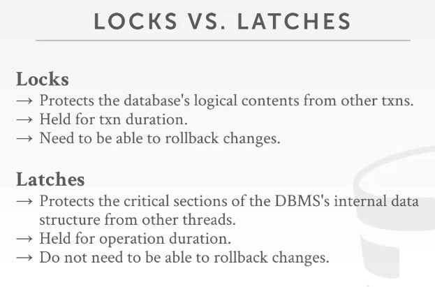
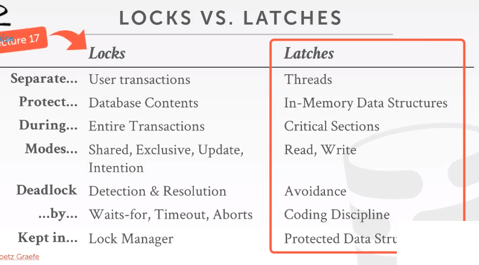

<!--more-->

## B+树简介

结构如图：


分为两种类型的节点：内部节点和叶子节点

内部节点中包含key和指向孩子节点的指针，指针数 = key个数+1

叶子节点中包含key和指向数据的指针，指针数 = key个数

节点中的key是有序存放的

根节点至少有一个key，指向两个孩子节点

其他节点至少半满，阶数就是最大孩子节点的个数，key_num>=ceil((order-1)/2)

相邻叶子节点间有指针连接，便于区间查询

B+树是向上生长的，就是插入节点后，之后叶子节点拆分后，才开始向上拆分节点，直到根。

### 插入

```c++
找到要插入的节点
如果节点未满，加入记录（利用插入排序或者二分保证有序）
否则，分裂节点
	分配新节点的空间，把原来节点的一半移动到新节点//此时当前节点还是叶子节点
	更新父亲节点，把新节点的最小值（或最大值）和地址插入到父亲节点
	如果父亲节点满，分裂父亲节点，第m/2个key加入到父亲节点的父亲节点，并更新孩子指针。重复该步，直到key个数不满或者分裂到根，树高+1。
```

### 删除

```c++
//有相应的key的情况
找到要删除的节点
删除key后，key个数大于等于 ceil((m-1)/2)，删除结束
如果兄弟节点key大于 ceil(m-1)/2，借用兄弟节点的key，更新父亲节点
如果兄弟节点没有多余的key，则合并成一个新的节点，并删除父亲节点中的key
检查内部节点key个数是否大于等于 ceil((m-1)/2),根据兄弟节点是否有剩余合并或者借key
```

## 序列化反序列化

内存中的B+树如何保存到磁盘，指针维护的父子节点关系如何转化？

用文件偏移量代替指针。数据库实现中，B+树存储在一个文件中，访问孩子节点也是通过文件偏移量实现。

### 序列化实现

序列化节点，写入前，先保存当前文件偏移量，这是的偏移量就是这个节点的偏移量，用做返回值。

然后正常写入节点的信息如键值数，键值。

如果当前节点有孩子节点，空出一块区域，大小根据孩子个数计算。这块区域等序列化孩子节点完成后，用孩子节点的偏移量填充。回去填充前需要记录当前偏移量，填充完成后再恢复回去，这样文件才能接着往下写。

该过程就是深搜的过程，往下搜的时候写node本身的数据，偏移量先空出来，递归返回后把偏移量填上。

```c++
long BPTree::serializeNode(Node * cur_node,int fd){
    long cur_offset = lseek(fd, 0, SEEK_CUR);
    write(fd,(char*)&cur_node->key_num,sizeof(int));
    write(fd,(char*)&cur_node->is_leaf,sizeof(bool));
    for(int i = 0;i<cur_node->key_num;i++){
        write(fd,&cur_node->key[i],sizeof(int));
    }
    if(cur_node->child_node[0]!=NULL){
        long offset_record_start = lseek(fd, 0, SEEK_CUR);
        lseek(fd,(cur_node->key_num+1)*sizeof(long),SEEK_CUR);
        std::vector<long>child_offset(cur_node->key_num+1);
        for(int i = 0;i<=cur_node->key_num;i++){
            child_offset[i] = serializeNode(cur_node->child_node[i],fd);
        }
        long recover_point = lseek(fd, 0, SEEK_CUR);
        lseek(fd,offset_record_start,SEEK_SET);
        for(int i = 0;i<=cur_node->key_num;i++){
            write(fd,(char*)&child_offset[i],sizeof(long));
        }
        lseek(fd,recover_point,SEEK_SET);
    }
    return cur_offset;
}
```

### 反序列化

反序列化就是根据序列化时的文件格式，找到孩子节点在文件中存储的位置，实例化到内存。

```c++
Node *BPTree::deserializeNode(int fd,Node *parent_Node){
    int key_num;
    bool is_leaf;
    read(fd,&key_num,sizeof(int));
    read(fd,&is_leaf,sizeof(bool));
    Node *node = new Node();
    node->key_num = key_num;
    node->is_leaf = is_leaf;
    for(int i = 0;i<key_num;i++){
        read(fd,&node->key[i],sizeof(int));
    }
    if(!is_leaf){
        long offset;
        for(int i = 0;i<=key_num;i++){
            long childOffset;
            read(fd,&childOffset,sizeof(long));
            long cur_offset = lseek(fd, 0, SEEK_CUR);
            lseek(fd,childOffset,SEEK_SET);
            node->child_node[i] = deserializeNode(fd,node);
            lseek(fd,cur_offset,SEEK_SET);//为了读下个child_offset
        }
    }
    return node;
}
```


## B+树并发控制机制

https://zhuanlan.zhihu.com/p/50112182

https://zhenghe.gitbook.io/open-courses/cmu-15-445-645-database-systems/relational-data-model

https://www.cs.usfca.edu/~galles/visualization/BPlusTree.html

Redis是一个单线程引擎

VoltDB是多线程引擎

并发协议，强制所有访问数据结构的线程使用这种协议,关注逻辑正确和物理正确

### lock和latches

lock是高级层面的概念，保护了数据库中的逻辑内容（tuple,table）

latch是低级层面的概念，关心的是保护数据结构或对象的物理完整性，保护数据库中的关键部分，保护内部数据结构免受其他线程同一时刻读写所带来的问题。 





latch只有两种模式，读、写

读模式允许多条线程在同一时间读取同一个对象。

写模式是独占的，只有一个进程能操作对象。

实现方式：

* ```
  std:mutex m;
  m.lock();
  m.unlock();
  ```

  * linux是用futex实现的，futex指fast userspace mutex,是在userspace也就是进程的地址空间里占用一点内存地址，通过这个内存来尝试进行一次cas操作，来获取这个latch,如果没有获取到，就会退一步使用速度更慢的mutex。(mutex是OS层面的)
  * 自旋锁 spin latch,这种做法很快，因为现代CPU里，有一条指令，这条指令可以在一个内存地址上进行CAS操作，c++ 中有std::atomic<T>可以实现，也有atomic_flag 实际就是atomic<bool>。

### b+树的并发协议

两个问题：

* 多个进程试图修改一个节点的内容
* 一个进程在遍历树，而另一个进程在分割或合并节点。

basic idea:

* 给parent加latch

* 给child加latch

* 如果parent是安全的，则释放latch

安全节点：在更新的时候不会分裂或者合并

* 插入的时候不满
* 删除的时候大于half-full


#### a better latching algorithm

* Insert/Delete:
  - 使用与 Search 相同的方式在查询路径上获取、释放read  latch，在 leaf node 上获取 write latch
  - 如果 leaf node 不安全，可能会引起其它节点的变动，则使用 Latch Crabbing 的策略再执行一遍

该方法乐观地假设整个操作只会引起 leaf node 的变化，若假设错误，则使用 Latch Crabbing 的原始方案。

#### Horizontal Scan

之后再看