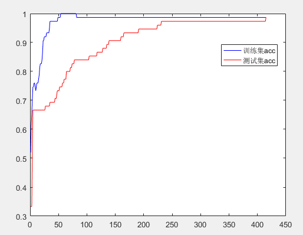

根据西瓜书5.3编写。

<!--more-->

搭建$4 \times 10\times3$的全连接神经网络。

```matlab
clear all;
clc;
data = load('Iris-train.txt');
testD = load('Iris-test.txt')
x2 = testD(:,1:end-1);
y2 = testD(:,end);
x = data(:,1:end-1);
temp = data(:,end);
y = zeros(3,75);
for i = 1:75
    y(temp(i)+1,i) =1;
end
%sigmoid function
f = @(x) 1/(1+exp(-x))

delta = 0.1;
V= randn(4,10);
W = randn(10,3);
gamma = randn(10,1);
theta = randn(3,1);


hTrain = []; 
hTest = [];
flag = 1;
while 1
    accTrain = 0;
    for k = 1:75  % for all samples
        b = arrayfun(f,V'*x(k,:)'-gamma);%隐含层的激活值 (10*1)
        y_bar = arrayfun(f,W'*b-theta);%输出层 (3*1) 
        
        %输出层梯度
        g = y_bar.*(1-y_bar).*(y(:,k)-y_bar); %(3*1)
        
        %隐含层梯度
        e = b.*(1-b).*(W*g);%(10*1)

        %权重和偏置更新
        W = W + delta*b*g'; %10*3
        theta = theta - delta*g;%3*1
        V = V + delta*x(k,:)'*e';%4*10
        gamma = gamma -  delta*e;
        [maxL,label] = max(y_bar);
        accTrain = accTrain + (label==(temp(k)+1));
    end
    %计算测试集准确率
    b = arrayfun(f,V'*x2'-repmat(gamma,1,75));%隐含层的激活值 (10*75)
    y_bar = arrayfun(f,W'*b-repmat(theta,1,75));%输出层 (3*75) 
    [maxL,label] = max(y_bar);
    hTrain = [hTrain accTrain/75];
    hTest = [hTest sum(label == (y2+1)')/75];
    plot(hTrain,'blue')
    hold on
    plot(hTest,'red')
    if flag == 1
        legend('训练集acc','测试集acc');
        flag = 0;
    end
    if sum(label == (y2+1)')/75>0.98
        break
    end
    pause(0.000001);
end
```



