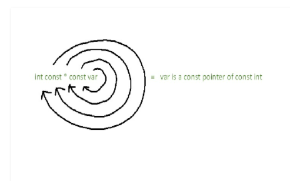
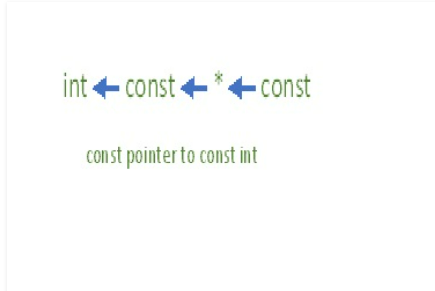
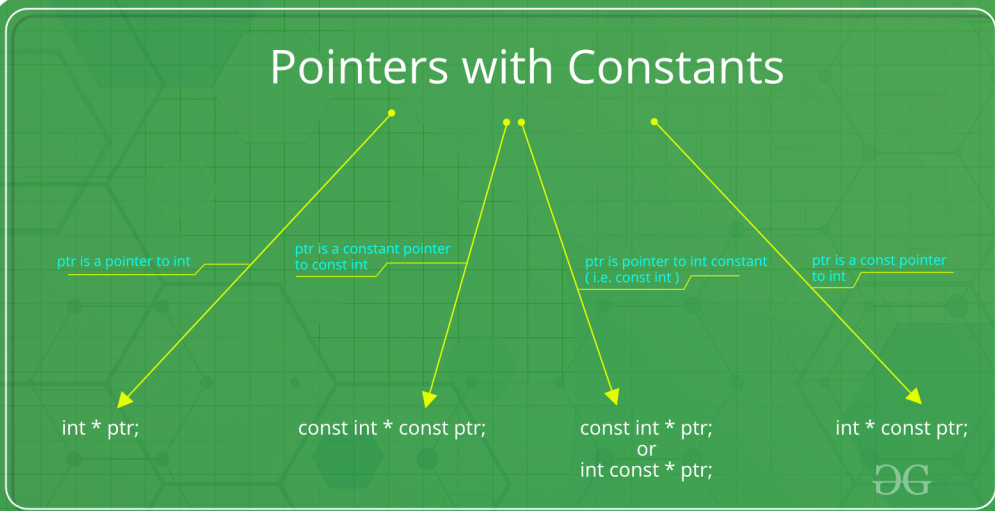
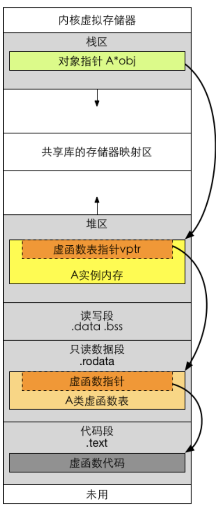

<!--more-->

## Effective c++

### item1 把c++看成语言的集合

C++可以看成由几个模块组成：

* C：C++是以C为基础的，指针、数组、数据类型等都是来自于C
* OOC（Object-Oriented C++）：类、继承、多态、虚函数等
* Template：泛型模块
* STL

这样区分的目的是：不同的模块有不同的编程策略

* C模块中，一般用值传递
* OOC，常量引用传递
* STL，也是使用值传递

### item2 用const、enum、inline代替#define

尽量以编译器代替预处理器

方便在编译出错的时候找到错误位置，因为编译器对变量报错是根据符号表来的，宏至少简单的文本替换，出错的时候不容易定位。

* 用const用来声明数值常量、常量指针、类中的常量需要加上static，从而保证不会产生多个拷贝
* enum hack：enum的行为像#define，比如不能获得地址，不会引来非必要的内存分配
* 使用inline代替宏：对于简单的语句封装成函数不划算，但是用宏可能会带来一些不可预料的错误，尽量写templet inline函数。

### item3 多用const

#### const的使用范围

* 可以在class外部修饰global或namesspace作用域中的常量
* 可以修饰被声明为static的对象
* 也可以修饰class内部的static和non-static成员变量
* 指针自身，指针所指也可以是const

#### const的语法规则

* `const int* ptr`被指的是常量，也就是指向的内存不能修改
* `int* const ptr`指针本身是常量，指针指向的位置不能修改
* `const int* ptr`和`int const* ptr`，意义相同

#### STL迭代器的const

* 对于STL的迭代器，如果希望迭代器所指的东西不可变动，需要使用的是const_iterator,如`std::vector<int>::const_iterator const_itr = vec.begin()`
* 如果迭代器本身不可变动，即不可指向别的地方，直接用const修饰即可

#### const在声明函数使用

const可以修饰函数的返回值、函数参数、函数自身

`const Rational operator* (const Rational& lhs, const Rational& rhs);`

#### const成员函数

指明该函数不会修改类的任何成员数据的值

#### bitwise constness和logical constness

```c++
class BigArray {
    vector<int> v; 
    int accessCounter;
public:
    int getItem(int index) const { 
        accessCounter++;
        return v[index];
    }
};
```

这个是编译不过的。我们希望的是getItem不会修改核心成员，而不考虑非核心成员，是logical constness。

编译器只认bitwise constness，为了解决这个问题，用mutable修饰accessCounter：`mutable int accessCounter; `。

#### const和non-const成员函数的重复问题

为了避免代码重复，使用non-const函数调用const函数。

#### 关于const约束的变量

> 从变量的名称开始，顺时针移动到下一个指针或者类型，直到表达式结束
>
> 或者是从右到左的语法解码，后面的修饰前面的





`*`读作`pointer to`

* `int const *p`：p是一个指针，指向一个const int，也就是说p本身指向的位置是可以修改的，但是指向的内存不能修改
* `int * const p`：p是一个const指针，指向int，就是说这个指针指向的位置不能修改，但是允许修改存储在地址的值
* `const int* cont p`：p是一个const 指针，指向一个const int。p既不能修改指向的位置，也不能修改里面的值



### item 4确定对象被使用之前已经被初始化

#### 永远在对象使用之前初始化

对于基本数据类型，手工完成。对于类，写构造函数，使得对象的每一个成员都被初始化。

主要：赋值和初始化不同

#### 赋值与初始化


## 语法

### 虚函数

http://www.noobyard.com/article/p-yfcqfueo-su.html

为什么要有虚函数：为了实现动态绑定，即在运行时决定调用哪个函数。举个例子：person为基类，派生出student 和 teacher子类，现在学校大门口有一个队列，存放了一系列person指针，每次pop，通过ptr调用函数“出校”，区别是学生需要扫码，而教师不需要，但是编译器在编译程序的时候并不知道要调用哪个出校函数，这取决与运行时队列pop出来的到底是student还是teacher，也就是动态绑定的含义，通过对象的虚表指针调用，因此也可以理解为：虚函数是将函数绑定到特定类的一种手段。



### static关键字

https://zhuanlan.zhihu.com/p/37439983

static出现在两种场景：面向对象和面向过程

* 面向对象	
  * 静态成员变量
  * 静态成员函数
* 面向过程
  * 静态全局变量
  * 静态局部变量
  * 静态函数

#### 静态成员变量

为什么要用static成员变量？每个对象有用相同的某项属性，就用static，比如student类，包含static int num 学生总人数，这是每个学生实例公用的。

static成员变量分配在数据段

跟全局对象相比：静态成员变量的命名空间在类中，不会与全局命名空间的命名产生冲突。static可以加入访问控制，比如private。

#### 静态成员函数

为什么用static成员函数？类似的，static成员函数为类服务，而不是为对象服务，因此static成员函数也没有this指针，因此也仅可以访问静态成员函数和静态成员变量

静态成员函数不能访问非静态成员函数和变量

反过来非静态成员函数可以任意访问静态成员函数和变量

#### 静态全局变量

#### 静态局部变量

#### 静态函数

static函数仅在声明他的函数中可见，不能被其他文件使用

为什么用？不同文件中可以定义相同名字的函数，不会发生冲突。

### RAII

## modern C++


## 参考

* [const](https://www.geeksforgeeks.org/difference-between-const-int-const-int-const-and-int-const/)
* [static](https://zhuanlan.zhihu.com/p/37439983)

