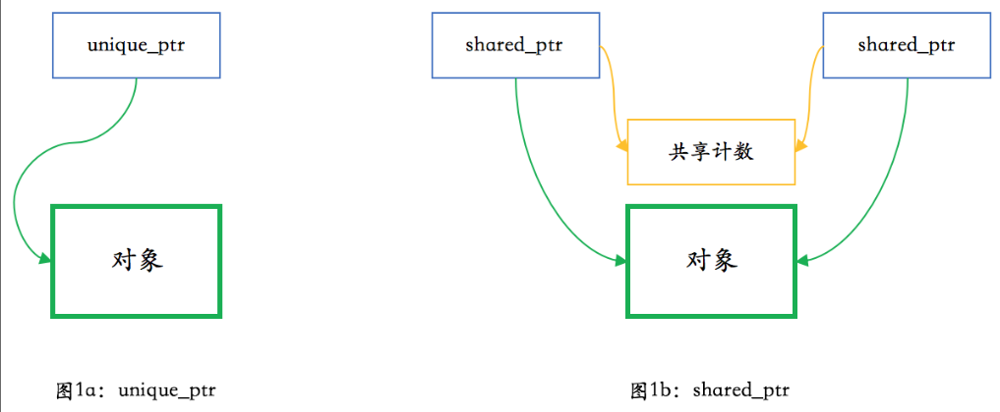

<!--more-->

## Effective c++

### item1 把c++看成语言的集合

C++可以看成由几个模块组成：

* C：C++是以C为基础的，指针、数组、数据类型等都是来自于C
* OOC（Object-Oriented C++）：类、继承、多态、虚函数等
* Template：泛型模块
* STL

这样区分的目的是：不同的模块有不同的编程策略

* C模块中，一般用值传递
* OOC，常量引用传递
* STL，也是使用值传递

### item2 用const、enum、inline代替#define

尽量以编译器代替预处理器

方便在编译出错的时候找到错误位置，因为编译器对变量报错是根据符号表来的，宏至少简单的文本替换，出错的时候不容易定位。

* 用const用来声明数值常量、常量指针、类中的常量需要加上static，从而保证不会产生多个拷贝
* enum hack：enum的行为像#define，比如不能获得地址，不会引来非必要的内存分配
* 使用inline代替宏：对于简单的语句封装成函数不划算，但是用宏可能会带来一些不可预料的错误，尽量写templet inline函数。

### item3 多用const

#### const的使用范围

* 可以在class外部修饰global或namesspace作用域中的常量
* 可以修饰被声明为static的对象
* 也可以修饰class内部的static和non-static成员变量
* 指针自身，指针所指也可以是const

#### const的语法规则

* `const int* ptr`被指的是常量，也就是指向的内存不能修改
* `int* const ptr`指针本身是常量，指针指向的位置不能修改
* `const int* ptr`和`int const* ptr`，意义相同

#### STL迭代器的const

* 对于STL的迭代器，如果希望迭代器所指的东西不可变动，需要使用的是const_iterator,如`std::vector<int>::const_iterator const_itr = vec.begin()`
* 如果迭代器本身不可变动，即不可指向别的地方，直接用const修饰即可

#### const在声明函数使用

const可以修饰函数的返回值、函数参数、函数自身

`const Rational operator* (const Rational& lhs, const Rational& rhs);`

#### const成员函数

指明该函数不会修改类的任何成员数据的值

#### bitwise constness和logical constness

```c++
class BigArray {
    vector<int> v; 
    int accessCounter;
public:
    int getItem(int index) const { 
        accessCounter++;
        return v[index];
    }
};
```

这个是编译不过的。我们希望的是getItem不会修改核心成员，而不考虑非核心成员，是logical constness。

编译器只认bitwise constness，为了解决这个问题，用mutable修饰accessCounter：`mutable int accessCounter; `。

#### const和non-const成员函数的重复问题

为了避免代码重复，使用non-const函数调用const函数。

#### 关于const约束的变量

> 从变量的名称开始，顺时针移动到下一个指针或者类型，直到表达式结束
>
> 或者是从右到左的语法解码，后面的修饰前面的


`*`读作`pointer to`

* `int const *p`：p是一个指针，指向一个const int，也就是说p本身指向的位置是可以修改的，但是指向的内存不能修改
* `int * const p`：p是一个const指针，指向int，就是说这个指针指向的位置不能修改，但是允许修改存储在地址的值
* `const int* cont p`：p是一个const 指针，指向一个const int。p既不能修改指向的位置，也不能修改里面的值


### item 4确定对象被使用之前已经被初始化

#### 永远在对象使用之前初始化

对于基本数据类型，手工完成。对于类，写构造函数，使得对象的每一个成员都被初始化。

主要：赋值和初始化不同

#### 赋值与初始化


## 语法

### 虚函数

http://www.noobyard.com/article/p-yfcqfueo-su.html

为什么要有虚函数：为了实现动态绑定，即在运行时决定调用哪个函数。举个例子：person为基类，派生出student 和 teacher子类，现在学校大门口有一个队列，存放了一系列person指针，每次pop，通过ptr调用函数“出校”，区别是学生需要扫码，而教师不需要，但是编译器在编译程序的时候并不知道要调用哪个出校函数，这取决与运行时队列pop出来的到底是student还是teacher，也就是动态绑定的含义，通过对象的虚表指针调用，因此也可以理解为：虚函数是将函数绑定到特定类的一种手段。


### static关键字

https://zhuanlan.zhihu.com/p/37439983

static出现在两种场景：面向对象和面向过程

* 面向对象	
  * 静态成员变量
  * 静态成员函数
* 面向过程
  * 静态全局变量
  * 静态局部变量
  * 静态函数

#### 静态成员变量

为什么要用static成员变量？每个对象有用相同的某项属性，就用static，比如student类，包含static int num 学生总人数，这是每个学生实例公用的。

static成员变量分配在数据段

跟全局对象相比：静态成员变量的命名空间在类中，不会与全局命名空间的命名产生冲突。static可以加入访问控制，比如private。

#### 静态成员函数

为什么用static成员函数？类似的，static成员函数为类服务，而不是为对象服务，因此static成员函数也没有this指针，因此也仅可以访问静态成员函数和静态成员变量

静态成员函数不能访问非静态成员函数和变量

反过来非静态成员函数可以任意访问静态成员函数和变量

#### 静态全局变量

#### 静态局部变量

#### 静态函数

static函数仅在声明他的函数中可见，不能被其他文件使用

为什么用？不同文件中可以定义相同名字的函数，不会发生冲突。

### RAII

## modern C++

### 完美转发std::forward


### RAII和智能指针

#### RAII

RAII是c++特有的资源管理方式。把依赖栈和析构函数，对所有资源进行管理（包括堆内存，下面有一个例子）。栈上的指针在释放的时候会调用析构函数，在析构函数里释放堆内存。

例子：

create_shape在堆上new了对象，返回对象的指针，如何让这块内存不会泄露？

把这个函数的返回值（对象的指针），包裹到一个局部对象中，该局部对象的析构函数中delete掉这个指针。

```c++

class shape_wrapper {
public:
  explicit shape_wrapper(
    shape* ptr = nullptr)
    : ptr_(ptr) {}
  ~shape_wrapper()
  {
    delete ptr_;
  }
  shape* get() const { return ptr_; }
private:
  shape* ptr_;
};

void foo()
{
  …
  shape_wrapper ptr_wrapper(
    create_shape(…));//这里的shape_wrapper是一个局部栈对象，退出foo函数时会自动析构wrapper对象，而wrapper的析构函数会delete传入的shape指针。
  …
}
```

经典RAII的例子：

```c++

std::mutex mtx;

void some_func()
{
  std::lock_guard<std::mutex> guard(mtx);
  // 做需要同步的工作
}
```

而不写成：

```c++

std::mutex mtx;

void some_func()
{
  mtx.lock();
  // 做需要同步的工作……
  // 如果发生异常或提前返回，
  // 下面这句不会自动执行。
  mtx.unlock();
}
```

#### 智能指针实现

从刚刚shape_wrapper类改造成模板类，就是一个简单的智能指针：

```c++

template <typename T>
class smart_ptr {
public:
  explicit smart_ptr(T* ptr = nullptr)
    : ptr_(ptr) {}
  ~smart_ptr()
  {
    delete ptr_;
  }
  T* get() const { return ptr_; }
private:
  T* ptr_;
};
```

但是这样跟指针的行为还有点差异，比如不能用*解引用，不能用->访问成员，不能用在bool表达式里，因此添加：

```c++

template <typename T>
class smart_ptr {
public:
  …
  T& operator*() const { return *ptr_; }
  T* operator->() const { return ptr_; }
  operator bool() const { return ptr_; }
}
```

然后对于拷贝构造呢？`smart_ptr<shape> ptr2(ptr1)`应该怎么表现？

转移指针所有权，这就是auto_ptr的实现了，现在已经废除，因为这样设计的smart_ptr一旦进行了赋值或拷贝，就不在拥有这个对象了。

```c++

template <typename T>
class smart_ptr {
  …
  smart_ptr(smart_ptr& other) //拷贝构造
  {
    ptr_ = other.release();
  }
  smart_ptr& operator=(smart_ptr& rhs) //赋值
  {
    smart_ptr(rhs).swap(*this);
   	//首先rhs把自己维护的指针交给给临时对象smart_ptr(rhs)，然后这个临时对象维护的指针和this对象维护的指针交换一下，this对象就拿到rhs维护的指针了，临时对象smart_ptr拿到this之前维护的指针，它会随着临时对象smart_ptr销毁而被delete。
    return *this;
  }
  …
  T* release()
  {
    T* ptr = ptr_;
    ptr_ = nullptr;
    return ptr;
  }
  void swap(smart_ptr& rhs)
  {
    using std::swap;
    swap(ptr_, rhs.ptr_);
  }
  …
};
```

再改下，就是unique_ptr：

```c++

template <typename T>
class smart_ptr {
  …
  smart_ptr(smart_ptr&& other) //改成移动构造函数
  {
    ptr_ = other.release();
  }
  smart_ptr& operator=(smart_ptr rhs)
  {
    rhs.swap(*this);
    return *this;
  }
  …
};
```

现在添加引用计数，形成shared_ptr:

```c++

#include <utility>  // std::swap

class shared_count {
public:
  shared_count() noexcept
    : count_(1) {}
  void add_count() noexcept
  {
    ++count_;
  }
  long reduce_count() noexcept
  {
    return --count_;
  }
  long get_count() const noexcept
  {
    return count_;
  }

private:
  long count_;
};

template <typename T>
class smart_ptr {
public:
  template <typename U>
  friend class smart_ptr;

  explicit smart_ptr(T* ptr = nullptr)
    : ptr_(ptr)
  {
    if (ptr) {
      shared_count_ =
        new shared_count();
    }
  }
  ~smart_ptr()
  {
    if (ptr_ &&
      !shared_count_
         ->reduce_count()) {
      delete ptr_;
      delete shared_count_;
    }
  }

  smart_ptr(const smart_ptr& other)
  {
    ptr_ = other.ptr_;
    if (ptr_) {
      other.shared_count_
        ->add_count();
      shared_count_ =
        other.shared_count_;
    }
  }
  template <typename U>
  smart_ptr(const smart_ptr<U>& other) noexcept
  {
    ptr_ = other.ptr_;
    if (ptr_) {
      other.shared_count_->add_count();
      shared_count_ = other.shared_count_;
    }
  }
  template <typename U>
  smart_ptr(smart_ptr<U>&& other) noexcept
  {
    ptr_ = other.ptr_;
    if (ptr_) {
      shared_count_ =
        other.shared_count_;
      other.ptr_ = nullptr;
    }
  }
  template <typename U>
  smart_ptr(const smart_ptr<U>& other,
            T* ptr) noexcept
  {
    ptr_ = ptr;
    if (ptr_) {
      other.shared_count_
        ->add_count();
      shared_count_ =
        other.shared_count_;
    }
  }
  smart_ptr&
  operator=(smart_ptr rhs) noexcept
  {
    rhs.swap(*this);
    return *this;
  }

  T* get() const noexcept
  {
    return ptr_;
  }
  long use_count() const noexcept
  {
    if (ptr_) {
      return shared_count_
        ->get_count();
    } else {
      return 0;
    }
  }
  void swap(smart_ptr& rhs) noexcept
  {
    using std::swap;
    swap(ptr_, rhs.ptr_);
    swap(shared_count_,
         rhs.shared_count_);
  }

  T& operator*() const noexcept
  {
    return *ptr_;
  }
  T* operator->() const noexcept
  {
    return ptr_;
  }
  operator bool() const noexcept
  {
    return ptr_;
  }

private:
  T* ptr_;
  shared_count* shared_count_;
};

template <typename T>
void swap(smart_ptr<T>& lhs,
          smart_ptr<T>& rhs) noexcept
{
  lhs.swap(rhs);
}

template <typename T, typename U>
smart_ptr<T> static_pointer_cast(
  const smart_ptr<U>& other) noexcept
{
  T* ptr = static_cast<T*>(other.get());
  return smart_ptr<T>(other, ptr);
}

template <typename T, typename U>
smart_ptr<T> reinterpret_pointer_cast(
  const smart_ptr<U>& other) noexcept
{
  T* ptr = reinterpret_cast<T*>(other.get());
  return smart_ptr<T>(other, ptr);
}

template <typename T, typename U>
smart_ptr<T> const_pointer_cast(
  const smart_ptr<U>& other) noexcept
{
  T* ptr = const_cast<T*>(other.get());
  return smart_ptr<T>(other, ptr);
}

template <typename T, typename U>
smart_ptr<T> dynamic_pointer_cast(
  const smart_ptr<U>& other) noexcept
{
  T* ptr = dynamic_cast<T*>(other.get());
  return smart_ptr<T>(other, ptr);
}
```




#### 问题

* shared_ptr怎么实现的
  * 见上
* shared_ptr是否线程安全
  * 分场景，同一个shared_ptr被多个线程写，不是线程安全的。多线程读是安全的，根据同一个智能指针创建新的智能指针（增加引用计数）也是安全的。（不懂）

### atomic

c++11引入atomic模板，可以应用到任何类型上，但实现不一样

对于整型量和指针等简单类型，通常结果是无锁的原子对象；

而对于另外一些类型，比如 64 位机器上大小不是 1、2、4、8（有些平台 / 编译器也支持对更大的数据进行无锁原子操作）的类型，编译器会自动为这些原子对象的操作加上锁。

编译器提供了一个原子对象的成员函数 is_lock_free，可以检查这个原子对象上的操作是否是无锁的。

#### 问题

* atomic怎么实现的
* 

### std::function

std::function是一个可调用对象的包装器

可调用对象可以是：函数指针、一个有operator成员函数的类对象、可以被转换成函数指针的类对象、类成员函数指针。

比如：

```c++
// 普通函数
int add(int a, int b){return a+b;} 

// lambda表达式
auto mod = [](int a, int b){ return a % b;}

// 函数对象类
struct divide{
    int operator()(int denominator, int divisor){
        return denominator/divisor;
    }
};
```

虽然他们类型不同，但是调用形式是相同的，调用形式就是参数和返回值，也就是function初始化时候的模板参数，于是就可以这样写：

```c++
std::function<int(int ,int)>  a = add; 
std::function<int(int ,int)>  b = mod ; 
std::function<int(int ,int)>  c = divide(); 
```

用来取代函数指针，特别适合作为回调函数使用。

### std::bind

把可调用实体的某些传入参数，绑定到已有的变量，返回一个std::function

```c++
struct Foo {
    void print_sum(int n1, int n2)
    {
        std::cout << n1+n2 << '\n';
    }
    int data = 10;
};
int main() 
{
    Foo foo;
    auto f = std::bind(&Foo::print_sum, &foo, 95, std::placeholders::_1);
    f(5); // 100
}
```

通过std::bind和std::function配合使用，所有的可调用对象均有了统一的操作方法。

### auto和decltype

auto 的推导用在初始化时候，但目前的c++标准不允许类成员变量使用auto。

auto总是推导出值类型，不可能是引用。

auto可以加上const、volatile、*、& 这样的类型修饰符，得到新的类型。

## STL


## 参考

* [const](https://www.geeksforgeeks.org/difference-between-const-int-const-int-const-and-int-const/)
* [static](https://zhuanlan.zhihu.com/p/37439983)

