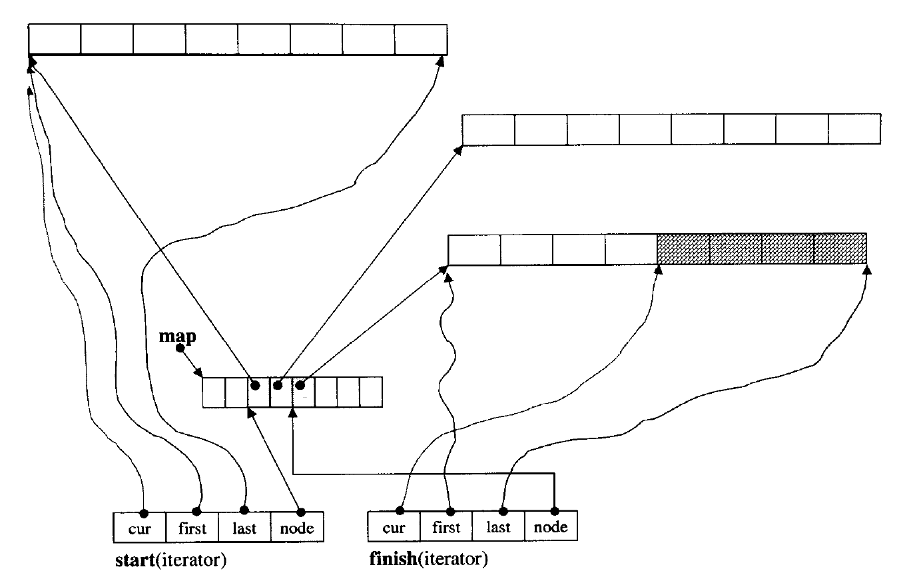

<!--more-->

## queue

queue其实有两种实现，一种底层是list，一种底层是deque

### list

list的实现是一个双向循环链表

### deque

是维护了一个map数组，map数组里存了指向几个连续空间的指针，连续空间存放用户数据。同时deque维护了两个迭代器，start和finish。

一个生产者一个消费者deque是线程安全的吗？

比如某个时刻push_back造成map需要重新分配，start迭代器的node需要更新到新的map，还没更新时候，发生了pop_front，需要start的node需要后移，这时push_back的node移动生效，就把pop_front的操作覆盖了。

对于list的情况呢？

由于是双向循环链表的情况，一个线程插入，一个线程删除。添加时，新增的末尾节点要指向第一个节点，还没赋值这个指针的时候，另一个线程进行了头部的删除，头节点已经修改。

为什么ringbuffer就是单生产者单消费者线程安全的了？

