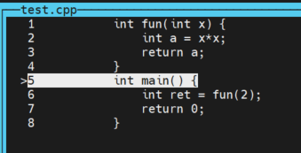
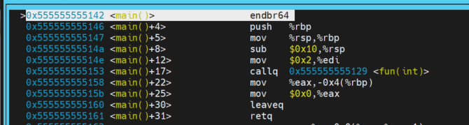
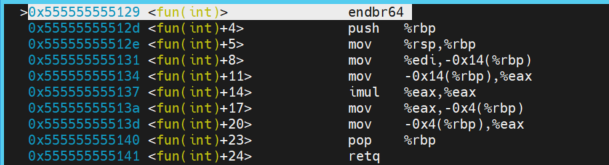
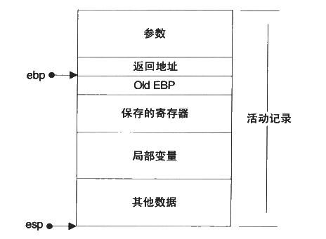
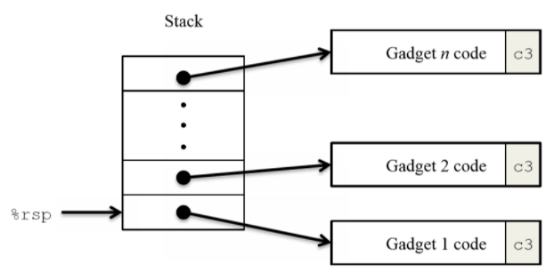
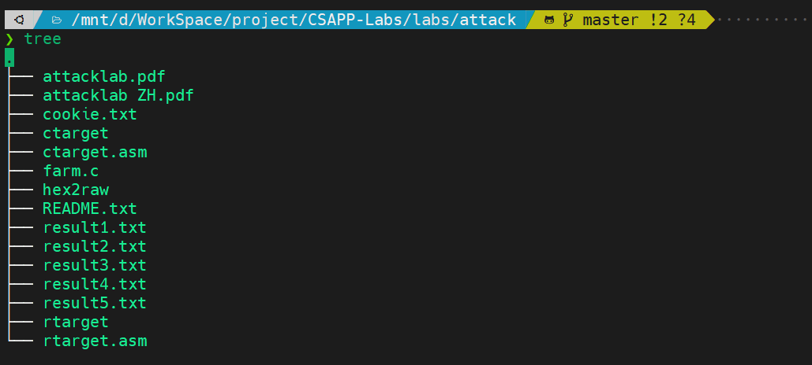
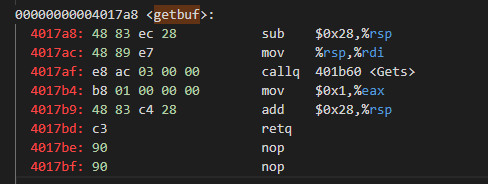

本文是CASPP Attack实验的学习笔记。

<!--more-->

## 缓冲区溢出原理

### 函数的调用过程

写一个测试程序，在main中调用fun()。



`layout asm`查看反汇编



`mov $0x2,%edi`，将2放入edi寄存器用作函数传参

`call`指令相当于`push IP`然后`jump [addr]`

使用`ni(next instruction)、si`指令调试，进入fun函数，看看函数调用做了什么：




* `push %rbp`：将rbp寄存器压栈，这时候的rbp指向的是main函数的rbp
* `mov %rsp,%rbp `，将rsp寄存器的值赋值给rbp寄存器
* `mov -0x4(%rbp),%eax`，将返回值写入eax寄存器
* `pop %rbp`，弹栈，栈顶元素赋值给`rbp`寄存器
* `retq`，相当于`pop IP`，弹栈，栈顶元素赋值给ip寄存器。

因此，函数调用过程：

* 调用方把要传的参数写入寄存器或者压栈，然后call 把下一条指令地址压栈，也就是函数的返回地址压栈，然后jump
* 进入被调方，被调用方先把old rbp压栈，也就是把调用方的rbp寄存器压栈，然后将rsp寄存器的值赋值给rbp寄存器，注意每次pop和push指令都会修改rsp的值，也就是将当前栈顶作为被调用函数栈帧结构的栈底
* 其实后面应该还会有sub指令修改rsp寄存器，可能是这里程序太简单编译器优化掉了，main函数的反汇编里倒是有体现（第四行）。
* 被调用方返回时，pop把old rbp恢复，指向main函数的栈底，其实还应该有个`mov %rbp %rsp`，把rbp的值赋值给rsp，也就是恢复main函数的栈顶为被调用者的栈底。
* 这个时候rsp指向函数的返回地址，ret从栈顶取出返回地址给rip寄存器。



### 用到的一些gdb指令

* `layout src、layout asm、layout regs`查看源码，反汇编，寄存器
* `ni,si`汇编指令的调试
* `x/nfu <addr>`：打印内存，n是打印单元个数，f是打印格式，u是单元类型

## ROP链攻击

### 原理

返回导向编程（Return-Oriented Programming）是一种攻击技术，利用栈溢出的方式控制程序的指令执行流程。

gadgets：以ret结尾的代码片段或函数

rop攻击：在代码空间中寻找以ret结尾的代码片段，组合形成一条攻击链，实现攻击，这些ret结尾的代码片段就叫gadgets。

将一个个gadgets的地址以字符串的形式存放在缓冲区中，当程序执行ret指令时会造成一连串的gadget被执行。



如图，程序在执行ret指令时，从栈中将gadget1的地址弹出，放到rip中，程序转而去执行gadget1的代码，然后执行ret，再从栈中将gadget2的地址弹出放到rip寄存器中，执行gadget2的代码，然后再ret。。。

### 实验文件

实验目录如下：



* ctarget: 实验一二的可执行程序
* rtarget: 实验三四的可执行程序
* cookie.txt: An 8-digit hex code that you will use as a unique identifier in your attacks.
* farm.c: The source code of your target’s “gadget farm,” which you will use in generating return-oriented programming attacks.
* hex2raw: A utility to generate attack strings.

使用`objdump -d exefile > exefile.asm`生成汇编代码

### rtarget

通过反汇编代码，看到代码中有getbuf函数，



该函数首先将rsp指针向下移动，然后将rsp的值传给了rdi寄存器，rdi寄存器是用来函数调用中传递的第一个参数，也就是Gets函数的参数。可以猜到，Gets函数从用户输入中读取数据，然后放在了某个缓冲区中，因此rdi寄存器传递的参数就是这个缓冲器的起始地址，就是getbuf栈帧结构中的某个数组，这个数组的首地址刚好是rsp指针指向的地方。

`touch2`如下：

```c++
void touch2(unsigned val)
{
    vlevel = 2; /* Part of validation protocol */
    if (val == cookie)
    {
        printf("Touch2!: You called touch2(0x%.8x)\n", val);
        validate(2);
    }
    else
    {
        printf("Misfire: You called touch2(0x%.8x)\n", val);
        fail(2);
    }
    exit(0);
}
```

**任务目的：**让`test`函数执行完`getbuf`后去执行`touch2`，`touch2`函数有一个参数，我们需要再执行`touch2`之前把`val`设置为`cookie`，`cookie`的值再`cookie.txt`中。

### 解题


## 一些问题


## 参考资料

* ROP攻击例子：http://lindada.com.cn/2020/04/19/ROP/
