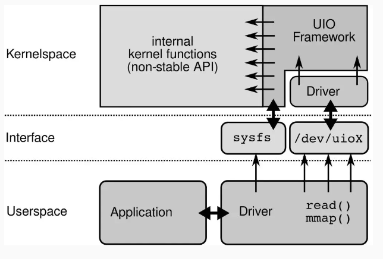
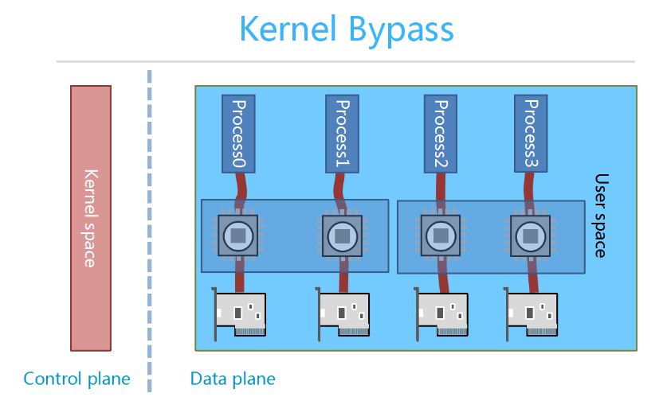

DPDK & f-stack

<!--more-->

## C10M问题

http://www.youtube.com/watch?v=73XNtI0w7jA#!

Errata Security 公司的 CEO Robert Graham，他在 Shmoocon 2013 大会上很巧妙地解释了这个问题， UNIX 的设计初衷其实为电话网络的控制系统而设计的，而不是一般的服务器操作系统，所以，它仅仅是一个数据负责数据传送的系统，没有所谓的控制层面和数据层面的说法，不适合处理大规模的网络数据包。

最后他得出的结论是：

> OS 的内核不是解决 C10M 问题的办法，恰恰相反 OS 的内核正式导致 C10M 问题的关键所在。

### 基于OS内核的数据传输的弊端

**1、中断处理。**当网络中大量数据包到来时，会产生频繁的硬件中断请求。

**2、内存拷贝。**数据从网卡通过 DMA 等方式传到内核开辟的缓冲区，然后从内核空间拷贝到用户态空间，占到了数据包整个处理流程的 57.1%。

**3、上下文切换。**硬件中断和软中断，锁竞争（内核资源），系统调用

**4、局部性失效。**一个数据包的处理可能跨多个 CPU 核心，容易造成 CPU 缓存失效，造成局部性失效。如果是 NUMA 架构，更会造成跨 NUMA 访问内存。

**5、内存管理。**传统服务器内存页为 4K，为了提高内存的访问速度，避免 cache miss，可以增加 cache 中映射表的条目，但这又会影响 CPU 的检索效率。

## DPDK

DPDK 能够绕过内核协议栈，本质上是得益于 UIO 技术，通过 UIO 能够拦截中断，并重设中断回调行为，从而绕过内核协议栈后续的处理流程。

UIO 设备的实现机制其实是对用户空间暴露文件接口，比如当注册一个 UIO 设备 uioX，就会出现文件 /dev/uioX，对该文件的读写就是对设备内存的读写。

## F-stack

**DPDK 本身并不包含 TCP/IP 协议栈**，F-Stack 好比胶水，粘合了 DPDK 和 FreeBSD TCP/IP 协议栈，纯 C 语言编写，通过外加头文件、宏控制、以及hook相关实现进行的移植，对FreeBSD协议栈源代码的修改不到100行(基于libuinet)。

### 无共享架构

每个进程CPU、网卡队列绑定，具有无竞争、零拷贝、线性扩展、NUMA友好等特点。

- 解决了局部性失效的问题。
- 使用DPDK的轮询模式，排除中断处理造成的性能影响。
- 使用DPDK作为网络I/O模块，将数据包从网卡直接接收到用户态，减少内核态到用户态的内存拷贝。
- 请求平均分配到每个核上，通过设置DPDK的rss hash函数保证相同ip、port的请求落到同一个核上。
- 各进程拥有独立的协议栈、PCB表等资源，消除了协议处理过程中的各种资源竞争。
- 进程之间不共享内存，通过无锁环形队列（rte_ring)传递通信，如ARP包等。

## 参考资料

[]: https://cloud.tencent.com/developer/beta/article/1005218	"官方全用户态网络开发套件 F-Stack 架构分析"

