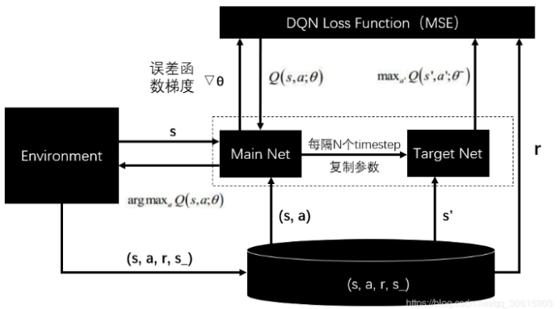
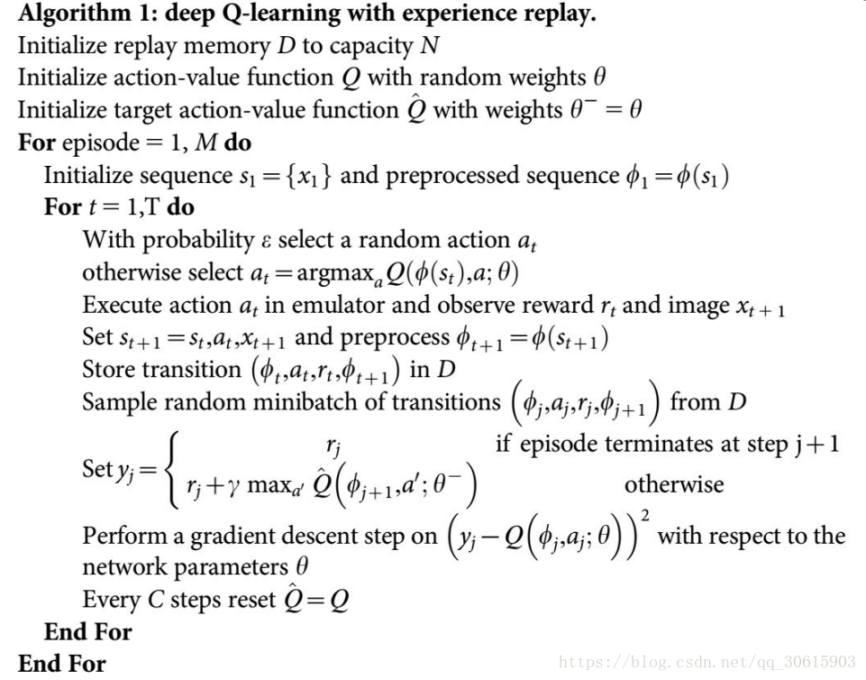
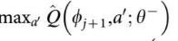

DQN记录。

<!--more-->

## Q-learning

首先要学习`DQN`算法要先学习`Q-learning`算法，`DQN`是在`Q-learning`得基础上结合了深度的方式。

Q-learning算法的核心是维护一张表叫做**Q表**，该表中保存了面对所有状态采取不同决策的**效用值**，假设有m种状态，n种操作，那么该表就是m*n的，假设能学习到一张完美的表，那么每帧都选用当前状态可采取操作的效用值最大的操作，那么在游戏中的存活时间就可以无限大。

所以关键是如何学习到这张表：

参考：https://www.zhihu.com/question/26408259的首赞答案。

伪代码如下：

```c
初始化 Q = {}; //Q表

while Q 未收敛： //Q表还能更新

	初始化S，开始新一轮游戏 

	while 游戏状态S未结束： 

		使用策略π，获得动作a=π(S) 

		使用动作a进行游戏，游戏的新状态S',与奖励R(S,a) 

		Q[S,A] ← (1-α)*Q[S,A] + α*(R(S,a) + γ* max Q[S',a])更新

		S ← S'//更新状态
```

## DQN

可以看出，Q-learning的弊端在于要保存所有状态所有动作的效用值，但对于很多问题状态空间太大了，所以就有人引出了DQN算法，改进的地方是使用神经网络来拟合这张表。



s是状态，a是采取的动作，theta是网络的参数，r是reward。

（s,a,r,s_）是经验池，经验池保存了每个时间步得到的（s,a,r,s_）样本，因为要采用离线的学习方式，随机的从以前的状态中学习（可能是为了防止局部最优）。

经验池中包含了：当前状态、采取的行动、带来的奖励（真实的奖励，而不是预测的）、采取行动后的下一个状态。每次模拟，都会往经验池中新增新的样本。



Q是预测到的奖励，那么为了拟合Q表，就是希望预测到的奖励能够等于真实的奖励。网络的输入是状态，输出是不同动作在该状态下对应的Q值

于是有了mse(r-Q),原公式还有改进，加入了折扣因子gamma,用来同时兼顾记忆中的利益，gamma越大，则原先经验的影响越大。

 

要理一下，假设有3个动作，那么网络的输出有3个神经元，但是计算loss的时候并没有用到3个神经元，而是选取a_j对应的神经元的值，对应的label是：经验池中面对当前状态，采取a_j后的真实收益 与 采取a_j动作后到达的下一个状态的预测可能最大收益的加权综合，是在表明，到达新位置后，新位置能够给出的最大效用值，也就是以往的经验。Gamma越大越注重经验，越小，越注重眼前的利益，也就是r。

## 关于GYM

`env.unwrapped.get_action_meanings()`可以获取动作的含义。

## 参考

https://blog.csdn.net/qq_30615903/article/details/80744083

