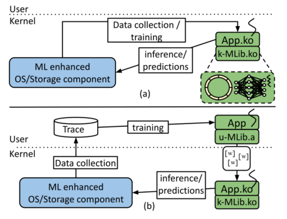
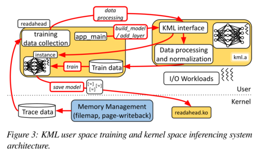

KML: Using Machine Learning to Improve Storage Systems

https://github.com/sbu-fsl/kernel-ml

<!--more-->

## motivation

这篇论文把机器学习框架移植到了内核，为什么要移植到内核？操作系统中包括许多启发式的算法，但是这些启发式的算法并不能很好的适用多变的工作负载，OS不得不向用户公开许多可调参数，让用户决定参数设置。

KML的提出是为了：

1、取代启发式算法，动态适应不断变化的工作负载。

2、使用ML进行系统参数设定，不再需要由用户确定。

该论文证明了ML可以比现有的启发式算法更好的调优存储系统的参数。

## OS中的启发式决策场景

### 预读大小

比如在NFS中，预读太少会浪费潜在的吞吐量，预读太大会污染缓存，读入无用数据，可以用ml设置参数。

### 预测KV存储中的索引结构

### 缓存相关

### IO调度

## KML的设计

提供了两种不同的操作模式：

* 内核空间进行训练和推理（性能和准确性，采样速率高时使用）
* 用户空间训练，内核空间进行推理（开发框架使用的便利性）

KML代码库由用户和内核空间共享

KML通过探针来收集OS中目标组件的数据。

异步ML计算不会对IO路径产生负面影响。

神经网络的计算是一个DAG（有向无环图），推理意味着从源点（输入）开始遍历DAG，直到终点（网络输出）。



u-MLib.a和k-MLib.ko时从相同的KML源码中编译得来的。

同时做了一个KML的包裹层，使得KML在用户和内核api是统一的（类似于syscall和glibc吧）。

问题：为什么不在用户空间推理，然后只修改内核参数

### 资源开销

3.4节介绍

#### 减少计算开销

##### 浮点计算问题

内核一般禁用浮点单元（FPU），这是为了减小上下文切换的开销，而ML中的矩阵原酸一般基于浮点运算。

三种解决方法：

* 量化：减少计算和内存开销，单数会降低准确度
* 定点表示：使用整数寄存器做浮点计算，所有浮点操作都是模拟的，效率很高，但是会有数值不稳定的现象（不太懂）
* 在内核中启用FPU：使用kernel_fpu_begin开启FP寄存器的使用。

##### 降低内存开销

内存开销有三个：

* 模型数据：结构，权重
* 训练和推理过程中KML内部的内存分配
* 训练和推理的数据收集：使用一个无锁循环缓冲区收集输入数据，然后用一个异步线程对收集到的数据进行训练，注意合理设置ringbuffer的大小，使得异步训练线程能及时处理。

##### 资源受限情况

没看懂，大概就是留了一些内存分配的api。

##### 数据处理和异步训练

normalization需要大量的FP计算，在为存储系统中设计KML时，一个主要原则时避免IO在数据路径上的内联计算。因此KML将训练、推理、数据归一化放到不同的异步线程中，线程间的通信使用ringbuffer或者其他KML组件（如数据收集组件）。目前只支持一个异步训练线程，不支持并行训练。

### 用户空间训练

KML的用户空间和内核空间库由相同的API访问，并从相同的代码库中编译，因此将训练好的ML模型移植到内核空间进行推断很容易。



跟踪内存管理子系统，使用Re-Animator从存储组件中收集数据。

KML提供了30个API，分为五类：内存管理、线程、日志、原子操作、文件操作。

### 安全稳定性

除了模型初始化和ML模型保存外，不涉及IO，KML对存储组件的稳定性方面的影响仅限于内存分配和并发。

用户模式和内核模式分配内存时都用到了锁机制，因此可能会出现意外的延迟或者死锁，为了解决这些问题，KML只在异步训练线程中分配内存，在使用ringbuffer使用了额外的保留内存（防止溢出吗）。

## 两个应用实例

### 预读

在动态工作负载下预测最佳的预读值。

预读是将磁盘上的存储数据预取到操作系统缓存，根据局部性原理预计这些数据将在近期使用，问题是要决定提前读多少：读太少就需要更多次的磁盘读，读太多会带来无用数据的缓存污染。这里的第一个应用就是ML调参，决定预读值的大小。

#### 数据采集

数据集生成：作者使用了4个不同的RocksDB的基准测试程序，每个测试都有20个不同的预读大小（8~1024）,这样就有了不同工作负载下不同预读值大小的性能（ops/sec），以这些为数据集预测其他工作负载的最佳预读值。

原始特征采集：使用LTTng来采集系统特征。利用hook function捕获page cache的行为，采集了三个原始特征：开始执行的时间差，inode 号（用来过滤RocksDB的文件访问）、文件的页偏移。

#### 数据预处理和归一化

以一秒为间隔对输入数据进行汇总，处理后的特征：

* 每秒发生的事务数量
* 页面偏移量的滑动平均值
* 页面偏移量的滑动标注差
* 连续事务的平均绝对页面偏移量的差值

输入到nn之前，先进行z-score归一化。

#### 模型结构

就一个3层的fcnn或这决策树模型（决策树要快，而且可解释性强一点）

#### 实验结果

k fold的交叉验证，准确率为95.5%

验证特征对分类性能的贡献：

* 随机化interest features的顺序，然后计算k fold的交叉验证
* 皮尔逊相关分析

最后发现特征的重要程度从高到低为：平均绝对页面偏移量的差，事务数，页面偏移量的滑动平均值。

### NFS rsize

网络读块大小最优值确定

最后处理完的特征为：

* 每秒的事务数
* 每对nfs4_read和nfs_readpage_done的时间差
* 连续nfs4_read的请求平均时间差
* 连续nfs_readpage_done的平均时间差

## 未来改进点

* 引入基于反馈的控制算法来解决不稳定行为

* 安全方面考虑，模型加载需要数字前面和认证


## 代码

### 前置知识


#### IO栈


#### kernel中的文件读写

 filp_open() filp_close(), vfs_read() vfs_write()，set_fs()，get_fs()等，这些函数在linux/fs.h和asm/uaccess.h头文件中声明。

#### iptables

https://cloud.tencent.com/developer/article/1619659

#### ebpf

#### C风格的面向对象

http://unicornx.github.io/2016/01/06/20160106-c-oob/

```
struct foo {
    int a;
    int b;
    int c;
    struct foo_operations ops;
};

struct foo_operations {
    void (*op_a) (struct foo *, loff_t, int);
    void (*op_b) (struct foo *, char __user *, size_t, loff_t *);
    void (*op_c) (struct foo *, const char __user *, size_t, loff_t *);
    ......
};
```

### 源码阅读

#### readahead

针对readahead问题，在readahead.c文件中实现了内核模块。

`module_init(kml_readahead_init)`指明了模块的入口点。

`kml_readahead_init`创建了两个内核线程，然后设置跟踪点。

```c++
static int __init kml_readahead_init(void) {
  ...
  kml_readahead_update_thread =
      kthread_run(&readahead_update, NULL, "kml_readahead_update");
  kml_perf_monitoring_thread =
      kthread_run(&perf_monitoring, NULL, "kml_perf_monitoring");
  ...
  set_trace_readahead_add_to_page_cache_fptr(
      (void *)&readahead_add_to_page_cache);//函数指针
  set_trace_readahead_mm_filemap_fsl_read_fptr(
      (void *)&readahead_mm_filemap_fsl_read);
  set_trace_readahead_fsl_writeback_dirty_page_fptr(
      (void *)&readahead_fsl_writeback_dirty_page);
  set_trace_readahead_get_tuning_device_fptr(
      (void *)&readahead_get_tuning_device);
  set_trace_readahead_get_disk_ra_val_fptr((void *)&readahead_get_disk_ra_val);
  //(void *)& a,取a的地址，然后转化为无类型指针。
  ...
  return 0;
}
```


```c++
void readahead_add_to_page_cache(struct page *page) {
  unsigned long index = 0, i_ino = 0;
  u64 time_passed;
  u64 data_process_start, data_process_end;
  dev_t blk_dev_no = 0;
  double data[3];

  if (page != NULL) {
    index = page->index;
    if (page->mapping != NULL && page->mapping->host != NULL) {
      i_ino = page->mapping->host->i_ino;
      blk_dev_no = page->mapping->host->i_sb ? page->mapping->host->i_sb->s_dev
                                             : page->mapping->host->i_rdev;
      if (blk_dev_no != tunning_device_number) {
        return;
      }
    }
  }

  time_passed = kml_get_current_time();
  time_passed = kml_get_time_diff(time_passed, start_time);

  if (module_exiting) return;

  kernel_fpu_begin();
  data[0] = time_passed;
  data[1] = i_ino;
  data[2] = index;

  data_process_start = kml_get_current_time();
  if (readahead_data_processing(data, (readahead_net *)readahead,
                                disk_base_readahead_val, true, false, i_ino)) {
  }
  data_process_end = kml_get_current_time();

  data_process_total += kml_get_time_diff(data_process_end, data_process_start);
  kml_atomic_add(&data_process_count, 1);

  kernel_fpu_end();
}
```


## 问题

为什么不用mmap

https://blog.acolyer.org/2016/04/26/the-linux-scheduler-a-decade-of-wasted-cores/
