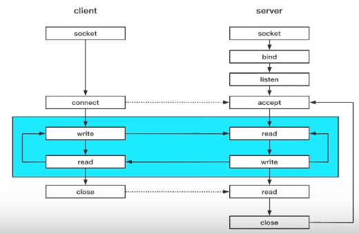
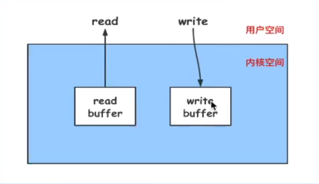
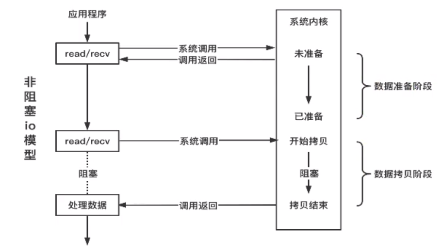
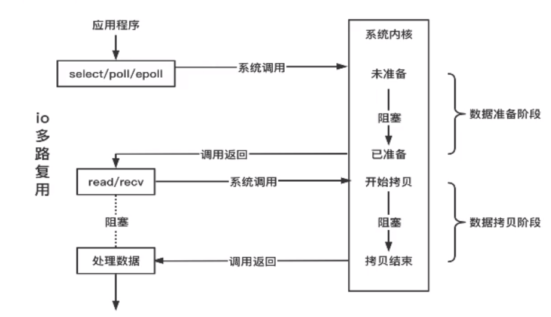
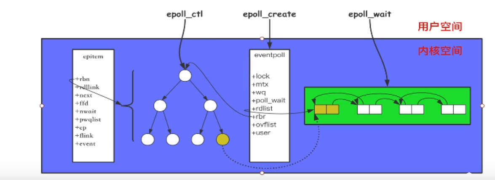
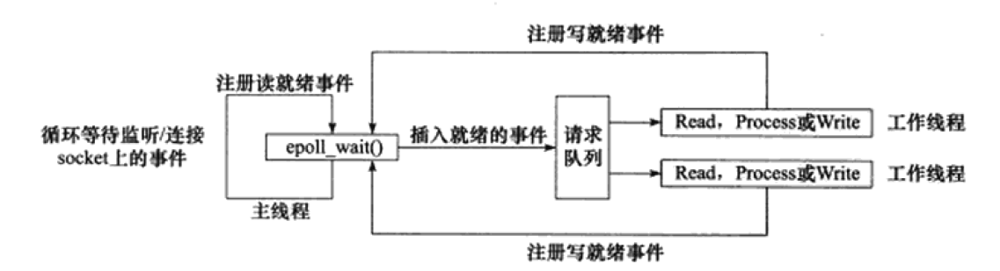

学libco过程中遇到了epoll和I/O复用相关概念。

<!--more-->

## 网络编程流程



## 阻塞IO和非阻塞IO

每个连接都会对应一个读缓冲区和写缓冲区



* 阻塞在哪？
  * 阻塞在网络线程，比如调用了read/recv，下面的就不能运行，程序就卡在那里
* 阻塞和非阻塞的差异？
  * IO函数在数据到达时是否立刻返回，立刻返回的是非阻塞
* 阻塞和非阻塞由什么决定？
  * fd决定，默认fd是阻塞。
  * fcntl可以设置fd为非阻塞

### 阻塞IO


数据准备阶段是看readbuffer是否有数据，数据到达后把数据拷贝到用户空间，也就是应用程序中，这个是数据拷贝阶段。

### 非阻塞IO



假设当前readbuffer没有数据，调用read/recv会立马返回，继续执行read后面的逻辑

### 阻塞非阻塞  同步和异步

阻塞和非阻塞强调的是线程的状态。

同步和异步强调的是执行顺序，同步可以确定程序执行的顺序调用，调用返回之前下一行代码不会调用。异步调用不明确执行顺序。

## I/O多路复用

> 用一个线程检测多个IO事件，复用的是网络线程

早期，为了实现一个服务器支持多个客户端的连接，使用fork/thread一个进程/线程的方式去接受并处理请求。这是阻塞IO+多线程，优点处理及时，但是线程利用率低，线程数有限。

一个连接到来后，遍历所有的已注册的文件描述符，找到需要处理的文件描述符，也就是select和poll。



**IO多路复用作用在数据准备阶段**

由于遍历引起的巨大开销O(n)，在原有的基础上进一步优化，有了epoll的方法。

epoll

> `epoll`是linux内核的可扩展I/O事件通知机制。

使用一个文件描述符管理多个描述符。

## epoll

> epoll 全程 event poll 事件轮询

epoll实际是从操作系统订阅消息。

epoll将进程关注的文件描述符存入一颗红黑树，在这棵红黑树中，key是socket的编号，值是socket关注的消息。当内核发生了一个事件的时候，比如socket编号1000可以读取，这个时候就从红黑树查找进程是否关注了这个事件。

为什么用红黑树：内核可以快速判断某个消息是否需要发送给使用epoll的线程。

当关注的事件发生时，epoll会将这个fd放到一个就绪队列中，当用户调用epoll_wait的时候，就会从队列中返回一个消息。epoll_wait不一定立刻返回，可以设置timeout，如果设置成0就立刻返回，epoll就是非阻塞的。

### 程序接口

```c++
int epoll_create(int size);
```

在内核中创建epoll实例，并返回一个epoll文件描述符。size是要监听的文件描述符数量，大于size的话内核会自动扩容。

```c++
int epoll_ctl(int epfd, int op, int fd, struct epoll_event *event);//ctl就是control
```

向epfd对应的内核epoll实例添加、修改或删除对fd事件event的监听。

op 为 

* `EPOLL_CTL_ADD`：往事件表中注册fd上的事件

* `EPOLL_CTL_MOD`：修改fd上的注册事件

* `EPOLL_CTL_DEL` ：删除fd上的注册事件

如果 event 的 events 属性设置了 `EPOLLET` flag，那么监听该事件的方式是边缘触发。

```c++
int epoll_wait(int epfd, struct epoll_event *events, int maxevents, int timeout);
```

当 timeout 为 0 时，epoll_wait 立即返回。

 timeout 为 -1 时，epoll_wait 会阻塞直到已注册的事件变为就绪。

当 timeout 为一正整数时，epoll 会阻塞直到计时 timeout 毫秒或已注册的事件变为就绪。（因为内核调度延迟，阻塞会略微超过 timeout 毫秒）。

### epoll的实现

#### 重要数据结构

```c++
struct eventpoll {
    struct rb_root rbr; //红黑树,管理epoll监听的事件
    struct list_head rdlist;//保存epoll_wait 返回满足条件的时间
    ...
};
```


```c++
struct epoll_event {
    __uint32_t events; /* Epoll events */
    epoll_data_t data; /* User data variable */
};
events可以是以下几个宏的集合：
EPOLLIN ：表示对应的文件描述符可以读（包括对端SOCKET正常关闭）；
EPOLLOUT：表示对应的文件描述符可以写；
EPOLLPRI：表示对应的文件描述符有紧急的数据可读（这里应该表示有带外数据到来）；
EPOLLERR：表示对应的文件描述符发生错误；
EPOLLHUP：表示对应的文件描述符被挂断；
EPOLLET： 将EPOLL设为边缘触发(Edge Triggered)模式，这是相对于水平触发(Level Triggered)来说的。
EPOLLONESHOT：只监听一次事件，当监听完这次事件之后，如果还需要继续监听这个socket的话，需要再次把这个socket加入到EPOLL队列里
```

描述监控事件，`events`对应文件描述符事件

`epoll_data_t`是一个联合体，同一时间只能使用一个字段

```c++
typedef union epoll_data {
    void *ptr;
    int fd;
    __uint32_t u32;
    __uint64_t u64;
} epoll_data_t;
```

事件发生时，用户设置的data字段将会返回给使用者


### 原理图



#### mmap

`mmap`将用户空间的一块地址和内核空间的一块地址同时映射到相同的一块物理内存地址，这块物理内存对内核和用户均可见，内核可以直接看到epoll监听的句柄。

#### 红黑树

> 二叉搜索树

存储epoll监听的套接字fd。存储到mmap出来的内存。添加或者删除一个套接字（`epoll_ctl`）时，都在红黑树上去处理。

通过`epoll_ctl` 添加进来的fd都会放在红黑树的节点内。

同时与网卡驱动建立回调关系，如果网卡驱动检测到节点有事件，节点会被拷贝到就绪队列

#### 双向链表

先看epoll_wait做了什么：

* 调用ep_poll，当双向链表中无就绪fd，挂起当前进程，直到链表不为空。
* 当文件fd状态改变，不可读/不可写变为可读/可写，对应fd上的回调函数ep_poll_callback会被调用
* ep_poll_callback将相应fd对应的epitem加入链表，导致链表不为空，进程被唤醒，epoll_wait继续执行。

* ep_event_transfer函数将rdlist中的epitem拷贝到txlist,rdlist清空
* ep_send_event，扫描txlist中的每个epitem，调用关联fd对应的poll方法，从而获得fd上较新的events，封装在epoll_event从epoll_wait返回。

### epoll使用

```c++
int listenfd = socket;
bind(listenfd,addr);
listen(listenfd);
int efd = epoll_create(0);//创建根节点
epoll_ctl(efd,epoll_ctl_add,listenfd,&ev);//把fd放到红黑树
while (true) {
    epoll_event ev[size];//需要在用户态分配内存
    int nevent = epoll_wait(efd,ev,size,timeout);//作用在数据准备阶段
    for(int i = 0; i < nevent; i++) {
		epoll_event *e = ev[i];
        if(e->fd == listenfd) {
			int clientfd = accept(listenfd);
            epoll_ctl(efd,epoll_ctl,clientfd.&env);
        } else {
            if (读事件) {
                read();
                logic;
                send();
            }
            if (写事件) send();
            if (错误事件) close();
        }
    }
}
```

### epoll的ET与LT

> ET：边沿触发  LT:水平触发

#### LT水平

**EPOLLIN**的触发条件是 **读缓冲区非空 **

**EPOLLOUT**的触发条件是 **写缓冲区非满 **

#### ET边沿

**EPOLLIN**的触发条件：对端有数据写入才会触发，所以触发一次要不断读数据直到所有的数据都读完，否则只能登下次对端写入了。所以epoll必须要求异步socket。

**EPOLLOUT**的触发：连接时触发一次，表示可写。

​	或者某次write，写满了发送缓冲区，对端读了一些数据，又重新可写了

​	也就是说EPOLLOUT发生在不写到可写转化的时刻。

​	如果想人为的强制触发，使用epoll_ctl重新设置event就可以，会马上触发一次EPOLLOUT事件。

## reactor

> 组成：非阻塞IO+IO多路复用
>
> 特征：基于事件循环，以事件驱动或者事件回调来实现业务逻辑

reactor要求主线程（I/O处理单元）只负责监听文件描述符上是否有事件发生，有的话就通知工作线程（逻辑单元），读写数据，接受新的连接，处理客户请求均在工作线程中完成。

使用同步I/O模型实现的reactor模式的工作流程为：

* 主线程向epoll内核事件表中注册socket上的读就绪事件
* 主线程调用epoll_wait等待socket上有数据可读
* 当socket上有数据到达，epoll_wait通知主线程，主线程将socket可读事件放入请求队列
* 睡眠在请求队列上的某个工作线程被唤醒。这个工作线程从socket上读取数据，并处理客户请求，然后往epoll内核事件表中注册该socket上的写就绪事件。
* 主线程调用epoll_wait等待socket可写。
* socket可写时，epoll_wait通知主线程，主线程将socket的可写事件放入请求队列
* 睡眠在请求队列上的某个工作线程被唤醒，向客户发送服务器的处理结果。




## 参考

https://www.cnblogs.com/shine-yr/p/5214705.html
