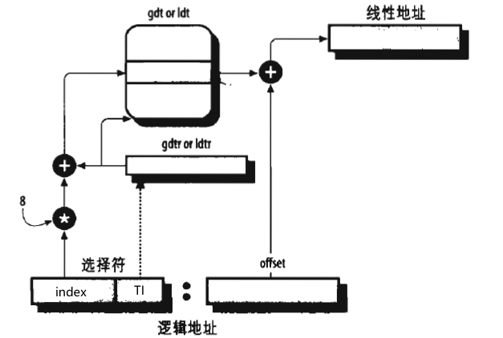
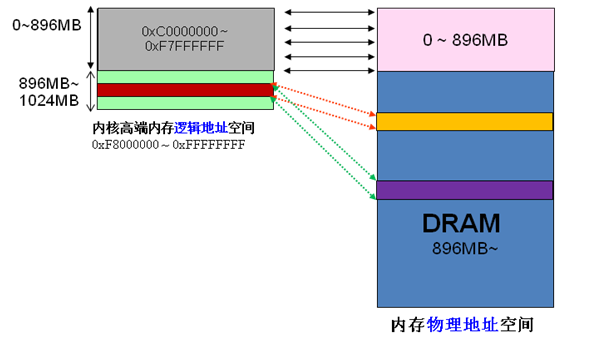
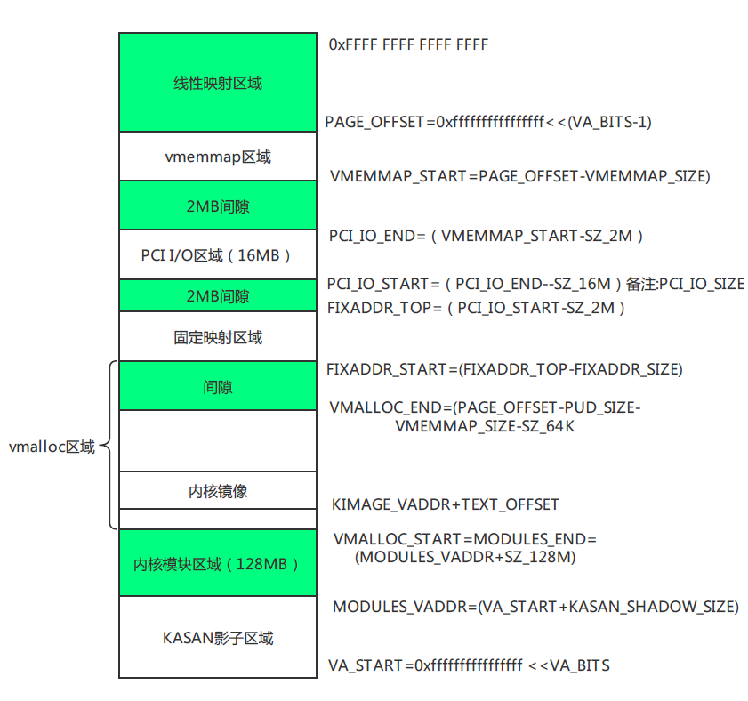
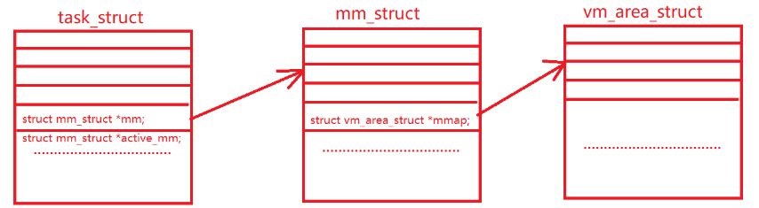
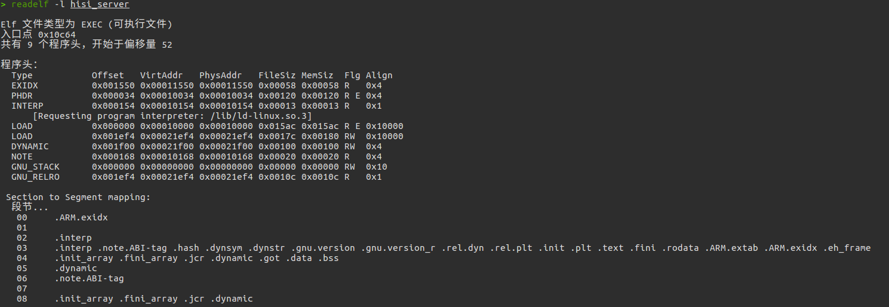

虚存管理：inux进程可以划分为多个不同的内存区域：代码段、数据段、BSS段、堆、栈。Linux内核把这些区域抽象成`vm_area_struct`的对象进行管理。

<!--more-->

## 前置知识

### 区分逻辑地址、线性地址、物理地址

* 逻辑地址就是应用程序员能看到的地址，就是机器语言中引用一个操作数或者是指定的地址
* 逻辑地址又叫虚拟地址

* 逻辑地址：段选择符+段内偏移量

* CPU中有一个MMU，MMU中有一个分段单元的逻辑电路把逻辑地址转换成线性地址。
  * 

* **Linux有限度的使用了分段机制，有限制就是说所有的段基址都为0**，所以**在linux系统下，逻辑地址（虚拟地址）就等于线性地址**
  * **段基址**就是根据**段选择符**查到的**段描述符**里的**base字段**
  * 所有进程使用了相同的段寄存器，也就是不同的进程共享了同样的一组线性地址。
  * 这样设计Linux可以移植到大多数处理器平台，比如一些不支持分段的体系结构。
* 内核的虚拟地址到物理地址只差了一个偏移，而用户空间的虚拟地址到物理地址则用了多久页表进行映射


## 内存管理

> 内核使用node、zone、page三级结构描述物理内存

### 页

> 页是内核管理内存的基本单位。MMU内存管理单元以页位单位管理系统中的页表。

```c
struct page {
	page_flags_t flags;	//页状态，页是不是脏的，有没有锁定在内存中等等
	atomic_t _count;//页被引用了多少次，没有引用的时候就可以在新的分配中使用它
	atomic_t _mapcount;
	unsigned long private;
	struct address_space *mapping;
	pgoff_t index;//包含页的最近最少使用的双向链表的指针。
	struct list_head lru;
#if defined(WANT_PAGE_VIRTUAL)
	void *virtual;//如果进行了内存映射，就是虚拟地址。对存在高端内存的系统来说有意义。
#endif /* WANT_PAGE_VIRTUAL */
};
```

### 区

内核的虚拟地址空间分为三个类型的区，这三个区又线性映射到物理内存上。

* ZONE_DMA：这里的页只能执行DMA操作（0~16MB）
* ZONE_NORMAL：正常映射的页（16~896MB）
* ZONE_HIGHEM：高端内存(动态映射)

#### 什么是高端内存

内核态下虚拟地址和物理地址是一个线性关系，就是所谓的内核线性地址空间，两者存在一个固定的offset，物理地址 = 逻辑地址 – 0xC0000000

x86-32位系统下，linux按照3：1来划分虚拟内存，3GB是用户空间，1GB是内核空间。

也就是说内核只能用1GB的地址空间来映射物理地址空间，如果内存大于1G的情况下，线性地址就不够用了。因此内核引入了一个高端内存的概念，小于896M的

叫低端内存，剩下的128M的线性空间用来灵活映射大于896M的物理地址空间，这128M就是我们说的高端内存区。



对于64位系统，地址空间足够用，就不用高端内存区了。

比如ARM-64的内核地址空间布局：



### 页管理

`struct page * alloc_pages(gfp_t gfp_mask,unsigned order)`分配$2^(order)$个连续的物理页，并返回指向第一个页的指针。

`void * page_address(struct page *page)`返回给定物理页的逻辑地址

`unsigned long __get_free_pages(gfp_t gfp_mask, unsigned int order)`也是分配物理页，当时返回的是分配的第一个页的逻辑地址。

还有获取填充为0的页，释放页等等

### kmalloc()、kfree（）和vmalloc()

这两个是对应的，用于获得以字节为单位的一块内核内存，释放由kmalloc分配出来的内存块。

kmaclloc确保分配出来的内存页在物理地址上是连续的，虚拟地址自然也是连续的。

分配的内存在虚拟地址上是连续的，而在物理内存上不一定连续，也是用户空间分配函数的工作方式。

他分配非连续的物理内存块，再修改页表，把内存映射到逻辑地址空间的连续区域中。

大多数情况下，只有硬件设备才需要连续的物理内存，因为硬件设备位于MMU之外，尽管如此，内核还是尽量使用kmalloc，因为这样可以提高性能，vmalloc需要对获得的页建立页表项一个个映射，还可能会导致TBL抖动。

### slab分配器

#### slab描述符

```c
struct slab {
	struct list_head	list;//slab高速缓存描述符的三个双向循环链表中的一个。
	unsigned long		colouroff;//slab中第一个对象的偏移。
	void			*s_mem;//slab中第一个对象的地址。
	unsigned int		inuse;//当前正在使用的slab中的对象个数。
	kmem_bufctl_t		free;//slab中下一个空闲对象的下标
};
```

#### 高速缓存描述符

```c
struct kmem_cache_s {
	struct array_cache	*array[NR_CPUS];//每个CPU都有一个slab空闲对象缓存
	unsigned int		batchcount;//要转移进本地高速缓存或从本地高速缓存中转移出的大批对象的数量。
	unsigned int		limit;//本地高速缓存中空闲对象的最大数目。这个参数可调。
	struct kmem_list3	lists;
	/* NUMA: kmem_3list_t	*nodelists[MAX_NUMNODES] */
	unsigned int		objsize;//高速缓存中包含的对象的大小。
	...
	unsigned int		gfporder;//一个单独slab中包含的连续页框数目的对数。
	...
	size_t			colour;	//slab使用的颜色个数。用于slab着色。
	unsigned int		colour_off;	//slab中的基本对齐偏移。
	...
};
```


## 虚存管理

### 进程的地址空间

#### 内存描述符

> 内存描述符mm_struct是进程描述符中的一个字段，包含了进程地址空间有光的全部信息

```c++
struct mm_struct {
    struct vm_area_struct * mmap;//指向线性区对象的链表头
    struct rb_root mm_rb;//指向红黑树的根
    //这是内存区域的两种不同的组织结构，实际包含的内容是一样的，根据不同的需求选用不同的结构。
    ...
    pgd_t * pgd;//指向页全局目录，根据多级页表的设计最终找到物理页面
    atomic_t mm_count;//引用计数
    struct list_head mmlist;
    ...
	unsigned long start_code, end_code, start_data, end_data;//代码段和数据段的地址
	unsigned long start_brk, brk, start_stack;//堆和栈的地址
    unsigned long arg_start, arg_end, env_start, env_end;//参数和环境变量
    ...
}
```

mm_struct是否共享决定了是进程还是线程。



mm_struct是对整个用户空间的描述

#### 虚拟内存区域VMA

> VMA

一个进程有多个不同的段，段用`vm_area_struct`进行描述，通过mmap创建。另外，堆和栈也是有自己的vma的。

使用`pmap`或`cat /proc/pid/maps`看到的就是进程的不同的区。如果有动态链接的情况，进程的地址空间也会包含链接库的代码段、数据段、bss段。

```c++
struct vm_area_struct {
    struct mm_struct; //指向关联的mm
    unsigned long vm_start,vm_end;//段的首位地址
    ...
    unsigned long vm_flags;//不同标志组合成不同的权限，从而决定不同的段的属性  
    ...
    unsigned long vm_pgoff;//在映射文件中的偏移量，以页为单位，处理页错误时候使用。
}
```

### ELF和Linux进程虚拟地址空间的映射关系

> ELF文件中有一个程序头，程序头描述了ELF文件该被如何转载到进程的虚拟地址空间。

ELF引入了一个叫Segment的概念，一个Segment包含一个或者多个属性类似的Section，比如`.init`和`.text`是两个属性类似的Section，这两个段被看作是一个Segment，在装载的时候对应了一个VMA，这样减少了页面的内部碎片。

Segment是从装载的角度对Section进行了划分，链接的时候，属性类似的段放在一个空间，这个属性是说权限，比如可读可执行。

在ELF文件中，描述Section的叫做段表，表示Segment的叫程序头，程序头才描述了ELF文件该被操作系统如何映射到进程的虚拟地址空间。

使用`readelf -l`读取程序头，比如：



不一定是每个Segment都要被映射到虚拟地址空间的，类型位LOAD的才需要，别的是装载时起辅助作用。

实际上程序头里写的各段转载虚拟地址并不一定跟linux装载后完全对应，linux装载时有一些特殊的处理，另外对于PIE地址无关编译的情况，程序头里代码段虚拟地址总是从0开始，实际情况下是随机的，各段共用了一个随机偏移量。

## 参考

linux2.6.11源码

《Linux内核设计与实现》第十二章、十五章

《程序员的自我修养》

《深入理解LINUX内核》第二章

[pie编译选项](https://zhuanlan.zhihu.com/p/24231428#:~:text=PIE%E4%B8%8E%E7%BC%96%E8%AF%91%E5%99%A8%E9%80%89%E9%A1%B9%20GCC%E7%BC%96%E8%AF%91%E5%99%A8%E7%94%A8%E4%BA%8E%E7%94%9F%E6%88%90%E5%9C%B0%E5%9D%80%E6%97%A0%E5%85%B3%E4%BB%A3%E7%A0%81%E7%9A%84%E5%8F%82%E6%95%B0%E4%B8%BB%E8%A6%81%E6%9C%89-fPIC%2C,-fPIE%2C%20-pie%E3%80%82%E5%85%B6%E4%B8%AD-fPIC%2C%20-fPIE%E5%B1%9E%E4%BA%8E%E7%BC%96%E8%AF%91%E6%97%B6%E9%80%89%E9%A1%B9%EF%BC%8C%E5%88%86%E5%88%AB%E7%94%A8%E4%BA%8E%E7%94%9F%E6%88%90%E5%85%B1%E4%BA%AB%E5%BA%93%E5%92%8C%E5%8F%AF%E6%89%A7%E8%A1%8C%E6%96%87%E4%BB%B6%E3%80%82%E5%AE%83%E4%BB%AC%E8%83%BD%E5%A4%9F%E4%BD%BF%E7%BC%96%E8%AF%91%E9%98%B6%E6%AE%B5%E7%94%9F%E6%88%90%E7%9A%84%E4%B8%AD%E9%97%B4%E4%BB%A3%E7%A0%81%E5%85%B7%E6%9C%89%E5%9C%B0%E5%9D%80%E6%97%A0%E5%85%B3%E4%BB%A3%E7%A0%81%E7%9A%84%E7%89%B9%E6%80%A7%E3%80%82%E4%BD%86%E8%BF%99%E5%B9%B6%E4%B8%8D%E4%BB%A3%E8%A1%A8%E6%9C%80%E5%90%8E%E7%94%9F%E6%88%90%E7%9A%84%E5%8F%AF%E6%89%A7%E8%A1%8C%E6%96%87%E4%BB%B6%E6%98%AFPIE)

