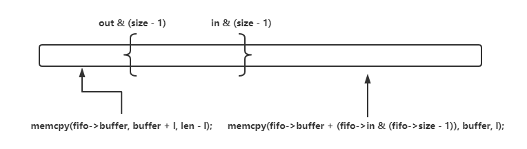

Linux内核中用到的一些数据结构

<!--more-->

## kfifo

内核中循环队列的实现

对于两个线程一个入队一个出队的并发操作，循环队列不加锁就可以保证线程安全。

```c
struct kfifo {
	unsigned char *buffer;	/* the buffer holding the data */
	unsigned int size;	/* the size of the allocated buffer */
	unsigned int in;	/* data is added at offset (in % size) */
	unsigned int out;	/* data is extracted from off. (out % size) */
	spinlock_t *lock;	/* protects concurrent modifications */
};
```

### 循环队列初始化

```c
struct kfifo *kfifo_alloc(unsigned int size, int gfp_mask, spinlock_t *lock)
{
	unsigned char *buffer;
	struct kfifo *ret;

	/*
	 * round up to the next power of 2, since our 'let the indices
	 * wrap' tachnique works only in this case.
	 */
	if (size & (size - 1)) { //判断size是否是二的幂
		BUG_ON(size > 0x80000000);
		size = roundup_pow_of_two(size);
	}

	buffer = kmalloc(size, gfp_mask);
	if (!buffer)
		return ERR_PTR(-ENOMEM);

	ret = kfifo_init(buffer, size, gfp_mask, lock);

	if (IS_ERR(ret))
		kfree(buffer);

	return ret;
}
```

注意到一点是，size需要为2的n次幂，否则就向上取整进行扩展。**这样是为了将模运算转化为与运算，提高效率**

`kfifo->in % kfifo->size` 转化为 `kfifo->in & (kfifo->size – 1)`，因为size-1一定是01111...这种形式的，取模就是一个保留低位舍弃高位的过程，刚好是01111..这样的二进制数取与的过程。

另外判断一个数不是二的幂用了**size & (size - 1)**，例如100000&011111 = 0，也就是只有**二的幂，与自己-1的数取与会得到0。**

### 入队

```c
unsigned int __kfifo_put(struct kfifo *fifo,
			 unsigned char *buffer, unsigned int len)//buffer是要加入队列的数据，len是buffer的长度
{
	unsigned int l;

	len = min(len, fifo->size - fifo->in + fifo->out);//需要长度和空闲长度的最小值

	/* first put the data starting from fifo->in to buffer end */
	l = min(len, fifo->size - (fifo->in & (fifo->size - 1)));//需要长度和末端长度的最小值
	memcpy(fifo->buffer + (fifo->in & (fifo->size - 1)), buffer, l);//一部分放到末端

	/* then put the rest (if any) at the beginning of the buffer */
	memcpy(fifo->buffer, buffer + l, len - l);//一部分放到起端

	fifo->in += len;//in和out始终是线性增大的，但溢出的时候，重新从0开始增长

	return len;
}
```

根据buffer的长度，分成了两部分进行入队

（在图上，in指针也不一定在out的右边，比如in一直写，是可能在out左边的，这也是出队时候可能会分成两部分memcpy的原因。但是数值上始终满足in>out，in-out<size）




### 出队

```c
unsigned int __kfifo_get(struct kfifo *fifo,
			 unsigned char *buffer, unsigned int len)
{
	unsigned int l;

	len = min(len, fifo->in - fifo->out);

	/* first get the data from fifo->out until the end of the buffer */
	l = min(len, fifo->size - (fifo->out & (fifo->size - 1)));
	memcpy(buffer, fifo->buffer + (fifo->out & (fifo->size - 1)), l);//to,from

	/* then get the rest (if any) from the beginning of the buffer */
	memcpy(buffer + l, fifo->buffer, len - l);

	fifo->out += len;

	return len;
}
```

跟入队类似。


kfifo使用in和out两个指针来描述写入和读取游标，对于写入操作，只更新in指针，而读取操作，只更新out指针
为了避免读者看到写者预计写入，但实际没有写入数据的空间，写者必须保证以下的写入顺序：

1.往[kfifo->in, kfifo->in + len]空间写入数据
2.更新kfifo->in指针为 kfifo->in + len

在操作1完成时，读者是还没有看到写入的信息的，因为kfifo->in没有变化，认为读者还没有开始写操作，只有更新kfifo->in之后，读者才能看到。

那么如何保证1必须在2之前完成，秘密就是使用内存屏障：smp_mb()，smp_rmb(), smp_wmb()，来保证对方观察到的内存操作顺序。

关于内存屏障：https://blog.csdn.net/weixin_30446197/article/details/96602025?utm_medium=distribute.pc_relevant.none-task-blog-2~default~baidujs_title~default-1.pc_relevant_antiscanv2&spm=1001.2101.3001.4242.2&utm_relevant_index=4

memcpy后修改out，修改out之前其实是要加内存屏障的，因为可能memcpy还没完成，out已经被修改了。

## 参考资料

https://www.cnblogs.com/blogs-of-lxl/p/10570885.html

