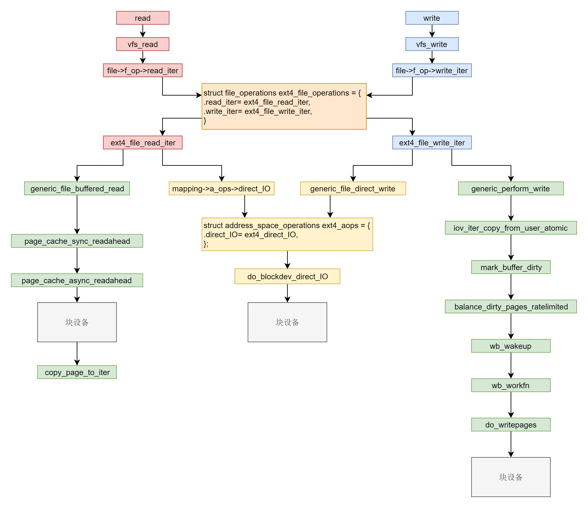

<!--more-->

对于read 和 write。

在 VFS 层调用的是 vfs_read 和 vfs_write 并且调用 file_operation。

在 ext4 层调用的是 ext4_file_read_iter 和 ext4_file_write_iter。

接下来就是分缓存 I/O 和直接 I/O。直接 I/O 读写的流程是一样的，调用 ext4_direct_IO，再往下就调用块设备层了。缓存 I/O 读写的流程不一样。对于读，从块设备读取到缓存中，然后从缓存中拷贝到用户态。对于写，从用户态拷贝到缓存，设置缓存页为脏，然后启动一个线程写入块设备。

