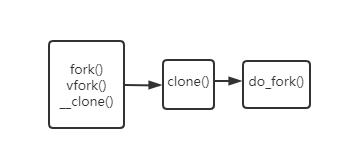

<!--more-->

## 进程描述符

> 进程描述符 task_struct ，其结构定义在<include/linux/sched.h>中，包含内核管理一个进程需要的信息

内核中有一个双向循环链表，用这个双向链表来链接所有进程。

```c++
struct list_head {
	struct list_head *next, *prev;
};
```

在linux 2.6.11的代码中，list_head是task_struct中的一个字段。

进程描述符通过slab分配器进行分配，在内核栈底或栈顶创建一个thread_info的结构，这个结构中有指向进程描述符的指针

thread_info结构定义在<asm/thread_info.h>下

```c++
struct thread_info {
	struct task_struct	*task;		/* mtain task structure */
	struct exec_domain	*exec_domain;	/* execution domain */
	__u32			flags;		/* low level flags */
	__u32			status;		/* thread synchronous flags */
	__u32			cpu;		/* current CPU */
	int 			preempt_count;

	mm_segment_t		addr_limit;	
	struct restart_block    restart_block;
};
```


## 进程创建

Unix用两个函数实现进程的创建：`fork()`和`exec()`

`fork()`拷贝当前进程创建一个子进程，子进程和父进程只有pid,ppid和一些统计量不同，其他是一样的。

然后用`exec()`读取可执行文件并载入地址空间开始执行。

### 写时拷贝的优化

fork使用写时拷贝实现。fork的时候内核不赋值整个进程的地址空间，而是父子进程暂时共享同一份拷贝。子进程需要写入的时候，数据才会被复制，对于fork后立刻exec的情况下，就不需要复制了。

因此fork的实际开销：

* 复制父进程的页表
* 给子进程创建task_struct进程描述符

### fork的实现

linux通过调用clone实现fork，vfork，__clone



### linux中线程的实现

从2.6.11内核的角度来说，并没有线程的概念。linux把所有线程都当成进程来对待，也没有特别的调度算法和数据结构来表示线程。

linux内核把线程看作与其他进程共享某些资源的进程，所以linux里的线程还是进程，也有自己的task_struct。

linux中的线程称为轻量级进程。

#### 线程模型

线程分用户线程与内核线程（根据运行环境和调度者的身份）。

用户线程运行在用户空间，由线程库调度，内核根本不知道这些线程的存在。

内核线程相当与用户线程运行的容器，一个进程可以拥有M个内核线程和N个用户线程，M<=N

线程实现形式的不同，决定了不同的M和N。

对于`M:N=M:1`的实现，也就是M个用户空间线程对应一个用户线程，这种就是完全在用户空间实现的线程，这种实现不占用内核资源，速度相当快，创建和调度也不用内核干预，当时缺点就是对于多CPU系统，一个进程的不同线程也无法运行在不同的CPU上。

对于`M:N = 1:1`的实现，一个用户空间线程被映射为一个内核线程，这种是内核级的线程，NPTL项目pthread就是这种实现方式。pthread_create会调用clone系统调用，由操作系统创建内核级线程，也就是轻量级进程。


## 参考资料

Linux下调用pthread库创建的线程是属于用户级线程还是内核级线程？求大神指教? - 大河的回答 - 知乎 https://www.zhihu.com/question/35128513/answer/148038406

linux2.6.11源码

《linux内核设计与实现》

