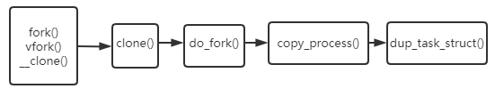
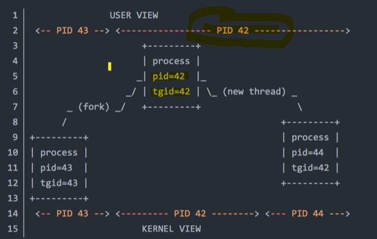
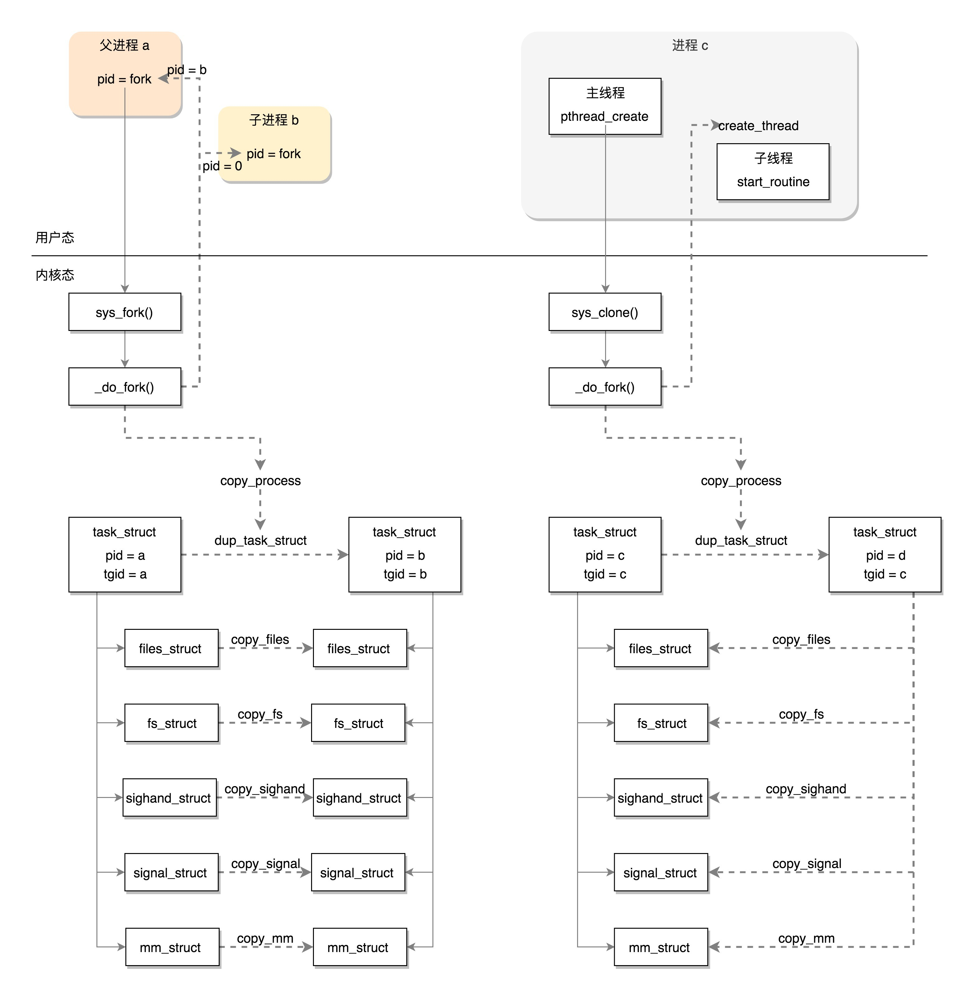

Linux内核之进程管理

<!--more-->

## 进程描述符

> 进程描述符 task_struct 就是PCB，其结构定义在<include/linux/sched.h>中，包含内核管理一个进程需要的信息

内核中有一个双向循环链表，所有进程也是用双向链表连接的。

```c++
struct list_head {
	struct list_head *next, *prev;
};
```

在linux 2.6.11的代码中，list_head是task_struct中的一个字段。

注意到的一点是，这里的双向链表和以前认识里的带data域的双向链表不同，这种结构实际上是一种侵入式链表，数据是附加到链表的，这样设计的双向链表是通用的，就不用考虑节点的数据类型了。

但是这样如何根据链表的指针获取外层的结构体？

Linux实现了一个特殊的宏

```c
#define list_entry(ptr, type, member) container_of(ptr, type, member) //ptr是成员变量指针，type是结构体的类型，member是ptr的变量名

#define list_entry(ptr, type, member) /
        ((type *)((char *)(ptr)-(unsigned long)(&((type *)0)->member)))
```

这个宏可以通过结构体某个成员的指针获取整个结构体的指针。

`(unsigned long)(&((type *)0)->member)`：得到的就是ptr指向的mebmer相对于结构体基址的偏移量，与ptr结构体成员指针相减就得到了结构体的基址。

这是因为在C语言中，一个给定结构中的变量偏移在编译时就被ABI固定下来了。

进程描述符通过slab分配器进行分配，在内核栈底或栈顶创建一个thread_info的结构，这个结构中有指向进程描述符的指针

thread_info结构定义在<asm/thread_info.h>下

```c++
struct thread_info {
	struct task_struct	*task;		/* mtain task structure */
	struct exec_domain	*exec_domain;	/* execution domain */
	__u32			flags;		/* low level flags */
	__u32			status;		/* thread synchronous flags */
	__u32			cpu;		/* current CPU */
	int 			preempt_count;

	mm_segment_t		addr_limit;	
	struct restart_block    restart_block;
};
```

## 进程创建

Unix用两个函数实现进程的创建：`fork()`和`exec()`

`fork()`拷贝当前进程创建一个子进程，子进程和父进程只有pid,ppid和一些统计量不同，其他是一样的。

然后用`exec()`读取可执行文件并载入地址空间开始执行。

### 写时拷贝的优化

fork使用写时拷贝实现。fork的时候内核不赋值整个进程的地址空间，而是父子进程暂时共享同一份拷贝。子进程需要写入的时候，数据才会被复制，对于fork后立刻exec的情况下，就不需要复制了。

因此fork的实际开销：

* 复制父进程的页表
* 给子进程创建task_struct进程描述符

### fork的实现

> 实际就是复制父进程的页表，并给子进程创建唯一的进程描述符

linux通过调用clone实现fork，vfork，__clone




pthread_create会调用__clone()，最后会通过不同的flags去调用clone()，flags设置为共享进程的地址空间，共享文件系统信息，共享打开的文件，共享信号处理程序。

fork调用clone时，四个标志都不设置创建的是进程。反正创建的是线程。

### linux中线程的实现

从2.6.11内核的角度来说，并没有线程的概念。linux把所有线程都当成进程来对待，也没有特别的调度算法和数据结构来表示线程。

linux内核把线程看作与其他进程共享某些资源的进程，所以linux里的线程还是进程，也有自己的task_struct。

linux中的线程是种轻量级进程实现LWP。

```c++
struct task_struct {
    ...
	pid_t pid;//pid对进程和线程都是独一无二的
	pid_t tgid;//linux中线程实现的核心成员，表示线程组id
    ...
}
```

当用`pthread_create`创建一个线程时，会创建一个新的`task_struct`，这个进程描述符有独一无二的pid，但是这个线程的tgid等于原始进程的pid，这个进程创建的所有线程的tgid都是原始进程的pid，领头进程的进程号。

命令`ps`和`getpid()`查到的pid是task_struct中的`tgid`成员，LWP号才是真正的pid。



```c++
struct tast_struct {
    ...
	struct mm_struct *mm, *active_mm;//内存区描述符，对于线程是共享的
    ...
}
```

多线程出现后，CPU的调度是以线程为单位进行调度，资源分配还是以进程为单位。

#### 线程模型

线程分用户级线程与内核级线程（根据运行环境和调度者的身份）。（区别内核线程，内核线程是没有用户空间的完全工作与内核的线程。）

用户线程运行在用户空间，由线程库调度，内核根本不知道这些线程的存在。

内核线程相当与用户线程运行的容器，一个进程可以拥有M个内核线程和N个用户线程，M<=N

线程实现形式的不同，决定了不同的M和N。

对于`M:N=M:1`的实现，也就是M个用户空间线程对应一个内核线程，这种就是完全在用户空间实现的线程，这种实现不占用内核资源，速度相当快，创建和调度也不用内核干预，tcb在用户空间，缺点就是对于多CPU系统，一个进程的不同线程也无法运行在不同的CPU上。协程就是用户级线程，这样设计避免了频繁的上下文切换。

对于`M:N = 1:1`的实现，一个用户空间线程被对应为一个内核线程，tcb在内核空间，linux的tcb还是task_struct，这种是内核级的线程，NPTL项目pthread就是这种实现方式。pthread_create会调用clone系统调用，由操作系统创建内核级线程，也就是轻量级进程。

现代线程都是1：1的，每个线程有两个栈，一个用户空间的一个内核的。

### 进程线程区别

创建进程的话，调用的系统调用是 fork，在 copy_process 函数里面，会将五大结构 files_struct、fs_struct、sighand_struct、signal_struct、mm_struct 都复制一遍，从此父进程和子进程各用各的数据结构。

而创建线程的话，调用的是系统调用 clone，在 copy_process 函数里面， 五大结构仅仅是引用计数加一，也即线程共享进程的数据结构。



## 进程切换

> 进程切换的关键操作：切换地址空间、切换内核堆栈、切换内核控制流程以及必要寄存器的现场保护与还原。

## 进程调度

> 调度需要关注什么时候进行切换和选择哪个进程来运行，这其实是个数学问题，给定一组参数，比如线程的优先级，使用的时间，然后返回下一个要运行的线程是谁。

内核2.6以前使用的是O(n)调度法，2.6版本替换为了O(1)调度法（2003年）。

O(1)调度法对每个优先级用两个链表管理运行的进程，一个是ready-to-run的就绪链表，一个是耗尽时间片的链表。

后来，Linux放弃了预定义的时间片的概念，引入了完全公平调度（CFS）到Linux 2.6.23内核中（2007年），直到现在也一直作为Linux的调度器。

CFS以模块方式组织，也就是实现了多个调度类，不同类型的进程选择不同的调度算法。比如，rt class调度试试进程，fair class才是CFS的实现，idle class处理没有任务运行的情况。

### 多核调度

> 多核调度的重点是load balance，其余的看成是单核调度的复刻

多核调度需要额外考虑的问题：

* 一个核的两个超线程不需要平衡：一个核有两个超线程，他们共享相同的执行部件，那么再平衡是没有意义的
* 跨核调度：如果轻易的跨核调度可能引发大量的cache失效，因为L1 L2cache是不共享的
* 线程NUMA系统的一个Node迁移到另一个
* 考虑CPU的休眠和降频的方式降低功耗，比如两个进程是在一个核上，另一个核休眠，或者分配到两个核上一起降频

CFS定期以软中断的形式周期执行load balance的代码，将任务从最繁忙的核中提取出来转移到空闲的核中来实现平衡，负载均衡的决策以来与缓存和NUMA的位置。CFS将core按层次结构划分为每个硬件级别的调度域（sched_domain），load balance在每个sched_domain执行。一个sched_domain中的cpu核又被划分为不同的调度组（sched_group），不同的组之间可以进行线程的迁移。

#### CFS负载均衡

## 内核线程

https://mp.weixin.qq.com/s/GO0z646XZko_pUvmMSa9RQ


## 问题

* 一个多线程的进程fork出来的进程是多线程的吗？答案不是，fork出来的进程只有一个线程，就是调用fork的那个线程。
* CFS的公平的含义是什么？


## 参考资料

Linux下调用pthread库创建的线程是属于用户级线程还是内核级线程？求大神指教? - 大河的回答 - 知乎 https://www.zhihu.com/question/35128513/answer/148038406

linux2.6.11源码

《linux内核设计与实现》

https://www.bilibili.com/video/BV1ov41157pA?from=search&seid=15110093483709811855

http://home.ustc.edu.cn/~hchunhui/linux_sched.html

https://cloud.tencent.com/developer/article/1759921

cgroups:https://tech.meituan.com/2015/03/31/cgroups.html

[进程创建过程、栈对齐]: https://www.cnblogs.com/qinghaowusu/p/14081097.html

