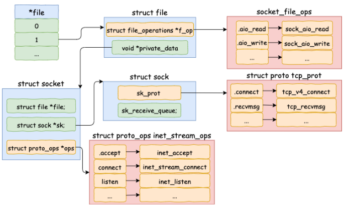
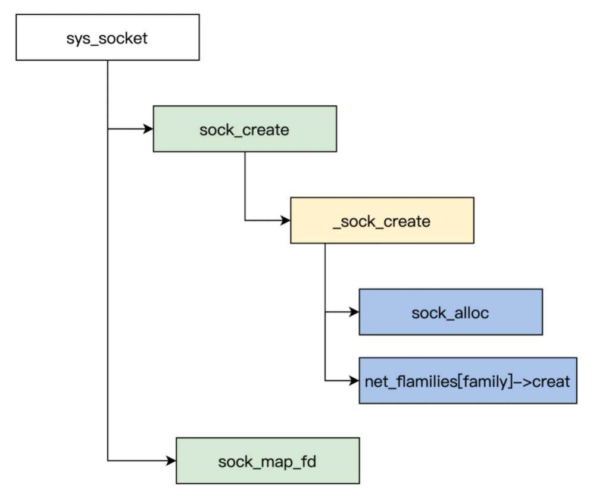

<!--more-->

## 套接字数据结构

> linux系统下，每个套接字都有一个**struce socket**和**struc sock**的数据结构实例。

### struct socket

```c
struct socket {
	socket_state		state;//套口状态，如SS_FREE
	unsigned long		flags;//套口标志位，如SOCK_ASYNC_NOSPACE
	struct proto_ops	*ops;//传输层提供的接口方法。如inet_stream_ops，inet_dgram_ops，inet_sockraw_ops
	struct fasync_struct	*fasync_list;//异步通知队列。用于异步IO
	struct file	*file;//与套口相关联的文件指针。
	struct sock	*sk;//与套口相关联的传输控制块。
	wait_queue_head_t	wait;//等待该套口的进程列表。
	short type;//套口类型，如SOCK_STREAM。
	unsigned char passcred;//是否设置了SO_PASSCRED选项。
};
```

struct socke与socket描述符一一对应，每个套接字都对应内核中唯一的struct socket，struct sock是struce socket中的一个字段。

### struct sock

sock结构体包含了套接字的全部属性，其中的一个sock_common是套接字的共有属性，所有协议族的这些属性都是一样的。

sock_common是sock里的一个成员，最重要的成员就在sock_common里。

```c
struct sock {
	struct sock_common	__sk_common;
    ...//很多特性很少用到，重点看sock_common
}
struct sock_common {
	unsigned short	skc_family;//所属协议族
	volatile unsigned char	skc_state;//连接状态，对UDP来说，存在TCP_CLOSE状态
	unsigned char skc_reuse;//是否可以重用地址和端口,SO_REUSEADDR设置
	int	skc_bound_dev_if;//如果不为0，则为绑定的网络接口索引，使用此接口输出报文
	struct hlist_node	skc_node;//通过此节点，将控制块加入到散列表中
	struct hlist_node	skc_bind_node;//如果已经绑定端口，则通过此节点将控制块加入到绑定散列表中
	atomic_t skc_refcnt;//引用计数
};
```

从`hlist_node`成员可以看出，sock组织在特定协议的哈希链表中，`skc_node`是哈希节点。

### socket在内核中的组织



## 套接字接口

### socket

socket()创建套接字，产生系统调用中断，调用内核套接字函数sys_socketcall，在将调用传送到sys_socket函数，

sock_create函数完成通用的套接字创建初始化工作，其中就创建了新的struct socket。

sock_alloc分配了struct socket需要的预留内存空间，也会分配struct inode实例的内存空间。

然后调用特定的协议族创建函数。

sock_map_fd返回了分配的文件描述符。



### bind

sys_bind将套接字和地址绑定起来

```c
asmlinkage long sys_bind(int fd, struct sockaddr __user *umyaddr, int addrlen)
{
	struct socket *sock;
	char address[MAX_SOCK_ADDR];
	int err;

	if((sock = sockfd_lookup(fd,&err))!=NULL)/* 根据文件描述符查找套接口 */
	{
		if((err=move_addr_to_kernel(umyaddr,addrlen,address))>=0) {/* 从用户态复制地址到内核中 */
			err = security_socket_bind(sock, (struct sockaddr *)address, addrlen);/* 安全审计 */
			if (err) {
				sockfd_put(sock);
				return err;
			}
			/* 调用套接口层的bind回调，对IPV4来说，就是inet_bind */
			err = sock->ops->bind(sock, (struct sockaddr *)address, addrlen);
		}
		/* 释放对文件句柄的引用 */
		sockfd_put(sock);
	}			
	return err;
}
```

首先根据文件描述符查找到socket实例，绑定之前，先将用户空间的地址拷贝到内核空间，然后检查传入地址是否正确。

bind函数完成绑定操作。

### connect

主动连接

```c
asmlinkage long sys_connect(int fd, struct sockaddr __user *uservaddr, int addrlen)
{
	struct socket *sock;
	char address[MAX_SOCK_ADDR];
	int err;

	sock = sockfd_lookup(fd, &err);/* 查找文件句柄对应的socket */
	if (!sock)
		goto out;
	/* 从用户态复制地址参数到内核中 */
	err = move_addr_to_kernel(uservaddr, addrlen, address);
	if (err < 0)
		goto out_put;

	/* 安全审计 */
	err = security_socket_connect(sock, (struct sockaddr *)address, addrlen);
	if (err)
		goto out_put;

	/* 调用传输层的connet方法inet_stream_connect或inet_dgram_connect */
	err = sock->ops->connect(sock, (struct sockaddr *) address, addrlen,
				 sock->file->f_flags);
out_put:
	sockfd_put(sock);
out:
	return err;
}

```

### listen

listen 的主要工作就是申请和初始化接收队列，包括全连接队列和半连接队列。

### accept

被动连接


## 参考资料

https://mp.weixin.qq.com/s?__biz=MjM5Njg5NDgwNA==&mid=2247485737&idx=1&sn=baba45ad4fb98afe543bdfb06a5720b8&scene=21#wechat_redirect

linux2.6.11
