谷歌文件系统：面向大规模数据密集型应用的可扩展分布式文件系统。

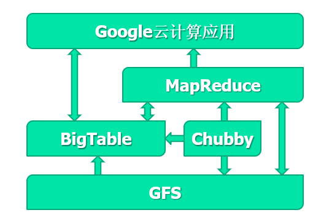

<!--more-->

## 概述

**GFS的作用：**

* 存储BigTable的子表文件
* 提供大尺寸文件存储功能

**文件组织形式**

* 分成Chunk(块)64MB/块，分布和复制在服务器上

**两个实体**

* 一个Master
  * 维护所有文件系统Meta data（命名空间、访问控制信息、文件名到块的映射、块的当前位置）
  * 复制其数据以实现容错
  * 定期与所有chunkserver通信：发送心跳信息、获取状体并发送命令
* 多个chunkserver
  * 响应read\write请求和master的命令
  * 在磁盘上存储实际的数据，Master只存了元数据

### 设计动机

* 组件失效是常态事件
* 文件非常大
* 绝大部分文件的修改是追加写的形式
* 应用程序和文件系统协同设计，以提高系统灵活性

### 设计思想

* 文件以数据块形式存储，每个数据块有自己的句柄
* 副本技术保证可靠性：每个数据块至少有3个副本，作为本地文件存储在Linux文件系统中
* Master维护所有文件系统的元数据，并利用周期性的心跳信息向chunkserver发送命令和收集状态
  * master不存在性能瓶颈的原因
    * 只存元数据：磁盘容量、内存容量不会是瓶颈
    * 元数据可以在内存里：磁盘IO不会是瓶颈
    * 数据流和数据缓存不通过master，带宽不会是master的瓶颈
    * 元数据可以缓存在client，CPU不会成为Master瓶颈

## GFS的体系结构

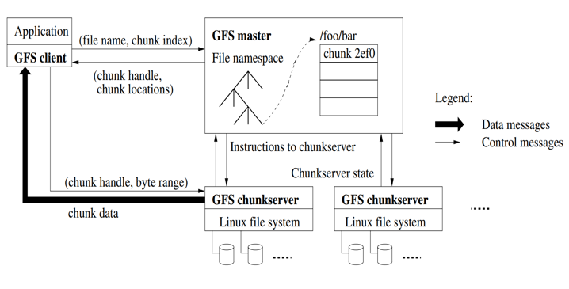

### 系统流程

#### 读操作

* 应用程序发起读取请求。
* Client从（文件名，字节范围）->（文件名，组块索引）转换请求，并将其发送到Master。
* Master以块句柄和副本位置（即存储副本的Chunkserver）作为响应。
* Client选择一个位置，然后将（块句柄，字节范围）请求发送到该位置。
* Chunkserver将请求的数据发送到Client。
* Client将数据转发到应用程序。

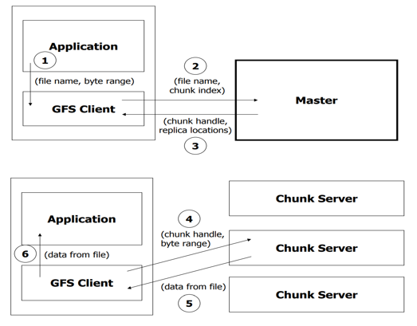

比如这里，2048是要读的字节数，Master中根据文件名找到了属于该文件的块编号，还有所在的chunkserver号

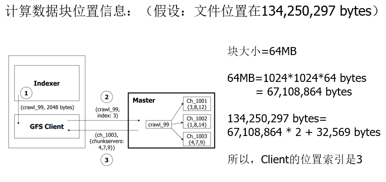

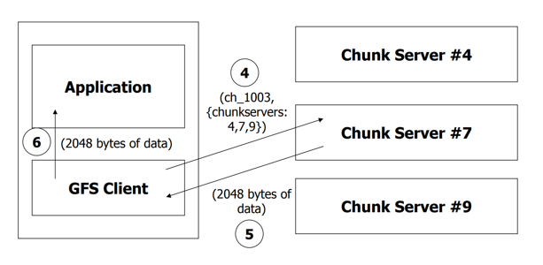

#### 写操作

任何写或者追加操作要求互斥

要求：数据需要被写到所有的副本上。当多个Client请求修改操作时，保证同样的次序

* Client发送请求到Master
* Master返回块的句柄和副本的位置信息
* Clinent将写数据发送给所有的副本
* 数据存储在副本的缓存中
* client发送写命令到primary
* primary给出写次序
* primary将次序发送给secondaries
* secondaries响应primary
* primary响应client

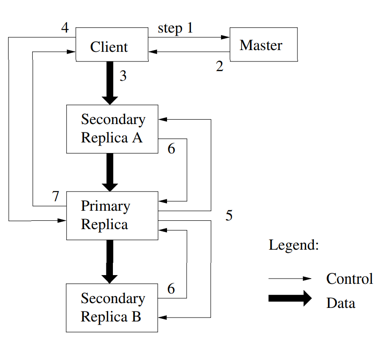

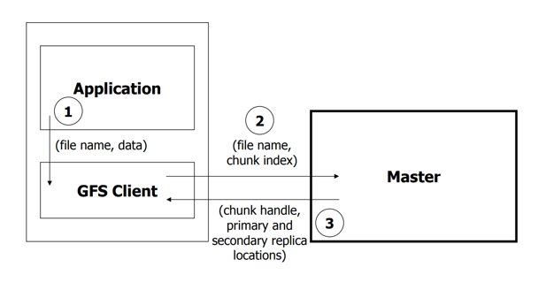

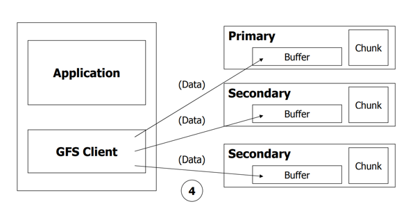

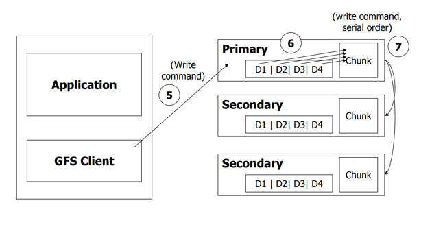

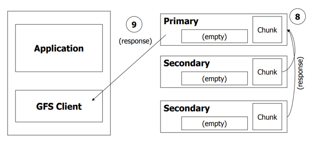

#### 添加操作

* client 将数据推送给所有副本，然后向primary发送请求
* primary检查append操作是否会使块超过64MB
  * 如果小于，正常处理
  * 大于，块被填充为0（放弃该块的写），所有secondary也同样操作，然后通知client在下一个块上重新尝试。

#### 一致性问题

区别两个概念：

* 一致：所有的client读取**相同**的数据
* 确定：所有的client读取**有效**的数据

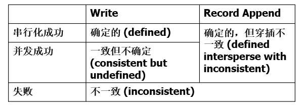

串行化成功：多个client串行写，写入并没有相互干扰。

并发成功：primary决定client的写的顺序，多个client可能并发写多个存在交叉的chunk，由于primary之间不通信，不同的primary可能选择不同的client写顺序，如果执行成功，所有的client会看到相同的数据，但是数据无效。
