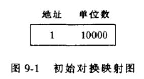
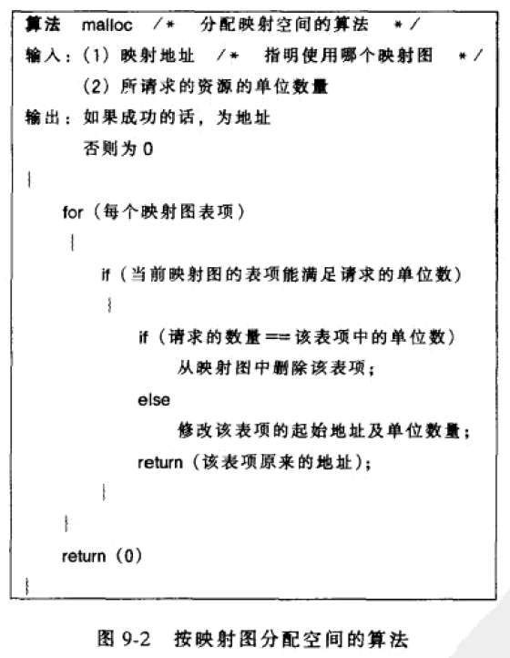
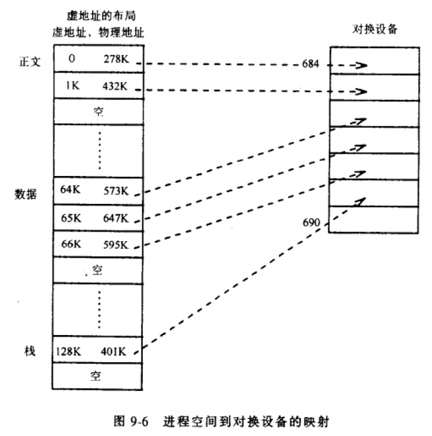
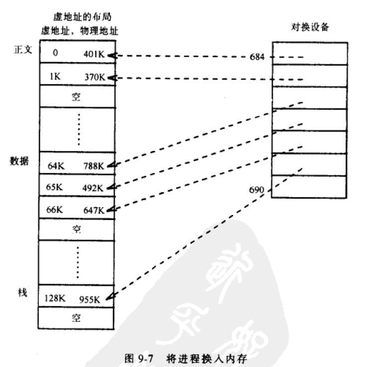
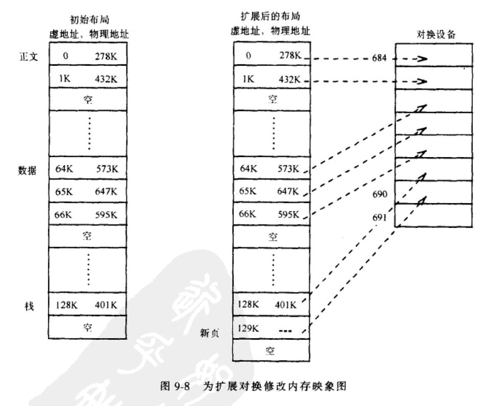
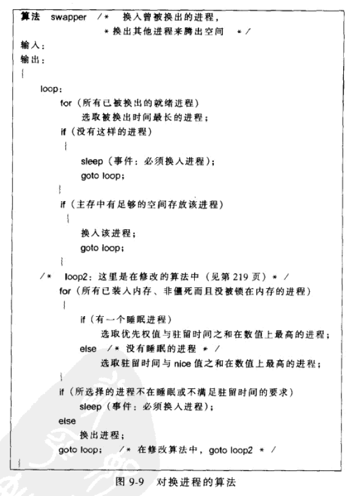
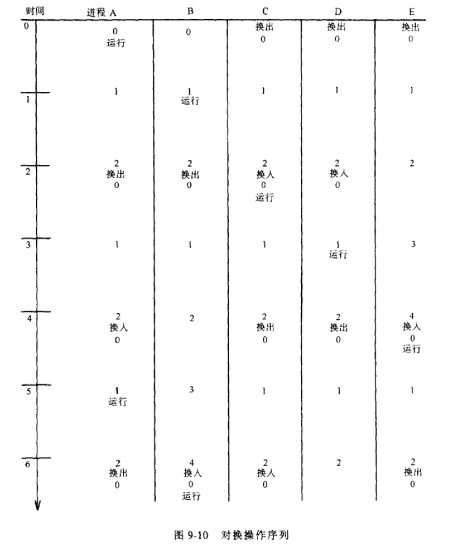

《UNIX操作系统设计》第九章

<!--more-->

## 对换

对换算法的描述分三个部分：对换设备上的空间管理、将进程换出内存、将进程换入内存。

### 对换空间的分配

对换设备：在一个磁盘的可配置段中的一个块设备。

内核在对换设备上可以以一组连续的磁盘块为单位分配空间。而文件一次只分配一个磁盘空间，这样可以减少碎片量

。而在对换设备上，进程驻留的时间是短暂的，最终会被释放掉，速度更关键，这时系统操作多个块速度要快的多。

对换设备分配方法和文件系统的分配方法不同，记录空闲区的数据结构也不一样。

* 内核用空闲块链接表管理文件系统的空闲空间，在超级块中可以存取到该链表。

* 内核通过存放在内存中的，叫做映射图的表来管理对换设备的空间。
* 映射图也用于管理其他一些资源，如设备驱动程序。采用最先适配算法，分配连续块。

映射图结构：

* 映射图是一个数组
* 每一项包含：一个可分配资源的地址、该地址上可用资源的单位数。

开始时，映射图只有一项（因为还没有被用过），指出资源的地址和全部可用资源的数目。后面随着分配和释放资源，内核会不断修改映射图，使其总是保存着空闲资源的准确信息。

映射图分配算法malloc

当释放资源时，有三种情况：

* 被释放的资源完全填满映射图中的一个空洞。释放的这个资源和前后两个表项合并，变成一项。
* 被释放的资源部分地填充映射图中的一个空洞。项数不变，修改表项地址和单位数
* 被释放的资源部分太南充一个空洞但不连接映射图中的任何表项。新建项

### 进程的换出

以下事件会引起进程换出

* 系统调用fork必须为子进程分配空间
* 系统调用brk扩大一个进程大小
* 进程由于栈的自然增长而变大
* 运行以前被换出，现在应该被换入的进程

fork的情况最特殊，是唯一不能放弃被进程先前占据的内存映象空间的情况。

换出的过程：

换出进程时，进程的每个区引用数减一，并把引用数为0的区换出。内核分配对换设备空间，并将该进程锁在内存中，防止对换操作过程中对换进程将它对换出来？？内核将区的对换地址保存在区表表项中。

对换的时候绕过高速缓冲。如果按页面组织内存，换出的数据在物理存储器上可能时不连续的，内核需要收集被换出数据的页面地址，磁盘驱动程序也可能要用这些页面地址驱动IO？？对换进程在换出剩下的数据之前要等待每一个IO操作完成。

内核没有必要将一个进程的整个虚地址空间全部写到对换设备上去。仅将物理存储拷贝到对换设备空间，忽略未分配的虚地址。

例子：

换入时，内核查找进程存储映射表得知进程有一个62k字节的空区，并指定相应的物理存储。进程占据的物理地址单元在换出前和换入后时不同的。

能不能换出的问题：

如果U区含有进程地址转换表，内核就不能换出U区。实现上要决定一个进程能否将自己换出，还是必须由另一个进程将其换出。

* fork对换：如果内存不足以创建子进程的上下文，内核将子进程换出到对换设备上，父进程的内存并不释放，父进程将子进程设置为就绪态，自己返回用户态。子进程直到换入内存调度后，才会完成它的fork系统调用部分然后返回用户态。

* 扩展对换：进程需要的内存比分配给的内存还多，如栈增长或brk引起，内核就要进行进程的扩展对换。内核在对换设备上预定足够多的空间，然后修改进程地址转换映射来适应新的虚存空间，但此时并不分配物理存储地址。内核通过一次正常的换出，将对换设备上新分配的空间清零。再次换入时，按新的增加了尺寸的地址转换映射图来分配物理地址。

  

### 进程的换入

进程0，就是对换进程，是唯一的将进程从对换设备上换入内存的进程。系统初始化结束后，对换进程就进入一个无限循环。它总是试图将进程从对换设备换入内存，如果需要主存空间，就将进程换出内存。如果对换进程没事做或不能做任何事就睡眠，内核会定期唤醒对换进程，并和其他进程一样进行调度。但对换进程仅在核心态下运行，使用内核内部函数来执行对换，这是所有核心进程的主要工作方式。

对换进程怎么工作的？

对换进程被唤醒后，就进行换入进程的工作，查找所有处在就绪且换出状态的进程，从中选取换出时间最长的（这个时间是时钟处理程序记录的），如果内存够，就换入。换入是换出操作的逆过程：分配物理存储，将进程从对换设备读入，然后释放对换空间。

如果对换进程找到了应该被换入的进程，但系统没有足够的内存空间，这时，对换进程试图换出另一个进程，如果成功则重新启动对换算法，查找要换入的进程。换出的另一个进程是正在睡眠的进程，如果没有睡眠的进程，就根据进程的nice值和在内存中驻留的时间换出就绪进程。

如果找不到可用换出的进程或要换入换出的进程在自己的环境里驻留时间不超过两秒（规定），对换进程就睡眠在一个事件上，这个事件表示，对换进程要换入一个进程，但内存不够。之后，时钟每秒一次唤醒对换进程，当有进程进入睡眠状态，内核也要唤醒对换进程。

举例：

malloc实现：看brk，mmap