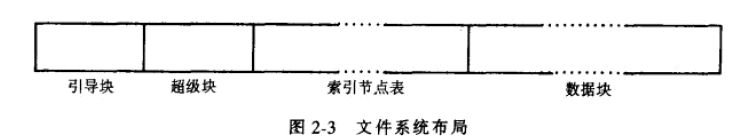

《UNIX操作系统设计》第四章

<!--more-->

UNIX系统中每个文件都有一个唯一的索引节点，记录了进程存取文件所必须的信息，如文件所有者、存取权限、文件长度、文件数据在文件系统中的位置。

每个路径名唯一指明一个文件，内核把路径名转换成文件的索引节点。

本章算法层次在高速缓冲算法之上。

| 算法          | 功能                                                         |
| ------------- | ------------------------------------------------------------ |
| iget          | 返回一个先前标识了的索引节点，可能是由高速缓冲从磁盘上读出的 |
| iput          | 释放索引节点                                                 |
| bmap          | 存取一个文件设置内核参数                                     |
| namei         | 使用iget、iput、bmap把一个用户级路径名转换成一个索引节点     |
| alloc、free   | 为文件分配及释放磁盘块                                       |
| ialloc、ifree | 为文件分配及释放索引节点                                     |

## 索引节点

### 定义

索引节点有两份，在磁盘上和内存上，在内存上缓冲是便于内核操作，提高效率，这里的缓冲采用的第三章高速缓冲。

索引节点以静态形式存在于磁盘上，核心把它们读进内存索引节点表中以操纵它们，索引节点字段组成：

* 文件所有者标识号
* 文件类型：正规类型、目录类型、字符设备类型、块设备类型、管道类型
* 文件存取许可权：chmod，Linux/Unix 的文件调用权限分为三级 : 文件所有者（Owner）、用户组（Group）、其它用户（Other Users）。
* 文件存取时间
* 文件联结数目：本目录树中有多少文件名指向该文件
* 文件数据的磁盘地址明细表
* 文件大小

并不标明该文件的路径名

内存中的索引节点除了磁盘索引节点那些字段外，还包含：

* 内存索引节点状态：是否上锁，是否有进程在等它变为开锁等等
* 含有该文件系统的逻辑设备号
* 索引节点号：索引节点存储在磁盘上的线性数组中，内核需要用下标来标识这个节点号。
* 指向其他内存索引节点的指针：内核也会把索引节点链接到散列队列和空闲表上。
* 引用数：该文件的活跃实例数目（如open），仅当索引节点的引用计数为0时才位于空闲表上，标识内核可以把这个内存索引节点重新分配给另一个磁盘索引节点。

### 对索引节点的存取 iget

iget分配一个索引节点的内存拷贝，与getblk算法几乎时完全相同的。内核把设备号和索引节点号映射到一个散列队列上，便于搜索找到索引节点。如果找不到，就从空闲表分配，并上锁。

然后就在磁盘中找对应的磁盘块号，块号 = （int（索引节点号-1）/每块的索引节点数目）+ 索引节点表的起始块号

知道块号后，利用bread从缓冲区读块，计算索引节点在块中的字节偏移量：((索引节点号-1) mod (每块的索引节点数目))*磁盘索引节点大小。

找到后，拷贝到内存索引节点表中，放到正确的散列队列，引用计数设置为1

### 释放索引节点 iput

当内核释放一个索引节点时（iput）,将他的索引节点引用计数减1，当减为0，且内存拷贝和磁盘不同，则内核需要往磁盘写入。内核还会把该索引节点放到空闲索引节点表中，当再次需要时，可以高效把该节点加入高速缓冲。如果联结数减为0，则释放与该文件有关的数据块，并将索引节点变为空闲。

## 正规文件的结构

### 把文件字节流的字节偏移量到物理磁盘块号的转换 bmap

例子：

两个发展：

* 允许使用大磁盘块，一个磁盘块可以包含若干个文件的分段
* 把文件数据存储到索引节点中。

## 目录

目录是文件，记录了一系列目录表项，每个表项由一个**索引节点号**和一个包含在这个目录中的**文件名**组成。

## 路径名到索引节点的转换 namei

如何根据路径名搜索索引节点

## 超级块

描述文件系统的状态，有多大，能存多少文件等等。

超级块字段组成：

* 文件系统的规模
* 文件系统中空闲块的数目
* 在文件系统上可用的空闲块表
* 空闲块表中下一个空闲块的下标
* 索引节点表的大小
* 文件系统中空闲索引节点数目
* 文件系统中空闲索引节点表
* 空闲索引节点表中下一个空闲索引节点的下标
* 空闲块表的锁字段和空闲索引节点表的锁字段
* 用来指示出超级块已经被修改了的标志

## 索引节点的分配

文件系统包含一个**索引节点线性表**，类型字段为0，说明这个**索引节点是空闲**的。当一个进程需要一个新的索引节点，如果内核搜索索引节点表，以寻找一个空闲节点，但这样代价太高了，至少对每个索引节点都需要一个读操作（可能从磁盘）。为了改善性能，文件系统超级块包含一个数组，以便把文件系统从空闲的索引节点号缓存起来。

### 分配索引节点ialloc

把一个磁盘索引节点号分配给一个新建立的文件

铭记的索引节点：如果超级块中没有空闲，即去磁盘搜索，当搜索到超级块装不下时停止搜索，此时记录下最高序号的索引节点，即下次搜索时从铭记索引节点开始。

### ifree 释放索引节点

## 磁盘块的分配

文件系统的**超级块包含**一个用来**把**文件系统中的**空闲磁盘块号**高速**缓冲起来的数组**。

mkfs把一个文件系统的数据块组织到一张链表中，表中**每个链是一个磁盘块大小**，块中包含的是一个数组，数组的分量给是**空闲磁盘块号**，一个分量是**下一个链表的块号**。

### 文件系统块分配 alloc

功能：把超级块空闲磁盘块号表中下一个可用的块分配出去。

当分配的是超级块高速缓冲中的最后一个可用块时，内核把他指向的块读出，填充到这个链表里，再加入一条新链，示例d。

### 释放磁盘块free

与分配磁盘块算法相反。

如果超级块未满，新释放的块的块号就被放到超级块表中。

如果超级块表满了，则新释放的块就变成一个链接块，内核把超级块表写到这个块上，然后把这个块写到磁盘上，然后把新释放的块的块号放到超级块表中作为下一个链表的指针，块号就成了表中唯一成员。

例子：

### 索引节点和磁盘块

两者的分配和释放算法类似，内核都使用超级块作为高速缓冲

内核维护的有一个块号链接表，文件系统中的每个空闲块号都作为其中的元素。

对索引节点不存在这样的链表，原因：

* 内核观察到文件类型字段被清除，则索引节点空闲。
* 一个磁盘块可以很容易容纳大的空闲块号表。
* 用户消耗磁盘块资源比消耗索引节点要快，所以快速得到空闲磁盘块更重要。

## 其他文件类型

管道文件、特殊文件

管道文件的数据时短暂的，先进先出，下一章介绍

特殊文件包括：块设备特殊文件、字符设备特殊文件，第10章介绍

