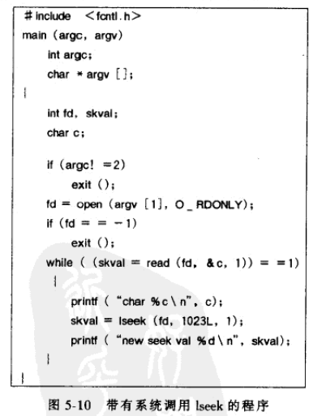

《UNIX操作系统设计》第五章

<!--more-->

引入了三种内核数据结构：文件表、用户文件描述秒和安装表

* 文件表：系统每个打开的文件在文件表中占有一项
* 文件描述分配表：记录进程已知的每个文件描述符
* 安装表：记录每个活动的文件系统信息


## 系统调用open

### 算法描述

`df = open(pathname,flags,modes)`

`pathname`是文件名，`flags`是打开的类型（读写），`modes`给出文件的许可权，返回一个称为文件描述符的整数。

打开清文件是什么？


内核先根据文件名找到索引节点，检查文件许可权，在文件表中分配表项，文件表表项中的指针指向索引节点，并设置偏移量，表示读写开始的地方。内核还会在进程的**u区的文件描述符表**中分配一个表项指向文件表中的表项，如下例子：


每个open调用都会在用户文件描述符表和内核文件表中分配一个唯一的表项，但在索引节点表中，每个文件只有一个表项。

文件表的作用：在若干文件描述符之间能够共享偏移量指针，见下文的dup和fork的实现。

文件描述符0、1、2分别为：标准输入、标准输出、标准错误文件描述符。

## 系统调用read

### 算法描述

`number = read(fd,buffer,count)`

`fd`是由open返回的文件描述符，`buffer`是用户进程中的一个数据结构的地址，调用成果结束时在该地址中存放所读的数据，`count`时要读的字节数，`number`是实际读的字节数。


* 根据文件描述符找到文件表项
* 在u区设置参数
  * 
* 找到索引节点
* 索引节点上锁
* 进入循环，直到读完。先读到缓冲区，再拷贝到用户地址空间

## 系统调用write

### 算法描述

`number = write(fd,buffer,count)`

写和读类似，区别：

* 若文件中还没有要写的字节偏移量所对应的块，内核要用alloc分配一个块，并将该块号放到索引节点表的正确位置上。
* 如果字节偏移量是一个间接块中的偏移量，内核可能需要分配几个块

### 举例

* 一个进程要写到一个文件的字节号为10240的地方

* 算法bmap访问该字节，内核将找不到对应的字节块，也没有必要的间接块。

* 内核分配磁盘块作间接块，并将块号写到内存的索引节点

* 然后，内核为数据分配磁盘块，并将块号写到新分配的间接块的第一个位置。

## 文件和记录的上锁

文件的加锁：指防止其他进程读或写整个文件的任何一部分的能力

记录的加锁：防止其他进程读或写特定记录的能力

之后将详细讨论实现

## 文件的输入/输出位置的调整——lseek

read和write提供了对文件的顺序访问，lseek可以指定IO的位置，从而实现文件的随机存取，语法格式如下：

`position=lseek(fd,offset,reference)`

`fd`是文件描述符，`offset`是字节偏移量，`reference`指出字节偏移量从哪开始：0表示文件头、1文件的当前读/写偏移量位置、2文件尾，`position`下次开始读/写的字节偏移量。

lseek的实现：系统通过调整文件表中的字节偏移量来实现。

### 举例



读取每隔1024倍数的那个字节

## 系统调用close

### 算法描述

`close(fd)`

内核对文件描述符、对应的文件表项、索引节点表项进行相应的处理，来完成关闭文件的操作。

* 如果因为调用dup或fork使得文件表项的引用数大于1，内核将引用数减1
* 如果引用数为1，内核将释放表项，并释放在open中分配的内存索引节点（iput）
* 如果其他进程还引用该索引节点，索引节点的引用数减1
* 否则索引节点引用数减为0，归还该索引节点

注意：这里的文件表项和索引节点都有一个引用数

进程退出时，内核检查其用户文件描述符，并在内部关闭，因此进程终止后，文件也关闭了。

### 举例

关闭前：


关闭B进程的两个文件后：


## 文件的创建creat

### 算法描述

`fd = creat(pathname,modes)`  


* 内核首先调用算法namei，作路径名到索引节点的对应
* 当namei达到路径名的最后一个分量，内核将要创建文件名时，namei记下目录中的第一个空目录槽的字节偏移量，并保存在u区中。
* 如果内核在目录中没有找到该路径名分量，则会将这个文件名写到刚刚的空槽中，这也是保存字节偏移量的原因。
* 如果没有空槽，内核记下目录尾的偏移量，并在那里建立一个新槽。
* 内核还要在u区记下被查找的目录的索引节点，并锁住该索引节点。
* 该节点将称为新文件的父目录，此时内核还不会把新文件写入该目录，这是为了防止以后发生的错误事件
* 检查有没有对该目录的写权限
* 如果给定名字的文件不存在，内核调用ialloc给新文件分配一个索引节点。
  * 内核按照保存在u区中的字节偏移量，把新文件名和新分配的索引节点号写到父目录中。
  * 释放父目录的索引节点。
* 如果给定的文件已经存在
  * 检查是否有写许可权
  * 用free算法释放所有的数据块

## 特殊文件的创建

### 算法描述

`mknod(pathname,type and permissions,dev)`

`type and permissions`给出节点的类型（如目录）和要被建立的新文件的访问许可权。`dev`是块特殊文件和字符特殊文件规定主设备号和次设备号（第10章）

mknod用来建立一些特殊文件，包括有名管道、设备文件和目录，同样内核需要分配一个索引节点


## 改变目录及根 chdir、chroot

`chdir(pathname)`


`chroot(pathname)` 把pathname当作进程的根目录

与chdir基本相同，将新的根索引节点存放在u区中。

## 改变所有者及许可权方式 chown、chmod

`chown(pathname,owner,group)`

内核先用namei将文件的名字转换成一个索引节点，然后赋予文件新的所有者和用户组，清除文件存取权方式中的setuid位和setgid位，并用iput释放该索引节点。

`chmod(pathname,mode)`

类似，改变的不是所有者号而是索引节点中的方式标志。

## 系统调用stat和fstat

允许查询文件的状态，他们返回诸如文件类型、文件所有者、存取许可权、文件大小等信息。

`stat(pathname,statbufer)` 文件名

`fstat(fd,statbuffer)` 文件描述符

## 管道

管道的传统实现方法是采用文件系统作为数据存储。有两种类型的管道：有名管道和无名管道。

进程调用pipe建立无名管道后，只有他们的后代才能共享这个管道

而对于有名管道，所有进程能够按照文件许可权存取有名管道

### 无名管道pipe

`pipe(fdptr)`

`fdptr`是一个整型数组的指针，整个数组含有读、写管道用的两个文件描述符


### 有名管道

也是文件，但是这个文件有目录项并且可以通过路径名来存取。有名管道在文件系统树钟永久地存在（可用系统调用unlink来清楚），而无名管道是临时性的，进程结束使用无名管道时，内核会回收索引节点。

打开有名管道的算法和打开一个正规文件的算法基本相同，根据进程打开管道的目的，读还是写，内核会唤醒等待的睡眠进程。

### 管道的读和写

管道存取数据按先进先出的方式。

内核存取管道数据的方式和正规文件一样，但是管道只用索引节点的直接块以获得较高的效率。另外，内核将读写偏移量放在索引节点而不是文件表，这样多个进程才能共享偏移量值。

内核将索引节点直接块作为循环队列来管理，内部修改读写指针来保证先进先出的顺序。


#### 写管道

```c
if(管道的空间足够存放要写入的数据){
	写入数据
	增加管道大小
}else{//管道不能容纳所有的数据
	if(要写的数据量大于管道的总容量)
		写尽可能多的数据
		然后睡眠
	else
		进程睡眠，等待数据从管道排出
}
```

#### 读管道

```c
if(管道不为空){
    if(要读的数据>管道中的所有数据){
        读出所有数据
        结束
    }else{
        读出数据
    }
}else{//管道为空
    进程进入睡眠
    直到有进程将数据写入管道
}
```


### 管道的关闭

与关闭正规文件的过程一样，只是在释放索引节点前要作特殊的处理：减少读者写者的数目，只要读进程或者写进程数目为0，就唤醒睡眠进程，对于有名进程也是一样的。

### 例子

内核并不关系也不知道读写管道的进程是否是同一进程


## dup

复制文件描述符，将一个文件描述符拷贝到该用户文件描述符表中的第一个空槽钟，给用户返回一个新的文件描述符

`newfd =dup(fd)` 

因为复制了文件描述符，对应文件表项的引用数+1

### 举例

先打开文件"/etc/passwd"（文件描述符3），再打开一次（文件描述符4），之后打开文件"local"（文件描述符5），再dup文件描述符3，返回6


dup可用于由简单的标准构建程序构造复杂的程序，例如构造shell管道线（第7章）


因为i,j所代表的两个文件描述符指向同一个文件表项，因此使用的是相同的文件偏移量，前两个read读出的数据在buf1和buf2中并不相同。

## 文件系统的安装和拆卸

`mount`将一个磁盘的指定段的文件系统连到一个已存在的文件系统目录树中，`umount`将一个文件系统从该文件系统目录树中拆卸下来。

`mount(special pathname, directory pathname, options)`

`special pathname`是磁盘段的设备特殊文件名，磁盘段含有要安装的文件系统

`directory pathname`是已存在的文件系统目录树中的目录，即要被安装的地方，安装点

`options`指出文件系统是否被安装成“只读”。

例如：

`mount("/dev/dsk1","/usr",0)`


内核中有个安装表，每个被安装的文件系统都占有一个表项，每个表项含有：

* 设备号，表示文件系统，即逻辑文件系统号
* 指向被安装的文件系统超级块的缓冲区的指针
* 指向被安装的文件系统的根索引节点的指针（如上例，就是“/”）
* 指向安装点的目录的索引节点的指针（如上例，就是“usr”）


### 在文件路径名中跨越安装点

如命令：

```shell
mount /dev/dsk1 /usr
cd /usr/src/uts 
cd ../../..
```

分别对应从安装点的系统文件跨越到被安装的文件系统的情况

从被安装的文件系统跨越到安装点的文件系统

### 修改iget

从安装点的文件系统跨越到被安装的文件系统。检查是否是安装点，如果是，需要在安装表中查找对应的安装表表项，并记下安装的设备号，然后利用设备号和根的索引节点，存取被安装设备的根索引节点。


例如 cd /usr/src/uts ，内核先找到/usr的索引节点，发现有安装点标志，就在安装表中找到被安装的文件系统的根索引节点。


### 修改namei

从被安装的文件系统跨越到安装点的文件系统。内核要检查路径名分量的索引节点号是否是一个文件系统的根节点，如果是，当前工作的索引节点也是根，路径名分量又是".."，就能识别出这个节点是安装点。


例如：cd ../../..，当前目录在“/usr/src/uts”，分析两个..后，到达usr,然后分析第三个..，内核发现这个..的索引节点号是根索引节点号，工作的索引节点也是根且分量名为..，内核在安装表中找到usr的表项，令工作索引节点为安装点的索引节点。

### 文件系统的拆卸

`umount(special filename)`

内核找到要被拆卸的设备的索引节点，查找特殊文件的设备号，释放对应的索引节点（iput）,并在安装表中查找设备号等于该特殊文件的设备号的表项。同时注意，拆卸之前内核会检查该文件系统中有活动的文件，如果有，拆卸失败。


## 创建硬链接link

在文件系统结构中，将一个文件联结到一个新名字，从而为一个已存在的索引节点创建一个新的目录项。

`link(source filename, target filename)`

`source filename`是源文件名，已经存在的文件的名字

`target filename`是完成调用后，源文件所具有的新的名字。

内核仅允许超级用户联结一个目录


立刻释放索引节点是为了防止死锁的发生。

### 举例


进程可以通过任意一个路径名存取文件，内核并不知道哪个名字是最初的文件名。

## 清除一个硬链接 unlink

清除文件的一个目录表项

`unlink(pathname)`

如果清除的是文件的最后一个链接，内核会释放他的数据块，如果有多个，通过其他路径，仍能访问文件。

拆除.见课后习题


### 文件系统的一致性

内核需要按某种次序进行写磁盘操作

内核也应按特别的次序释放索引节点和磁盘块

### 竞争条件

例如：

rmdir清除目录前要先证实一个目录不含任何文件。但是证实目录为空和清除目录的操作不是原子的，证实一个目录为空后，另一进程又在目录中创建文件，就需要上锁。

一个进程利用namei将一个文件的路径名变为一个索引节点，另一个进程正在清除该路径名中的一个目录。

一个进程使一个文件处于打开状态，另一个进程可能在该文件打开期间拆除该文件，第一个进程仍能用他的文件描述符进行所有正常的文件操作，直到他关闭该文件，索引节点的引用数减为0，内核才清除该文件内容，利用这个特点，进程常创建一些临时文件，并立刻拆除他们。

## 文件系统的抽象

允许UNIX系统支持各种文件系统类型？？不太懂


## 文件系统维护

介绍几种由fsck检查的不一致性

* 一个磁盘块可能属于一个以上的索引界定啊，或者属于自由块链表的一个索引节点
* 一个块号既不存在块的自由链表上，由不在任何文件中，文件系统则是不一致的
* 一个索引节点联结数不为0，但是索引节点号却不在文件系统的任何目录
* 一个索引节点的格式不正确
* 一个索引节点号出现在目录表项中，但同时又是自由可用的
* 保存在超级块中的自由块数或自由节点数与磁盘上存在的数目不一致