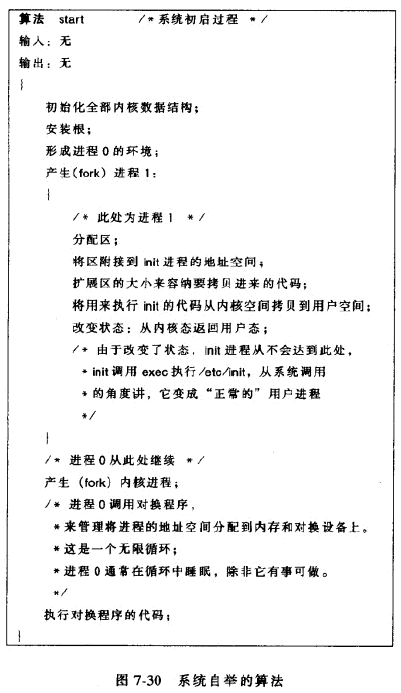

《UNIX操作系统设计》第七章进程控制

<!--more-->

## 进程的创建

UNIX中，创建新进程的唯一方法就是系统调用fork，进程0使唯一不通过fork创建的进程，由内核内部的创建。

`pid = fork()`

父子进程除了返回值pid不同外，具有完全一样的用户级上下文。

父进程pid为子进程的进程号

子进程的pid值为0

fork完成的操作：

* 为新进程在进程表中分配空槽
* 为新进程赋值唯一的pid
* 做一个父进程上下文的逻辑副本
* 进程关联的文件表和索引节点表的引用数++
* 父子进程分别返回pid

fork会先确认由足够的资源来完成fork，对换系统中在内存或磁盘上存放子进程、请求调页系统中，内核为页表分配存储空间，如果资源不足，调用失败


pid分配的时候使累加的，达到最大值后会从0重新分配。

一个用户可以同时运行的进程数有限制，也不能占用最后一个进程表表项，否则不能调用exit正常退出。超级用户可以创建进程表所能容纳的任意多个进程，也可以占用最后一个空槽，它能启动一个子进程强制其他进程退出kill。

初始化子进程的进程表项，从父进程拷贝各各字段，填写父进程pid。再初始化各种调度参数，初始状态为“创建”状态。

然后调整引用数。子进程位于父进程的当前目录，所以当前目录的进程数+1，内核要层架该目录索引节点的引用数。如果父进程调用了chroot，子进程也继承这一改变，并增加其索引节点的引用数。内核查找父进程的用户文件描述符表，把其中的每一个打开的文件的全局文件表中的引用数+1。

创建子进程上下文时，对于静态部分，算法dupreg复制父进程的所有区，attachreg将每个区附接到子进程。在对换系统，内核拷贝非共享区的内容到一个新的内存区域。子进程的U区被初始化和父进程一样，除了指向进程表表项的指针。

对于动态部分，子进程和附近成的内核栈完全一样。

子进程上下文就绪后，父进程将子进程状态改为“在内存中就绪”。


## 软中断信号

简称信号，通知进程发生了异步事件。

进程之间可以调用kill相互发送软中断信号，内核从内部也可以发送软中断信号

UNIX系统V中有19个软中断信号，分为几类：

* 进程终止相关
* 进程例外事件相关，如访问越界、写 只读的内存区、硬件错误
* 系统调用期间遇到的不可恢复的条件相关
* 系统调用时遇到非预测错误条件
* 用户态进程发出
* 和终端交互有关
* 跟踪进程执行

相关问题：

内核如何向进程发送软中断信号？

内核在进程表中，按所要接受的信号类型设置软中断信号字段的某一位。

进程如何接受软中断信号？

进程从内核态返回用户态，或者进入或离开低调度优先级睡眠状态，内核会检查进程是否收到了软中断信号。

进程如何对中断信号反应？


### 软中断信号的处理

内核在收到软中断信号的进程上下文中处理软中断信号。处理分三种情况：进程收到软中断信号后退出；进程忽略信号；收到信号后执行一个特殊的用户函数。

进程可以调用signal来定义当收到某一信号时要做的特殊动作

`oldfunction = signal(signum,function)`

u区中含有一个软中断处理程序字段的数组，每一个字段对应系统中定义的一个信号。

内核可以对进程有错的那些软中断信号转储内存映像，便于调试程序。


进程接受到一个决定要捕获的信号，当返回用户态，便执行用户定义的软中断处理函数，执行前，内核要执行下列步骤：

* 存取用户保存的寄存器上下文，找出PC和栈指针
* 清除u区软中断信号处理函数字段，设置为缺省
* 在用户栈上创建一个新的栈层，写入PC和栈指针，根据需要分配新空间
* 改变寄存器上下文

#### 例子


可能产生竞争条件

### 进程组

系统有时用组来标识进程。用进程组号标识进程，这组进程对于某些事件应该收到共同的信号。进程表中有记录组标识号。

`grp = setpgrp`用来初始化一个进程的进程组号，并设置为与该进程标识号相同的值。

### 从进程发送软中断信号

进程使用系统调用kill发送软中断信号

`kill(pid,signum)`

pid为正值，发送给pid的进程；为0发送给所有同组进程；为-1发送给真正用户标识号等于发送进程的有效用户标识号的进程，如果发送进程有超级用户的有效用户标识号，信号将被发送给除进程0和进程1以外的所有进程。pid为非-1的负数，发送个组好为pid绝对值的进程组中的所有进程。

## 进程的终止

退出的进程进入僵死状态，释放它的资源，撤出进程上下文，但保留它的进程表项

`exit(status)`

status的值返回给父进程。main结束调用；内核在进程收到非捕获信号时，可以内部调用exit，status是软中断信号号。


## 等待进程的终止

进程调用wait使它的执行与子进程终止同步

`pid = wait(stat_addr)`

pid使僵死子进程的进程号；

stat_addr使一个整数在用户空间的地址，将含有子进程的退出状态码。


执行wait的进程有子进程，但没有僵死进程，则该进程睡眠在可被中断的优先级上，直到出现一个软中断信号。

内核对睡眠与系统调用wait中的进程没有显示的唤醒调用，只有收到软中断信号时才被唤醒。

特殊点是，如果软中断信号是“子进程死”，该进程将采用不同的对策

* 缺省情况下，进程从wait的睡眠中醒来
* 如果进程捕俘“子进程死”软中断信号，内核将像处理其他信号一样，安排调用用户的软中断信号处理子程序
* 如果进程忽略“子进程死”软中断信号，内核将重新开始wait中的循环，释放僵死进程的进程表项，然后寻找其他的子进程。

## 对其他程序的引用

exec实现引用一个程序，用一个可执行文件的副本覆盖一个进程的存储空间。

```c++
	execve(filename,argv,envp);
	//filename是要引用的可执行文件的文件名
	//argv是一个字符指针数组的指针，这组字符指针是可执行程序的参数
	//envp是另一个字符指针数组的指针，这一组字符指针是执行程序的环境
	系统调用exec的库函数有好几个，如execl，execv，execle等待。这些库函数最终都要调用execve
```


文件系统中一个可执行文件的逻辑格式，通常由汇编程序或装配程序（loader）所组成


四部分组成：

* 主文件头：魔数给出了可执行文件的类型
* 若干个段头：段头描述了文件中的每个段，给出了段的大小、在系统中运行时该段所占据的虚地址和其他信息
* 数据段：如正文
* 其他信息段：如符号表、其他数据，这些信息对debug很有用

？？？

## 进程的用户标识号

内核将两个用户标识号和一个进程关联，独立于进程标识号。用户标识号分为：真正用户标识号和有效用户标识号（setuid设置的用户ID），真正用户标识号标识负责运行进程的用户。有效用户标识号用于给新创建的文件赋所有权、检查文件的存取权限和检查通过系统调用kill像进程发送软中断信号的许可权限。

进程可以用exec执行一个setuid程序，或显示的系统调用setuid来改变有效用户标识号

## 改变进程数据区的大小

```c++
brk(endds);//endds是进程数据区的最高虚地址值，称为break值
oldendds = sbrk(increment);//increment以字节为单位对当前break值的改变量
```


## shell程序


## 系统自举和进程init

自举：系统管理员通过自举过程来初始化一个处于非活动状态的系统。将操作系统装入内存，并开始执行。

系统管理员设置计算机控制台上的开关，规定一个特殊的硬编码的程序地址，按下一个按钮，指示机器从他的微代码装入自举程序，这个程序仅有几条指令组成，只是机器执行另一个程序。UNIX中，自举最后读一个磁盘自举块，并装入内存，自举块中的程序将内核从文件系统装入内存，内核装入内存后，自举程序将控制转到内核的起始地址，内核开始运行start。



init进程是一个进程派遣者，除了产生其他进程外，还产生一些使用户在系统上注册的进程。进程init读文件“/etc/inittab”来得到关于要产生那些进程的指示。


UNIX三种进程：用户进程、守护进程、核心进程

守护进程执行系统功能，如管理和控制网络，执行与时间相关的活动、行打印机假脱机输出等等

核心进程只在内核态运行，由进程0产生，核心进程在提供系统范围服务方面类似于守护进程，但执行优先权上具有更大的权力，因为他们是内核代码的一部分。

