《UNIX操作系统设计》 第六章进程结构

<!--more-->

## 进程状态

九状态

1、在用户态下执行

2、在核心态下执行

3、在内存中就绪

4、在内存中睡眠

5、就绪且换出

6、睡眠且换出

7、被抢先，进程正从核心态返回用户态

8、刚被创建，是除进程0以为的所有进程的初始状态

9、调用了exit，僵死，留下一个记录，由父进程收集，包含了出口码和一些计时统计信息，是进程的最后状态

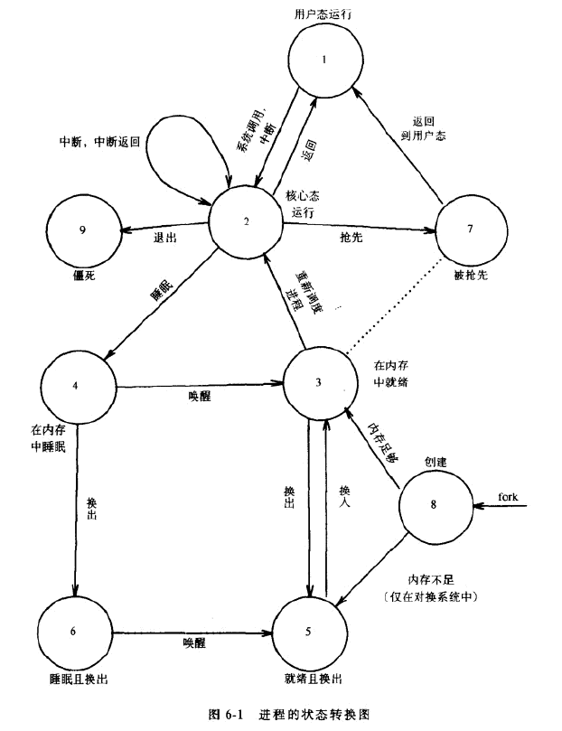

* “被抢先”和“在内存中就绪”是等价的，分为两种是为了强调：在核心态运行的进程，只有在即将返回用户态时，才能被抢先。
* 进程执行系统调用，从用户态进入内核态
* 如果系统调用需要等待，比如磁盘请求操作需要等待输入输出完成，将进入在内存中睡眠
* 输入输出完成，硬件中断cpu，中断处理程序唤醒进程，进入内存中就绪

描述进程状态的内核数据结构：进程表项和U区。内核总是可以存取进程表，而U区只能由正在运行的进程存取

进程表字段：进程状态字段、进程和其U区在内存或二级存储器中的位置、uid、pid、事件描述符字段、调度参数、软中断信号字段、各种计时字段

U区字段，进一步刻画进程状态的特性：指向进程表的指针、计时器、软中断信号反应数组等等

## 系统存储方案

UNIX上的进程由三个逻辑段组成：正文段、数据段、栈

### 区

区是进程虚拟地址空间的一段连续区域，被看作是可被共享和保护的独立实体。区可以共享，几个进程执行同一个程序，会共享一个正文区。

内核中有一个区表，每个在系统中活动的区对应表中的一个表项。每个进程都有一个私有的本进程区表，称为pregion表，表项可以放在进程表、U区或独立分配的存储区域中，取决于实现。进程区表和区的结构类似与文件表和索引节点结构。

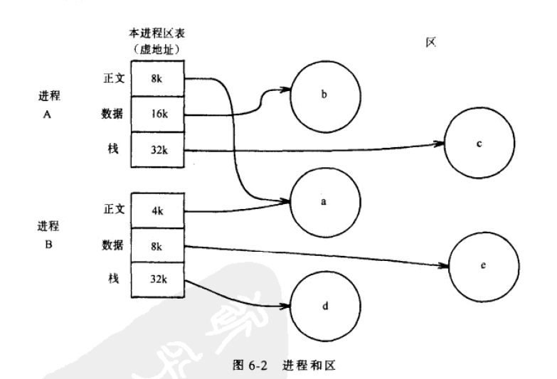

### 页和页表

页：由存储管理的硬件将物理存储器分成的一些大小相等的块。

内核向区分配物理页，页不一定是连续的，分页的目的是为了增加灵活性，减少因为分割所造成的不可用空间，类似磁盘块分配给文件。

### 内核的安排

内核的页表类似于进程的页表，转化内核虚地址的方法也类似与转换用户虚地址采用的方法。

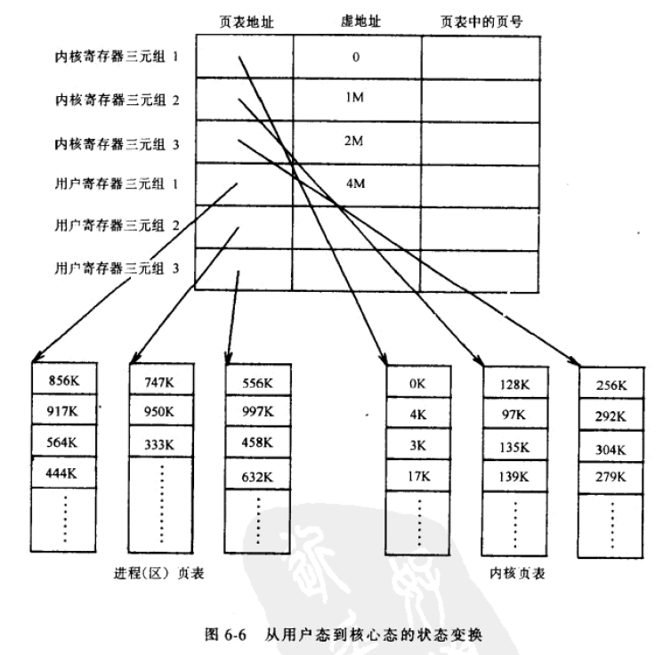

### U区

每个进程都有一个U区，但是对于内核来说，好像只有一个，即正在运行的进程的U区。内核可以动态的改变U区的虚地址映射，使U区的地址映射到另一个物理地址上。

进程在核心态运行时才能访问U区

### 进程的上下文

进程上下文：用户地址空间的内容、硬件寄存器的内容、该进程有关的内核数据结构。分为用户级上下文、寄存器上下文、系统级上下文

* 用户级上下文：进程的正文、数据、用户栈、共享存储区
* 寄存器上下文：程序计数器、处理机状态寄存器、栈指针、通用寄存器
* 系统级上下文由动态和静态两部分组成
  * 静态：一个进程的进程表表项、一个进程u区、区表表项、区表、页表
  * 动态：内核栈帧、系统上下文层

内核压入上下文层，当中断发生、进程进行系统调用、进程切换上下文时。

内核弹出上下文层，当从中断处理中返回、从系统调用中返回、上下文切换发生时

## 进程上下文的保存

内核每压入一个新的系统上下文层，就要保存一个进程的上下文。当系统收到一个中断、一个进程执行系统调用、内核做上下文切换时，就要对进程的上下文进行保存。

### 中断和例外

内核处理中断的操作顺序：

* 保存当前进程的寄存器上下文并压入一个新的上下文层
* 识别中断类型，根据中断向量表。
* 内核调用中断处理程序
* 中断处理程序工作完毕前返回

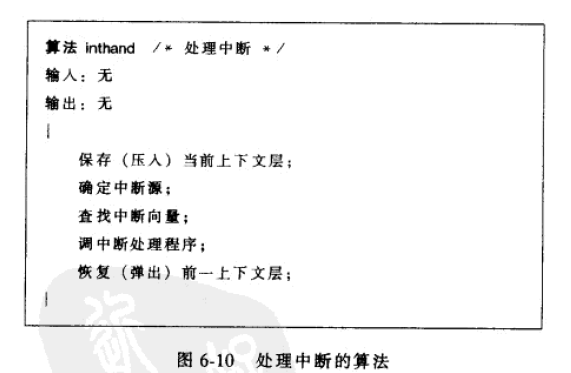

### 系统调用的接口 syscall

C编译程序采用一个预定义的函数库，解决了用户程序中请求系统调用的问题。这些库函数都执行一条指令，将进程的执行方式变为核心态，这个指令称为操作系统陷入（OS trap）。简单来讲，系统调用的接口是一个中断处理程序的特例。

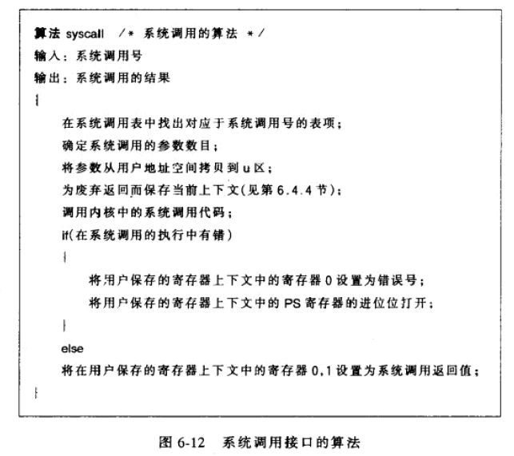

### 上下文切换

发生在四种情况：

* 进程使自己进入睡眠
* 进程从一个系统调用返回用户态但不是最有资格运行的进程
* 进程在内核完成中断处理后返回用户态，但不是最有资格运行的进程
* 退出exit时。

上下文切换和处理中断类似，不同的是，内核恢复的是一个不同进程的上下文层。

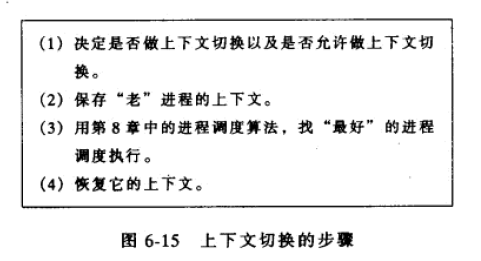

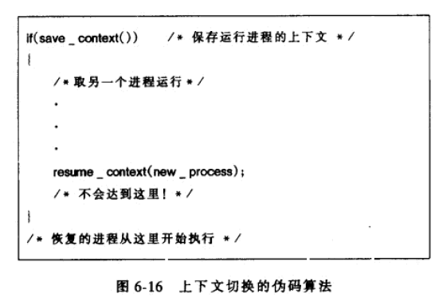

### 为废弃返回而保存上下文

发生在内核必须种植他当前的执行顺序，立即从先前保存的上下文执行时

### 在系统和用户地址空间之间拷贝数据

许多系统调用要在内核和用户空间之间传递数据

## 进程地址空间的管理

本节定义区数据结构和区上的操作

区表表项描述一个区的必要信息，包含以下字段：

* 指向文件的索引节点的指针
* 区的类型（正文、共享存储区、私有数据和栈）
* 区的大小
* 区的物理存储器中的位置
* 区的状态
  * 锁住
  * 在请求中
  * 正在被装入内存的过程中
  * 有效，已被装入内存
* 引用数，引用该区的进程数

管理区的操作：锁区、解锁区、分配区、将区附接attach到某个进程的存储空间、释放一个区、使区和一个进程的存储空间断接detach、复制区的内容。

### 区的上锁和解锁

上锁和解锁操作与分配和释放无关，内核能上锁和分配一个区，然后又解锁但不释放它

### 区的分配 allocreg

系统调用fork、exec、shmget期间，内核将分配一个新区（allocreg）。内核有一个区表，表项在一个自由链表或者一个活动链表中。内核要分配一个区表项时，就从自由链表中取出第一个可用表项，并放到活动表中，该区上锁并表示他的类型（共享或私有）。

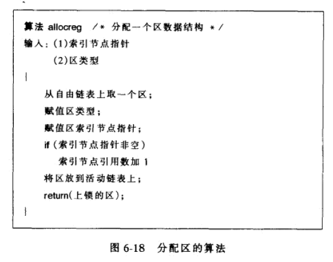

### 区附接到进程 attachreg

在调用fork、exec、shmat期间，内核要使一个区和一个进程的地址空间联系起来名称为附接（attach）。附接的区可以使一个新分配的区，也可以是该进程要与其他进程共享的、已存在的区。

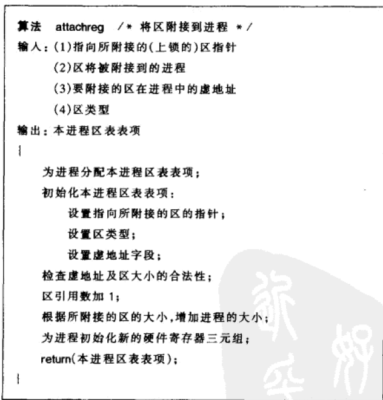

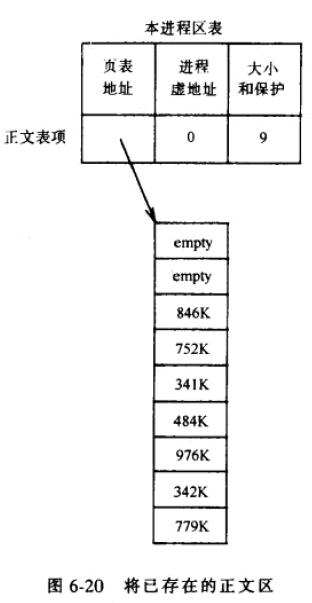

### 区大小的改变 growreg

进程用系统调用sbrk来扩展或者压缩虚地址空间。内核在内部调用算法growreg来改变区的大小。growreg用于两种情况：用户栈的自动增长、系统调用sbrk用于一个进程的数据区。这两种区都是私有区，正文区和共享存储区在初始化以后不能再被扩展。

内核通过扩展现存的页表来适应更大的区。如果进程要压缩区，内核只要简单的释放分配给该区的存储空间即可。

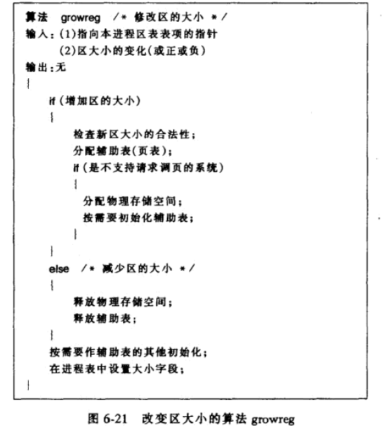

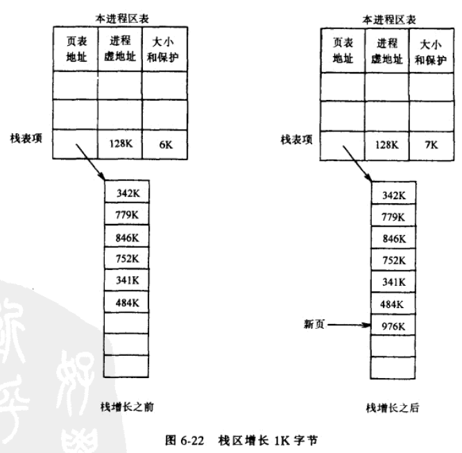

### 区的装入 loadreg

```
对换系统：内存不够时，进程真个被写到swap上
请求调页系统：内存不够时，把存储器的某些页写到兑换设备上
```

在请求调页系统，内核在系统调用exec期间将一个文件映射到进程的地址空间，然后按要求安排读入每个物理页。

在不支持请求调页的系统中，内核要将可执行文件拷贝到存储器中，将进程的区装到在可执行文件中指定的虚地址上。内核可以将区附接到一个虚地址上，这个地址不同于文件装入的实际地址，从而造成了页表中的间隙。

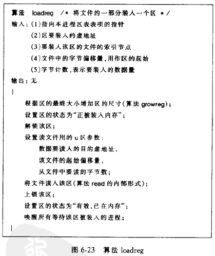

例子：内核要把一个7K大小的正文装入一个区，这个区被附接到某个进程的虚地址0上，且内核要在该区的开头留1k字节的间隙。

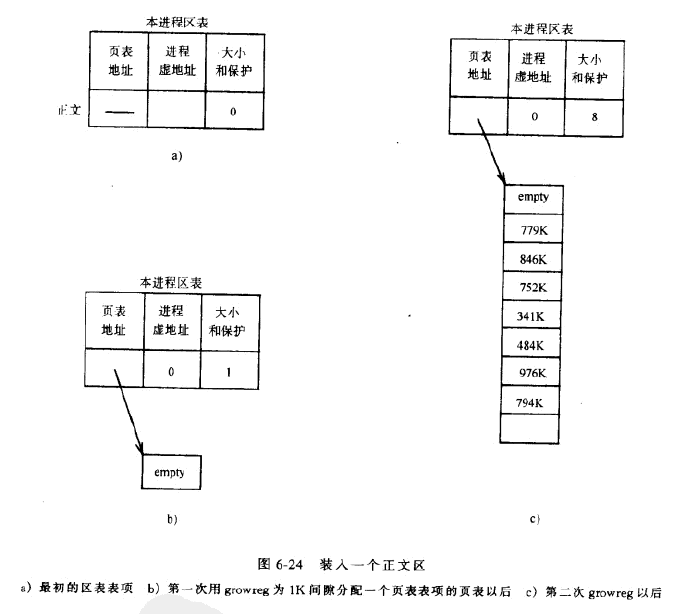

### 区的释放 freereg

一个区不在与任何进程相附接，内核便释放区并把它移动到自由链表

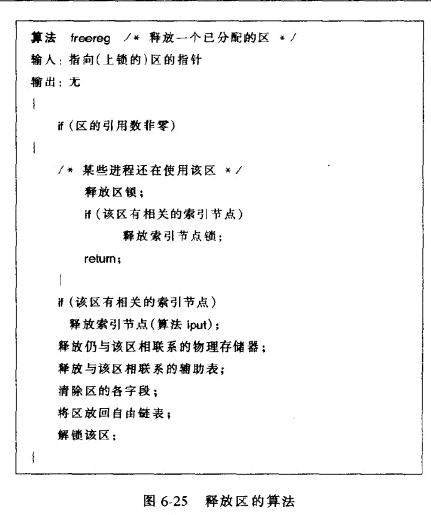

### 区与进程的断接 detachreg

系统调用exec、exit、shmdt中，内核使有关的区与进程相断接。它更新本进程区表表项，使有关的存储管理寄存器三元组无效，而从切断区与物理存储的联系。

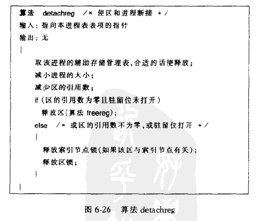

### 区的复制

fork系统调用，内核会复制进程的所有区，如果某个区是共享的（例如共享正文或共享存储区），内核只会增加该区的引用数，允许父进程和子进程共享该区。如果区不是共享的，内核就物理的拷贝该区，并为它分配新的区表表项、页表和该区的物理存储空间。

例如A 创建B并复制自身的区

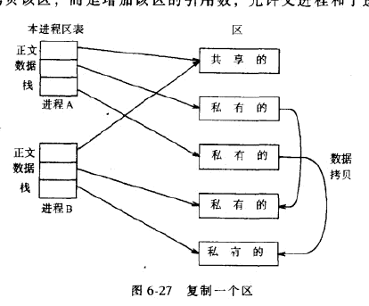

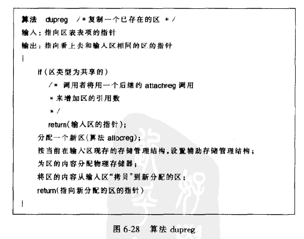

## 睡眠

sleep将进程由”核心运行“变成”在内存中睡眠“，wakeup将进程状态由睡眠变成“在内存中就绪“或”就绪且换出“。

进程在系统调用期间进入睡眠：操作系统陷入，等待资源，存取尚未物理地装入虚地址而导致页面错误。

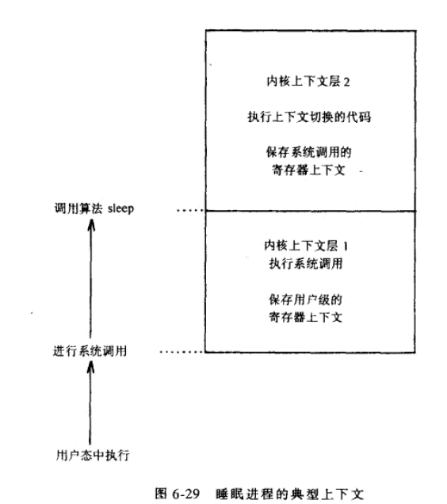


### 睡眠事件及其地址

进程在一个事件上睡眠，实际上是将一组事件映射到内核虚地址上。这种实现不区别由多少进程在等待该事件。

这样就产生了两种异常情况：多个进程在等待一个事件，当事件发生时，这些进程都被唤醒，可能同时竞争一个上锁的结构，因此这些进程就又回到了睡眠状态。

另一种异常情况：若干个事件映射到同一个地址上。多个事件发生任何一个，所有进程都会被唤醒，因为他们在同一个地址上休眠。但实际情况，这种冲突发生很少。

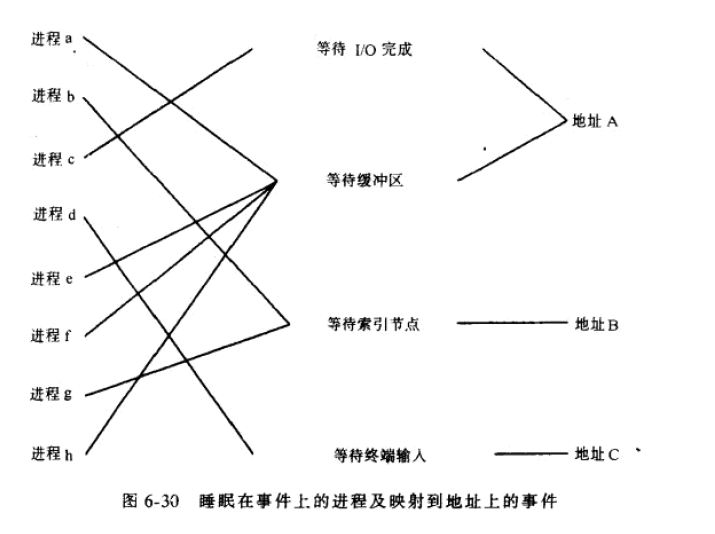

### sleep和wakeup

sleep：内核提高处理机优先级来屏蔽所有中断，保存旧处理机优先级，以便进程唤醒时可以恢复。睡眠地址和优先级保存在进程表中，并把进程放到睡眠进程的散列队列中。

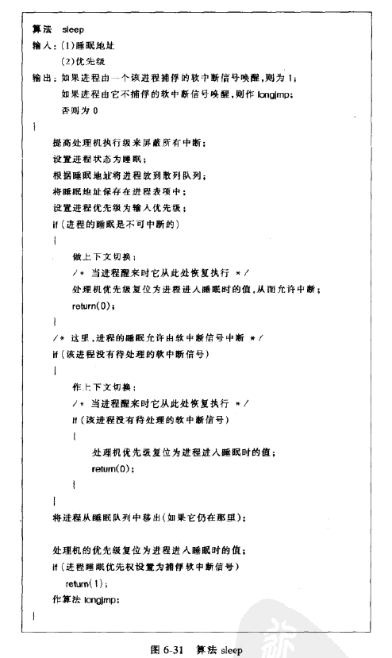

wakeup不是立即使一个进程被调度，只是使该进程有资格被调度。

对睡眠在输入地址上的每个进程，状态设置为就绪，从睡眠队列中移出，放到就绪队列。然后清除进程表中标志睡眠地址的字。如果进程被唤醒不在内存，则要换入内存（假设系统不支持请求调页）。

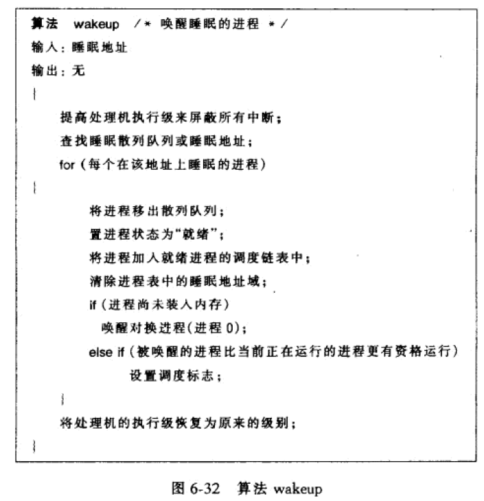

进程有可能睡眠在一个不一定发生的事件，内核会通过给进程发送软中断信号来中断睡眠的进程。

为了区别各种类型的睡眠，内核会设置睡眠优先级参数，然后用优先级值调用sleep，？？