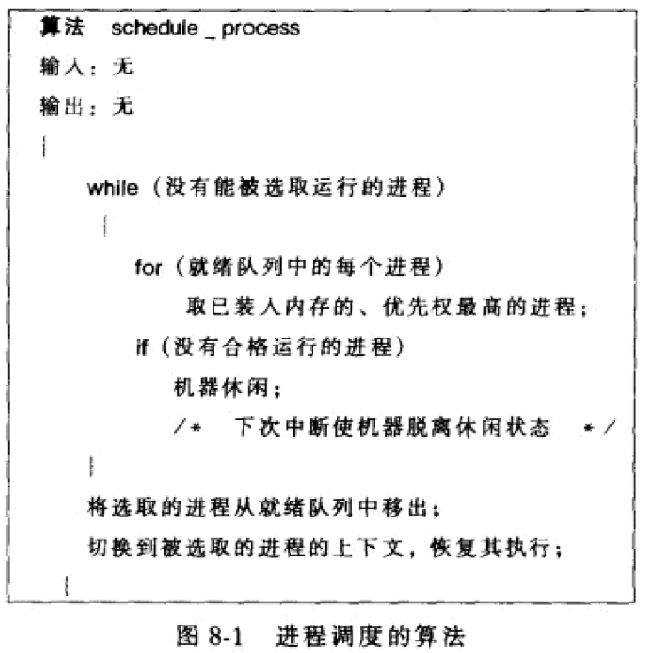
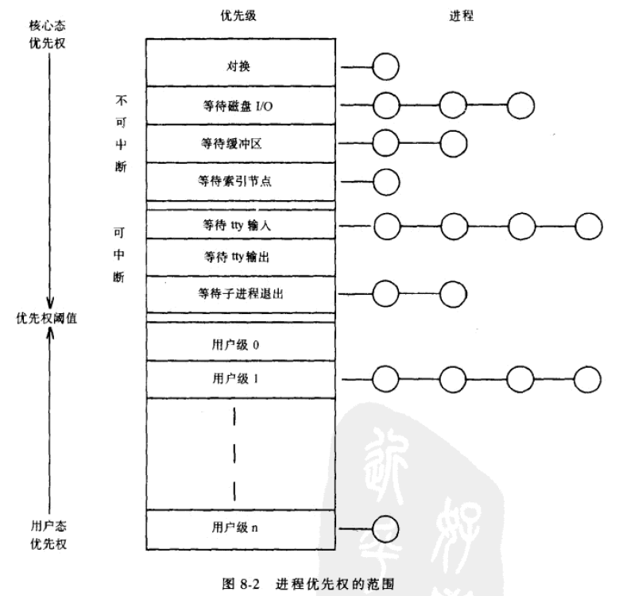
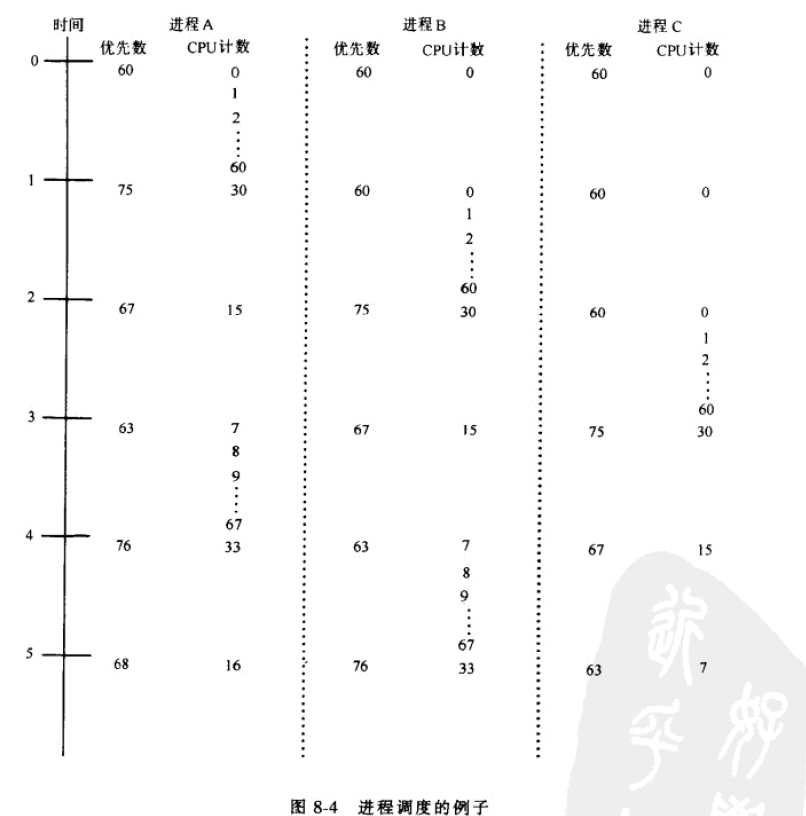
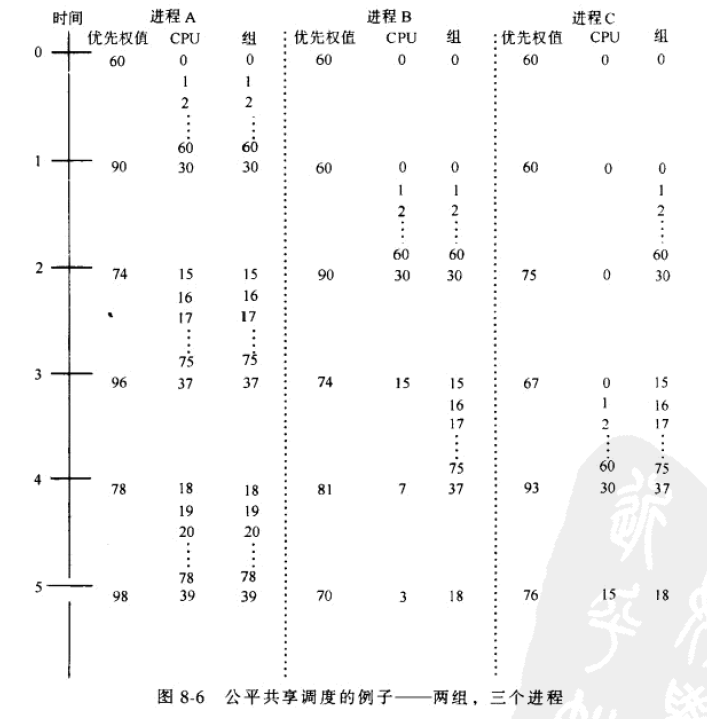
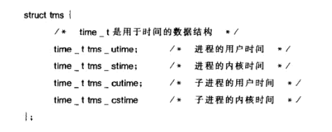
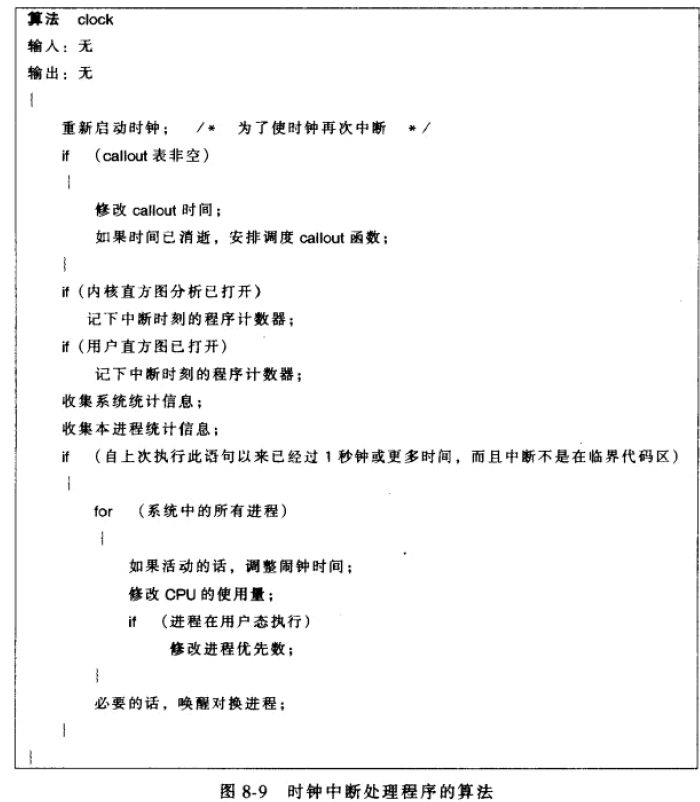
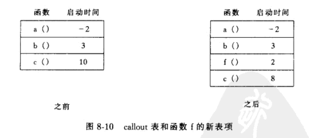
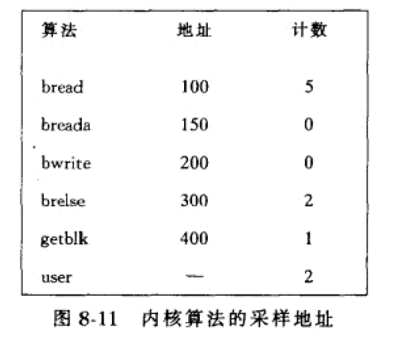

<!--more-->

内核做上下文切换时，选取有最高优先权的进程，切换到该进程的上下文。当运行的进程从核心态切换到用户态时，内核重新计算它的优先权，并定期的调整在用户态就绪的每个进程的优先权。

## 进程调度

UNIX采用多级反馈循环调度

### 算法

上下文切换结束时，内核选取处于**在内存中就绪**和**被抢先状态**的进程，**选择优先权最高的进程**来调度，**如果**若干进程**都有最高的优先权**，内核按**循环调度策略**选择在就绪状态时间最长的进程。

没有合格进程，内核休闲，直到下次中断再次调度，下次中断最迟发生在下一个时钟。



### 调度参数

进程有一个优先权域，用户态进程的优先权是**关于最近使用CPU时间的函数**。进程优先权范围分为：用户优先权和核心优先权，每种优先权有几个优先权值，每个优先权都有一个进程队列。



用户级优先权的进程在从核心态返回用户态时被抢先，从而得到用户及优先权，而核心级优先权的进程是在算法sleep中得到核心级优先权的。

用户级优先权低于一个阈值，核心级优先权高于该阈值。核心级优先权又可以进一步划分为：在收到一个软中断信号时，具有低核心优先权的进程可以被换新，高核心优先权的进程继续睡眠（见7.2.1）

**内核会在不同的进程状态下计算下进程的优先权：**

* 内核将一个固定的优先权值和睡眠的原因联系起来
* 内核调整从核心态返回到用户态的进程的优先权
* 时钟处理程序以1s的间隔调整用户态下的所有进程的优先权，并使内核运行调度算法

进程表中的一个字段记录了进程的最近CPU使用时间，每次时钟中断，由时钟处理程序使该字段增加

```
decay(CPU) = CPU/2 
priority = ("recent CPU usage"/2)+(base level user priority)
```

base level user priority 为核心态和用户态之间的优先权阈值。

最近CPU使用时间衰减的越慢，一个进程的优先权达到其基级优先权的时间越慢（也就是已经执行CPU时间的惩罚力度越大）

重新计算优先权使，具有用户级优先权的进程在优先队列之间移动

内核计算活动优先权的时间间隔为1s，但这个间隔是可以变化的，当内核执行一段临界区代码时，如果时钟中断已经到来（处理机优先级已被提高，但还没有高到足以屏蔽时钟中断），如果这时候计算优先权会使内核在临界区呆的时间过长。这时，内核只记住它应该重新计算优先权，当以前的处理及执行级降低之后的一次时钟中断时，内核才做计算。

### 进程调度的例子

系统V上三个进程ABC的调度



### 进程优先权的控制

系统调用`nice(value)`，来增加或减少进程表中的nice字段，只有超级用户才能提供nice值

在执行强计算作业，通过nice降低其进程优先权，这对系统中其他用户来说是**友好的**，因此得名nice?

value被加入到进程优先权的计算中：

`priority = ("recent CPU usage"/constant)+(base priority)+(nice value)`

nice仅作用在正在运行的进程，一个进程不能设置另一个进程的nice值，也就是说如果一个进程消耗了太多时间，系统管理员只能kill掉它。

### 公平共享调度

上述的调度算法对不同类型的用户不做区分，不可能将CPU时间分一般给一组特殊的进程，为了解决这个问题，提出了公平共享调度策略。

原则是，将用户团体分为一些公平共享组，每个组的成员受到常规的进程调度的限制。系统将CPU时间按比例**平均分给每个组**，并不考虑组中的成员的多少。

举个例子，有四组进程，分别含有1、2、3、4个进程，如果按常规的调度算法，每个进程得到10%的CPU时间，但是按照公平共享调度，第一组进程得到的CPU时间是第二组的2倍，第三组的3倍，第四组的4倍。

实现方法：

在计算进程优先权值的公式中，加入了一个“公平共享组优先权”的项，进程的u区有个新字段 ，指向一个公平共享CPU使用字段，由该组所有进程共享。时钟中断程序增加公平共享CPU使用字段，并每秒一次衰减所有公平共享组CPU使用字段的值。

例子：

2个组 3个进程    A在一个组，BC在另一个组



### 实时处理

实时处理 指 对外部事件进行立即响应，在该时间发生后的一个指定时间内，调度指定的进程去运行。这种实现存在两个问题，一个是调度算法，上面的调度算法都是为分时环境设计的，这里是实时环境。**另一个问题是内核时不可抢先的**，**但是现在的内核时可以抢先的，这本书很老了**。解决方法是允许实时进程动态存在，并提供一种机制来通知内核实时要求，目前UNIX还没有这种。

强实时一般时嵌入式做的，比如飞机的检测系统

## 有关时间的系统调用

`stime,time`是关于全局的系统时间，`stimes,alarm`是关于单个进程的时间。

`stime`允许超级用户将一个表示当前时间的值赋给一个内核全局变量

`stime(pvalue)`，pvalue是一个指针，指向一个以秒为单位的长整数时间，时钟中断程序每秒一次使该变量加一

`time(tloc)`，查询由stime所设置的时间`time(tloc)`，tloc指向一个用户进程中用作返回值的单元

`times`给出调用进程在用户态和核心态执行时所花费的积累时间以及它的所有僵死子进程在用户态和执行态时曾花费的累积时间。

```c++
times(tbuffer);
struct tms *tbuffer;
```

tms定义如下



## 时钟

时钟中断处理程序的功能：

* 重新启动时钟
* 按内部定时器有计划的调用内部的内核函数
* 对核心进程和用户进程提供运行直方图分析的能力
* 手机系统和进程几张及统计信息
* 计时
* 在有请求时，项进程发送时钟软中断信号
* 定期地唤醒对换基础南横
* 控制进程的调度

时钟中断处理程序在高处理机执行级上运行，来防止中断处理程序工作期间发生其他事件。

### 重新启动时钟

当时钟中断系统时，多数机器由软件指令重新启动时钟，这些指令和机器有关，这里不讨论。

### 系统的内部定时

有些系统操作需要在实时基础上调用内核的一些函数，如设备驱动和网络协议。



内核将必要的信息存放在callout表中，其中含有当定时事件到时所要调用的函数名、该函数的一个参数以及时钟滴答为单位的定时时间。

callout表用户不能直接控制，由内核算法创建，按照各自的**启动时间**排序。各表项记录的是前一表项启动后，到该表项被启动时的时间量。



实现上讲，callout表使用链表实现，也可以用表然后调整表项的位置。

时钟中断处理程序在每次时钟中断时，会使callout表中的字段减1。

内核准备好调用callout表中的某个函数的时刻和软件中断发生的时刻之间，可能发生很多中断，因此第一项可能为负？

### 直方图分析

用来确定系统在用户态的执行时间和核心态的执行时间之比，以及内核执行内核各个子程序所花费的时间的度量方法。

内核有一个直方图分析程序，在时钟中断时，对内核的活动进行采样，以便监视内核模块的相对性能。程序有一个内核地址表，用来采样，装有内核函数的地址。进程实现通过write写直方图驱动程序来装入这些地址。

流程：中断处理程序调用直方图驱动工程系的中断处理程序，首先确定处理机在中断时时处于核心态还是用户态，如果是核心态，对应程序计数器的一个内部计数器+1，如果是用户态，用户执行计数器+1。用户进程可以读直方图驱动程序，来获得内核计数并做统计。

例子：



用户可以使用系统调用profil对进程的执行做统计

`profil(buffer,bufsize,offset,scale)`

### 记账和统计

进程U区有一个字段，记录消耗的内核时间和用户时间，当处理时钟中断时，进程根据进程是在核心态运行还是在用户态运行，来修改该运行进程在U区中对应的字段。父进程调用wait收集子进程的统计信息。

u区中还有一个记录进程使用的内存情况字段。时钟中断一个运行的进程时，内核计算一个进程使用的总内存数，该数是该进程的私有存储区和它在共享存储区中所占的比例的函数。

例如，一个进程和其他四个进程共享50k字节的正文区，并使用大小分别为25k和40k字节的数据区和栈区，则总内存数为50/5+25+40。

对于请求调页的系统，内核计算每个区中的有效页数来计算内存的使用情况，共享区的收费也是平均分。

进程退出时，内核将这个信息写到记账记录中，并用作向用户收费的依据。

### 计时

内核在每个时钟中断，使一个时间变量加1。系统的计时是以时钟滴答为单位，从系统自举之时开始。