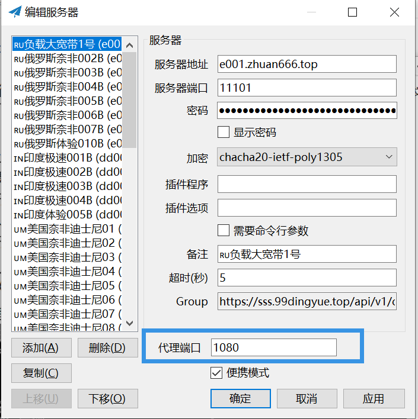
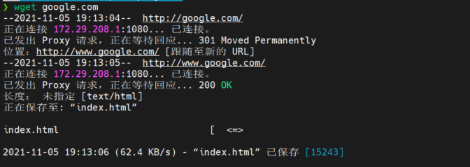

WSL使用主机shadowsocks代理

<!--more-->

* 双击小飞机，查看代理端口
* 编辑bashrc，然后source生效

```shell
# proxy config
export hostip=$(cat /etc/resolv.conf |grep -oP '(?<=nameserver\ ).*')
export https_proxy="http://${hostip}:1080"
export http_proxy="http://${hostip}:1080"
export all_proxy="socks5://${hostip}:1080"
```

* 测试生效

  

  
