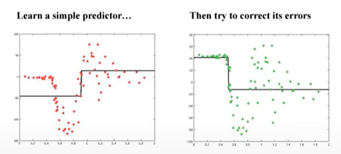

2014年Tianqi Chen开发了XGBoost，2017年微软团队开发了LightGBM都是针对同一个算法。

<!--more-->

## Gradient Boosting

> 是一种ensemble method，同一组数据构建n个相互独立的classifier，假设每个classifier的犯错概率相同，则n个独立的classifier的结论结合在一起，实际得到的出错概率服从伯努利期望，这个期望远远小于p，这就是ensemble method的基本原理

### Boosting

> GB中采用决策树当作基本的classifier

对原始数据做predictor，然后计算第一个model的预测值和真实值之间的差值，第二个model用来预测error，得到第二个模型后会把第一个模型和第二个模型做综合，以此类推。

基本思想就是根据当前模型的残差来加入新的弱分类器，然后将训练好的弱分类器以累加的形式结合到现有的模型中。

### 从梯度的角度思考Boosting

对平方误差来说，Boosting计算出的error实际就是负梯度

也就是说，对于总体模型的更新是基于负梯度的。

## XGBoost  

