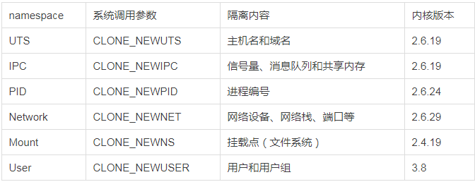
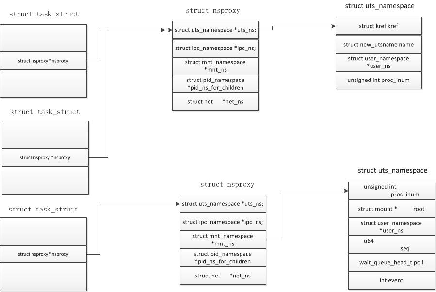
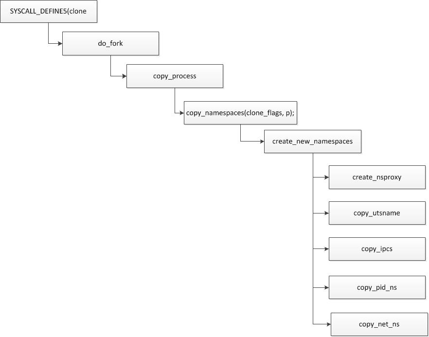

<!--more-->

对于 Docker 等大多数 Linux 容器来说，**Cgroups** 是用来制造约束的主要手段，而 **Namespace** 技术则是用来修改进程视图的主要方法。

## namespace 

namespace是linux内核支持的特性，来实现进程资源隔离。

创建新进程fork时，底层调用clone函数，通过设置参数实现。



比如一个骨干程序，对clone可以传入不同的参数达到不同的namespace隔离:

```c++
#define _GNU_SOURCE
#include <sys/types.h>
#include <sys/wait.h>
#include <stdio.h>
#include <sched.h>
#include <signal.h>
#include <unistd.h>
#define STACK_SIZE (1024 * 1024)

static char container_stack[STACK_SIZE];
char* const container_args[] = {
   "/bin/bash",
   NULL
};

// 容器进程运行的程序主函数
int container_main(void *args)
{
   printf("在容器进程中！\n");
   execv(container_args[0], container_args); // 执行/bin/bash   return 1;
}

int main(int args, char *argv[])
{
   printf("程序开始\n");
   // clone 容器进程
   int container_pid = clone(container_main, container_stack + STACK_SIZE, SIGCHLD, NULL);
   // 等待容器进程结束
   waitpid(container_pid, NULL, 0);
   return 0;
}
```

clone可以选择传入不同的参数，比如：

```c++
int container_pid = clone(container_main, container_stack + STACK_SIZE, SIGCHLD | CLONE_NEWUTS | CLONE_NEWIPC | CLONE_NEWPID, NULL);
```

ipc隔离可s以通过`ipcmk`和`ipcs`命令验证

从内核实现角度，task_struct里有一个指向namespace的指针nsproxy



clone时候：



## cgroup

在task_struct里有一个字段：

```c++
#ifdef CONFIG_CGROUPS
	/* Control Group info protected by css_set_lock */
	struct css_set *cgroups;
	/* cg_list protected by css_set_lock and tsk->alloc_lock */
	struct list_head cg_list;
#endif
```

里面包含了一个css_set结构体，里面存储了与进程相关的cgroups信息。

cg_list是一个链表，链接到同一个css_group的进程被组织成一个链表。

```c++
struct css_set {
	atomic_t refcount;//被几个进程共用
	struct hlist_node hlist;//所有css_set组织成一个hash表，用来快速查找
	struct list_head tasks;//链接到该css_set的所有进程
	struct list_head cg_links;
	struct cgroup_subsys_state *subsys[CGROUP_SUBSYS_COUNT];
	struct rcu_head rcu_head;
};
```


## 参考

[docker](https://camelgemonion.gitbook.io/docker/)

[namespace详解](https://www.cnblogs.com/bakari/p/8560437.html)

[namespace内核实现](http://abcdxyzk.github.io/blog/2015/08/06/namespace2/)

[cgroup内核实现](http://abcdxyzk.github.io/blog/2015/08/07/cgroup-2/)
