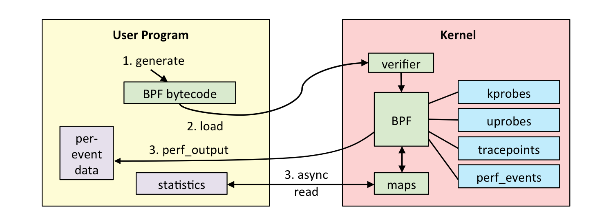
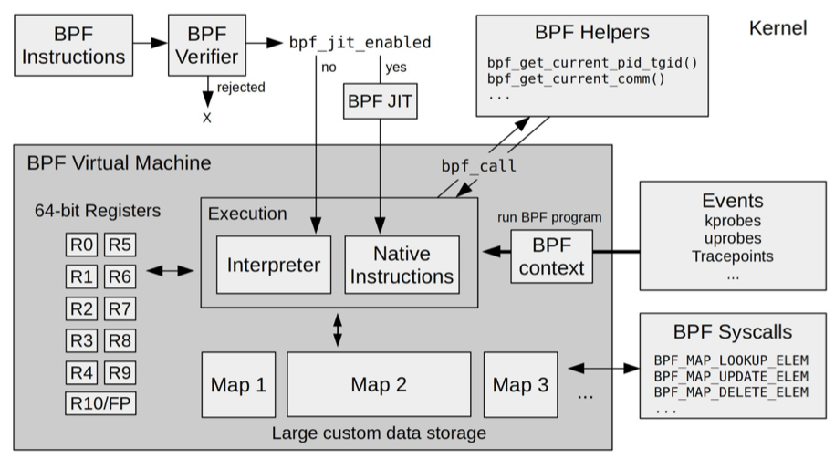
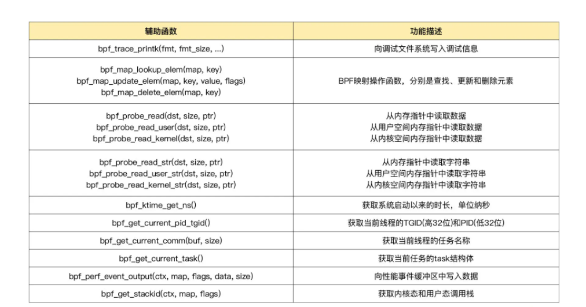
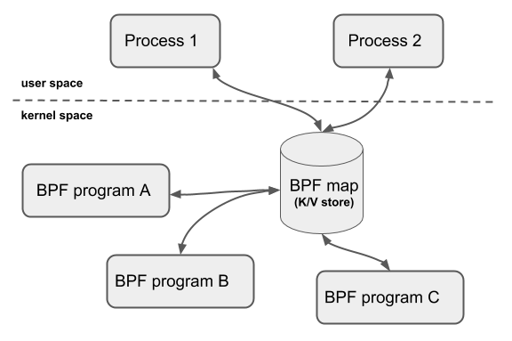
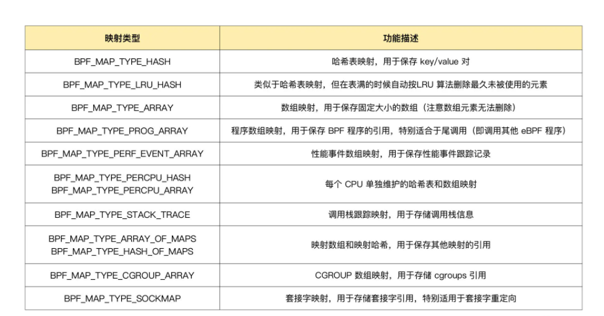
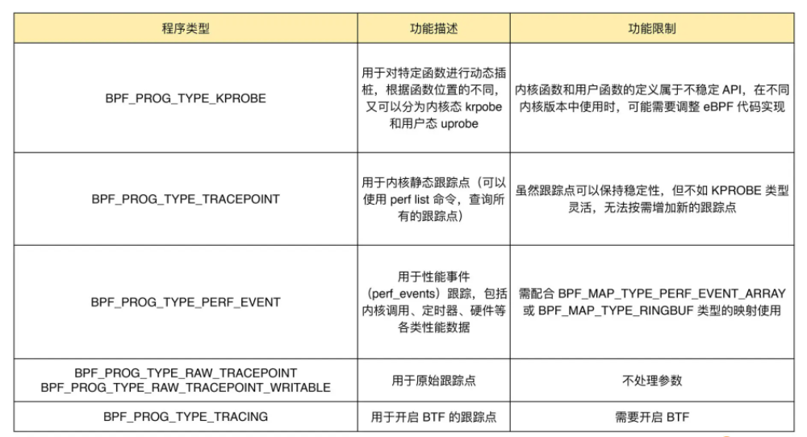

<!--more-->

## 基本使用

bpf程序加载到内核后，并不会立刻执行。ebpf程序需要事件触发后才会执行，这些事件包括：系统调用、内核跟踪点、内核函数和用户态函数的调用退出、网络事件等等。

首先写一个c程序，ebpf程序：

```c
int hello_world(void *ctx)
{
  bpf_trace_printk("Hello, World!");
  return 0;
}
```

然后通过bbc的python库，加载这个ebpf程序：

```python
#!/usr/bin/env python3
# This is a Hello World example of BPF.
from bcc import BPF

# load BPF program
b = BPF(src_file="hello.c")
b.attach_kprobe(event="do_sys_openat2", fn_name="hello_world") #内核跟踪
b.trace_print()
```

然后执行：`sudo python3 hello.py`即可启动这个ebpf程序

一个完成的ebpf程序包括用户态和内核态两个部分

用户态负责ebpf程序的加载，事件的绑定，ebpf程序运行结果的汇总输出。

内核态运行在ebpf虚拟机中，负责定制和控制系统的运行状态



用户态和内核态的交互通过系统调用bpf()来完成。

```c
#include <linux/bpf.h>

int bpf(int cmd, union bpf_attr *attr, unsigned int size);
```

* cmd ，代表操作命令，比如上 BPF_PROG_LOAD 就是加载 eBPF 程序

* attr，代表 bpf_attr 类型的 eBPF 属性指针，不同类型的操作命令需要传入不同的属性参数

* size ，代表属性的大小

## 运行原理

eBPF是一个运行在内核中的虚拟机。虽然叫虚拟机，但是跟系统虚拟化比如KVM还是有本质的不同。

系统虚拟化基于X86或arm的通用指令集，来完成计算机的所有功能。而eBPF只提供了非常有限的指令集，只用于完成一部分内核的功能。

eBPF在内核运行是的5个模块组成：



* ebpf辅助函数：提供ebpf程序与内核其他模块进行交互的函数
* ebpf验证器：确保ebpf程序的安全，保证执行的指令是一个有向无环图（DAG），确保程序不包含不可达指令，不会执行无效指令
* 存储模块：11个64位寄存器，一个程序计数器，一个512字节的栈
* 即时编译器：将ebpf字节码编译成本地机器指令，从而在内核中执行。bpf指令加载到内核后，即使编译器会将其编译成本地机器指令，最后才会执行编译后的机器指令。c源代码->bpf指令->机器指令。
* bpf映射：提供给用户空间程序来访问

### BPF辅助函数

ebpf程序不能随意调用内核函数，隐私内核定义了一些列的辅助函数，用来ebpf程序与内核其他模块进行交互。比如的上面例子中的`bpf_trace_printk()`，用来向debugfs（/sys/kernel/debug/tracing/trace_pipe）中写入调试信息。

`bpftool feature probe`可以查看当前系统支持的辅助函数列表。



### bpf映射

bpf映射提供大块的kv存储，可以被用户程序访问，进而获取ebpf程序的运行状态



bpf映射智能通过用户态程序的系统调用来创建，比如：

```c
int bpf_create_map(enum bpf_map_type map_type,
       unsigned int key_size,
       unsigned int value_size, unsigned int max_entries)
{
  union bpf_attr attr = {
    .map_type = map_type,
    .key_size = key_size,
    .value_size = value_size,
    .max_entries = max_entries
  };
  return bpf(BPF_MAP_CREATE, &attr, sizeof(attr)); //返回映射的文件描述符
} 
```

比较关键的是设置映射类型，`bpftool feature probe | grep map_type`可以查看支持的映射类型



另外，如果ebpf程序使用了bbc库，还可以通过预定义的宏来简化bpf映射的创建过程，比如对于hash表映射，bbc定义了`PF_HASH(name, key_type=u64, leaf_type=u64, size=10240)`

```c

// 使用默认参数 key_type=u64, leaf_type=u64, size=10240
BPF_HASH(stats);

// 使用自定义key类型，保持默认 leaf_type=u64, size=10240
struct key_t {
  char c[80];
};
BPF_HASH(counts, struct key_t);

// 自定义所有参数
BPF_HASH(cpu_time, uint64_t, uint64_t, 4096);
```

bpftool查看操作映射的常用指令：

```c

//创建一个哈希表映射，并挂载到/sys/fs/bpf/stats_map(Key和Value的大小都是2字节)
bpftool map create /sys/fs/bpf/stats_map type hash key 2 value 2 entries 8 name stats_map

//查询系统中的所有映射
bpftool map
//示例输出
//340: hash  name stats_map  flags 0x0
//key 2B  value 2B  max_entries 8  memlock 4096B

//向哈希表映射中插入数据
bpftool map update name stats_map key 0xc1 0xc2 value 0xa1 0xa2

//查询哈希表映射中的所有数据
 
bpftool map dump name stats_map
//示例输出
//key: c1 c2  value: a1 a2
//Found 1 element

//删除哈希表映射
rm /sys/fs/bpf/stats_map
```

### 内核数据结构定义问题

bbc在编译ebpf程序时，需要从内核头文件中找到相应的内核数据结构定义，这就会带来问题。

比如内核头文件的数据结构在不同的内核版本不一样。

从内核 5.2 开始，只要开启了 CONFIG_DEBUG_INFO_BTF，在编译内核时，内核数据结构的定义就会自动内嵌在内核二进制文件 vmlinux 中。

可以借助：`bpftool btf dump file /sys/kernel/btf/vmlinux format c > vmlinux.h`

把这些数据结构的定义导出到一个头文件中，这样在开发ebpf程序时只要引入一个vmlinux.h即可。

## 事件触发

内核中不同事件会触发不同的eBPF程序。eBPF程序类型决定了一个eBPF程序可以挂载的事件类型和事件参数。

`bpftool feature probe | grep program_type`查看支持的程序类型

主要可以分类三大类

* 跟踪：从内核和程序的运行状态中提取跟踪信息
* 网络：对网络数据包进行过滤和处理
* 其他，包括安全控制，BPF扩展等等

#### 跟踪类

主要用于从系统中提取跟踪信息，进而为监控、排错、性能优化等提供数据支撑。



#### 网络类

对网络数据包进行过滤和处理，进而实现网络的观测、过滤、流量控制以及性能优化。

根据触发位置不同，有可以分为XDP（express data path）程序、TC（traffic control流量控制）程序、套接字程序以及cgroup程序。

##### XDP程序

在网络驱动程序刚刚收到数据包时触发执行，定义为`BPF_PROG_TYPE_XDP`

XDP程序并没有绕过内核协议栈。而是在内核协议栈之前处理数据包，处理后的数据包还可以正常通过内核协议栈继续处理。

根据网卡和网卡驱动是否原生支持XDP程序，XDP可以分为三种：

* 通用模式：xdp程序运行在内核中，性能差，一般用于测试，不需要网卡和网卡驱动支持
* 原生模式：需要网卡驱动支持
* 卸载模式：网卡固件支持XDP卸载，XDP程序直接运行在网卡上，不需要消耗CPU资源，具有最好的性能。

XDP程序通过ip link命令加载到具体的网卡上。

## 内核跟踪


## 问题

即时编译器是事件被触发才会编译吗？

## 参考

[XDP](https://arthurchiao.art/blog/xdp-paper-acm-2018-zh/)
