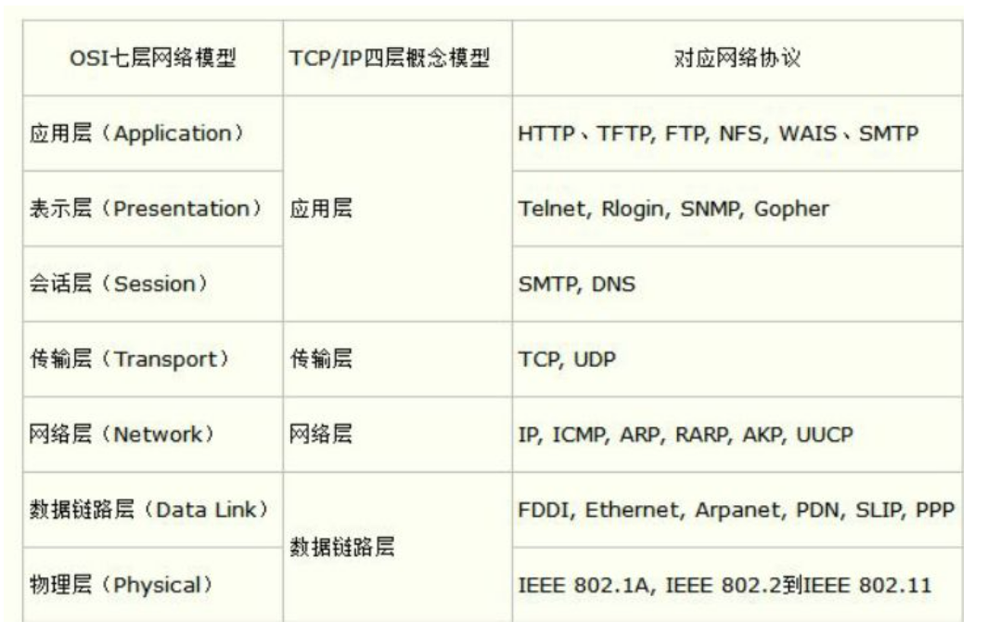
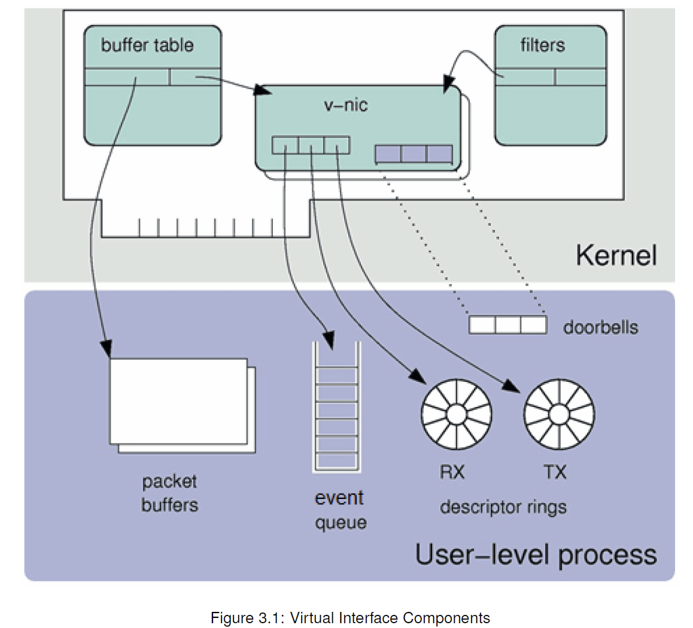

<!--more-->
## 简介

ef_vi允许应用程序直接访问Solarflare网卡数据路径，以降低延迟并减少每条消息的处理开销。它可以直接用于那些需要最低延迟的发送和接收API，并且不需要POSIX套接字接口的应用程序。

### 特点

ef_vi的主要特点是：

* 用户空间：ef_vi可由非特权用户空间应用程序使用。
* 内核旁路：数据路径操作不需要系统调用。
* 低CPU开销：数据路径操作占用很少的CPU周期。
* 低延迟：适用于超低延迟应用。
* 高数据包速率：每个核心每秒支持数百万个数据包。
* 零拷贝：对于过滤和转发应用程序特别有效。

ef_vi位于数据链路层，OSI第二层，用来收发以太网数据帧。本质上是网络适配器提供的VNIC（虚拟网络接口控制器）接口的封装。

ef_vi可以用来指定只处理某个端口的数据包，也就是可以与标准linux内核网络栈和其他加速技术同时使用。

### 用途

#### 加速socket

可用于替代socketsAPI。

例如：在hft系统中处理多播UDP数据报。

应用程序将建立一个ef_vi实例

应用程序给定目标IP地址和端口号。

只有需要加速的数据包才由ef_vi处理。

其他还是内核处理。

应用程序可以创建多个ef_vi实例来处理不同的数据包流，或者在多个线程上分散负载。如果每个传输线程都有自己的ef_vi实例，那么它们可以在无锁和不共享状态的情况下并发传输数据包。这大大提高了效率。 啥意思？可以多线程处理同一条数据路径？

#### 抓包

Solarflare的SolarCapture软件构建在ef_vi API之上。与传统的捕获API一样，ef_vi可用于捕获到达网络端口或子集的所有数据包，并打时间戳。

其他用途：包重放、作为end-station、网络虚拟化。

## 概念

每个ef_vi实例，提供了一个网卡的虚拟接口，如下：

一个虚拟接口包括三个组件：Event queue、Transmit descriptor ring、Receive descriptor ring。（这是软件资源）

一个虚拟接口（就是一个ef_vi实例）的硬件资源：

两个寄存器，用来通知TX、RX 缓冲区可用。？

一些定时器?

一个共享的中断。

### event queue

用来网卡和应用程序之间传递消息。比如通知应用程序有数据包到达的事件。

### transmit descriptor ring

将数据包从应用程序传递到网卡。环中的每个条目都是一个描述符，它引用包含数据包的缓冲区。每个数据包由一个或多个描述符描述。
数据包的传输在后台进行，适配器在数据包传输完成后通过事件队列通知应用程序。

### Receive descriptor ring

将数据包从适配器传递到应用程序。应用程序必须预先分配缓冲区并将其发送到接收描述符环。环中的每个条目都是一个描述符，它引用适配器可以将数据包放入的“空闲”缓冲区。
当适配器向ef_vi实例发送数据包时，它会将数据包复制到下一个可用的接收缓冲区，并通过事件队列通知应用程序。

大数据包可以分散在多个接收缓冲区上。

### Protection Domain

* 每个虚拟接口都与一个保护域相关联。
* 每个内存区域都注册了一个或多个保护域。这样可用共享资源，做零拷贝转发。

### Memory Region

发送或接收缓冲区的内存区域要使用`ef_memreg`接口注册。

这确保了内存区域符合ef_vi的要求：

* 内存被固定，因此无法交换到磁盘。
* 内存映射为DMA，以便网络适配器可以访问它。适配器将应用程序提供的DMA地址转换为PCIe总线上使用的I/O地址。
* 内存区域与页面对齐，以提高性能。
* 内存区域的大小是数据包缓冲区大小的倍数，因此不会浪费内存。

### Packet Buffer

就是收发数据包的buffer，通常大小2kb，只有同一保护域中的虚拟接口才能访问。是memory region么。

大数据包可能分散在多个packet buffer上。

### Packet Buffer Descriptor

每个包缓冲区用一个descriptor引用，包含了：

* 一个指针，指向实际的buffer内存区
* 一个偏移量，谁的偏移量？
* 一个长度

rings上存放的就是这些描述符。

#### Programmed I/O

?没看懂

#### Fliter

选择哪些数据包被传递到虚拟接口。其他的走内核。

根据数据包的特征过滤。比如以太网MAC地址、VLAN标记、IP地址和端口号。

## 问题

多个线程读一个socket会怎么样？

ef_vi用到的硬件资源怎么理解。