git是一个内容寻址文件系统，核心部分是一个键值对数据库。以hexo博客的git管理为例分析。

<!--more-->

## .git文件夹下有什么

### 六个文件

先用`tree`命令看下.git文件夹下的内容


git将整个数据库存储在.git目录下

首先看几个文件

`COMMIT_EDITMSG`：记录了最后一次commit时的msg，比如

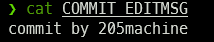

`HEAD` ：文本文件，指向当前工作区所在的分支，比如以下，表示当前工作分支在hexo

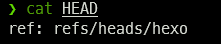

然后看`refs/heads/hexo`下有什么


`config`：文本文件，git相关配置，比如

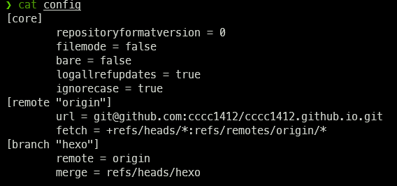

`description`：关于该仓库的描述

`index`：这个就是git三分区中的索引，也叫暂存区。index是一个二进制文件，直接cat出来是乱码

可以用`git ls-files -s`显示index中的部分数据，实际index文件结构复杂的多，见https://zhuanlan.zhihu.com/p/142289703

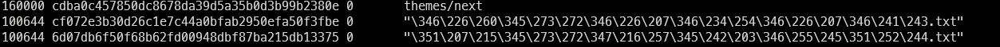

包含了四个字段：文件类型和权限（file mode bits）、文件sha-1值、用来处理冲突的stage number、文件路径

`packed-refs`：ref下文件的打包，比如

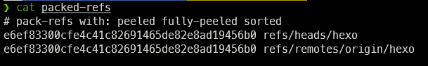

### 六个文件夹

`branches`

`hooks`：里面放了一些shell脚本，比如

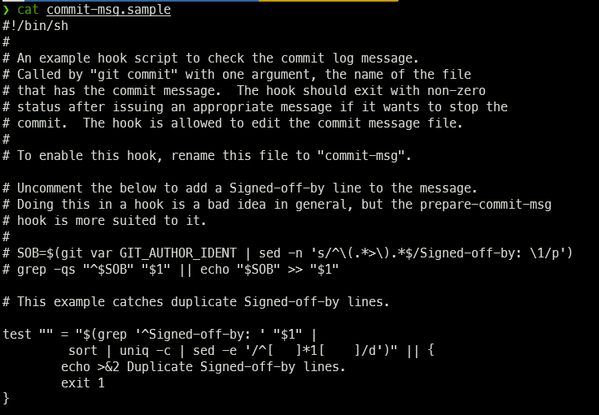

`info`：

`logs`：每个分支的提交日志

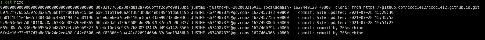

`object`：最重要的文件夹，存放git对象object

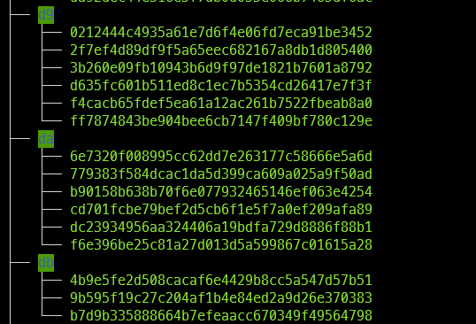

`refs`：

## git中的四种对象

> 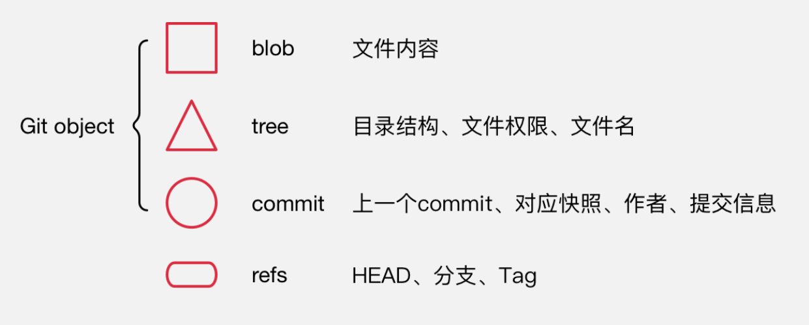

### blob

`blob`：存储的是文件内容，是二进制的数据文件，只包含文件内容，**不包含其他文件信息如文件名创建时间等**。

这样设计的优点，比如只修改一个文件名，只需要在tree里进行修改，而不需要重新创建blob。

修改文件后的每一次add，都会为文件创建新的blob，也就是文件的全新快照，而不是文件的变更部分，空间换时间。不过git本身自己也有优化，pack。blob的文件名就是sha-1的值。

### tree

`tree`：对应文件系统里的目录结构，保存了文件类型，权限，hash（这个指向了blob），文件名。比如

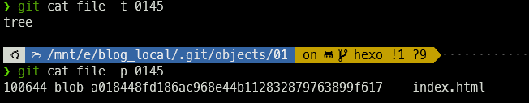

各字段解释如下：

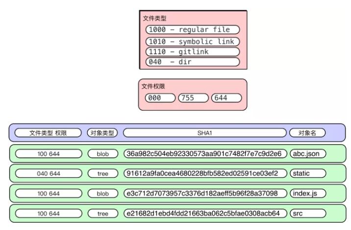

### commit

```shell
git log --graph --pretty=format:'%Cred%h%Creset -%C(yellow)%d%Creset %s %Cgreen(%cr)%Creset' --abbrev-commit --date=relative #查看commit
```

`commit`：是一次修改的集合，指向对应目录结构快照tree

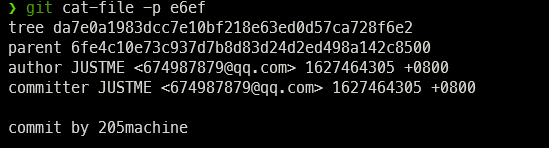

指向的tree:

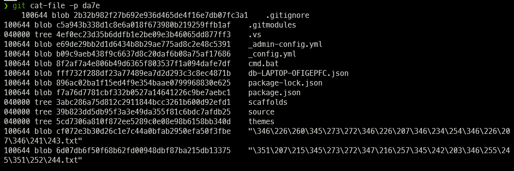

可以看出这就是当时的整个目录结构。

commit各字段解释如下：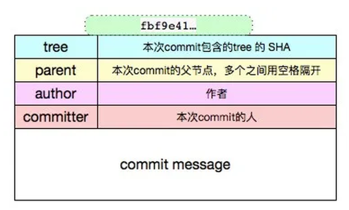

### refs

tag是一个固化的分支，就是这个tag代表的内容永远不可改变，关联了当时版本库中最后一个commit，软件发布时候一般用tag

## git操作时obj发生了什么变化

### add操作

这里将a.txt文件内容111修改为333，然后add。这时git仓库中新建了一个新的blob保存a文件的新内容，然后更新索引，将a.txt指向了新的blob对象

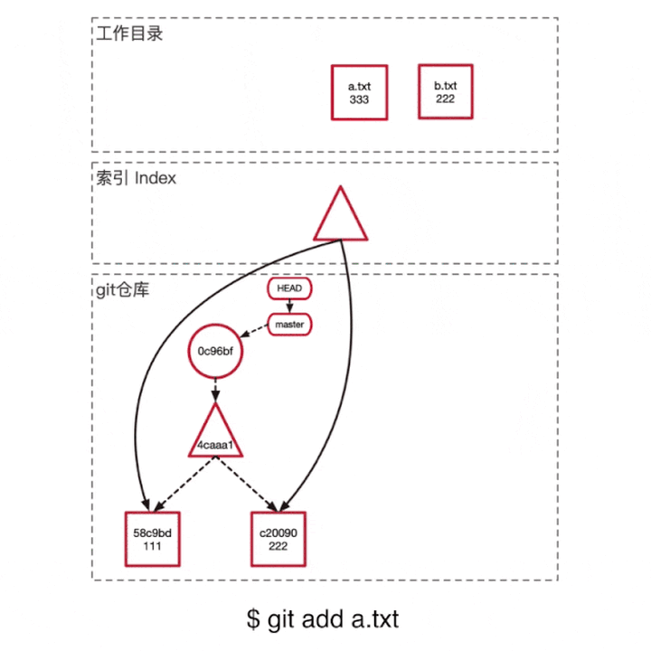

### commit操作

首先根据当前索引指向情况创建新的tree obj（图中的三角），这样保证新建的tree指向的是最新的文件，作为提交的快照。

然后创建新的commit obj，保存本次的commit信息，父亲节点指向上一个commit，形成链状的变更历史

更新分支指向。


## 参考资料

https://zhuanlan.zhihu.com/p/96631135

https://zhuanlan.zhihu.com/p/142289703


