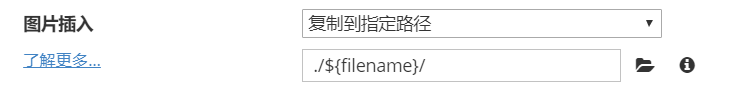
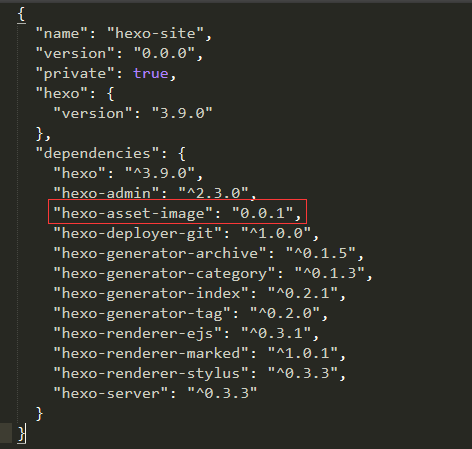

## 配置Typora

文件 $\longrightarrow$ 偏好设置



<!--more-->

## 安装hexo-asset-image

**安装0.0.1版，1.0.0会出现.com问题**

打开博客根目录下的package.json文件，如下修改：

```
"hexo-asset-image": "0.0.1",
```



然后在博客根目录下

```
npm install
```

使用以下格式在md文件中即可插入图片：

```
 
```

____

参考资料：https://alreadyright.github.io/2019/06/16/aboutHexo/

