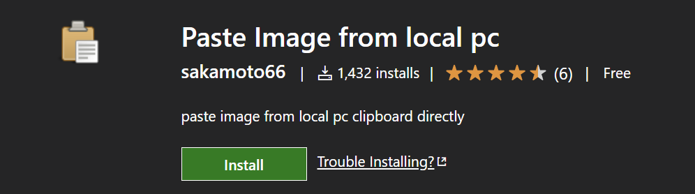
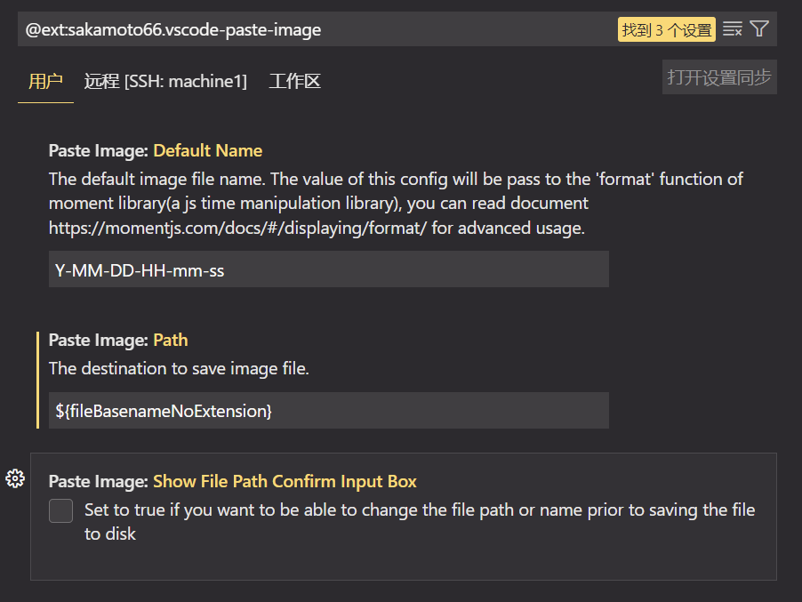

## 配置Typora

文件 $\longrightarrow$ 偏好设置


<!--more-->

## 安装hexo-asset-image

**安装0.0.1版，1.0.0会出现.com问题**

打开博客根目录下的package.json文件，如下修改：

```
"hexo-asset-image": "0.0.1",
```


然后在博客根目录下

```
npm install
```

使用以下格式在md文件中即可插入图片：

```
 
```
## vscode remote 图片上传插件
https://marketplace.visualstudio.com/items?itemName=sakamoto66.vscode-paste-image


${fileBasenameNoExtension}
这样就可以remote编写markdown插入图片了,ctrl+alt+v

### markdown 导出 pdf
http://sunqunyan.net/2019/08/11/markdown-pdf/

参考资料：https://alreadyright.github.io/2019/06/16/aboutHexo/

