leveldb是LSM（Log Structured-Merge Tree）树的经典实现，除去测试部分，代码量大概1.5W行，遵循google c++代码规范。

<!--more-->

## 调试环境搭建

```shell
#先git clone
mkdir -p build && cd build
cmake -DCMAKE_BUILD_TYPE=Debug .. && cmake --build .

#回到根目录
sudo cp -R include/leveldb /usr/local/include
sudo cp ./build/libleveldb.a ./test
```

## LSM-tree

> 设计LSM tree的目的是为了实现高效写入操作。

为什么要提出LSM-Tree，因为原有的B+树的写操作太慢了，根本原因是磁盘的随机操作满，顺序读写快。

以此磁盘I/O的时间 = 寻道时间 + 旋转时间 + 数据传输时间

其中寻道是磁头移动到正确的磁道，旋转是讲扇区移动到磁头下，这两个都是机械操作，磁头寻址耗时造成随机操作耗时。

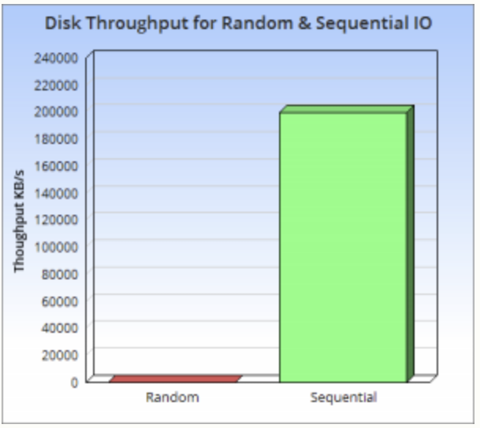

磁盘的顺序读写要远快于随机读写，而且快了三个数量级。

### LSM-tree 的通用结构

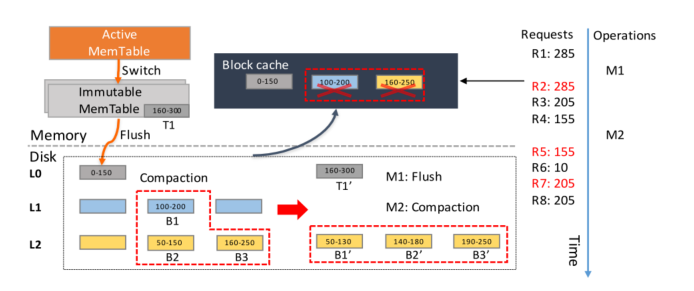

LSMtree由内存驻留组件和磁盘驻留组件组成。

## 整体设计

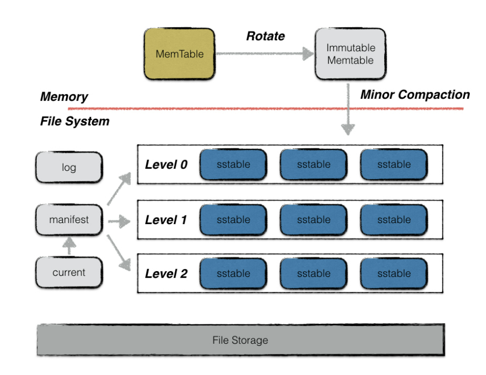

### memtable

一次leveldb的写入过程并不是直接将数据持久化到磁盘文件中，而是先写将操作写到日志文件中，然后将写操作应用到memtable。

memtable是在**内存中**维护的一个**跳表**的数据结构。系统运行过程中，如果memtable中的数据占用达到指定值（write buffer size），memtabe 会转化为immutabel，然后自动生成新的memtable。immutable 被新的线程dump到磁盘中，dump结束后immutable就可以被释放了。

```c++
class MemTable {//是一个接口类，核心的数据结构是里面的skipList，定义在memtable.h里
 public:
  ...
  // 引用计数
  void Ref() { ++refs_; }
  //自身引用为0，则析构
  void Unref() {
    --refs_;
    assert(refs_ >= 0);
    if (refs_ <= 0) {
      delete this;
    }
  }
  //跳表的一个迭代器，可以用来便利table的内部数据，很好的设计思路，可以用来隐藏table的内部实现
  Iterator* NewIterator();

  //添加和删除数据的接口，注意到这里没有Delete的接口，是因为memtable的delete是插入一条type为delete的记录
  void Add(SequenceNumber seq, ValueType type, const Slice& key,
           const Slice& value);
  bool Get(const LookupKey& key, std::string* value, Status* s);

 private:
	...
  typedef SkipList<const char*, KeyComparator> Table; 
  	...
  int refs_;
  Table table_;
};
```

跳表中KV的存储格式为：

```
| Internal Key size | internal key | value len |value|
其中
internal key = |user key |sequence number |type |
Internal key size = key size + 8
```

跳表的排序基于：

* 首先根据user key按升序排列
* 然后根据sequence number按降序排列
* 最后根据value type按降序排列

#### 跳表

> 一种支持二分查找的有序链表

就是在原始的链表上加了多级索引

### SStable

> 数据最终在磁盘上的物理存储，sorted string table.

一个sstable就是一个文件，作者在`doc/table_format.md`描述了文件的逻辑结构

```
<beginning_of_file>
[data block 1]
[data block 2]
...
[data block N]
[meta block 1]
...
[meta block K]
[metaindex block]
[index block]
[Footer]        (fixed size; starts at file_size - sizeof(Footer))
<end_of_file>
```

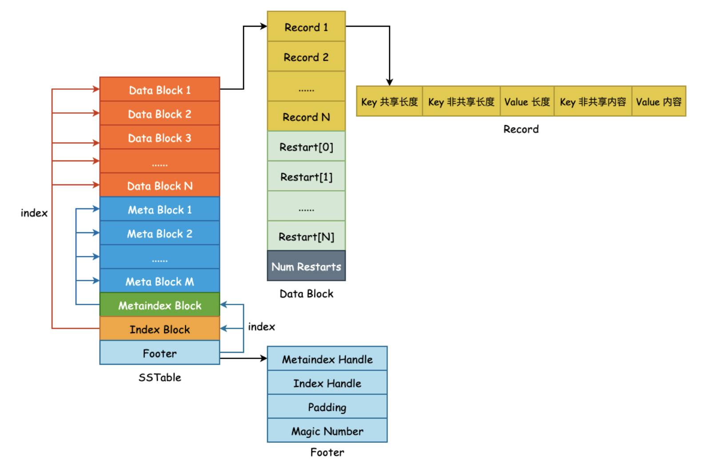

* Data Block：存储KV对，有序
* Meta Block：每一个DataBlock对应一个Meta Block，存储的是布隆过滤器，可以快速定位key是否在data block中
* Meta Index Block：对meta block的索引，<过滤器名字，offset，size>
* Index Block：是对Data Block的索引，<该块最大key值，该块在sstabl中的偏移量，块大小>

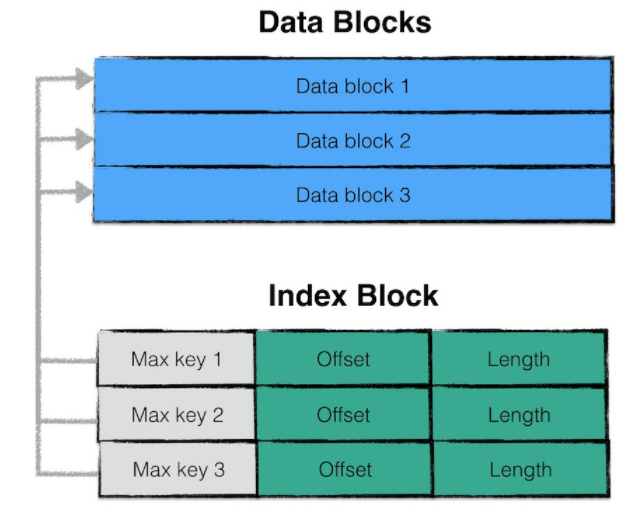

* Footer：可以理解成文件头

### 查找key步骤

* 找文件：找到可能包含key的sstable
* 加载IB和FB：把sstable中的index block和filter block加载到内存
* 查找IB：二分查找index block找到可能包含key的data block
* 查找FB：通过过滤器判断key是否在data block中
* 加载DB：如果过滤器判断在，则加载data block
* 查找DB：二分查找data block
* 读数据
* 如果fliter判断不存在或者查找不存在，则在下一个搜索候选文件。

#### Block 存储格式

块是sstable的组成单位，一个块约4kb大小，块大不是定长而是一个阈值，为了。

> Block有三部分组成：block data, type, crc32，默认每个块大小为4kb。 其中type是压缩方式：none或则snappy。

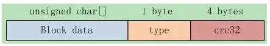

```c++
class BlockHandle {
private:
  uint64_t offset_;
  uint64_t size_;
};
```

#### 布隆过滤器

> 布隆过滤器是未来在大量数据中查询某个字符串是否存在

比如：

* word如何判断某个单词是否拼写正确
* 网络爬虫中如何不去爬相同的页面

##### 定义

布隆过滤器是一种概率型的数据结构，特点是高效的插入和查询，能返回某个字符串**一定不存在**或者**可能存在**，相比传统的数据结构，如hash表，set，map更加高效，占用的空间更小，代价是返回的结果是概率存在，同时不支持删除操作。

##### 组成

+ bitmap + n个hash函数

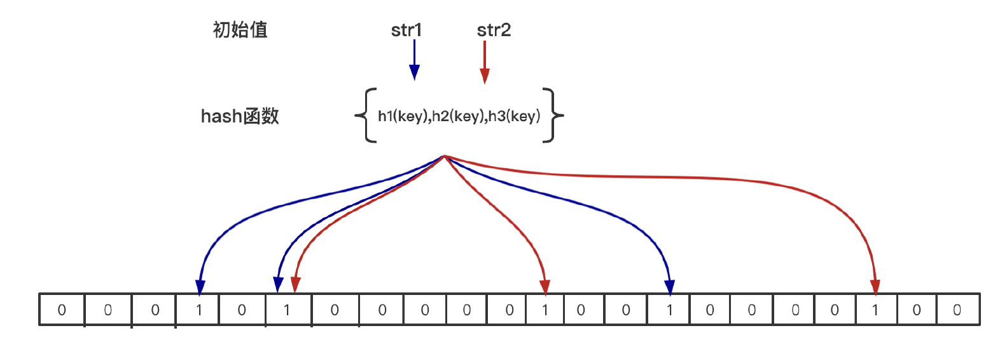

##### 原理

* 添加：利用n个hash函数将这个元素映射到位图里的n个点，置为1
* 查找：用n个hash函数检测位图中的k个点是否都为1，如果有不为1的点，就认为不存在，全部为1，则可能存在（hash冲突）

### SSTable的合并

> 合并分两类：minor compaction和major compaction

#### minjor compaction

immutable memtable持久化成sstable的过程，优先级高，完成内存数据的持久化

注意到level 0层的sstable文件数据是可能存在overlap的，所以需要往下合并，去重，提高查找效率。

#### major compaction

##### 触发条件

* 0层文件超过上限（4个）
* level i层文件总大小超过（10^i）MB
* 某个文件无效读取次数过多

##### 合并流程

* 寻找第一个输入文件：不同触发条件的输入文件不同
* 根据key的重叠情况扩大输入文件集合

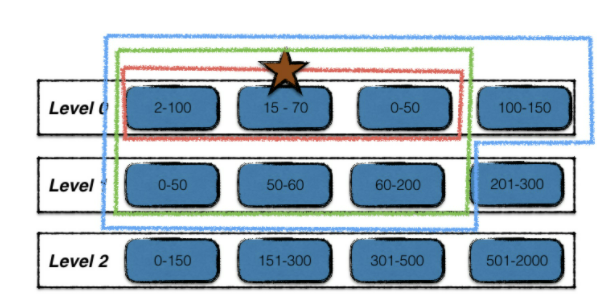

* 多路合并：i和i+1层文件中的数据项合并，冗余数据清理，保留最新数据，输出到i+1层

## 缓存系统

> 缓存的是sstable中的文件对象和相关元数据，如果以此读操作都会发生一次磁盘IO，那么整体效率会非常低下，所以需要把热数据加入cache。

### TableCache

查找数据时，现在memtable和immutable 中查找，如果都查找不到，那么就要打开sst文件，解析文件中的index block，然后根据index block 找到对应的data block中进行查找，如果对于每次sst查询都经历上述步骤，效率很低。因此引入了table cache来缓存sst文件和对应的index block。

#### table cache创建

`/db_impl.cc`文件中的的DB构造函数中创建了table_cache_

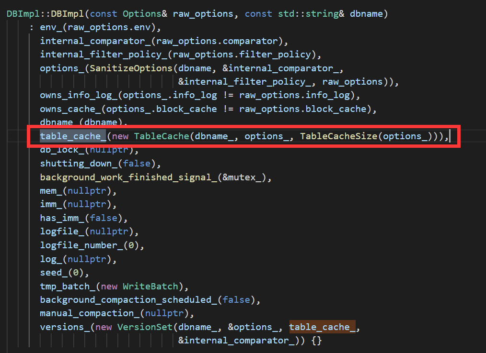

table_cache_是TableCache的一个实例化对象，然后跳转到TableCache的构造函数里看：

```c++
TableCache::TableCache(const std::string& dbname, const Options& options,
                       int entries)
    : env_(options.env),
      dbname_(dbname),
      options_(options),
      cache_(NewLRUCache(entries)) {}
```

发现TableCache的成员对象cache_是由NewLRUCache函数初始化的，再跳转到NewLRUCache:

```c++
Cache* NewLRUCache(size_t capacity) { return new ShardedLRUCache(capacity); }
```

发现cache_实际是`ShardedLRUCache`对象的一个实例。

#### ShardedLRUCache

```c++
class ShardedLRUCache : public Cache {
 private:
  LRUCache shard_[kNumShards];
  ...

 public:
  explicit ShardedLRUCache(size_t capacity) : last_id_(0) {
    const size_t per_shard = (capacity + (kNumShards - 1)) / kNumShards;
    for (int s = 0; s < kNumShards; s++) {
      shard_[s].SetCapacity(per_shard);
    }
  }
```

可以看出ShardedLRUCache里面维护了一个LRUCache数组。

这样设计的目的是为了减少多线程访问加锁时的竞争，查找key的时候，先计算属于哪一个LRUCache，然后只对一个LRUCache进行加锁，而不是整个cache一把锁。分区是一个减少竞争的策略，比如ptmalloc在管理堆内存的时候也引入了arena分配区的概念，malloc和free时先查找要在哪个分配区上进行操作，只对一个分配区加锁。都是为了减少竞争。

所以看LRUCache的实现就可以了。

#### LRUCache

在跳转到LRUCache:

```c++
class LRUCache {
 public:
  ...
  Cache::Handle* Insert(const Slice& key, uint32_t hash, void* value,
                        size_t charge,
                        void (*deleter)(const Slice& key, void* value));
  Cache::Handle* Lookup(const Slice& key, uint32_t hash);
  void Release(Cache::Handle* handle);
  void Erase(const Slice& key, uint32_t hash);
  void Prune();
  size_t TotalCharge() const {
    MutexLock l(&mutex_);
    return usage_;
  }

 private:
  void LRU_Remove(LRUHandle* e);
  void LRU_Append(LRUHandle* list, LRUHandle* e);
  void Ref(LRUHandle* e);
  void Unref(LRUHandle* e);
  bool FinishErase(LRUHandle* e) EXCLUSIVE_LOCKS_REQUIRED(mutex_);

  // Initialized before use.
  size_t capacity_;

  // mutex_ protects the following state.
  mutable port::Mutex mutex_;
  size_t usage_ GUARDED_BY(mutex_);

  // Dummy head of LRU list.
  // lru.prev is newest entry, lru.next is oldest entry.
  // Entries have refs==1 and in_cache==true.
  LRUHandle lru_ GUARDED_BY(mutex_);

  // Dummy head of in-use list.
  // Entries are in use by clients, and have refs >= 2 and in_cache==true.
  LRUHandle in_use_ GUARDED_BY(mutex_);

  HandleTable table_ GUARDED_BY(mutex_);
};
```

#### 缓存失效问题

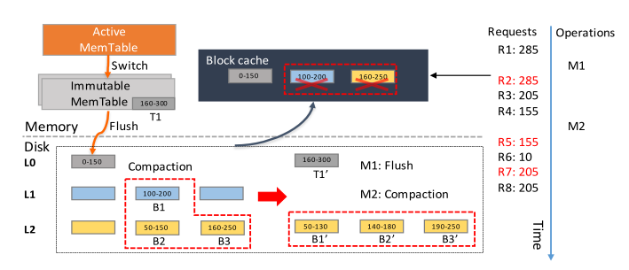

开始时，M1将immutable memtable刷盘，R2请求285，失效。M2产生了compaction，L1的一个块和L2的两个块合并，新产生的块放在L3，这时R5访问155，155所在的块已经被修改，cache失效，R7访问205，同样失效。

## 版本控制

### 什么时候产生新的版本

sstable的更替对leveldb来说是一个最小的操作单元，具有原子性，**leveldb每次生成或者删除sstable**，就会产生新的版本。


## 代码分析

### Get

`status = db->Get(leveldb::ReadOptions(),key, &value);`

```c++
Status DBImpl::Get(const ReadOptions& options, const Slice& key,
                   std::string* value) {
  Status s;
  MutexLock l(&mutex_);
  SequenceNumber snapshot;
  if (options.snapshot != nullptr) {
    snapshot =
        static_cast<const SnapshotImpl*>(options.snapshot)->sequence_number();
  } else {
    snapshot = versions_->LastSequence();
  }

  MemTable* mem = mem_;
  MemTable* imm = imm_;
  Version* current = versions_->current();
  mem->Ref();
  if (imm != nullptr) imm->Ref();
  current->Ref();

  bool have_stat_update = false;
  Version::GetStats stats;

  // Unlock while reading from files and memtables
  {
    mutex_.Unlock();
    // First look in the memtable, then in the immutable memtable (if any).
    LookupKey lkey(key, snapshot);
    if (mem->Get(lkey, value, &s)) {//从memtable里查找
      // Done
    } else if (imm != nullptr && imm->Get(lkey, value, &s)) {//immutable memtable里查找
      // Done
    } else {
      s = current->Get(options, lkey, value, &stats);//查cache和sstable
      have_stat_update = true;
    }
    mutex_.Lock();
  }

  if (have_stat_update && current->UpdateStats(stats)) {
    MaybeScheduleCompaction();
  }
  mem->Unref();
  if (imm != nullptr) imm->Unref();
  current->Unref();
  return s;
}
```


## 列簇

> 列簇 column families是rocks db中的概念

数据分片，将键值对按照不同的属性分配给不同的CF

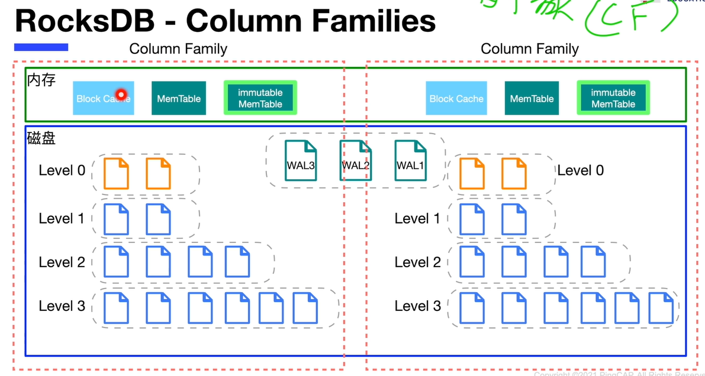


## 问题

1. 利用sstable中的index block进行快速的数据项位置定位，得到该数据项有可能存在的**两个**data block；？？为什么两个
2. 引用计数和锁
3. compaction 为什么能平衡读写

## 参考资料

* 讲TableCache的：https://axlgrep.github.io/tech/leveldb-tablecache.html
* leveldb代码解析：https://github.com/SmartKeyerror/reading-source-code-of-leveldb-1.23
* https://wingsxdu.com/post/database/leveldb/
