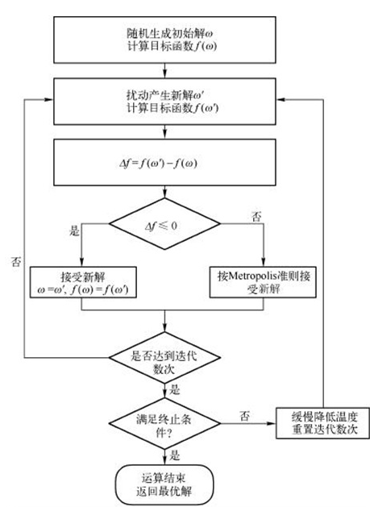

​	记录了模拟退火的原理和matlab第三方工具箱satools的使用。

<!--more-->

## 算法原理



## SATOOLS使用

### 模拟退火主函数`anneal`

#### 调用格式：

```matlab
function [W,Ew,Wbsf,Ebsf,Tt,Et,Etarget,ert,Kt,Ebsft,Eh,M,rho,Ebin] = anneal( ...
    verbose, ...
    newstate, X, ...
    cost, moveclass, ...
    walkers, ...
    acceptrule, q, ...
    schedule, P, ...
    equilibrate, C, maxsteps, ...
    Tinit, r, ...
    Tfinal, f, maxtemps, ...
    v, bins, e)
```

#### 参数说明

##### 输入参数

* `verbose`：flag变量，为1时打印状态变量
* `newstate`：用户自定义函数,产生初始解
* `X`：问题的domain(解空间?)，常量
* `cost`：用户自定义函数，最优化的目标函数
* `moveclass`：用户自定义函数，用来产生新解
* `walkers`：正整数
* `acceptrule`：用户自定义函数，接受规则，工具箱也提供了几个，经常用metropolis准则
* `q`：`acceptrule`所需要的参数
* `schedule`：温度更新函数，可自定义
* `P`：`schedule`所需参数
* `equilibrate`：(平衡)可传入函数句柄或其他。当传入函数时，表示温度是否改变的判断函数
* `C`：`equilibrate`所需参数
* `maxsteps`：同一温度下的迭代最大次数
* `Tinit`：初始化函数，可自定义可使用工具箱提供函数。
* `r`：`Tinit`所需参数
* `Tfinal`：终止温度，可以是自定义函数，工具箱也提供，或者是数（-INF ok）
* `f`：参数
* `maxtemps`：最大温度迭代次数
* `v`：温度变化的快慢$[0,1]$
* `bins：`
* `e`：

##### 输出参数

* `W`：每个`walker`的最终状态
* `Ew`：`W`对应的最终能量
* `Wbsf`：每个`walker`的`best so far`状态
* `Ebsf`：每个`walker`的`best so far`能量
* `Tt(i)`：每次温度步的温度记录
* `Et(i)`：`Tt(i)`对应的平均能量
* `Etarget（i）`：`Tt(i)`对应的目标平均能量，根据`v`计算
* `ert(i)`：
* `kt(i)`：`Tt(i)`对应的热平衡步数
* `Ebsft(i)`：`Tt(i)`对应的`best so far`能量
* `Eh`：能量和温度的历史记录
  * `i = 1,1 + (steps*walkers)`
  * `Eh(i,1)`：温度步的下标`t`
  * `Eh(i,2)`：`t`对应的温度`T`
  * `Eh(i,3)`：在温度`T`时的达到热平衡步数的编号`j`
  * `Eh(i,4)`：`walker`的编号`k`
  * `Eh(i,5)`：在`T`温度下,第`j`步，`walker k`对应的能量
  * `Eh(i,6)`：在`T`温度下,第`j`步，`energy E' attempted from E`

* `M`：
* `rho`：
* `Ebin`：

#### 自定义函数编写

1. `newstate`产生初始解，

   ```matlab
   function W = PROBLEMNAME_new(X)
   % W = PROBLEMNAME_new(X)
   % See http://www.frostconcepts.com/software for information on SA Tools.
   %
   %   W = PROBLEMNAME_new(X) ;
   %
   %   X = behaviorally constant application data
   %
   %   W = specific data about current state
   %
   %   Instantiates a new state.
   %
   W = [] ;    % a typical application will put state specific data here
   ```

2. `cost`最优化目标

   ```matlab
   function Ew = PROBLEMNAME_cost(X,W)
   % Ew = PROBLEMNAME_cost(X,W)
   %
   %   X = behaviorally constant application data
   %
   %   W = specific data about current state
   %
   %   Ew = energy corresponding to W
   %
   Ew = rand ;     % a typical application will use information from W and X to compute Ew.
   ```

3. `moveclass`产生新解

   ```matlab
   function W = PROBLEMNAME_perturb(X,W,Ea,T)
   % W = PROBLEMNAME_perturb(X,W,Ea,T)
   %
   %   X = behaviorally constant application data
   %
   %   W = (on input) current state, (on output) next state.
   %
   %   Ea = current average energy
   %   T = current temperature
   ```

4. 产生解空间

   ```matlab
   function X = PROBLEMNAME_init()
   % X = PROBLEMNAME_init()
   %
   %   X = behaviorally constant application data
   %
   X = [] ;        % a typical application will put problem domain data here
   ```

   