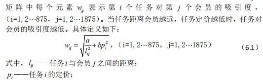
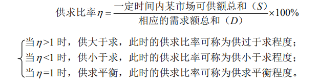
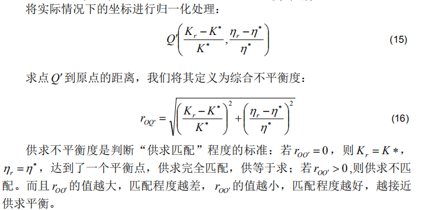
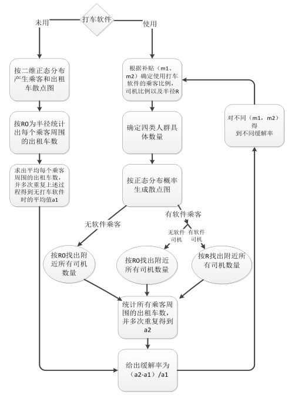
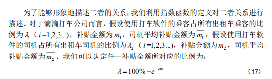

简单记录了题目和思路。

<!--more-->

## 2017B ”拍照赚钱“的任务定价

### 问题描述

在拍照赚钱APP中，用户可以领取拍照任务，完成任务后可以获得酬金，不同的任务又不同的定价。

1. 附件一给了任务的位置（经纬度），定价，完成情况，需要分析任务未完成的原因。
2. 制定新的定价方案，并和原方案比较。
3. 考虑任务联合打包发布规则下的定价模型，并分析对最终任务完成情况的影响。
4. 对附件三种的新项目给出定价方案。

### 思路

#### 问题一：

从**定性和定量**角度分析，先使用cftool工具箱绘制定价和经纬度坐标的**三维拟合图**，观察结果定性得出结论。然后利用kmeans聚类，将地图划分为网格区域，每个网格内定义四个指标，然后利用**灰色关联矩阵**定量分析定义的指标和定价的**相关程度**，然后通过对比未完成任务和已完成任务的相关度矩阵得出最显著的影响因素。

#### 问题二：

将定价方案看作**优化问题**，总成本最小化，完成率最大化：$\left\{ \begin{array} { l } { \min \sum _ { i = 1 } ^ { 835 } p _ { i } } \\ { \max \sum _ { i = 1 } ^ { 835 } C _ { i } } \end{array} \right.$，定义了吸引度矩阵：

定义阈值，$w _ { i } = \left\{ \begin{array} { l } { \min \left\{ w _ { i j } \right\} , C _ { i } = 1 } \\ { \max \left\{ w _ { i j } \right\} , C _ { i } = 0 } \end{array} \right.$当第*i* 

个任务被完成时，其阈值至少低于其对一个会员的吸引度；当第*i* 个任务未被完成时，其阈值不低于任何其对一个会员的吸引度。 

#### 问题三：

修改优化模型，通过聚类分析打包任务，修改吸引力矩阵，重新进行搜索。

#### 问题四：

聚类分析将任务打包，然后用第三问的任务数据和最优定价作为训练数据训练**神经网络**，再带入附件三的数据得到定价。

## 2016B 小区开放对道路通行的影响

### 问题描述

1. 建立评价指标体系，评价小区开放对周边道路通行的影响。
2. 建立车辆通行的数学模型，用以研究小区开放对周边道路通行的影响。 
3. 小区开放产生的效果，可能会与小区结构及周边道路结构、车流量有关。请选取或构建不同类型的小区，应用你们建立的模型，定量比较各类型小区开放前后对道路通行的影响。

### 思路

#### 问题一:

找指标，**先找了多个指标**，利用**聚类分析**把影响因素进行归类，然后利用**层次分析法构建评价体系**。

#### 问题二：

利用**元胞自动机**模拟道路情况，车辆变量更新规则有**NS模型**，

然后考虑**道路通行能力，安全性，便捷度**，建立**模糊综合评价模型**。通行能力利用层次分析法评定，安全性自己定义公式，便携度求最短路径。

#### 问题三：

针对不同小区，确定问题二模型中的参数，相当于模型求解。

## 2015B “互联网+”时代的出租车资源配置

### 问题描述

请你们搜集相关数据，建立数学模型研究如下问题：

 (1) 试建立合理的指标，并分析不同时空出租车资源的“供求匹配”程度。

 (2) 分析各公司的出租车补贴方案是否对“缓解打车难”有帮助？

 (3) 如果要创建一个新的打车软件服务平台，你们将设计什么样的补贴方案，并论证其合理性。

### 思路

#### 问题一：

还是**找指标**，里程利用率，供求比率

里程利用率 *K* =载客里程（公里）/行驶里程（公里）*100%

然后确定这两个指标在供求平衡下的理想值（不是1）

然后再对不同时段（高峰，常规），不同空间（市区，郊区）进行模拟。

#### 问题二：

软件使用比例计算：

意愿半径计算：即司机为接单愿意行驶的最大距离。也是用函数拟合的思路，定义一个函数形式，带入已知求出参数。

不同的时间段有不同的补贴金额，缓解率也随时间变化，可以绘制变化曲线。

#### 第三问：

开放问题，示例论文中采用了**分区域动态实时补贴**的方法，自己值定了一些规则，根据规则列出方程，解方程得到的结果。

也可以采用最优化问题的求解思路，站在平台的角度，补贴最少，效益最高。

## 2014B 创意平板折叠桌

做过，不写了，模拟动态变化的过程就是推导桌子角度变量间的一些关系式，加工参数确定看成最优化问题。

## 2013B 碎纸片拼接复原

做过，不写了，有点难。

## 2012B 太阳能小屋的设计

### 问题描述：

**问题1：**请根据山西省大同市的气象数据，**仅考虑贴附安装方式**，选定光伏电池组件，对小屋（见附件2）的部分**外表面进行铺设**，并根据电池组件分组数量和容量，**选配相应的逆变器的容量和数量**。

**问题2：**电池板的朝向与倾角均会影响到光伏电池的工作效率，请选择**架空方式**安装光伏电池，重新考虑问题1。

**问题3：**根据附件7给出的小屋建筑要求，请为大同市**重新设计一个小屋**，要求画出小屋的外形图，并对所设计小屋的外表面优化铺设光伏电池，给出铺设及分组连接方式，选配逆变器，计算相应结果。

### 思路

#### 第一问：

电池板有三种串并联方式，不同的串并联方式还可以连接不同的逆变器，针对每种串并联方式，设置最优化目标:

全年功率最大化：$\max W_{jmA}$，逆变器和电池总价最小化：$\min p_{jmA}$，j表示墙免编号，m表示逆变器型号，A表示不同的电池连接方式。

针对该多目标优化问题，分别先做单目标规划下的最优值，求解出$W'_{jmA}$和$p'_{jmA}$

然后再构造单目标规划：

$f = (W_{jmA}-W'_{jmA})^2+(p_{jmA}-p'_{jmA})^2$

根据此形式构造出优先级函数，得到不同型号逆变器的最佳组合方式定义优先级：

$f' = (\frac{W_{jmA}-W_{max}}{W_{max}})^2+(\frac{p_{jmA}-p_{min}}{p_{min}})^2  $

采用贪心的方法根据优先级进行安装。

#### 第二问：

最优化，找到全年辐射强度最大的角度。

然后需要研究电池板的投影情况，阴影情况限制了电池的铺设。

#### 第三问：

根据房屋建设的标准制定约束，以全年接受光强之和为优化目标。

## 2012A 葡萄酒评价

### 问题描述

1. 分析附件1中两组评酒员的评价结果有无显著性差异，哪一组结果更可信？

2. 根据酿酒葡萄的理化指标和葡萄酒的质量对这些酿酒葡萄进行分级。

3. 分析酿酒葡萄与葡萄酒的理化指标之间的联系。
4. 分析酿酒葡萄和葡萄酒的理化指标对葡萄酒质量的影响，并论证能否用葡萄和葡萄酒的理化指标来评价葡萄酒的质量？

### 方法记录



