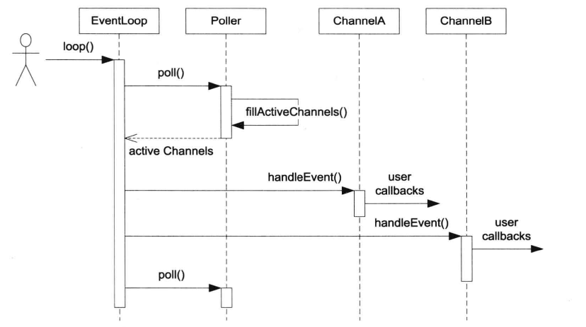

<!--more-->

<!-- @import "[TOC]" {cmd="toc" depthFrom=1 depthTo=6 orderedList=false} -->

# 调用关系分析
## Muduo自顶向下
> 自顶向下分析muduo的调用逻辑
### 创建自己的业务server

* 创建自己的server类,包含了两个私有成员:`EventLoop *loop_`,`TcpServer server_`
*  实现`on_message`和`on_connection`，在构造函数里设置回调，设置线程数
*  main函数调用server.start()
*  server.start()会调用内部TcpServer的start,然后调用EventLoop的loop()。
```c++
class EchoServer
{
public:
    EchoServer(EventLoop *loop, InetAddress &addr, string name)
        : server_(loop, addr, name), loop_(loop)
    {
        //注册回调函数
        server_.set_connection_callback(bind(&EchoServer::on_connection, this, _1));
        server_.set_message_callback(bind(&EchoServer::on_message, this, _1, _2, _3));

        //设置线程数量
        server_.set_thread_num(3);
    }
    void start()
    {
        server_.start();
        loop_->loop();
    }

private:
    //连接建立或者断开的回调
    void on_connection(const TcpConnectionPtr &conn)
    {
        if (conn->connected())
        {
            LOG_INFO("conn up: %s", conn->get_peeraddr().get_ip_port().c_str());
        }
        else
        {
            LOG_INFO("conn down: %s", conn->get_peeraddr().get_ip_port().c_str());
        }
    }

    //可读事件回调
    void on_message(const TcpConnectionPtr &conn, Buffer *buffer, TimeStamp time)
    {
        string msg = buffer->retrieve_all_asString();
        conn->send(msg);
        //conn->shutdown();
    }

private:
    EventLoop *loop_;
    TcpServer server_;
};

int main()
{
    EventLoop loop(1);
    InetAddress addr(8000);
    EchoServer server(&loop, addr, "echo 01");
    server.start();
    //loop.loop(); //启动main loop的底层poller
    return 0;
}
```
### TcpServer的start
> 业务server调用TcpServer的start


TcpServer有一个main Loop,一个线程池，池子里是所有的subReactor，每个线程也有自己的loop
TcpServer的start会调用自己的线程池的start，然后在自己的main loop里调用listen

```c++
//开启服务器监听
void TcpServer::start()
{
    if (started_++ == 0) //防止被多次启动
    {
        thread_pool_->start(thread_init_callback_);
        loop_->run_in_loop(bind(&Acceptor::listen, acceptor_.get()));
    }
}
```
### 线程池的start
创建thread_nums个EventLoopThread,每个thread有自己的一个EventLoop，调用start_loop，返回的eventloop地址然后放到线程池的loops_数组中。
```c++
void EventLoopThreadPool::start(const ThreadInitCallback &callback)
{
    started_ = true;
    //整个服务端只有baseloop，也就是mainreactor
    if (thread_nums_ == 0)
    {
        callback(baseloop_);
    }
    else
    {
        for (int i = 0; i < thread_nums_; ++i)
        {
            char buffer[name_.size() + 32] = {0};
            snprintf(buffer, sizeof(buffer), "%s %d", name_.c_str(), i);
            EventLoopThread *t = new EventLoopThread(callback, buffer);
            threads_.push_back(unique_ptr<EventLoopThread>(t));
            loops_.push_back(t->start_loop()); //底层开始创建线程，并绑定一个新的eventloop，返回其地址
        }
    }
}
```

### EventLoopThread的start_loop
```c++
EventLoop *EventLoopThread::start_loop()
{
    thread_.start(); //启动线程

    EventLoop *loop = nullptr;
    {
        unique_lock<mutex> lock(thread_mutex_);
        while (loop_ == nullptr)
        {
            condition_.wait(lock);
        }
        loop = loop_;
    }

    return loop;
}

```
里面再调用Thread的start
```c++
void Thread::start()
{
    started_ = true;
    sem_t sem;
    sem_init(&sem, false, 0);

    //开启线程
    thread_ = shared_ptr<thread>(new thread([&]() {
        //获取线程tid值
        tid_ = Current_thread::tid();
        sem_post(&sem);
        //执行函数
        function_();
    }));
    //需要等待新创建的线程，获取其线程的id
    sem_wait(&sem);
}
```
这里会创建新的线程，然后新的线程里跑function_, function_实际就是初始化EventLoopThread时传入了的thread_function，在里面会创建EventLoop，然后进入EventLoop的while 1循环。 
```c++
//启动的线程中执行以下方法
void EventLoopThread::thread_function()
{
    EventLoop loop(0); //创建一个独立的EventLoop，和上面的线程是一一对应 one loop per thread

    if (callback_function_)
    {
        callback_function_(&loop);
    }

    {
        unique_lock<mutex> lock(thread_mutex_);
        loop_ = &loop;
        condition_.notify_one();
    }

    loop.loop(); //开启事件循环

    //结束事件循环
    unique_lock<mutex> lock(thread_mutex_);
    loop_ = nullptr;
}
```
上面说的while 1循环就是调用poller的poll，然后填充active_channel，然后在使用channel来处理不同事件，比如读写的回调函数。
```c++
while (!quit_)
{
    active_channels.clear();
    //监听两类fd 一种是client的fd，一种wakeup的fd
    poll_return_time_ = poller_->poll(k_poll_timeout, &active_channels);

    for (Channel *channel : active_channels)
    {
        //Poller监听哪些channel发生事件了，然后上报给eventloop，通知channel处理事件
        channel->handle_event(poll_return_time_);
    }

    //执行当前EventLoop事件循环需要处理的回调操作
    do_pending_functors();
}
```
然后main reactor会调用run_in_loop, 开启acceptor的listen
```c++
void Acceptor::listen()
{
    LOG_INFO("Acceptor listen called!\n");
    listenning_ = true;
    accept_socket_.listen();
    //借助poller进行监听
    accept_channel_.enable_reading();
    
}
```
### Acceptor
acceptor_是TcpServer类中的一个指针成员。包含两个关键成员：指向mainloop的指针，和用来管理listenfd的channel。
```c++
EventLoop *loop_; //acceptor用的用户定义的那个baseloop，也就是mainloop

Channel accept_channel_;
```
当有新的连接到达时，Acceptor会执行new_connection的回调，里面会选择一个subreactor，创建一个新的connection，放到TcpServer的map里，然后，在这个subreactor里调用establish_connect，establish_connect会像Poller添加关于这个新连接fd的事件监听。
```c++
void TcpServer::new_connection(int sockfd, const InetAddress &peeraddr)
{
    LOG_INFO("new connection callback called\n");
    //轮询算法，选择一个subloop管理channel
    EventLoop *ioloop = thread_pool_->get_nextEventLoop();//连接均匀打到每个eventloop上

    char buffer[BUFFER_SIZE64] = {0};
    snprintf(buffer, sizeof(buffer), "-%s#%d", ip_port_.c_str(), next_conn_id_);
    ++next_conn_id_;
    string conn_name = name_ + buffer;

    LOG_INFO("tcp server:: new connection[%s] - new connection[%s] from %s\n", name_.c_str(), conn_name.c_str(), peeraddr.get_ip_port().c_str());

    //通过sockfd，获取其绑定的端口号和ip信息
    sockaddr_in local;
    bzero(&local, sizeof(local));
    socklen_t addrlen = sizeof(local);
    if (::getsockname(sockfd, (sockaddr *)&local, &addrlen) < 0)
    {
        LOG_ERROR("new connection get localaddr error\n");
    }

    InetAddress localaddr(local);

    //根据连接成功的sockfd，创建tcpc连接对象
    TcpConnectionPtr conn(new TcpConnection(ioloop, conn_name, sockfd, localaddr, peeraddr));

    connections_[conn_name] = conn;

    //下面回调是用户设置给tcpserver-》tcpconn-》channel-》poller-》notify channel
    conn->set_connection_callback(connection_callback_);
    conn->set_message_callback(message_callback_);
    conn->set_write_complete_callback(write_complete_callback_);

    //设置如何关闭连接的回调
    conn->set_close_callback(bind(&TcpServer::remove_connection, this, _1));
    ioloop->run_in_loop(bind(&TcpConnection::establish_connect, conn));
}
```
看下run_in_loop怎么实现的：
如果调用方就是这个loop所属的线程，直接调用
否则放到这个eventloop的pending_Functors_里，而eventloop每次poll完，处理完对应channel的handle都会调用do_pending_functors()。
```c++
void EventLoop::run_in_loop(Functor cb)
{
    //在当前的loop线程中执行回调
    if (is_in_loopThread())
    {
        cb();
    }
    else //在其他线程执行cb，唤醒loop所在线程执行cb
    {
        queue_in_loop(cb);
    }
}
```

# 模块分析
## Reactor



### EventLoop

```c++
class EventLoop : boost::noncopyable {
    public:
        EventLoop();
        ~EventLoop();
        void loop();
        void assertInLoopThread() {
            if (!isInLoopThread()) {
                abortNotInLoopThread();
            }
        }
        bool isInLoopThread() const { return threadId_ == CurrentThread::tid(); }
    private:
        void abortNotInLoopThread();
        bool looping_; /* atomic */
        const pid_t threadId_; //记录自己所属的线程
    };
```

构造函数会检查当前线程是否创建了EventLoop对象，如果已经创建了就返回错误。这是one loop per thread的要求，一个IO线程只能有一个EventLoop对象。

### Channel

用来管理各种callback，比如对于readcallback:

TimerQueue用它来读timerfd

EventLoop用来读eventfd

TcpServer/Acceptor用来读listening socket

TcpConnection 用它来读Tcp socket

```c++
   class Channel : boost::noncopyable {
    public:
        typedef boost::function<void()> EventCallback;
        Channel(EventLoop *loop, int fd);
        void handleEvent();
        void setReadCallback(const EventCallback &cb) { readCallback_ = cb; }
        void setWriteCallback(const EventCallback &cb) { writeCallback_ = cb; }
        void setErrorCallback(const EventCallback &cb) { errorCallback_ = cb; }
        int fd() const { return fd_; }
        int events() const { return events_; }
        void set_revents(int revt) { revents_ = revt; }
        bool isNoneEvent() const { return events_ == kNoneEvent; }
        void enableReading() {
            events_ |= kReadEvent;
            update();
        }
        // void enableWriting() { events_ |= kWriteEvent; update(); }
        // void disableWriting() { events_ &= ~kWriteEvent; update(); }
        // void disableAll() { events_ = kNoneEvent; update(); }
        // for Poller
        int index() { return index_; }
        void set_index(int idx) { index_ = idx; }
        EventLoop *ownerLoop() { return loop_; }
    private:
        void update();
        static const int kNoneEvent;//几种事件的定义
        static const int kReadEvent;
        static const int kWriteEvent;
        EventLoop *loop_;
        const int fd_;
        int events_;//关心的IO事件，由用户设置
        int revents_;//目前活动的事件，由Event/Poller设置
        int index_; // used by Poller.
        EventCallback readCallback_;
        EventCallback writeCallback_;
        EventCallback errorCallback_;
    };
```

每个channel只属于一个EventLoop，因此每个channel只属于一个IO线程，每个Channel对象自始至终只负责一个文件描述符的IO事件分发，Channel把不同的IO线程分发为不同的回调，例如ReadCallback、writeCallback等，回调用boost::function。后面的TcpConnection是对Channel的更上层封装，用户一般不使用channel。

由于channel的成员函数只能在IO线程使用，所以更新成员函数不用加锁。

```c++
const int Channel::kNoneEvent = 0;
const int Channel::kReadEvent = POLLIN | POLLPRI;
const int Channel::kWriteEvent = POLLOUT;

Channel::Channel(EventLoop *loop, int fdArg)
        : loop_(loop),
          fd_(fdArg),
          events_(0),
          revents_(0),
          index_(-1) {
}

void Channel::update() {
    loop_->updateChannel(this);
}

void Channel::handleEvent() { 
    if (revents_ & POLLNVAL) {
        LOG_WARN << "Channel::handle_event() POLLNVAL";
    }

    if (revents_ & (POLLERR | POLLNVAL)) {
        if (errorCallback_) errorCallback_();
    }
    if (revents_ & (POLLIN | POLLPRI | POLLRDHUP)) {
        if (readCallback_) readCallback_();
    }
    if (revents_ & POLLOUT) {
        if (writeCallback_) writeCallback_();
    }
}

```

updata()会调用eventloop的updateChannel

```
```

void Channel::handleEvent() 是Channel的核心，由EventLoop::loop()调用，根据revents_的值分别调用不同的用户回调。

```c++
void EventLoop::loop() {
    assert(!looping_);
    assertInLoopThread();
    looping_ = true;
    quit_ = false;

    while (!quit_) {
        activeChannels_.clear();
        poller_->poll(kPollTimeMs, &activeChannels_);
        for (ChannelList::iterator it = activeChannels_.begin();
             it != activeChannels_.end(); ++it) {
            (*it)->handleEvent();
        }
    }

    LOG_TRACE << "EventLoop " << this << " stop looping";
    looping_ = false;
}
```

### Poller

Poller是IO 多路复用的封装。

```c++
class Poller : boost::noncopyable {
    public:
    typedef std::vector<Channel *> ChannelList;

    Poller(EventLoop *loop);

    ~Poller();

    /// Polls the I/O events.
    /// Must be called in the loop thread.
    Timestamp poll(int timeoutMs, ChannelList *activeChannels); //核心

    /// Changes the interested I/O events.
    /// Must be called in the loop thread.
    void updateChannel(Channel *channel);

    void assertInLoopThread() { ownerLoop_->assertInLoopThread(); }

    private:
    void fillActiveChannels(int numEvents,
                            ChannelList *activeChannels) const;

    typedef std::vector<struct pollfd> PollFdList;
    typedef std::map<int, Channel *> ChannelMap; //fd到Channel*的映射

    EventLoop *ownerLoop_;
    PollFdList pollfds_;
    ChannelMap channels_;
};
```

Channel提供了fd到Channel*的映射，poll()不会在每次调用前构造pollfd数组，而是把它缓存到follfds_里。

```c++
Timestamp Poller::poll(int timeoutMs, ChannelList *activeChannels) {
    // XXX pollfds_ shouldn't change
    int numEvents = ::poll(&*pollfds_.begin(), pollfds_.size(), timeoutMs);
    Timestamp now(Timestamp::now());
    if (numEvents > 0) {
        LOG_TRACE << numEvents << " events happended";
        fillActiveChannels(numEvents, activeChannels);
    } else if (numEvents == 0) {
        LOG_TRACE << " nothing happended";
    } else {
        LOG_SYSERR << "Poller::poll()";
    }
    return now;
}
```

poll是Poller的核心功能，调用poll（2）获取当前活动的IO事件，然后放入activeChannels中（fillActiveChannels）。

```c++
void Poller::fillActiveChannels(int numEvents,
                                ChannelList *activeChannels) const {
    for (PollFdList::const_iterator pfd = pollfds_.begin();
         pfd != pollfds_.end() && numEvents > 0; ++pfd) {
        if (pfd->revents > 0) { //有事件发生
            --numEvents;
            ChannelMap::const_iterator ch = channels_.find(pfd->fd);
            assert(ch != channels_.end());
            Channel *channel = ch->second;
            assert(channel->fd() == pfd->fd);
            channel->set_revents(pfd->revents);
            // pfd->revents = 0;
            activeChannels->push_back(channel);
        }
    }
}

//注pollfd结构
struct pollfd
  {
    int fd;			/* File descriptor to poll.  */
    short int events;		/* Types of events poller cares about.  */
    short int revents;		/* Types of events that actually occurred.  */
  };

```

fillActiveChannels() 先遍历了缓存的pollfds_，判断pollfd是否有事件发生，如果有事件，则根据ChannelMap找到该fd对应的Channel，放到activeChannels中。

poll完之后，eventloop会handleEvent。

一个点是，这里不能边遍历pollfds，一边handleEvents，因为handleEvents会添加或删除Channel，从而造成pollfds数组大小改变。另一个原因是Poller的职责是多路复用，并不负责事件分发。

```c++
void Poller::updateChannel(Channel *channel) {
    assertInLoopThread();
    LOG_TRACE << "fd = " << channel->fd() << " events = " << channel->events();
    if (channel->index() < 0) {
        // a new one, add to pollfds_
        assert(channels_.find(channel->fd()) == channels_.end());
        struct pollfd pfd;
        pfd.fd = channel->fd();
        pfd.events = static_cast<short>(channel->events());
        pfd.revents = 0;
        pollfds_.push_back(pfd);
        int idx = static_cast<int>(pollfds_.size()) - 1;
        channel->set_index(idx); //记住自己在fd数组中的下标
        channels_[pfd.fd] = channel;
    } else {
        // update existing one
        assert(channels_.find(channel->fd()) != channels_.end());
        assert(channels_[channel->fd()] == channel);
        int idx = channel->index();
        assert(0 <= idx && idx < static_cast<int>(pollfds_.size()));
        struct pollfd &pfd = pollfds_[idx];
        assert(pfd.fd == channel->fd() || pfd.fd == -1);
        pfd.events = static_cast<short>(channel->events());
        pfd.revents = 0;
        if (channel->isNoneEvent()) {
            // ignore this pollfd
            pfd.fd = -1;
        }
    }
}
```

updateChannel()负责维护和更新pollfds_数组。为什么说插入删除是logN?

## 定时器

muduo的定时器实现用了三个类，TimerId、Timer、TimerQueue。

### TimerQueue

有了Reactor的基础，在EventLoop加上定时器功能。现代Linux中有timerfd，可以用和处理IO事件相同的方式来处理定时。传统reactor通过控制select和poll的等待事件来实现定时。

```c++
class TimerQueue : boost::noncopyable {
    public:
    TimerQueue(EventLoop *loop);
    ~TimerQueue();

    ///
    /// Schedules the callback to be run at given time,
    /// repeats if @c interval > 0.0.
    ///
    /// Must be thread safe. Usually be called from other threads.
    TimerId addTimer(const TimerCallback &cb,
                     Timestamp when,
                     double interval);

    // void cancel(TimerId timerId);

    private:

    // FIXME: use unique_ptr<Timer> instead of raw pointers.
    typedef std::pair<Timestamp, Timer *> Entry; 
    typedef std::set<Entry> TimerList;

    // called when timerfd alarms
    void handleRead();

    // move out all expired timers
    std::vector<Entry> getExpired(Timestamp now);

    void reset(const std::vector<Entry> &expired, Timestamp now);

    bool insert(Timer *timer);

    EventLoop *loop_;
    const int timerfd_;
    Channel timerfdChannel_; //用来观察timerfd_上的readable事件
    // Timer list sorted by expiration
    TimerList timers_;
};
```

TimerQueue提供了两个接口addTimer()和cancel()，只能在它所属的IO线程调用，所以不用加锁。

addTimer()提供给EventLoop使用。EventLoop会把addTimer()封装为更好用的runAt()、runAfter()、runEvery()等函数。

TimerQueue需要管理未到期的Timer，能快速根据当前时间找到已经到期的Timer，同时能高效添加和删除Timer。

### EventLoop的改动

新增几个调用定时器的接口。

## EventLoop::runInLoop()函数

在IO线程内执行某个用户任务回调。

## TCP网络库

### Acceptor

acceptor用来accept新的TCP连接，并通过回调通知使用者。这个类是TcpServer使用的。

```c++
class Acceptor : boost::noncopyable {
    public:
    typedef boost::function<void(int sockfd,
                                 const InetAddress &)> NewConnectionCallback;

    Acceptor(EventLoop *loop, const InetAddress &listenAddr);//构造函数则执行TCP服务端的传统步骤，创建socket,bind

    void setNewConnectionCallback(const NewConnectionCallback &cb) { newConnectionCallback_ = cb; }

    bool listenning() const { return listenning_; }

    void listen(); //然后listen

    private:
    void handleRead(); //调用accept接受新的连接，并回调用户的callback

    EventLoop *loop_;
    Socket acceptSocket_;//封装了socket，利用RAII管理生命期。这里是个listen socket
    Channel acceptChannel_;
    NewConnectionCallback newConnectionCallback_;
    bool listenning_;
};
```

### TcpServer

管理accept得到的连接，直接给框架的用户使用。用户只需要设置好callback，然后调用start

```c++
class TcpServer : boost::noncopyable {
    public:

    TcpServer(EventLoop *loop, const InetAddress &listenAddr);

    ~TcpServer();  // force out-line dtor, for scoped_ptr members.

    /// Set the number of threads for handling input.
    ///
    /// Always accepts new connection in loop's thread.
    /// Must be called before @c start
    /// @param numThreads
    /// - 0 means all I/O in loop's thread, no thread will created.
    ///   this is the default value.
    /// - 1 means all I/O in another thread.
    /// - N means a thread pool with N threads, new connections
    ///   are assigned on a round-robin basis.
    void setThreadNum(int numThreads);

    /// Starts the server if it's not listenning.
    ///
    /// It's harmless to call it multiple times.
    /// Thread safe.
    void start();

    /// Set connection callback.
    /// Not thread safe.
    void setConnectionCallback(const ConnectionCallback &cb) { connectionCallback_ = cb; }

    /// Set message callback.
    /// Not thread safe.
    void setMessageCallback(const MessageCallback &cb) { messageCallback_ = cb; }

    /// Set write complete callback.
    /// Not thread safe.
    void setWriteCompleteCallback(const WriteCompleteCallback &cb) { writeCompleteCallback_ = cb; }

    private:
    /// Not thread safe, but in loop
    void newConnection(int sockfd, const InetAddress &peerAddr);

    /// Thread safe.
    void removeConnection(const TcpConnectionPtr &conn);

    /// Not thread safe, but in loop
    void removeConnectionInLoop(const TcpConnectionPtr &conn);

    typedef std::map<std::string, TcpConnectionPtr> ConnectionMap;

    EventLoop *loop_;  // the acceptor loop
    const std::string name_;
    boost::scoped_ptr<Acceptor> acceptor_; // avoid revealing Acceptor
    boost::scoped_ptr<EventLoopThreadPool> threadPool_;
    ConnectionCallback connectionCallback_;
    MessageCallback messageCallback_;
    WriteCompleteCallback writeCompleteCallback_;
    bool started_;
    int nextConnId_;  // always in loop thread
    ConnectionMap connections_;
};
```

内部使用acceptor管理新连接的fd。持有目前存活的TcpConnection的shared_ptr。

### TcpConnetction
包含了这个连接对应的socket，和对应的channel
```c++
class TcpConnection : boost::noncopyable,
public boost::enable_shared_from_this<TcpConnection> {
    public:
    /// Constructs a TcpConnection with a connected sockfd
    ///
    /// User should not create this object.
    TcpConnection(EventLoop *loop,
                  const std::string &name,
                  int sockfd,
                  const InetAddress &localAddr,
                  const InetAddress &peerAddr);

    ~TcpConnection();

    EventLoop *getLoop() const { return loop_; }

    const std::string &name() const { return name_; }

    const InetAddress &localAddress() { return localAddr_; }

    const InetAddress &peerAddress() { return peerAddr_; }

    bool connected() const { return state_ == kConnected; }

    //void send(const void* message, size_t len);
    // Thread safe.
    void send(const std::string &message);

    // Thread safe.
    void shutdown();

    void setTcpNoDelay(bool on);

    void setConnectionCallback(const ConnectionCallback &cb) { connectionCallback_ = cb; }

    void setMessageCallback(const MessageCallback &cb) { messageCallback_ = cb; }

    void setWriteCompleteCallback(const WriteCompleteCallback &cb) { writeCompleteCallback_ = cb; }

    /// Internal use only.
    void setCloseCallback(const CloseCallback &cb) { closeCallback_ = cb; }

    // called when TcpServer accepts a new connection
    void connectEstablished();   // should be called only once
    // called when TcpServer has removed me from its map
    void connectDestroyed();  // should be called only once

    private:
    enum StateE {
        kConnecting, kConnected, kDisconnecting, kDisconnected,
    };

    void setState(StateE s) { state_ = s; }

    void handleRead(Timestamp receiveTime);

    void handleWrite();

    void handleClose();

    void handleError();

    void sendInLoop(const std::string &message);

    void shutdownInLoop();

    EventLoop *loop_;
    std::string name_;
    StateE state_;  // FIXME: use atomic variable
    // we don't expose those classes to client.
    boost::scoped_ptr<Socket> socket_;
    boost::scoped_ptr<Channel> channel_;
    InetAddress localAddr_;
    InetAddress peerAddr_;
    ConnectionCallback connectionCallback_;
    MessageCallback messageCallback_;
    WriteCompleteCallback writeCompleteCallback_;
    CloseCallback closeCallback_;
    Buffer inputBuffer_;
    Buffer outputBuffer_;
};
```

TcpConnection使用Channel来获得socket上的IO事件。

## Buffer

Buffer是非阻塞Tcp网络编程比不可少的东西。在TcpConnection中作为输入输出缓冲。

## 多线程TcpServer

### EventLoopThreadPool

多线程TcpServer自己的EventLoop只用来接受新连接，而新连接会用其他EventLoop来执行IO。

```c++
class EventLoopThreadPool : boost::noncopyable {
    public:
    EventLoopThreadPool(EventLoop *baseLoop);

    ~EventLoopThreadPool();

    void setThreadNum(int numThreads) { numThreads_ = numThreads; }

    void start();

    EventLoop *getNextLoop();

    private:
    EventLoop *baseLoop_;
    bool started_;
    int numThreads_;
    int next_;  // always in loop thread
    boost::ptr_vector<EventLoopThread> threads_;
    std::vector<EventLoop *> loops_;
};

```

TcpServer每次新建一个TcpConnection就会调用getNextLoop()来取得一个Event-Loop。

# 使用io_uring的改写
muduo原生支持epoll和poll两种poller，都是为Poller基类派生出来，现在派生出一种新的Poller，叫UringPoller如下，包含了uring需要的资源，如sqe,cqe， 然添加新的接口：
* add_accept
* add_socket
* add_socket_write
* add_provide_buf


都是向sqe队列中添加读写事件，等待内核完成后返回给cqe队列。
## 基于iouring实现新的Poller
```c++
class UringPoller : public Poller
{
public:
    UringPoller(EventLoop *loop);
    ~UringPoller() override;

    TimeStamp poll(int timeout, ChannelList *active_channels) override;

    void update_channel(Channel *channel);
    void remove_channel(Channel *channel);

private:
    //填写活跃的链接
    void fill_active_channels(int events_num, ChannelList *active_channels) ;
    //更新channel，调用epoll_ctl
    //void update(int operation, Channel *channel);
    void add_accept(Channel* channel, struct sockaddr *client_addr, socklen_t *client_len, unsigned flags); //新链接
    void add_socket_read(Channel* channel, unsigned gid, size_t message_size, unsigned flags);
    void add_socket_write(Channel* channel, unsigned flags, const string &buf);
    void add_provide_buf(__u16 bid, unsigned gid);

private:
    static const int k_init_eventList_size_ = 16;

private:
    conn_info* conns;
    char bufs_[BUFFERS_COUNT][MAX_MESSAGE_LEN] = {0};
    int group_id_ = 1337;
    struct io_uring_params params_;
    struct io_uring ring_;
    struct io_uring_sqe *sqe_;
    unsigned count;
    struct io_uring_cqe *cqes_[BACKLOG];
};
```

## 使用UringPoller
以add_socket_read为例：
当一个新的连接到来，main reactor会用轮询的方式选择一个sub reactor，然后创建TcpConnection，这个新的连接就由选择出来的sub reactor所属的eventloop负责，然后建立连接的回调函数就会在这个eventloop的poller里添加负责管理这个新fd的channel的事件监听。

```c++
void TcpConnection::establish_connect()
{
    set_state(k_connected);
    channel_->tie(shared_from_this());
    channel_->enable_reading(); //向poller注册channel的epollin事件
    printf("get fd from channel fd = %d\n",channel_->get_fd());
    loop_->poller_->add_socket_read(channel_.get(), 1337, 0, 0);
    //新连接建立
    connection_callback_(shared_from_this());
}
```
这里自己定义了一个结构体conn_info，把这个结构体放在sqe的user_data域里，等内核处理完成后，返回的cqe队列也会有这个conn_info,这样就能知道那个channel发生了（完成了）事件。
```
typedef struct conn_info {
    __u32 fd;
    __u16 event;
    __u16 bid;
    Channel* channel;
} conn_info;
```

```c++
void UringPoller::add_socket_read(Channel* channel, unsigned gid, size_t message_size, unsigned flags) {
    int fd = channel->get_fd();
    conn_info *conn_i = &conns[fd];
    printf("add_socket_read:fd = %d\n",fd);
    struct io_uring_sqe *sqe = io_uring_get_sqe(&ring_);
    io_uring_prep_recv(sqe, fd, NULL, 0, 0); //读0长度，只关注事件是否发生。
    io_uring_sqe_set_flags(sqe, flags);
    sqe->buf_group = gid;

    conn_i->fd = fd;
	conn_i->event = READ;
    conn_i->channel = channel;
	io_uring_sqe_set_data(sqe, conn_i);
}
```
## UringPoller的poll实现
对于UringPoller，实现poll成员函数：
```c++
TimeStamp UringPoller::poll(int timeout, ChannelList *active_channels)
{
    count++;
    int ret = io_uring_submit_and_wait(&ring_, 0); //提交sq的entry
    if (ret < 0) {
        printf("Returned from io is %d\n", errno);
        perror("Error io_uring_submit_and_wait\n");
        LOG_ERROR("%s", "io_uring failure");
        exit(1);
    }
    //将准备好的队列填充到cqes中，并返回已准备好的数目，收割cqe
    int cqe_count = io_uring_peek_batch_cqe(&ring_, cqes_, sizeof(cqes_) / sizeof(cqes_[0]));
    TimeStamp now(TimeStamp::now());
    if (cqe_count > 0)
    {
        LOG_INFO("%d events happened \n", cqe_count);
        fill_active_channels(cqe_count, active_channels);
    }
    //返回发生事件时间点
    return now;
}
```


