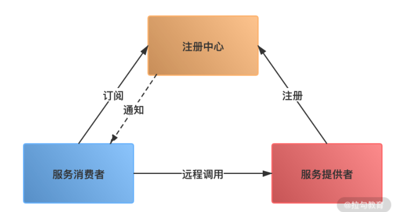

<!--more-->

## RPC

一次RPC调用的流程：

客户端将调用的类名，方法名，参数名，参数值等信息，序列化成二进制流

客户端将二进制流，通过网络发送给服务端

服务端收到二进制流后，进行反序列化，得到要调用的类名，方法名，参数名和参数值，再通过动态代理的方式，调用对应的方法得到返回值

服务端将返回值序列化，再通过网络发送给客户端

客户端反序列化，得到调用结果。

### RPC的组成

网络通信框架、网络传输协议（序列化）、服务注册和服务发现

服务启动时，服务提供者向注册中心注册服务，暴露自己的地址和端口号。注册中心会更新服务列表。

消费者启动时向注册中心请求可用的服务地址，并在本地缓存一份。

为什么要有服务注册和服务发现：方便业务水平扩展，添加新的业务只需要向注册中心注册即可。

比如etcd就可以用于服务注册和服务发现。

### RPC的性能

RPC的性能取决与网络传输和反序列化

#### 网络传输性能

选择一个高性能的IO模型，及选择IO多路复用。

网络参数调优，比如开启tcp_nodelay，及关闭nagle算法。

#### 序列化方法

序列化要考虑性能，时间和空间开销

再考虑跨平台，跨语言。

对性能要求不高，就json

有性能要求就protobuf

## brpc文档阅读

### 原子指令

>  c++ 11中引入了原子指令

#### 原子指令的作用

为了避免锁成为性能瓶颈。

为了wait-free和lock-free

| 原子指令 (x均为std::atomic)                      | 作用                                                         |
| ------------------------------------------------ | :----------------------------------------------------------- |
| x.load()                                         | 返回x的值。                                                  |
| x.store(n)                                       | 把x设为n，什么都不返回。                                     |
| x.exchange(n)                                    | 把x设为n，返回设定之前的值。                                 |
| x.compare_exchange_strong(expected_ref, desired) | 若x等于expected_ref，则设为desired，返回成功；否则把最新值写入expected_ref，返回失败。 |
| x.compare_exchange_weak(expected_ref, desired)   | 相比compare_exchange_strong可能有[spurious wakeup](http://en.wikipedia.org/wiki/Spurious_wakeup)。 |
| x.fetch_add(n), x.fetch_sub(n)                   | 原子地做x += n, x-= n，返回修改之前的值。                    |

#### 原子指令存在的问题

##### ABA问题

一个线程把数据A变为了B，然后又重新变成了A。

解决方法：加入版本号

##### memory fence

指令重排问题。

##### cacheline同步

缓存一致性使得对cache中的更改必须同步到其他cache副本中，且这个过程是原子的，造成原子指令需要等待最新的cacheline。

解决方法：

* 尽量避免共享，MPMC该SPSC
* 使用tls，比如所有线程修改一个计数器，性能很慢，因为多核在同步cacheline，因此可以改用tls，需要时再合并

##### false sharing

位于同一个cacheline中的变量可能自身不变，而其他变量频繁改变，同样要等待cacheline同步，因此频繁被多线程修改的变量应该放在独立的cacheline中。

### 雪崩

雪崩指流量过大造成请求超时，**且流量减少后仍无法恢复的现象**。

雪崩式多服务才会发生的。比如请求访问A服务，A服务又访问了B服务，这时B被打满请求，正常情况下还是不会雪崩的，但是有例外：

* 流量放大，A可能对B发起了过于频繁的基于超时的重试，造成了恶性循环：B无法恢复->A超时->A继续重试->B无法恢复
  * 解决：重试只在连接出错时发起

* A或B没限制缓冲队列的长度
  * 设置最大并发max_concurrency，防止请求积压。
  * **最大qps \* 非拥塞时的延时**来评估最大并发（little's law）

### 一致性哈希

一些场景，我们希望同样的请求落到一台服务器上，这样可以利用缓存，不同的机器也不用缓存所有内容。hash可以满足这个要求：输入x总是会发送到第hash(x) % n的服务器。但是有个缺点，m增加时，之前的发送目的地会变，如果目的地时缓存服务，所有缓存就会失效。

一致性哈希解决了这个问题，新增加服务器时，发向旧节点的请求只会有一部分转向新节点。

## 参考

[RPC]: http://learn.lianglianglee.com/%E4%B8%93%E6%A0%8F/%E9%AB%98%E5%B9%B6%E5%8F%91%E7%B3%BB%E7%BB%9F%E8%AE%BE%E8%AE%A140%E9%97%AE/23%20%20RPC%E6%A1%86%E6%9E%B6%EF%BC%9A10%E4%B8%87QPS%E4%B8%8B%E5%A6%82%E4%BD%95%E5%AE%9E%E7%8E%B0%E6%AF%AB%E7%A7%92%E7%BA%A7%E7%9A%84%E6%9C%8D%E5%8A%A1%E8%B0%83%E7%94%A8%EF%BC%9F.md

文档： https://brpc.apache.org/zh/docs/
