存储网络论文：

1. From Luna to Solar: The Evolutions of the Compute-to-Storage Networks in Alibaba Cloud
2. When Cloud Storage Meets RDMA
3. X-RDMA: Effective RDMA Middleware in Large-scale Production Environments

<!--more-->

## From Luna to Solar

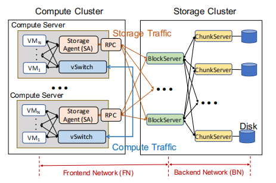

## When Cloud Storage Meets RDMA

> 这篇论文介绍了将RDMA引入盘古存储网络的相关经验。就是存储节点之间的网络通信。（NSDI 2021）

### pangu

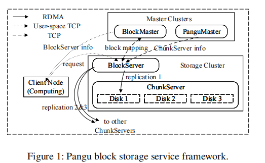

以块存储为例介绍了盘古的框架。

* 计算节点： client node，将数据组织成固定大小（32GB）的段。

* 存储节点：BlockServer和ChunkServer

计算节点中的每个段都和BlockServer对齐来进行IO处理。

在BlockServer上，一个segment被分成块并复制到ChunkServer上，ChunkServer负责块的存储和设备管理。

* Master节点：

BlockMaster：管理元数据，例如段和其所在的BlockServer之间的映射以及BlockServer的状态。

PanguMaster：管理ChunkServer的状态。

Master节点之间通过Raft协议进行同步。

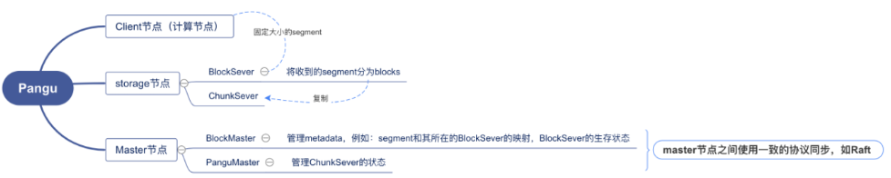

### Motivation

存储介质的快速发展使得网络成为云存储的瓶颈。具体来说是nvme的快速发展。

Non-Volatile Memory Express (NVMe) ：

- 延迟：us级
- 带宽：100Gbps

 传统网络协议栈：

* 延迟：ms级
* 带宽：几十Gbps

RDMA：在主机nic上实现整个协议栈，代替传统网络协议栈。

* 延迟：us级
* 带宽：100Gbps
* 而且cpu开销几乎为0

### 挑战

可用性、SLA（server level agreement）、未知的PFC 风暴源

### RDMA部署

#### 考虑因素

存储容量与需求匹配、控制硬件成本、优化性能、最小化可用性和SLA风险。最终的结果是在所有这些因素之间进行权衡。

#### 盘古的部署

**可用性优先原则**

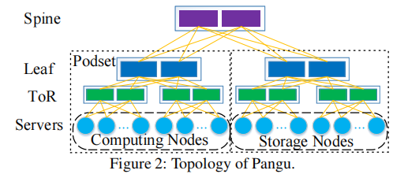

##### 网络拓扑结构

基于Clos的网络拓扑结构，与常见的**dual-home**做法相一致，署了Mellanox CX系列双端口RNIC，用两个不同的ToR交换机连接主机。

特别是，两个物理端口绑定到一个IP地址。网络连接（例如，RDMA中的QPs）在两个端口上以循环方式进行平衡。当一个端口down时，此端口上的连接可以迁移到另一个端口。

##### RDMA范围

为了最小化故障域，**只在每个podset内部和存储节点之间启用RDMA通信**。**计算节点和存储节点之间**的通信通过**user space TCP**协议。这是由于计算节点的硬件配置复杂，更新速度快。因此，TCP可以有效地作为一种独立于硬件的传输协议来应用。内核TCP由于其通用性而被选择用于跨podset通信。

### 性能优化

优化目标：最大化吞吐量的同时最小化延迟。

#### 目前的障碍

##### 存储设计

将RDMA协议栈集成在存储后端。

USSOS（用户空间存储操作系统），基于用户空间技术（如DPDK和SPDK），在盘古上使得cpu效率提高了五倍以上。

USSFS是USSOS的核心部分之一，是为ssd设计的高性能用户态文件系统。USSOS将磁盘划分为chunks，ChunkServer有对应的api来管理这些chunks，并通过轮询来感知完成事件。USSFS能比而ext4文件系统调高4-10倍的iops。

**run-to-completion模型**被认为是RDMA网络堆栈与存储堆栈集成的最佳方法。然而，这些研究是在2017年将RDMA引入盘古之后发表的。Reflex和i10侧重于远程直接I/O，而盘古的ChunkServer则作为本地存储引擎用于分布式存储。

##### 内存瓶颈

随着网络速度的提高，内存吞吐量成为系统瓶颈。

使用Intel memory Latency Checker（MLC）工具测试内存吞吐量，在测试中，最大可实现内存带宽为61GB/s，读写比为1:1。但是，盘古的平均内存吞吐量已经是29GB/s + 28GB/s = 57GB/s。这表明内存是瓶颈，而不是网络。

需要优化的是验证和数据复制的过程。目前，RDMA收到的数据分成4KB的块，每个块上会加入4B的crc和44B的间隔。在写磁盘时，还会发生数据复制。

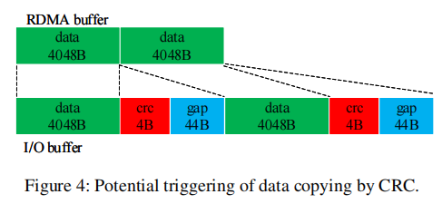

##### 大量QPs

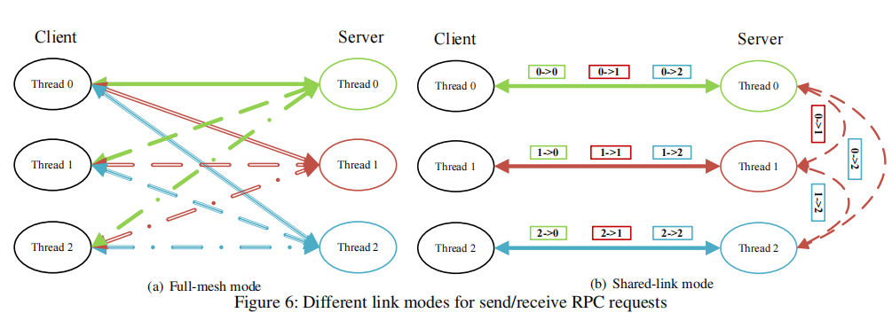

我们曾经在盘古中的运行线程之间采用全网状链接模式，以最大化吞吐量并最小化延迟。假设每个ChunkServer有14个线程，每个BlockServer有8个线程，并且每个节点都包含ChunkServer和BlockServer。对于由100个存储节点组成的集群中的全网格模式，每个节点中可能有14×8×2×99 = 2,2176个QP。由于高速缓存未命中，对于大量QP，RNIC的性能急剧下降。尤其是RX pause（即接收到的PFC暂停帧）的数量非常多。
为了解决这个问题，FaSST（一篇文章） 在线程之间共享QP，由于线程之间QP的锁争用，随后降低了CPU效率和性能。另一种启发式方法是包括专用的代理线程，该线程管理所有的接收和发送请求。但是，切换到专用代理线程或从专用代理线程切换会增加延迟。此外，很难用单个线程饱和整个网络带宽。此外，代理解决方案对基础RDMA库不透明。

#### design

最小化性能开销为设计原则。

##### storge-RDMA unified Run-to-Completion stack

存储和网络都采用了Run-to-Completion的线程模型来实现低延迟。下图展示了请求处理的过程：

* 节点收到写RPC
* RNIC通过DMA将其发送到用户空间
* RPC框架通过轮询获得请求，并将其交给ChunkServer处理。
* ChunkServer通知ussfs为请求分配一个chunk资源。
* 用户空间驱动程序与nvme ssd交互以存储数据。

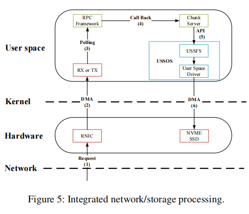

以上操作在单个服务器线程中执行，无需线程切换。

大的IO请求会被拆分成较小的请求，确保了对IO信号的快速响应。

附属工作，比如formatting和crc计算会交给非IO线程。

数据格式统一为IO vector，不需要序列化，使用scatter-gather DMA通过单个RDMA verb传输I/O vector。

不需要序列化是RDMA的语义决定的。

scatter-gather DMA可以通过单个中断传输不连续的数据。

##### 零拷贝和CRC offloading

**在盘古，数据必须在I/O路径上复制一次，因为每个4KB数据块都经过验证并附有CRC footer。**

利用**RNICs的用户模式内存注册（UMR）**特性来**避免这种数据复制。**

UMR可以通过定义适当的内存键（memory keys）将RDMA数据分散到远程端。UMR将来自发送方的连续数据重新映射到接收方的I/O缓冲区，其中每个单元包含4KB数据、4B页脚和44B的间隙。在CRC计算之后，填充的I/O缓冲区可以直接用于磁盘写入。此外，CRC计算能够被卸载到有能力的RNICs。

##### shared-link mode

这是减少盘古QP数量的关键。，shared-link在应用程序中实现，不涉及RDMA库。

### 可用性保证

#### PFC 风暴

##### 之前的研究

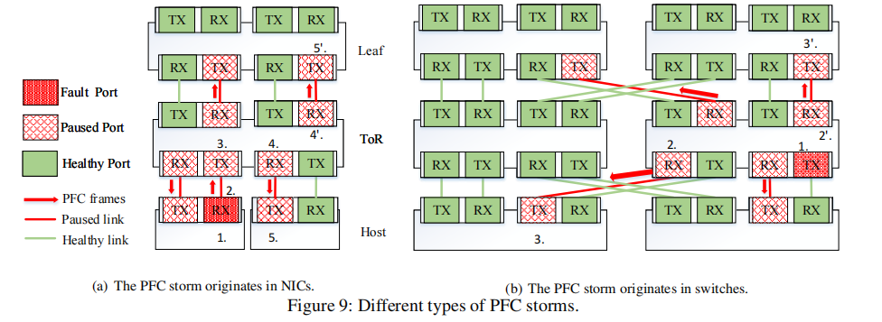

以前的一些研究中，PFC风暴来自于NICs，receiving pipeline存在bug，如上图(a)描述：

* bug减慢了NIC接收，缓冲区很快被填满
* 为了防止丢包，NIC将PFC pause发送到其ToR交换机
* ToR交换机暂停传输
* ToR交换机的缓冲区满，并且开始发送PFC pause
* 受害者的端口暂停，无法传输

##### 盘古中的PFC风暴

盘古在使用RDMA时，遇到了不同类型的PFC风暴，根本原因是特定供应商的交换机硬件存在bug，上图（b）中描述：

假设bug发生在ToR交换机的下行端口，the bug  reduces the switching rate of the lossless priority queues to a very low rate.

* 由于传输速率低，交换机的缓冲区已满
* 交换机将PFC pause发送到连接的端口
* 附加交换机和NIC停止传输
* 连接到这个ToR交换机的leaf交换机和NIC收到连续的pause frame，造成了风暴。

##### 之前的解决方案

Guo et al.构建了一个基于NIC的看门狗来持续监控传输的暂停帧，必要时禁用PFC机制。该方案不能完全解决开关产生的PFC风暴问题。特别是，网卡上的TX pause看门狗将不工作，因为**NIC只接收来自交换机的PFC风暴**。

这种新型的PFC风暴使Guo等人的解决方案失效，该方案的重点是隔离PFC暂停源，以防止风暴扩散。当源是ToR交换机时，此方法失败，因为ToR中的所有主机都被风暴暂停。

##### 盘古的解决方案
我们处理PFC风暴的设计原则是escape as far as possible。

在盘古，每个网卡监控接收到的PFC暂停帧。对于连续暂停帧，NIC确定是否存在PFC风暴。在PFC风暴的情况下，管理员可以使用两种解决方案。

解决方法1：shutdown。关闭受PFC风暴影响的网卡端口数秒。dual-home拓扑为PFC风暴提供了一个紧急逃生通道，从而QP将断开连接并通过另一个端口再次连接。 此方法与优化一起使用，以减少QP超时的时间。 尽管此解决方案简单有效，但由于带宽损失了一半，因此不够理想。

解决方法2：RDMA/TCP切换。在这个解决方案中，PFC风暴中受影响的RDMA链路被切换到TCP链路。与关机解决方案相比，它会折中了一个更复杂的过程，但它能够保持可用带宽。我们检测PFC风暴中受影响的RDMA链路。在每 T ms，每个工作线程选择一个服务器，并通过RDMA和TCP链接分别ping它的所有线程。如果RDMA ping失败并且TCP ping成功超过F次，则此RDMA链路上的流量将切换到TCP链路。一旦RDMA ping成功超过S次，交换的TCP链路上的流量将切换回RDMA链路。

### 参考

https://blog.csdn.net/Sylvia_Wu51/article/details/117325150

## X-RDMA

> 介绍了X-RDMA中间件，轻量，但功能齐全。RDMA的特点：超低延迟（2us）,高吞吐量，支持零拷贝和kernel bypass，减少传统协议栈的开销，例如上下文切换、协议处理和数据复制。

###  背景

#### RDMA编程模型

RDMA支持两种常用的模式：可靠连接（RC）和不可靠数据报（UD）。

 RDMA 有两种通信范式：

内存语义（单向）： Write/Read/Atomic 以访问远程内存而无需对等方 CPU 参与。

类似传统以太网（双向）：Send/Recv 。 

RDMA中的抽象结构：Queue Pair (QP) 代表一对完成队列（CQ）：发送队列（SQ）和接收队列（RQ）。

* 在建立连接之前，节点应该创建一个受保护域（PD），然后使用这个 PD 注册一个或多个内存区域MR（memory region）和一个唯一的远程密（rkey）。 仅当 rkey 正确时，才允许访问受 MR 保护的内存。

* 每个 RDMA 操作都需要向相应的 CQ 发布工作请求 WR（work request），每个 CQ能容纳的WR有一个深度上限。

*  在双向模式下，接收方应预先将 WR 发送到其 RQ，然后发送方发送请求并指示有效负载的缓冲区地址。

* 最后，接收方应轮询此 RQ 以确保数据包到达。

* 在完成一个 RDMA 操作后，会生成一个完成队列条目 (CQE)。 
* 在单边模式下，只有发送方需要发布一个WR。 
* 单侧 RDMA 操作总是比双侧 RDMA 操作具有更好的性能

* RDMA Write 和 Send 都支持额外的即时数据，可以立即用 uint_32 数据通知接收方。
* 总之：RDMA 程序需要一个复杂的仪式：初始化上下文、注册内存、建立连接、交换元数据、创建 QP、修改 QP 以“准备发送/接收”，最后发送/轮询 WR/CQE。

#### Alibaba中的网络部署

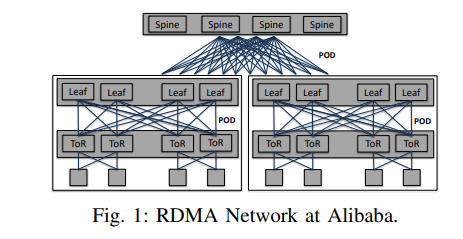

Top of Rack (ToR)

一个典型的数据中心包含三层： the spine layer, the leaf layer, and the ToR layer。

通常的配置是：四十个节点连接到一个 ToR 交换机。 ToR 交换机连接到leaf交换机，leaf交换机连接到spine交换机。

#### RDMA use case

阿里巴巴数据中心的三个代表应用：增强型固态硬盘 (ESSD)、X-DB 和 PolarDB。

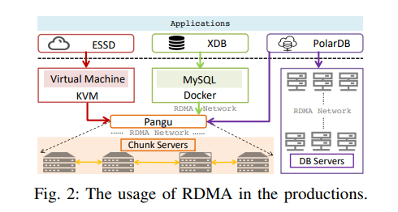

盘古的每台服务器上有两个关键组件：chunkserver和blockserver

每个block server从前端（例如ESSD中的虚拟机）中接收数据，然后通过全网状（full-mesh）RDMA通信将二或三个副本分发到不同的chunkserver上。

目前阿里巴巴有两个核心产品使用了盘古：ESSD和X-DB。

ESSD 的一半 I/O 路径是从具有 QEMU/KVM 虚拟化的虚拟机到盘古。 X-DB 是一个分布式数据库，它为交易系统（例如在线购物网站）提供高可用性、强 ACID 和水平可扩展性。 X-DB的前端是Docker中的MySQL实例，使用RDMA连接盘古。 PolarDB则不同，它的实现有两种模式：一种是针对自己的后端，另一种是针对盘古。 两种模式都使用RDMA。

### 大规模部署的问题

#### 编程模式复杂

原生 RDMA 库（即 libverbs）比传统的套接字编程更复杂。 需要对RDMA库API进行适当的简化和分类。

#### 扩展性挑战

* **RDMA资源占用会随着集群规模的扩大而迅速增加**。RDMA最大的优势之一是零拷贝，但单边模式需要按需分配内存，即在每个连接开始任何传输之前就预留更多的内存。 相反，在 TCP/IP 中，内核可以自动管理缓冲区。
* **大规模 RDMA 网络中普遍存在拥塞和大量 incast** 。我们生产服务器中的典型场景是盘古或 ESSD 等分布式存储，并且始终遵循 incast 流量模式 。此外，类似于 Facebook 中的部署 ，网络工作负载总是在饱和和不饱和之间切换，它很容易使 RNIC 因拥塞而过载。另一方面，拥塞也会导致抖动。尽管有微调的 DCQCN，但由于大 - 大小消息阻塞 RNIC 处理 ，在较大的集群中观察到一些严重的抖动情况。在生产环境中，严重的抖动会导致 70% 的吞吐量下降（从 3.4 GBps 到 1.1 GBps）和 2×∼15× 的延迟。
* **连接建立速度慢**会延迟恢复并增加集群返回稳定状态的时间。使用 RDMA_CM的 RDMA 的连接建立时间约为 **4 毫秒**，而 TCP 几乎为 **100 微秒**。

#### 鲁棒性低

* 发送方很难通过RDMA单方面操作了解接收方应用程序的处理进度, 发送方不知道进度并继续发送，导致RNR 错误，增加重传率，从而浪费网络带宽和 CPU 周期。
* 原生 RDMA 库和 RNIC 无法确保对等端始终处于活动状态。

#### bug和性能干扰

需要做一些运维工具

#### Conditional Performance Maximization

满足需求的同时最大化性能。也是设计X-RDMA的原则

### X-RDMA设计

#### overall architecture

三层，16个主要组件：

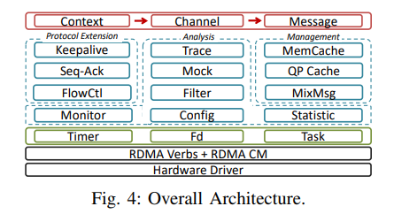

**最上层**

提供了三个抽象的数据结构：context, channel, and msg.

八个主要api：

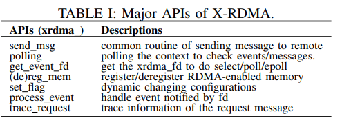

**中间层**

X-RDMA 实现了**可靠协议扩展**、**资源管理**、**流量控制**和**性能分析**组件。

**底层**

timer、fd、task这些是X-RDMA的底层。

总的来说，这些组件分为四个独立的系统，为不同的开发者带来了便利，牺牲了不常用的功能，以避免复杂的编程抽象陷阱。

#### 线程模型

由于使用现代 RNIC 的延迟可以低至纳秒级，因此即使在最坏的情况下，数据平面上的所有操作也可以在恒定时间 (O(1)) 内完成，以匹配较低的网络延迟。

X-RDMA 采用lock -free、atomic-free 和 no-syscall 策略，以减少用户空间和内核空间之间总线锁定和上下文切换的开销。避免使用任何锁，只允许非关键路径上的原子操作和系统调用。

X-RDMA的线程模型设计原则一般是run-to-complete。高层资源，如context、channel、memCache、QP cache等，都是在per thread级别进行操作，避免线程间同步。这些资源 将在每个上下文中仅初始化一次。X-RDMA 使用混合轮询方式，其中一个线程首先使用 epoll，然后在触发消息或定时器事件时切换到忙轮询，类似于 Linux 内核中的 NAPI。X-RDMA向per-thread timer注册一些事件，包括keepAlive、statistic等。在空闲时间，轮询模式可根据应用程序的方案进行配置。

#### 消息模型

多进程之间采用请求-响应的方式进行通信。

X-RDMA 采用混合消息策略，包括两种模式：用于最大化性能的小消息模式和用于减少内存占用的大消息模式。荷载有个阈值S（默认4KB），小于S视为小消息。

区分两种模式的原因：buffer预分配阶段带来的较大的开销。

**Small Messages v.s.Large Messages**

对于小消息，发送方直接向接收方发送数据，从而触发接收WR。每次数据传输只需要一次RDMA操作。但是，接收方需要预先分配足够的缓冲区。 因此，小消息的payload size不能太大，否则会消耗更多的缓冲区，从而导致内存消耗高。

对于大消息，发送方会先发送一个RDMA Send WR来唤醒接收方。接收方准备 RDMA enabled buffers on demand。我们称这个阶段为buffer preparation phase。之后，实际的数据传输依赖于发送端的RDMA写/读。在这种模式下，每次数据传输至少需要两次RDMA操作。 在生产环境中，小消息比通常传输时间较长的大消息对高延迟更敏感。在某种程度上，大消息可以通过准备好的缓冲区来容忍延迟的一点点降低。

**Read Replace Write**

X-RDMA 支持内置 RPC。在大多数 RPC 实现中，接收方将响应发回给发送方。大尺寸响应是禁止处理的。由于发送方不知道响应的有效负载大小，发送方 端应该为接收端保留“超大”缓冲区，以便通过 RDMA Write 将响应写回。更糟糕的是，在 RPC 场景中，RDMA 出站操作（Write）总是比入站操作（Read）慢 接收方。**为了解决这个问题，X-RDMA 允许发送方直接处理响应。接收方应该让发送方知道响应的大小和地址，发送方将通过 RDMA Read 被动获取响应 。**

#### Work Flow

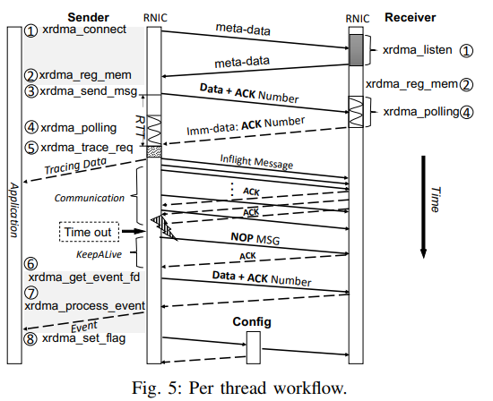