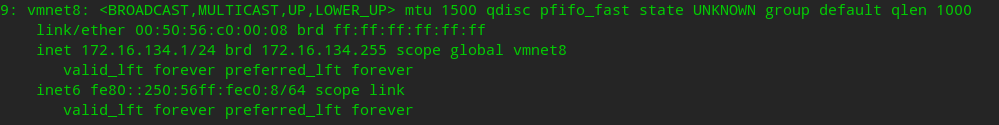
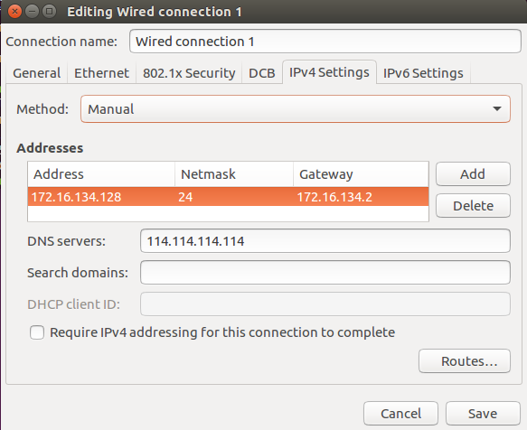
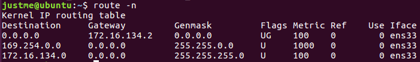

虚拟机静态ip配置，网络排查

<!--more-->

## 静态IP配置

虚拟机设置为NAT模式

在宿主机下可查看虚拟网卡：

然后在虚拟机下配置静态ip：

用`route -n`查看路由表确定网关是172.16.134.2

## 网络故障排查

先`ping www.baidu.com`

如果ping不通，试试ping百度的ip，如果ping通了就是dns的问题。

如果ip也ping不同，可能就是网关的问题，ping网关试试，再进行配置。

如果`ping www.baidu.com`是正常的，但是浏览器访问不正常，curl也不正常，检查是不是代理的配置问题。

