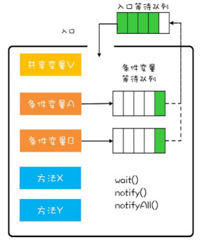

<!--more-->

## 条件变量

```c++
//基本用法
#include <condition_variable>
std::condition_variable cond_;
std::unique_lock <std::mutex> lock(mutex_);
cond_.wait(lock);
cond_.notify_all();
cond_.notify_one();
```

## 管程

> 管程用来管理类额成员变量和成员方法，让这个类是线程安全的。下面以阻塞队列的实现为例
>
> 管程解决了并发编程中的俩个核心问题：互斥，同步

* 互斥：同一时刻只允许一个线程访问共享资源
* 同步：线程之间的通信，协作
* 管程如何解决互斥问题：mutex，将共享变量和对共享变量的操作同一封装了起来，互斥锁就是管程模型的入口
* 管程如何解决同步问题：引入条件变量



### 阻塞队列

首先是一个队列，有插入和删除操作。当队列中没有元素时，弹出操作将会被阻塞，直到有元素被插入时才会被唤醒。队列满时，队列的插入操作被阻塞，直到有元素被弹出后才会被唤醒。

阻塞队列的应用：在线程池实现中，使用阻塞队列来保存任务，直到线程空闲之后从阻塞队列弹出任务来执行。一旦队列为空，线程就会被阻塞，直到有新任务被插入为止。

```c++
template <typename T, typename D = std::deque<T> >
class ThreadQueue {
 public:
  typedef D queue_type;
  bool pop_front(T& t, size_t millsecond);
  void push_back(T& t);
  void push_front(T& t);
  void swap(queue_type& q);
  void clear();
  bool empty();
  auto begin();
  auto end();

 protected:
  queue_type queue_;
  size_t size_;

 private:
  std::mutex mutex_;
  std::condition_variable cond_;
};

template <typename T, typename D>
bool ThreadQueue<T, D>::pop_front(T& t, size_t millsecond) {
  std::unique_lock<std::mutex> lock(mutex_);
  while (queue_.empty()) {  //为什么if不行？
    cond_.wait(lock);
  }

  assert(!queue_.empty());
  t = queue_.front();
  queue_.pop_front();
  size_--;
  return true;
}

template <typename T, typename D>
void ThreadQueue<T, D>::push_back(T& t) {
  std::unique_lock<std::mutex> lock(mutex_);
  queue_.push_back(t);
  size_++;
  cond_.notify_one();
}

template <typename T, typename D>
void ThreadQueue<T, D>::push_front(T& t) {
  std::unique_lock<std::mutex> lock(mutex_);
  queue_.push_front(t);
  size_++;
  cond_.notify_one();
}

template <typename T, typename D>
void ThreadQueue<T, D>::clear() {
  std::unique_lock<std::mutex> lock(mutex_);
  queue_.clear();
  size_ = 0;
}

template <typename T, typename D>
bool ThreadQueue<T, D>::empty() {
  return queue_.empty();
}

template <typename T, typename D>
auto ThreadQueue<T, D>::begin() {
  std::unique_lock<std::mutex> lock(mutex_);
  return queue_.begin();
}

template <typename T, typename D>
auto ThreadQueue<T, D>::end() {
  std::unique_lock<std::mutex> lock(mutex_);
  return queue_.end();
}

template <typename T, typename D>
void ThreadQueue<T, D>::swap(D& q) {
  std::unique_lock<std::mutex> lock(mutex_);
  // if(queue_.empty()) {
  //     cond_.wait(lock);
  // }
  q.swap(queue_);  //交换两个队列的 内容
}
```


## 参考

* 管程：https://zhuanlan.zhihu.com/p/99054391

