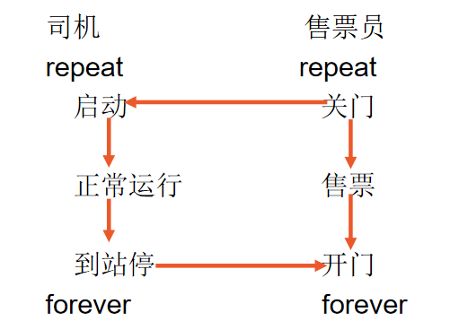

进程管理——同步作业

<!--more-->

* 图书馆有N个座位，一张登记表，要求(1)阅读者进入时登记，取得座位号；(2)出来时注销。请用P、V操作描述一个读者的使用过程。

  ```c
  // 进入时为生产者 出来时为消费者
  semaphore s = 0; // 已经登记量
  semaphore empty = N; // 空余量
  semaphore mutex = 1; // 互斥信号量
  void login()
  {
      while (true)
      {
          P(empty); // 空余量减少1
          P(mutex); // 互斥
          // 登记
          V(mutex);
          V(s); // 已登记量增加1
      }
  }
  
  void logout()
  {
      while (true)
      {
          P(s); // 已登记量减少1
          P(mutex); // 互斥，（这里互斥的原因是不可能为多个人注销，或者在注销的时候为另一个人登记，因此申请互斥信号量）
          // 注销
          V(mutex);
          V(empty); // 空余量增加1
      }
  }
  ```

  

* 请用P、V操作描述下列过程：

  ```c
  // 假设一开始车停下，门开启
  semaphore stop = 1; // 停车信号量
  semaphore closedoor = 0; // 关门信号量
  
  void drive() //司机
  {
  	while (true)
  	{
  		P(closedoor); // 检测到门已关
  		// 启动, 正常运行
  		V(stop); // 停下
  	}
  }
  
  void seller() // 售票员
  {
  	while (true)
  	{
  		P(stop); // 检测到车已停
  		// 售票
  		V(closedoor); // 关门
  	}
  }
  ```


* 4个并发执行的进程P1、P2、P3和P4合作解决数据计算问题：Y(i)=X(i)2+X(i)3
    	(1)P1不断产生随机数并放入的缓冲区A中；
    	(2)P2、P3分别读取缓冲区A中的数据并计算其平方值、立方值，然后分别放入缓冲区B、C中；
    	(3)P4读取缓冲区B、C中的数据，将其相加，并输出；
   	(4)缓冲区A、B、C的容量为1。
    		用P，V操作实现其同步过程。

  ```c
  semaphore A = 1; // 缓冲区A
  semaphore B = 0; // 缓冲区B
  semaphore C = 0; // 缓冲区C
  semaphore s12 = 0; // P1与P2同步
  semaphore s13 = 0; // P1与P3同步
  semaphore s24 = 0; // P2与P4同步
  semaphore s34 = 0; // P3与P4同步
  void P1()
  {
      while (true)
      {
          P(A); // 上一次计算是否完毕
          // 随机产生数据放入缓冲区A
          V(s12); V(s13); // 通知P2和P3
          V(B); V(C);
      }
  }
  void P2()
  {
      while (true)
      {
          P(s12); // 收到P1的信号
          P(B); // 申请缓冲区B的资源
          // 读取缓冲区A中存放数据计算其平方值 写入缓冲区B
          V(s24); // 通知P4
      }
  }
  void P3()
  {
      while (true)
      {
          P(s13); // 收到P1的信号
          P(C); // 申请缓冲区C的资源
          // 读取缓冲区A中存放数据计算其立方值 写入缓冲区C
          V(s34); // 通知P4
      }
  }
  void P4()
  {
      while (true)
      {
          P(s24); // 收到P2的通知
          P(s34); // 收到P3的通知
          // 将缓冲区B和C中的数值相加并输出
          V(B); // 缓冲区B释放
          V(C); // 缓冲区C释放
          V(A); // 本次计算完毕 可以写入新的i
      }
  }
  ```

  

* 桌上有一空盘，最多允许存放一只水果。爸爸可向盘中放一个苹果或放一个桔子；儿子专等吃盘中的桔子，女儿专等吃苹果。用P、V操作实现爸爸、儿子、女儿三个并发进程的同步。

  ```c
  semaphore plate = 1; // 盘子是否可以放入水果
  semaphore orange = 0; // 盘子中的桔子数 
  semaphore apple = 0; // 盘子中的苹果数
  
  void dad()
  {
      while (true)
      {
          result = prepare_fruit(); // 准备水果 result为水果类型
          P(plate); // 放入水果
          // 将水果放入盘子
          if (result == apple) 
              V(apple); // 苹果数+1
          else V(orange); // 桔子数+1
      }
  }
  void daughter()
  {
      while (true)
      {
          P(apple); // 盘中是否有苹果
          // 拿走苹果
          V(plate); // 盘空
      }
  }
  void son()
  {
      while (true)
      {
          P(orange); // 盘中是否有桔子
          // 拿走桔子
          V(plate); // 盘空
      }
  }
  ```

  

* 用P、V原语实现东西向单行道上车辆的正确行驶，要求：(1)当有车自东向西方向（或自西向东方向）行驶，另一方向上的车辆须等待；(2)同一方向上的车可以连续通过；(3)当某一方向上已经没有车辆在单行道上行驶时，另一方向上的车辆即可以进入单行道。

  ```c
  semaphore mutex_dir = 1; // 互斥东西方向
  semaphore mutex_eastc = 1;
  semaphore mutex_westc = 1;
  int east_count = 0, west_count = 0;
  void east_to_west()
  {
      while (true)
      {
          P(mutex_eastc); 
          east_count++; 
          if (east_count == 1) P(mutex_dir); // 当前方向是否可以通过
          V(mutex_eastc);
          // 从东向西通过
          P(mutex_eastc);
          east_count--;
          if (east_count == 0) V(mutex_dir); // 单行道上已空 释放方向
          V(mutex_eastc);
      }
  }
  void west_to_east()
  {
      while (true)
      {
          P(mutex_westc);
          west_count++;
          if (west_count == 1) P(mutex_dir); // 当前方向是否可以通过
          V(mutex_westc);
          // 从西向东通过
          P(mutex_westc);
          west_count--;
          if (west_count == 0) V(mutex_dir); // 单行道上已空 释放方向
          V(mutex_westc);
      }
  }
  ```

  

* 某寺庙，有小、老和尚若干，有一水缸，由小和尚提入水缸供老和尚饮用。水缸可容10桶水，水取自同一井中。水井径窄，每次只能容一个水桶取水，水桶总数为3个。每次入、取缸水仅为1桶，且不可同时进行。试给出有关老和尚从缸取水和小和尚打水、入水的算法描述。

  ```c
  semaphore sj = 1; // 水井
  semaphore sg = 1; // 水缸
  semaphore st = 3; // 可用水桶数
  semaphore water = 0; // 已入水数
  semaphore empty_w = 10; // 可入水数
  
  void drwater() // 小和尚打水入水
  {
      P(empty_w); // 是否有空位可以入水
      P(sj); // 水井是否可用
      P(st); // 是否有水桶
      // 打水
      V(sj); // 释放水井
  
      P(sg); // 水缸是否可用
      // 入水
      V(st); // 可用水桶数增加1
      V(sg); // 释放水缸
      V(water); // 已入水数增加1
  }
  
  void qwater() // 老和尚取水
  {
      P(water); // 是否有水可以取
      P(sg); // 水缸是否可用
      P(st); // 是否有水桶
      // 取水
      V(sg); // 释放水缸
      V(st); // 可用水桶数增加1
      V(empty_w); // 可入水数增加1
  }
  ```

  

