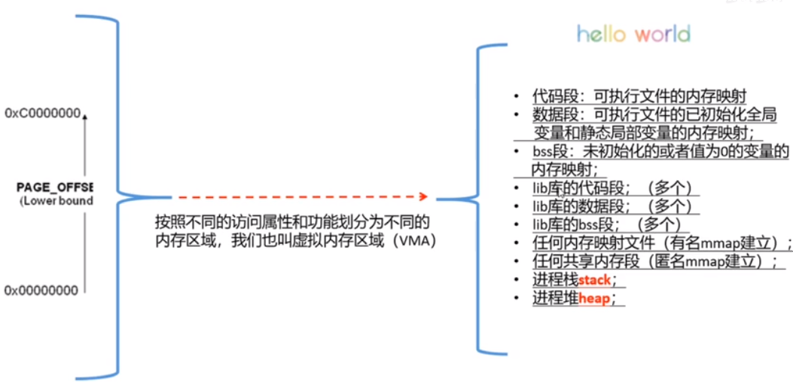

<!--more-->

## 基本特点

Linux是单内核的（也叫宏内核），较少了消息传递的开销（函数调用形式），性能会更好，但是可扩展性就会比较差。为了改善单内核的可维护性，Linux提出了内核模块机制，用户可以在不对内核重新编译的情况下，动态向内核装入和移除模块。

微内核和宏内核的根本区别是，微内核是进程间通信，宏内核走函数调用。

模块的本质是一种目标对象文件，不能独立运行，但是其代码可以在运行时连接到系统中作为内核的一部分运行，从而动态扩展内核的功能。

对比应用程序和内核模块

| C语言应用程序 | 内核模块程序 |                   |
| ------------- | ------------ | ----------------- |
| 使用函数      | Libc库       | 内核函数          |
| 运行空间      | 用户空间     | 内核空间          |
| 运行权限      | 普通用户     | 超级用户          |
| 入口函数      | main()       | module_init()     |
| 出口函数      | exit()       | module_exit()     |
| 编译          | Gcc –c       | Makefile          |
| 连接          | Gcc          | insmod            |
| 运行          | 直接运行     | insmod            |
| 调试          | Gdb          | kdbug, kdb,kgdb等 |

* 内核开发中没有libc，标准头文件。考虑大小，内核页禁止患处，常驻内存，不能太大。

* 应使用GNU C，不完全符合ANSI C标准

* 关注的语法特性

  * inline c99标准引用
  * 内联汇编：asm volatile(......)
  * 分支优化预测，likely、unlikely给编译器提示，这是kernel代码中定义的宏，c++20才作为关键字

* 没有内存保护机制

* 不要轻易在内核中使用浮点数

  * 内核态进程使用浮点操作时，内核会完成从整数模式到浮点操作模式转换
    * 通常时通过捕获陷阱进行转换

* 内核本身不能陷入，需要人工保存、恢复浮点寄存器。

* 函数调用栈很小，所以别用局部大数组

  * 默认情况下，64位栈大小为8kb

  * 不要使用局部数组、不要使用递归调用

    * 非要递归，写尾递归

    * 尾递归

    * ```c
      f(int n) {
      	if(n==1) return 1;
      	return n*f(n-1);
      }
      
      改写
      f(int res, int n) {
      	if(n==0) return res;
      	return f(res*n,n-1);
      }//编译器会自动展开成循环
      ```

likely宏

```c++
 void func1(int i) {
     if(likely(i > 8)) {
         i = 10;
         printk("%d", i);
     }
     else {
         i = 2;
         printk("%d", i);
     }
 }
 
 void func2(int i) {
     if(unlikely(i > 8)) {
         i = 10;
         printk("%d", i);
     }
     else {
         i = 2;
         printk("%d", i);
     }
 }
 
```


```assembly
(gdb) disass func1
Dump of assembler code for function func1:
   0x00000000000001e5 <+0>:	callq  0x1ea <func1+5>
   0x00000000000001ea <+5>:	push   %rbp
   0x00000000000001eb <+6>:	mov    %rsp,%rbp
   0x00000000000001ee <+9>:	cmp    $0x8,%edi //8和edi比较
   0x00000000000001f1 <+12>:	jle    0x206 <func1+33> //小于等于（小概率）发生跳转
   0x00000000000001f3 <+14>:	mov    $0xa,%esi
   0x00000000000001f8 <+19>:	mov    $0x0,%rdi
   0x00000000000001ff <+26>:	callq  0x204 <func1+31>
   0x0000000000000204 <+31>:	jmp    0x217 <func1+50>
   0x0000000000000206 <+33>:	mov    $0x2,%esi
   0x000000000000020b <+38>:	mov    $0x0,%rdi
   0x0000000000000212 <+45>:	callq  0x217 <func1+50>
   0x0000000000000217 <+50>:	pop    %rbp
   0x0000000000000218 <+51>:	retq   
End of assembler dump.
(gdb) disass func2
Dump of assembler code for function func2:
   0x0000000000000219 <+0>:	callq  0x21e <func2+5>
   0x000000000000021e <+5>:	push   %rbp
   0x000000000000021f <+6>:	mov    %rsp,%rbp
   0x0000000000000222 <+9>:	cmp    $0x8,%edi //8和edi比较
   0x0000000000000225 <+12>:	jle    0x23a <func2+33>  //编译器问题没起作用，以前的编译器是jg,所以现在编译器大概不支持了。一般默认if里面直接跟的是小概率事件
   0x0000000000000227 <+14>:	mov    $0xa,%esi
   0x000000000000022c <+19>:	mov    $0x0,%rdi
   0x0000000000000233 <+26>:	callq  0x238 <func2+31>
   0x0000000000000238 <+31>:	jmp    0x24b <func2+50>
   0x000000000000023a <+33>:	mov    $0x2,%esi
   0x000000000000023f <+38>:	mov    $0x0,%rdi
   0x0000000000000246 <+45>:	callq  0x24b <func2+50>
   0x000000000000024b <+50>:	pop    %rbp
   0x000000000000024c <+51>:	retq   
End of assembler dump.
```


内核模块机制：

首先需要了解内核符号表的概念，内核符号表存放了所有模块可以访问的符号及相应的地址，模块声明的任何全局符号都成为内核符号表的一部分。

内核符号表处于内核代码段的_ksymtab部分，其开始地址和结束地址是由C编译器所产生的两个符号来指定：\__start_ksymtab和\_stop_ksymtab。

内核模块没有main函数，通过回调方式运行

回调：向内核注册函数，然后应用程序触发函数的执行，比如驱动程序在初始化时，向内核注册处理某个设备写操作的函数，当应用程序使用write系统调用写该设备时，内核就会调用注册的回调函数。

## 内核模块makefile编写

```makefile
ifneq ($(KERNELRELEASE),)
#检查KERNELRELEASE是否已经被定义
        obj-m := PrintModule.o
        #说明有一个模块需要从PrintModule.o中构造，而该模块名为PrintModule.ko
        PrintModule-objs := DriverMain.o DriverFileOperations.o
        #说明PrintModule由多个目标文件构成，一个.o文件就是一个编译单元,一个.c生成一个.o
EXTRA_CFLAGS := -DTEST_DEBUG -ggdb -O0
#DTEST_DEBUG 是代码中定义的debug宏
#-ggdb 加入调试信息
#-O0 优化级别，没有优化
#-O1 基本优化级别
#-o2 主要优化时间效率，不考虑生成的目标文件大小
#-O3 最高优化级别，一般不用
#-Os 优化生成的目标文件大小，并且激活-O2中不增加代码大小的优化选项
#-Og gcc4.8中引入的优化级别。编译快，同时合理提供运行效率。
else
        KERNELDIR ?= /lib/modules/$(shell uname -r)/build 
        #?=表示如果KERNELDIR还没赋值，则赋值
        #$(shell uname -r) 获取当前内核版本号
        #/lib/modules/$(shell uname -r)存放编译好的内核模块符号信息
        #build是一个符号连接，指向了/usr/src/linux-headers-xxxxx-generic，里面包含了内核头文件，用于编译内核模块的各个Makefile
        PWD := $(shell pwd)
        # 保存当前路径
default: #default都会执行
        $(MAKE) -C $(KERNELDIR) M=$(PWD) modules
        #MAKE：就是执行make
        #-C:切换目录到$(KERNELDIR)，因为这里有顶层makefile文件，编译内核模块之前需要对这个顶层的内核模块进行处理
        #在顶层makefile文件中，就定义了KERNELRELEASE
        #KERNELRELEASE = $(shell cat include/config/kernel.release 2> /dev/null)
        #M表示在构造内核模块之前，回到目录PWD，再次执行当前目录下的Makefile
        rm *.order *.symvers *.mod.c *.o .*.o.cmd .*.cmd .tmp_versions -rf
endif
```

### 优化和调试级别

优化

* -O0 优化级别，没有优化
* -O1 基本优化级别
* -O2 主要优化时间效率，不考虑生成的目标文件大小
* -O3 最高优化级别，一般不用
* -Os 优化生成的目标文件大小，并且激活-O2中不增加代码大小的优化选项
* -Og gcc4.8中引入的优化级别。编译快，同时合理提供运行效率。

调试级别

* -g 利用操作系统native format生成调试信息，调试器可以直接使用，默认是-g2
  * -g2 包含扩展的符号表，行号，局部或外部变量信息
  * -g3包含2中的所有调试信息，外加源码中定义的宏
* -ggdb 是gcc为gdb专门生成的调试信息，只能用gdb调，默认是-ggdb2
  * -ggdbx，x跟在-gx的解释一样
* -g0其实是不包含调试信息，等于不使用-g
* -g1不包含局部变量和行号有关的调试信息，因此只能用于回溯跟踪（函数调用历史）和堆栈转储

## 内核源码各目录功能

du -sh 源码大概800mb

arch是体系结构相关的代码

arm/boot是启动相关的代码

mach-xxx开头是不同公司针对硬件平台增加的代码，比如三星的飞思卡尔的，不同的硬件平台配置不同。

/Documentaion 是内核说明

/firmware 固件芯片相关

/init 内核初始化代码，汇编代码会调用start_kernel函数，do_mount挂载文件系统

/usr是测试代码，不用看了

/block 块设备相关代码

/drivers 是驱动代码，占据了内核代码的一半以上。

/fs文件系统代码

/ipc 进程通信相关代码

/kernel 内核核心通用代码，比如进程

/arch/arm/kernel 是体系结构相关的内核代码，kernel里的代码会调用这里面的

/net 网络子系统相关代码

/crypto 加密相关

/sound 声卡相关

/include 内核头文件相关

/lib 通用库，给内核各个模块使用

/mm 内存管理，页表页表管理等等

/scripts 编译内核的脚本

## 编译内核

顶根目录下有一个makefile文件，各个子目录下也有makefile文件。

顶层makefile通过include子目录下的makefile文件。

顶层makefile首先会include体系结构相关的makefile文件

```makefile
SRCARCH 	:= $(ARCH)
...
include arch/$(SRCARCH)/Makefile
```

子目录，顶层makefile会调用这些子目录的makefie：

```makefile
init-y		:= init/
drivers-y	:= drivers/ sound/ firmware/
net-y		:= net/
libs-y		:= lib/
core-y		:= usr/
virt-y		:= virt/
```

比如`drivers/tty`里的，Kconfig文件是make menuconfigkey看见的配置文件，makefile里面就是那些文件应该编译成ko或者哪些不需要编译。

里面都是obj打头的变量。-y表示编译到内核里，-m表示编译成驱动的形式

```
```

Kconfig支持编译到内核里还是编译成内核模块还是不编译。-y表示编译到内核里，-m表示编译成驱动的形式

obj-y += 目录 意思是到下级目录继续编译

build-in.o是这个目录下所有.o文件的链接文件

然后顶层makefile再把所有build-in.o链接成内核镜像

定义lds一个链接文件，位于arch/$(SRCARCH)/kernel下。

```
export KBUILD_LDS          := arch/$(SRCARCH)/kernel/vmlinux.lds
```

```makefile
vmlinux-dirs	:= $(patsubst %/,%,$(filter %/, $(init-y) $(init-m) \
		     $(core-y) $(core-m) $(drivers-y) $(drivers-m) \
		     $(net-y) $(net-m) $(libs-y) $(libs-m) $(virt-y)))

vmlinux-alldirs	:= $(sort $(vmlinux-dirs) $(patsubst %/,%,$(filter %/, \
		     $(init-) $(core-) $(drivers-) $(net-) $(libs-) $(virt-))))

init-y		:= $(patsubst %/, %/built-in.a, $(init-y)) #内置函数
core-y		:= $(patsubst %/, %/built-in.a, $(core-y))
drivers-y	:= $(patsubst %/, %/built-in.a, $(drivers-y))
net-y		:= $(patsubst %/, %/built-in.a, $(net-y))
libs-y1		:= $(patsubst %/, %/lib.a, $(libs-y))
libs-y2		:= $(patsubst %/, %/built-in.a, $(filter-out %.a, $(libs-y)))
virt-y		:= $(patsubst %/, %/built-in.a, $(virt-y))
```

`KBUILD_CFLAGS += -I/root/kernel-ml/include`这样可以添加头文件


为了方便，下载与当前系统相同的内核版本进行修改，这样编译不容易出错。然后用当前系统的config文件基础上进行。编译内核的时候为了方便调试尽量不要优化。-02改成-O1。-O0会编不过

```shell
cp /boot/config-xxxx-generic /pwd/.config
make oldconfig
make-kpkg clean
make-kpkg --initrd kernel-headers kernel_image
#记得安装apt install kernel-package, libncurses6-dev等
#然后会生成headers.deb和image.deb,在内核源码的上层目录下。
dpkg -i *.deb
reboot
```

编译成功后的效果：

* 安装了linux-headers文件

  * ```shell
    ls /usr/src/
    #里面会有对应版本的headers文件夹
    #里面存放了用来编译内核模块的内核makefile，包括顶层makefile,用来编译内核模块
    #include里面就是头文件
    ```

* `/lib/modules`新增了对应版本的文件夹，里边的build、source指向了刚刚编译内核的目录

* `/boot`目录下增加了config-xxxx，inintrd.img，符号表信息System.map-xxx，内核映像vmlinuz-xx（理解成内核的可执行文件）

* 启动项里也有增加，`vi /boot/grub/grub.cfg`

什么是initrd

系统启动的过程中，一个重要的任务就是mount根文件系统，里面存放了大部分系统程序

而要mount根文件系统，必须有磁盘的驱动程序和文件系统驱动程序

由于硬件和兼容性的限制。内核影响的大小不能太大

Linux需要尽可能的支持多的硬件设备，但是由于内核映像大小的的限制，不能随便把硬件设备驱动程序放入内核映像中。

于是将各种硬件设备、文件系统的驱动程序模块化。发行商提供内核映像、系统安装程序，系统安装过程中，会跟根据当前硬件设备情况，选出系统启动需要的驱动程序，并据此制作成initrd

initrd相当于一个临时的根文件系统，其中存放了系统启动必须的各种驱动程序

### 修改grub启动项

```shell
grep menuentry /boot/grub/grub.cfg
```


```shell
vim /etc/default/grub
```


修改`GRUB_DEFAULT`，`submenu`之间用`>`连接


## kgdb

### 原理


* 一台目标机，target、服务器，运行kgdb，需要调试时。目标机启动kgdb，控制权就移交给kgdb。等待连接gdb连接
* 一台开发机，host，客户端，运行gdb，调试命令发送给目标机。使用gdb连接目标机的kgdb。发起连接

### 调试器基本原理

#### 断点如何实现

设置断点，调试器会将断点处的内存修改为0xcc，也就是int3

运行到断点，相当于执行int3的处理函数，就是调试器的主要工作环境

然后调试器再把断点处的0xcc修改为原值

### 环境搭建

* step1：编译内核
  * 尽量不要优化编译，去优化。makefile文件里的-O2改成-O1。
  * 不要设置优化大小CONFIG-CC_OPTIMIZE_FOR_SIZE
  * 设置CONFIG_DEBUG_SECTION_MISMATCH,相当于-fno-inline-functions-called-once,避免inline优化
  
* step2：利用VMWare clone虚拟机

* step3：为两个系统配置串口

  * 
  * 
  * 目标机：`cat /dev/ttyS1`
  * 开发机：`echo "test" > /dev/ttyS1`

* step4：配置grub.cfg，禁止内核地址随机化（nokaslr），不要直接改.cfg
  * 修改/etc/default/grub文件，增加：GRUB_CMDLINE_LINUX="nokaslr rootdelay=90quiet splash text kgdboc=ttyS1,115200"
    * 坑：增加后实验2.4会死机？，不知道为什么
  * 执行#update-grub

### 内核源码调试

目标机：`echo g > /proc/sysrq-trigger`

开发机：

```shell
gdb ./vmlinux
set serial baud 115200
target remote /dev/ttyS1
b do_init_module
#获取模块段地址
p mod->sect_attrs->nsections
#找到内核模块各个段的名字
p mod->sect_attrs->attrs[2]->battr->attr->name
#找到模块段的地址
p mod->sect_attrs->attrs[2]->address
```

找出代码段、数据段、bss段地址：


然后设置各段地址：

`add-symbol-file /mnt/hgfs/lilin-linux/homework/1/driver/AddModule.ko 0xffffffffc0680000 -s .data 0xffffffffc0682000 -s .bss 0xffffffffc06824c0`

然后就可以对模块进行打断点调试等等。

## 进程的用户栈和内核栈

用户栈：

基于进程的虚拟地址空间的管理机制实，以VMA的形式实现

内核栈：

每个进程都有自己的内核栈，一般是4k，一个page。作为task_struct的一部分。每个进程可能通过系统调用进入内核，内核会代表进程执行一些代码，会保存一些私有的数据，这时候就要用内核站。




task_struct描述了linux进程的通用部分

里面的一个结构体thread_info 描述了特定体系结构的汇编代码段需要访问的那部分进程的数据。定义在arch/arm/include/asm/thread_info.h

是不同体系下进程的描述。


## 内核同步场景


## 源码相关

### GDT表管理代码

管理GDTR必须要专门的指令，lgdt和sgdt

内核一定会使用lgdt指令把GDT表的及地址写入GDTR寄存器

所以在源码文件中搜索出现了lgdt指令的地方

方法是利用源码搜索网站结合观察源码一层层找

最后找到内核用gdt_page管理GDT表

```c++
struct pv_cpu_ops {
	...
	void (*load_gdt)(const struct desc_ptr *);
    ...
}//间接层，类似于vfs的接口

static inline void load_gdt(const struct desc_ptr *dtr)
{
	PVOP_VCALL1(cpu.load_gdt, dtr);
}//x86平台的load_gdt实现

void load_direct_gdt(int cpu)
{
	struct desc_ptr gdt_descr;

	gdt_descr.address = (long)get_cpu_gdt_rw(cpu);//返回了gdt表的地址
	gdt_descr.size = GDT_SIZE - 1;
	load_gdt(&gdt_descr);
}//调用了load_gdt的地方
EXPORT_SYMBOL_GPL(load_direct_gdt);


static inline struct desc_struct *get_cpu_gdt_rw(unsigned int cpu)
{
	return per_cpu(gdt_page, cpu).gdt;
}//get_cpu_gdt_rw做了什么


struct gdt_page{
	struct desc_struct gdt[GDT_ENTRIES];
}//真正的GDT表

struct desc_struct {
	u16 limit0;
	u16 base0;
	u16 base1:8, type: 4, s: 1, dpl: , p:1;
	...
}//这里就是Intel手册中的段描述符，就是GDT表的表项。
```

GDT全局描述符表位于内存中，每个CPU对应一个GDT

## __thread和PerCPU

## PerCPU

假设有一个per cpu变量int x, x存在于内核映像文件.data..percpu段内。当系统初始化时，内核会为每个cpu都分配per cpu内存空间，并向其中复制一份.data..percpu段内的所有内容。


#### pvops

pvops接口来源于Xen项目，初衷是建立一个类虚拟化(para-virtualized）内核来适应于不同的hypervisor(虚拟层)，当然也包括适应于非虚拟化平台。

pvops将类虚拟化操作分成一系列结构：`pv_time_ops`,`pv_cpu_ops`,`pv_mmu_ops`,`pv_lock_ops`和`pv_irq_ops`。

举个例子，x86系统中利用`MOV CR3`指令来加载页表。pvops将其替换为一个间接跳转到`pv_mmu_ops -> write_cr3`函数。 每种虚拟化平台，对这些函数都有自己的实现。上面是`load_gdt`在x86的实现。

https://diting0x.github.io/20170101/pvops/


问题：gdt表是一个cpu一个吗？


page fault两个例子：mmap，fork的写时复制

堆栈地址范围

内核编了，kgdb调

kpti
