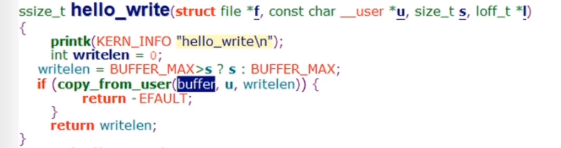

https://space.bilibili.com/646178510 学习记录

<!--more-->

# 开发基础

## 7、linux内核编译过程

顶层根目录有个顶层makefile，各级源代码目录还有一个makefile，顶层makefile去include各子目录的makefile文件，从而把内核源码囊括起来。

## 9、内核空间和用户空间以及数据拷贝





`copy_from_user(addr_kernel, addr_user, len)`

`copy_to_user(addr_user, addr_kernel, len)`

为什么不允许内核直接访问用户空间的数据呢？防止缺页？安全性？

## 10、x86页式内存管理和页表映射


逻辑地址->线性地址->物理地址

分为两个阶段：段页式转换->页表映射，只是linux内核里段基址是0，也就是逻辑地址等于线性地址。

### 页表映射

以二级页表转换为例。


（物理块就是物理页）

cr3->页目录表->二级页表->物理页地址->加上偏移就是物理地址。

## 11、内核同步场景

比如设备驱动的open，有的设备可以被多个进程访问，比如磁盘、网卡。

一个有问题的例子：


出现问题：


这个例子中，xxx_count就是一个共享资源，并发执行单元对共享资源的访问会引发竞态问题。需要使用内核同步方法来保护临界区。

## 12、semaphore使用


```c
struct semaphore sema;
sema_init(&sema, 1);
down(&sema);
up(&sema);
```


## 13、semaphore内核实现

本质上是基于进程调度器实现的，UP和SMP实现无差异

### 结构体


list_head是双向链表

### 初始化


初始化一个结构体，然后赋值。

### down

获取一个锁


如果获取不到，进入down


就是第二个进程进来后，会创建一个waiter，加入到sem的wait_list里。然后进入while 1,把当前这个进程设置为休眠，然后释放down函数里申请的自旋锁，让这个把当前的进程调度出去，等被唤醒后，看下waiter.up，为true就返回。

传入的state是进程的状态，task_uninterruptable，不可运行且不能被打断的。

### up

down里检查waiter.up，就是在up里设置的。跟down是对应的


理一下，就是当资源不够，当前进程会休眠，休眠之前，这个task_struct会加入到这个sem的wait_list里面。

up时候，如果wait_list有进程，就把它拿出来，然后wake_up。

## 14、内核原子变量

为啥要有原子变量，比如刚刚的例子，只是要对一个open_count进行保护，使用信号量的开销太大了，信号量会让进程调度。也就是atomic适合针对int变量进行同步的场景。


atomic_dec_and_test就是原子减一 ,结果为0 返回 true，atomic_inc就是原子加一，不会被调度，不会被cpu打断。

## 15、atomic内核实现

实现跟体系结构相关。视频中讲的是arm下的，这里看x86的


## 16、spinlock使用

信号量不支持进程和中断之间的同步，但是spinlock可以。中断上下文不允许睡眠，适合spinlock。


死等是用特殊的汇编指令实现的。

```c
spinlock_t count_lock;
spin_lock_init(&count_lock);
spin_lock(&count_lock);
spin_unlock(&count_lock);
```

使用自旋锁的临界区代码尽可能少，不能调用睡眠或可能引起睡眠的函数。


## 17、spinlock内核实现（UP）

实现也跟体系结构相关。

### 结构体

封装了三层：spinlock，raw_spinlock，arch_spinlock_t（具体实现），多一层封装多一层灵活性。


使用owner和next来保证先到先唤醒。


### 初始化

就是对raw_lock进行初始化，owner和next都等于0


读内核时候，check函数可以不仔细看，就是辅助函数


### spin_lock


_raw_spin_lock的实现有两种，分别对应UP和SMP的。

up的实现比较简单，**关闭抢占**，__LOCK就什么都没做了

在include/linux下


## 18、spinlock内核实现（SMP）

接上，区别在_raw_spin_lock的实现，在kernel/locking下


多核也是先关抢占，然后要同步其他cpu，最后是体系结构相关的代码。

## 19、spinlock、rw spinlock、seqlock、rcu机制比较


lock更新后，引起其他cpu核的cache失效。性能满足不了需求，就提出了RCU机制。


## 22、页框和伙伴算法和slab


## 23、内存管理和分配方法


kmem_cache_alloc会调用slab_aclloc。flags是运行睡眠还是不允许睡眠。


给硬件分配的一般要求连续，用kmalloc


## 24、kmalloc实现

`kmalloc->__kmalloc-> __do_kmalloc`

### 主体实现

kmalloc依赖slab分配器实现，slab又依赖伙伴系统实现。


根据size找到对应的高速缓存，然后调用slab_alloc找到一个空闲的object，然后把它的指针返回。  kasan_kmalloc是内存调试用的，先忽略。

### 根据size获取kmem_cache(高速缓存)

kmem_cache


换算成一个index，从kmalloc_caches数组里拿。

## 25、高速缓存和size的对应关系

过

## 26、虚拟地址空间管理

不同的区域用不同的vma管理


## 27、虚拟地址空间管理的内核结构


对于线程来说，多个线程共享一个地址空间，也就是多个 task_struct 使用同一个 mm_struct 结构，所以执行 fork 时只需要把父进程的 mm 赋值给子进程的 mm;

## 28、mmap实现

pass

## 29、用户栈和内核栈

> 用户栈是vma来管理，另一个作为task_struct的一部分。


我记得内核栈是8k。


内核会有其他方式来保证内核栈不溢出。

thread_info是体系结构相关的，可以看下arm的：


## 30、进程上下文和中断上下文

### preempt_count

这个变量保存在thread_info里面


## 32、软中断特点以及softirq注册和触发


哪个cpu触发软中断，哪个cpu执行这个软中断处理函数

每个cpu都有一个__softirq_pending变量，所以只能看到本地cpu软中断的状态。


## 33、do_softirq()的执行时机

### ksoftirqd线程

每个cpu都会创建这么一个线程，`ksoftird/%u`


这里的代码解释下，local_irq_disable()关闭中断是为了保护数据，__do_softirq()里又把硬中断打开了，所以说在软中断的执行过程中是打开cpu中断的。

### 硬件中断返回irq_exit()


如果本地cpu上有待处理的软中断，只有不处于中断上下文的时就会调用__do_softirq()。

为什么需要判断 !in_inerrupt() ？那是因为在某些时候，软中断被硬件中断抢占执行，硬中断退出时，尽管退出了硬中断上下文，但是仍处于软中断上下文中，这时候不应该嵌套执行软中断，因为硬中断函数返回之后会继续执行被打断的软中断。

```c
static inline void invoke_softirq(void)
{
    if (ksoftirqd_running(local_softirq_pending()))
        return;

    if (!force_irqthreads) {
        ...
        __do_softirq();
#endif
    } else {
        wakeup_softirqd();
    }
}
```

### 直接调用

例如在网络子系统，对实时性要求比较高，所以会直接调用do_softirq进行处理。


### 参考

https://zhuanlan.zhihu.com/p/363225717

## 34、软中断的执行过程


得到已经触发的软中断flag，然后一个个调它的软中断处理函数。

* 不同软中断优先级如何体现


* ksoftirqd优先级高于普通进程

硬件中断返回时候，就会调用：


这里几乎没什么条件，就会调用invoke_softirq

## 35、free memory和avaliable memory

`free memory`是完全没有被用到的内存，而Linux认为内存不用也是浪费，因此会尽量“多”地把内存用来做各种缓存，提高系统的性能。而`available memory`是应用程序认为可用内存数量，它是`free memory`，`buffer`和`cache`的总和。

# 追踪调试基础

## 1、linux追踪技术三大件


前端工具：应用层工具。

tracing framework：把追踪的事件返回到用户空间

事件源：比如printk就是一种事件源


## 2、事件源

