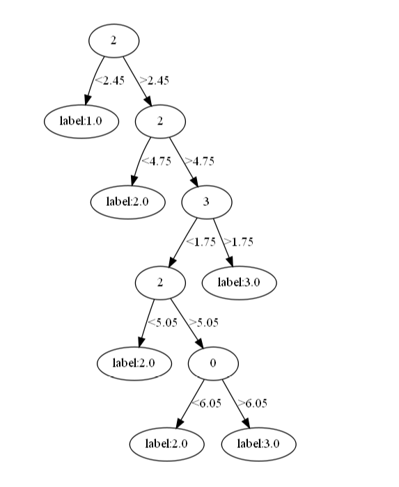

参考西瓜书第4章编写，并用`graphviz`实现可视化。

<!--more-->

## 代码

```python
import numpy as np
from collections import Counter
from graphviz import Digraph
import os
os.environ["PATH"] += os.pathsep + 'D:/Graphviz2.39/bin'
def loadData(filename):
    with open(filename) as f:
        line = f.readline()
        res = []
        while line:
            c = line.split()
            content = [float(x) for x in c]
            res.append(content)
            line = f.readline()
    #print(res)
    return res
def getEnt(data):
    num = len(data)
    labelCount = {}
    for feature in data:
        label = feature[-1]
        if label not in labelCount.keys():
            labelCount[label] = 0
        labelCount[label] += 1
    Ent = 0
    for key, p in labelCount.items():
        p = p / num
        Ent -= p*np.log2(p)
    return Ent
def splitDate(data,feature,point):#整体数据集、特征编号、分割点
    data1 = [x for x in data if x[feature]<point]
    data2 = [x for x in data if x[feature]>point]
    return data1,data2
def chooseBF(data):#选择最佳的划分属性
    featureValue = []
    num = len(data)
    Ent = getEnt(data)
    numFeature = len(data[0])-1#获取属性的个数
    maxGain = float('-inf')
    for i in range(numFeature):#对每个属性，统计出现的值
        featureList = [feature[i] for feature in data]#统计该属性出现的可能值
        featureList = sorted(list(set(featureList)))
        for j in range(len(featureList)-1):
            data1,data2 = splitDate(data,i,(featureList[j]+featureList[j+1])/2)
            Ent1 = getEnt(data1)
            Ent2 = getEnt(data2)
            Gain = Ent - (len(data1)/num)*Ent1 - (len(data2)/num)*Ent2
            if Gain>maxGain:
                feature = i
                point = (featureList[j]+featureList[j+1])/2
                dataLeft = data1
                dataRight = data2
                maxGain = Gain
    return feature,point,dataLeft,dataRight#返回分割的属性和分裂点


def creatTree(data):
    node = {}
    label = [sample[-1] for sample in data]
    if len(set(label))==1:
        node['label'] = label[0]
        return node
    unique = []
    for i in range(len(data[0])-1):
        unique.append(len(set([sample[i] for sample in data])))
    tot = sum([1 for x in unique if (x == 1)])
    dataCount = Counter([sample[-1] for sample in data])
    if (tot == 4):
        node['label'] = list(dataCount.most_common(1)[0])[0]
        return node
    featureIndex,point,dataLeft,dataRight = chooseBF(data)#分裂属性编号，分裂值
    node['value'] = point
    node['feature'] = featureIndex
    node['leftChild'] = creatTree(dataLeft)
    node['rightChild'] = creatTree(dataRight)
    return node

def predict(sample,node):
    if 'feature' in node:
        if sample[node['feature']]>node['value']:
            label = predict(sample,node['rightChild'])
        else:
            label = predict(sample,node['leftChild'])
    else:
        return node['label']
    return label


def test(data,tree):
    num = len(data)
    ans = []
    for i in range(num):
        ans.append(predict(data[i],tree))
    return ans


def plot_model(tree, name):
    g = Digraph("G", filename=name, format='png', strict=False)
    g.node("0", str(tree['feature']))#根节点的feature
    _sub_plot(g, tree, "0")
    return g
    g.view()


root = "0"


def _sub_plot(g, tree, inc):
    global root
    ts = tree
    for i in ts.keys():#i是字典的key 根节点的key
        if i == 'leftChild':  # 上次的节点指向刚刚画的节点
            root = str(int(root) + 1)
            if 'feature' in tree[i]:
                g.node(root,str(tree[i]['feature']))#新生成的子节点root
            else:
                g.node(root, str(tree[i]['label']))  # 新生成的子节点root
            g.edge(inc, root, '<' + str(tree['value']))
            _sub_plot(g, tree[i], root)
        if i == 'rightChild':
            root = str(int(root) + 1)
            if 'feature' in tree[i]:
                g.node(root, str(tree[i]['feature']))  # 新生成的子节点root
            else:
                g.node(root, str(tree[i]['label']))  # 新生成的子节点root
            g.edge(inc, root, '>' + str(tree['value']))
            _sub_plot(g, tree[i], root)
        if i == 'label':
            g.node(root, 'label:' + str(tree['label']))  # 画出儿子节点


if __name__ == '__main__':
    trainData = loadData('traindata.txt')
    testData = loadData('testdata.txt')
    tree = creatTree(trainData)
    ans = test(testData,tree)
    trueLabel = [sample[-1] for sample in testData]
    rightCount = 0
    for i in range(len(ans)):
        if ans[i]==trueLabel[i]:
            rightCount = rightCount + 1
    g = plot_model(tree, "决策树")
    g.view()

    print(rightCount/len(ans))
```

## 结果及可视化

`acc = 96%`




## 实验数据

每行一个样本，前三列为属性，最后一列为label

### 训练集

```
5	3	1.6	0.2	1
5	3.4	1.6	0.4	1
5.2	3.5	1.5	0.2	1
5.2	3.4	1.4	0.2	1
4.7	3.2	1.6	0.2	1
4.8	3.1	1.6	0.2	1
5.4	3.4	1.5	0.4	1
5.2	4.1	1.5	0.1	1
5.5	4.2	1.4	0.2	1
4.9	3.1	1.5	0.2	1
5	3.2	1.2	0.2	1
5.5	3.5	1.3	0.2	1
4.9	3.6	1.4	0.1	1
4.4	3	1.3	0.2	1
5.1	3.4	1.5	0.2	1
5	3.5	1.3	0.3	1
4.5	2.3	1.3	0.3	1
4.4	3.2	1.3	0.2	1
5	3.5	1.6	0.6	1
5.1	3.8	1.9	0.4	1
4.8	3	1.4	0.3	1
5.1	3.8	1.6	0.2	1
4.6	3.2	1.4	0.2	1
5.3	3.7	1.5	0.2	1
5	3.3	1.4	0.2	1
6.6	3	4.4	1.4	2
6.8	2.8	4.8	1.4	2
6.7	3	5	1.7	2
6	2.9	4.5	1.5	2
5.7	2.6	3.5	1	2
5.5	2.4	3.8	1.1	2
5.5	2.4	3.7	1	2
5.8	2.7	3.9	1.2	2
6	2.7	5.1	1.6	2
5.4	3	4.5	1.5	2
6	3.4	4.5	1.6	2
6.7	3.1	4.7	1.5	2
6.3	2.3	4.4	1.3	2
5.6	3	4.1	1.3	2
5.5	2.5	4	1.3	2
5.5	2.6	4.4	1.2	2
6.1	3	4.6	1.4	2
5.8	2.6	4	1.2	2
5	2.3	3.3	1	2
5.6	2.7	4.2	1.3	2
5.7	3	4.2	1.2	2
5.7	2.9	4.2	1.3	2
6.2	2.9	4.3	1.3	2
5.1	2.5	3	1.1	2
5.7	2.8	4.1	1.3	2
7.2	3.2	6	1.8	3
6.2	2.8	4.8	1.8	3
6.1	3	4.9	1.8	3
6.4	2.8	5.6	2.1	3
7.2	3	5.8	1.6	3
7.4	2.8	6.1	1.9	3
7.9	3.8	6.4	2	3
6.4	2.8	5.6	2.2	3
6.3	2.8	5.1	1.5	3
6.1	2.6	5.6	1.4	3
7.7	3	6.1	2.3	3
6.3	3.4	5.6	2.4	3
6.4	3.1	5.5	1.8	3
6	3	4.8	1.8	3
6.9	3.1	5.4	2.1	3
6.7	3.1	5.6	2.4	3
6.9	3.1	5.1	2.3	3
5.8	2.7	5.1	1.9	3
6.8	3.2	5.9	2.3	3
6.7	3.3	5.7	2.5	3
6.7	3	5.2	2.3	3
6.3	2.5	5	1.9	3
6.5	3	5.2	2	3
6.2	3.4	5.4	2.3	3
5.9	3	5.1	1.8	3
```

### 测试集

```
5.1	3.5	1.4	0.2	1
4.9	3	1.4	0.2	1
4.7	3.2	1.3	0.2	1
4.6	3.1	1.5	0.2	1
5	3.6	1.4	0.2	1
5.4	3.9	1.7	0.4	1
4.6	3.4	1.4	0.3	1
5	3.4	1.5	0.2	1
4.4	2.9	1.4	0.2	1
4.9	3.1	1.5	0.1	1
5.4	3.7	1.5	0.2	1
4.8	3.4	1.6	0.2	1
4.8	3	1.4	0.1	1
4.3	3	1.1	0.1	1
5.8	4	1.2	0.2	1
5.7	4.4	1.5	0.4	1
5.4	3.9	1.3	0.4	1
5.1	3.5	1.4	0.3	1
5.7	3.8	1.7	0.3	1
5.1	3.8	1.5	0.3	1
5.4	3.4	1.7	0.2	1
5.1	3.7	1.5	0.4	1
4.6	3.6	1	0.2	1
5.1	3.3	1.7	0.5	1
4.8	3.4	1.9	0.2	1
7	3.2	4.7	1.4	2
6.4	3.2	4.5	1.5	2
6.9	3.1	4.9	1.5	2
5.5	2.3	4	1.3	2
6.5	2.8	4.6	1.5	2
5.7	2.8	4.5	1.3	2
6.3	3.3	4.7	1.6	2
4.9	2.4	3.3	1	2
6.6	2.9	4.6	1.3	2
5.2	2.7	3.9	1.4	2
5	2	3.5	1	2
5.9	3	4.2	1.5	2
6	2.2	4	1	2
6.1	2.9	4.7	1.4	2
5.6	2.9	3.6	1.3	2
6.7	3.1	4.4	1.4	2
5.6	3	4.5	1.5	2
5.8	2.7	4.1	1	2
6.2	2.2	4.5	1.5	2
5.6	2.5	3.9	1.1	2
5.9	3.2	4.8	1.8	2
6.1	2.8	4	1.3	2
6.3	2.5	4.9	1.5	2
6.1	2.8	4.7	1.2	2
6.4	2.9	4.3	1.3	2
6.3	3.3	6	2.5	3
5.8	2.7	5.1	1.9	3
7.1	3	5.9	2.1	3
6.3	2.9	5.6	1.8	3
6.5	3	5.8	2.2	3
7.6	3	6.6	2.1	3
4.9	2.5	4.5	1.7	3
7.3	2.9	6.3	1.8	3
6.7	2.5	5.8	1.8	3
7.2	3.6	6.1	2.5	3
6.5	3.2	5.1	2	3
6.4	2.7	5.3	1.9	3
6.8	3	5.5	2.1	3
5.7	2.5	5	2	3
5.8	2.8	5.1	2.4	3
6.4	3.2	5.3	2.3	3
6.5	3	5.5	1.8	3
7.7	3.8	6.7	2.2	3
7.7	2.6	6.9	2.3	3
6	2.2	5	1.5	3
6.9	3.2	5.7	2.3	3
5.6	2.8	4.9	2	3
7.7	2.8	6.7	2	3
6.3	2.7	4.9	1.8	3
6.7	3.3	5.7	2.1	3
```


## `graphviz`安装

先`pip install praphviz`

windows端需要去官网下载`msi`文件进行安装

然后将`D:\Graphviz2.39\bin`添加到环境变量

