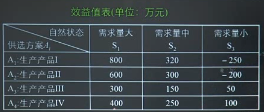
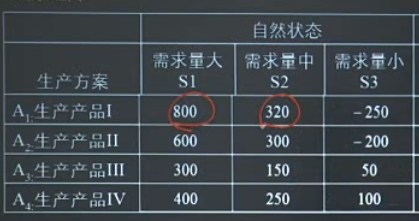
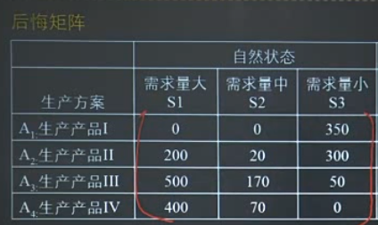
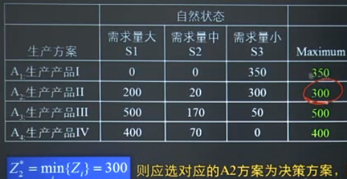
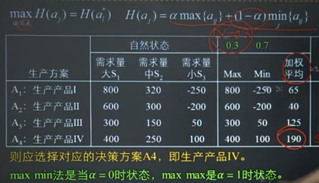
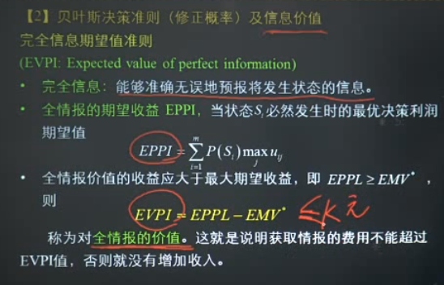

决策论中的一些基本概念。

<!--more-->

## 基本内容

* 不确定型决策的几种准则：悲观准则、乐观准则、最小后悔准则、等可能性准则与乐观系数法
* 风险型决策的最大期望收益值法（EMV）、贝叶斯决策准则及信息价值（EVPI）、决策树法

## 不确定型决策

### 决策基本要素

* 状态空间：$S=\left\{S_{1}, S_{2}, S_{3} \cdots, S_{m}\right\}=\left\{S_{i}\right\} \quad i=1, \cdots m$
* 策略空间：$A=\left\{A_{1}, A_{2}, \cdots, A_{n}\right\}=\left\{A_{j}\right\} \quad j=1, \cdots, n$
* 损益函数：$U_{i j}=u\left(S_{i}, A_{j}\right) \quad i=1,2, \cdots m ; j=1,2, \cdots n$

所以决策系统可以表示为三个主要素的函数：

$$D=D(S, U, V)$$

### 不确定决策例子

公司决策生产那种新商品

* 悲观主义准则（小中取大）
* 乐观主义准则（大中取大）
* 最小后悔值准则：编制机会损失表$r_{i j }=\left\{\max _{j}\left\{a_{i j }\right\}-a_{i j}\right\}$,找出每个方案的最大机会损失$Z_{i}=\max _{i}\left\{r_{i j}\right\}$,选择最小的机会损失值$Z_{l}^{*}=\min _{i}\left\{Z_{i}\right\}$

* 等可能型决策：不同状态等可能，计算平均收益
* 乐观系数法：给出乐观系数$\alpha \in[0,1]$

## 风险型决策

对发生各事件的概率已知，一般采用期望值作为决策准则。

### 贝叶斯决策准则及信息价值（EVPI）

已知先验概率，可以通过增加花费（信息费用）修正概率，修正概率通过贝叶斯公式得到。

