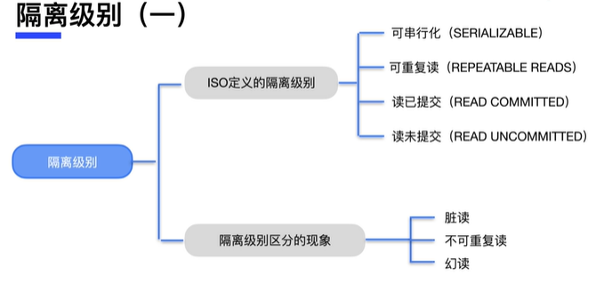
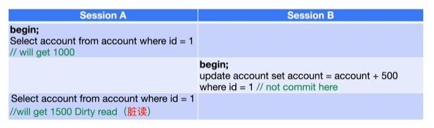
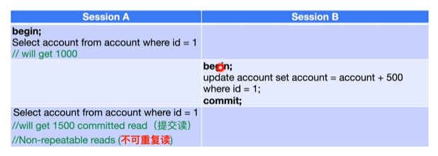
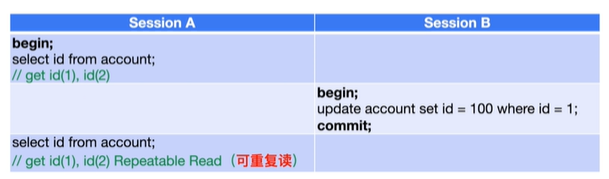
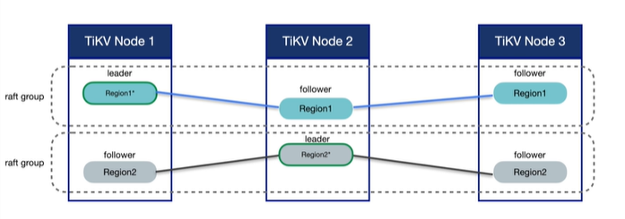
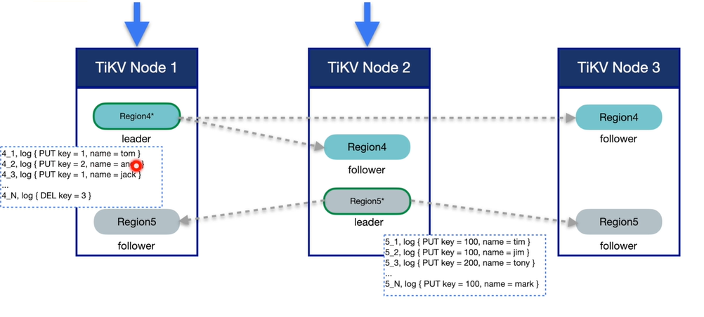
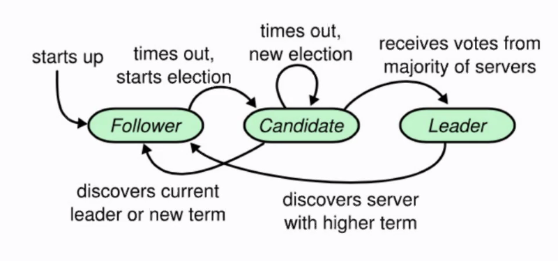

分布式系统

<!--more-->

## 分布式事务

### 事务

事务是数据库上进行的一系列操作的集合，是数据改变的不可分割的基本单位。

* 原子性，不可分割，要不都成功要不都失败，
* 一致性，比如转账事务，转账前后钱总和不变，事务做完后，数据完整性不会被破坏
* 隔离性，一个事务不会看到另一个事务正在修改的数据，事务之间的安全，事务修改不会又相互的影响
* 持久性，事务提交完成后，修改一定会保存到数据库里不会丢失，数据安全落地的问题

#### 隔离性

数据库必须遵照一种隔离级别，现象是几种隔离级别产生的

* 脏读
  * 事务A修改了数据data，但未提交
  * 此时事务B读到了data的修改，称为脏读
* 不可重复读
  * 事务A的两次读data之间，事务B访问了数据data，并进行了修改提交
  * 事务A的前后两次读由于事务B的修改，导致的不一致成为不可重复读
* 幻读
  * 与不可重复度的区别是，幻读涉及的是插入操作，不可重复读是更新
  * 同一个事务的不同时刻读到的数据可能多了（有另外的事务insert data）

* 未提交读
* 提交读
* 可重复读（整个事务从开始到结束，读某个数据的结果不会改变）

* 

## Raft协议

> raft是一个公式算法，raft将集群中的角色分为leader、follwer、candidate。正常情况下集群中只能由一个leader，然后一群follower，没有candidate。当leader挂了，这个时候follwer收不到来自leader的心跳，就会变成candidate进行选举。选举是节点先自己给自己投一票，然后向其他节点拉票，如果拉到的票数超过集群数目的一半，就可以成为leader。集群只有Leader能写入日志，Leader负责复制日志到Follower节点，并强制Follower节点与自己保持相同。

leader：整个集群的管理者，所有客户端的读写都走leader

follower：被管理者，对其他服务做出相应

conditate：follower演变过来，leader长时间没有统计信息

写数据时候只写leader，leader将写入指令变成日志的方式向所有follower复制，当集群中的大多数节点都收到了日志并且都持久化，则认为该日志已经commited，leader就可以把写入apply到db中变成kv数据。

数据以region形式存放，每一个region就是一个kv结构，相邻两个region不允许出现间隙，每一个region的key是一个前闭后开的区间，比如[1,1000)。region有一个最大限制，比如96M，超过后就会分裂。

一个region构成一个raft组，多个raft group就是multi raft。

### 日志复制

写数据只发送给leader，leader开始相应，数据同步到其他follower

第一步叫propose：leader收到请求，将请求转化成日志

写入请求变成一条写入日志，存入到自己的日志文件里日志格式，每条日志有一个标识：region号+日志号，日志存储在db实例中，这个实例时专门存log的。

第二步叫append：将raft日志中写到db中，把日志进行持久化。follower收到日志后也写入到自己的存储中。

第三步commited：大多数region都返回append成功的消息。

### leader选举

term，一个时期的意思。raft将时间分成了一小段一小段的term。对于raft，时间由一个个term组成，一个term代表一段固定的关系。

集群刚开始创建的时候时没有leader的，全是followe，每一个region有一个计时器，每个计时器有个election time out， 就是等待leader心跳的时间。那个region先超过election time out，就会从follower变成candidate，递增自己的term，并发出我要当leader的请求，然后其他的follower根据term是否比自己大进行投票，多数同意leader就产生了。

选举流程：

* 节点以Follower状态启动，同时随机生成自己的选举超时时间
* 选举超时时，节点向自己发送MSGhup消息。
* 节点进行选举：首先将自己的term + 1，然后广播给其他节点选举消息，带上其他字段，包括：节点当前的最后一条日志索引（Index），最后一条日志对应的任期号（LogTerm），选举任期号（Term），Context字段。
* 如果选举成功，就切换为leader，同时发送sendAppend。

### 问答题

https://blog.csdn.net/zhou920786312/article/details/115457979

###

## 参考资料

可视化raft：http://thesecretlivesofdata.com/raft/

幽灵复现问题：https://zhuanlan.zhihu.com/p/362679439
