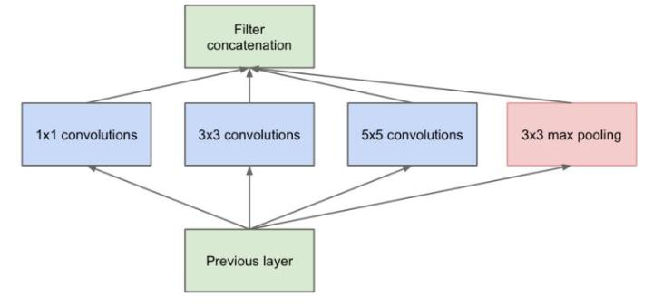
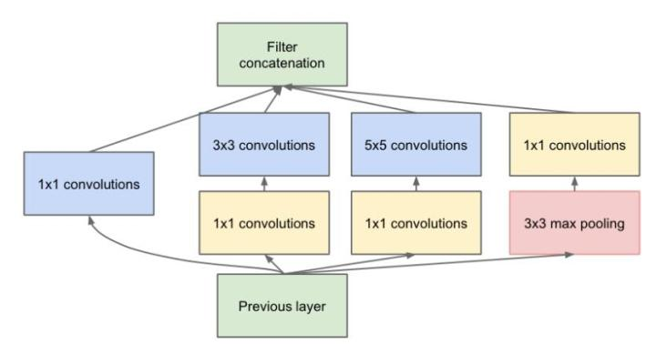
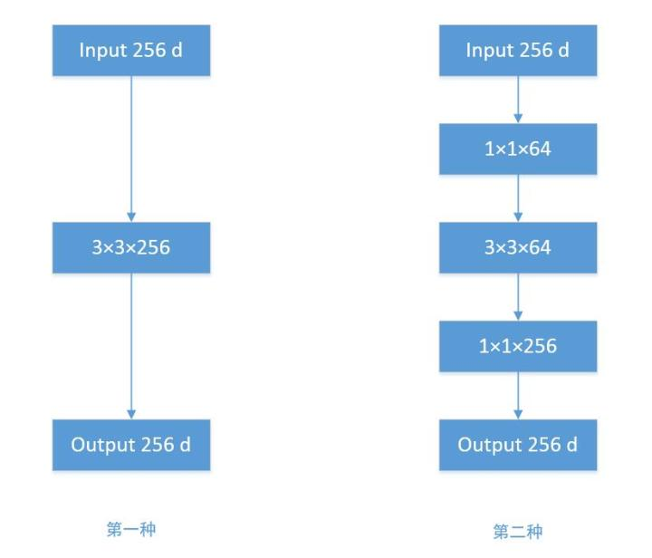
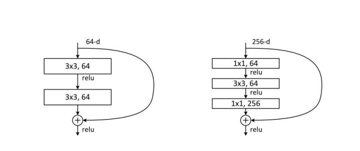
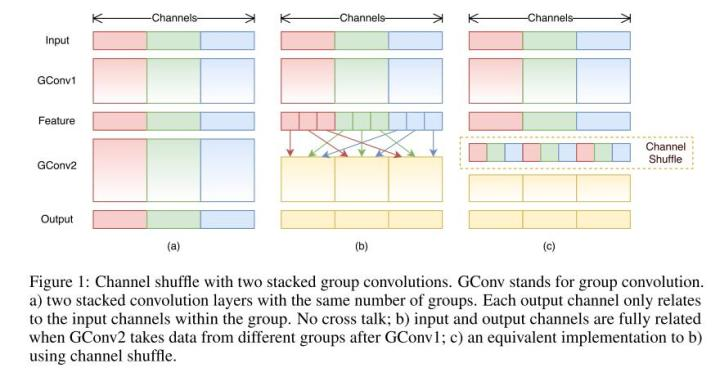
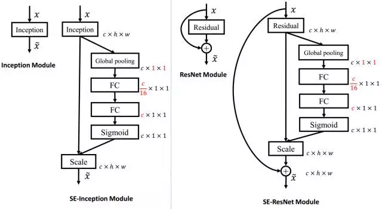

参考：https://zhuanlan.zhihu.com/p/28749411
记录了一些卷积神经网络种的操作。

<!--more-->

## Group convolution（分组卷积）


卷积核的总数不变，通道数变为原来的$1/G$,故参数量也变为原来的$1/G$,**减少了参数**（G为分组数）。

```python
nn.functional.conv2d(x,self.convWeight2,bias = self.mybias,stride=1, padding=1, dilation=1, groups=1)
```

`groups`参数就表示分组卷积的组数，传统卷积下`groups=1`。

## 3*3卷积核

之前人们的观念是，卷积核越大，receptive field（感受野）越大，看到的图片信息越多，因此获得的特征越好。虽说如此，但是大的卷积核会导致计算量的暴增，不利于模型深度的增加，计算性能也会降低。于是在VGG（最早使用）、Inception网络中，利用2个3×3卷积核的组合比1个5×5卷积核的效果更佳，同时参数量（3×3×2+1 VS 5×5×1+1）被降低，因此后来**3×3卷积核被广泛应用在各种模型**中。

## Inception结构



一个输入的feature map分别同时经过1×1、3×3、5×5的卷积核的处理，得出的特征再组合起来，获得更佳的特征。

## Bottleneck

为了解决`Inception`带来的参数变多的问题，引入$1 \times 1$的卷积核。



对比两种结构：



1. 输入为256通道的feature map，$3 \times 3 \times 256$ 表示256个3*3卷积核，通常省略通道数，那么参数量为：256×3×3×256 = 589,824
2. 若先通过1×1×64的卷积层，维度变为64通道，再经过一个3×3×64的卷积层，最后经过一个1×1×256的卷积层，输出256维，参数量为：256×1×1×64 + 64×3×3×64 + 64×1×1×256 = 69,632。

## Resnet残差网络

解决网络退化问题：随着深度增加，网络表现变差，很大程度上的原因是因为当层数加深时，梯度消散得越来越严重，以至于反向传播很难训练到浅层的网络。



```python
# Residual block定义残差块
class ResidualBlock(nn.Module):
    def __init__(self, in_channels, out_channels, stride=1, downsample=None):
        super(ResidualBlock, self).__init__()
        self.conv1 = conv3x3(in_channels, out_channels, stride)
        self.bn1 = nn.BatchNorm2d(out_channels)
        self.relu = nn.ReLU(inplace=True)
        self.conv2 = conv3x3(out_channels, out_channels)
        self.bn2 = nn.BatchNorm2d(out_channels)
        self.downsample = downsample
        
    def forward(self, x):
        residual = x
        out = self.conv1(x)
        out = self.bn1(out)
        out = self.relu(out)
        out = self.conv2(out)
        out = self.bn2(out)
        if self.downsample:
            residual = self.downsample(x)
        out += residual
        out = self.relu(out)
        return out
```

## DepthWise操作


假设输入通道数为3，要求输出通道数为256，两种做法：

1.直接接一个3×3×256的卷积核，参数量为：3×3×3×256 = 6,912

2.DW操作，分两步完成，参数量为：3×3×3 + 3×1×1×256 = 795

##  ShuffleNet

**对通道进行随机分组**，传统Group Convolution只能在最后时刻才融合不同组之间的特征，对模型的泛化性是相当不利。

ShuffleNet在每一次层叠这种Group conv层前，都进行一次channel shuffle，shuffle过的通道被分配到不同组当中。进行完一次group conv之后，再一次channel shuffle，然后分到下一层组卷积当中，以此循环。

## SEnet

**通道间的特征可以加入权重**，第一条直接通过，第二条首先进行Squeeze操作（Global Average Pooling），把每个通道2维的特征压缩成一个1维，从而得到一个特征通道向量（每个数字代表对应通道的特征），把这一列特征通道向量输入两个全连接层和sigmoid，建模出特征通道间的相关性，**得到的输出其实就是每个通道对应的权重**，把这些权重通过Scale乘法通道加权到原来的特征上（第一条路），这样就完成了特征通道的权重分配。



## Dilated convolution（空洞卷积）

```python
nn.functional.conv2d(x,self.convWeight2,bias = self.mybias,stride=1, padding=1, dilation=1, groups=1)
```

`dilation=1`就是空洞的大小。

这样即使卷积核大小不变，但它看到的区域变得更大了。

##  Deformable convolution 可变形卷积核

直接在原来的过滤器前面再加一层过滤器，这层过滤器学习的是下一层卷积核的位置偏移量（offset），这样只是增加了一层过滤器，或者直接把原网络中的某一层过滤器当成学习offset的过滤器，这样实际增加的计算量是相当少的，但能实现可变形卷积核，识别特征的效果更好。

## 参考资料

分组卷积：https://www.cnblogs.com/shine-lee/p/10243114.html

残差网络demo：https://shenxiaohai.me/2018/10/19/pytorch_tutorial_intermediate_02/