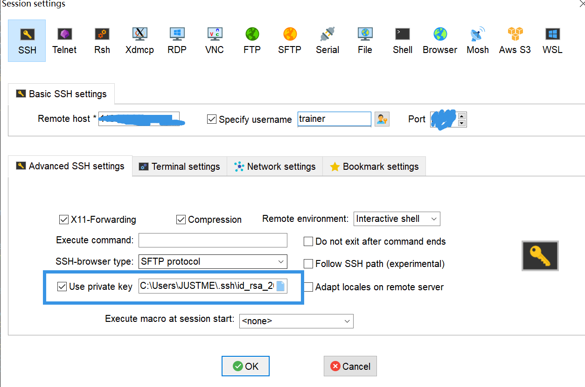
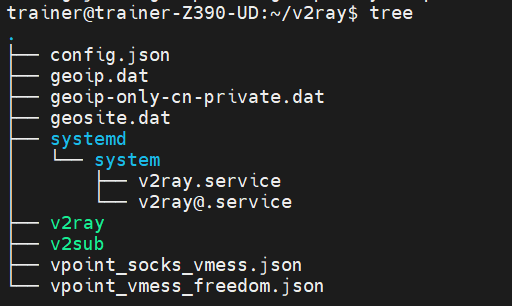

<!--more-->

## 用户管理

#### 添加新用户

```shell
adduser username
```

adduser和useradd的区别是adduser会在/home下创建同名目录，也会设置密码，设置shell，用adduser就可以。

### 添加到sudo用户组

```shell
usermod -aG sudo username
```

## 文件备份

```
rsync
```

## 安全防护

### 禁用密码登录使用密钥

```shell
ssh-keygen
#回车即可
#会在.ssh下生成一个公钥一个私钥
#将私钥拷贝到自己主机上
#在服务器上安装公钥
cat id_rsa.pub >> authorized_keys
chmod 600 authorized_keys
```

配置SSH

打开`/etc/ssh/sshd_config`文件设置

```shell
Port XXXX#修改默认端口号
RSAAuthentication yes
PubkeyAuthentication yes
PasswordAuthentication no
```

然后重启SSH

`service sshd restart`

本地使用私钥登录



### fail2ban

使用密钥登录这个就用不到了

```
sudo apt install fail2ban
sudo cp /etc/fail2ban/jail.{conf,local}
sudo fail2ban-client status sshd #查看fail2ban日志
```

## 炼丹环境

### 安装驱动

选择自己的显卡型号，系统

https://www.nvidia.cn/Download/index.aspx?lang=cn

`wget url`下载`NVIDIA-Linux-x86_64-xx.xx.run`驱动

## 魔法搭建

不少机场都是给一个订阅url，然而v2ray命令行版并不支持订阅，需要解析工具：https://github.com/iochen/v2gen

```shell
v2gen -u 订阅链接 -o V2Ray配置文件路径
systemctl restart v2ray
```

### v2ray安装

没梯子的话安装脚本大概率下载不了，自己下载预编译文件后传到服务器上，把文件copy到对应文件夹

https://github.com/v2fly/v2ray-core/releases



安装v2gen，生成config,默认端口号是1080和1081，需要在

https://github.com/teasiu/v2gen/blob/main/README_zh_cn.md

