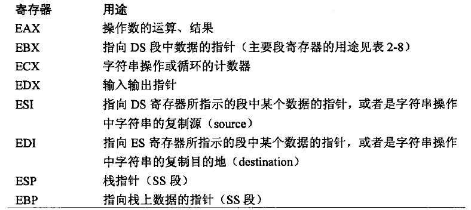

Debughacks 深入调试的技术和工具
<!--more-->
## 基础知识
### core dump
```shell
ulimit -c unlimited #不限制core dump文件大小，单位字节
gdb -c core.7561 ./a.out #调式core dump
cat /proc/<pid>/coredump_filter #查看转储掩码
```

### Intel 架构
intel 是小端，低位数据在内存低位。
#### 64位环境的寄存器
16个64位通用寄存器

R8~R15

1个64位RIP寄存器
1个64位RFLAGS寄存器
16个128位XMM寄存器