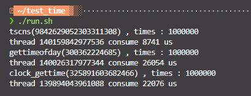

利用时间戳、perf工具分析程序性能
<!--more-->
## 时间戳
* time
* gettimeofday
* clock_gettime
* rdtsc: https://github.com/MengRao/tscns
三者性能差不多，都是走的vdso，time是对gettimeofday的封装，vdso就理解成内核会定期"推送"共享内存区域到用户态，用户在调用这些glibc函数时候，并不真正执行系统调用，直接从用户态拿就可以了。rdtsc最快。


测试代码：
```c
#include <sys/time.h>
#include <time.h>
#include <iostream>
#include "tscns.h"

using namespace std;

uint64_t now() {
  struct timeval tv;
  gettimeofday(&tv, NULL);
  return tv.tv_sec * 1000000 + tv.tv_usec;
}

void* func_gettimeofday(void* p) {
  int32_t c = *(int32_t*)p;
  uint64_t start = now();
  uint64_t us = 0;
  int i = 0;
  while (i++ < c) {
    struct timeval tv;
    gettimeofday(&tv, NULL);
    us += tv.tv_usec;  // avoid optimize
  }

  cout << "gettimeofday(" << us << ") , times : " << c << endl;
  cout << "thread " << pthread_self() << " consume " << now() - start << " us"
       << endl;
  return 0;
}

void* func_clockgettime(void* p) {
  int32_t c = *(int32_t*)p;
  uint64_t start = now();
  uint64_t us = 0;
  int i = 0;
  while (i++ < c) {
    struct timespec tp;
    clock_gettime(CLOCK_REALTIME, &tp);
    us += tp.tv_nsec;
  }

  cout << "clock_gettime(" << us << ") , times : " << c << endl;
  cout << "thread " << pthread_self() << " consume " << now() - start << " us"
       << endl;

  return 0;
}

void* func_tscns(void* p) {
  int32_t c = *(int32_t*)p;
  TSCNS tscns;
  tscns.init();
  uint64_t start = now();
  uint64_t temp = 0;
  int i = 0;
  while (i++ < c) {
    int64_t tsc = tscns.rdtsc();
    temp += tsc;
  }
  cout << "tscns(" << temp << ") , times : " << c << endl;
  cout << "thread " << pthread_self() << " consume " << now() - start << " us"
       << endl;

  return 0;
}

int main(int argc, char** argv) {
  if (argc != 4) {
    cout << " [gettimeofday/clock_gettime] thread_number loop_count" << endl;
    exit(-1);
  }
  string mode = string(argv[1]);
  int n = atoi(argv[2]);
  int loop = atoi(argv[3]);
  pthread_t* ts = new pthread_t[n];
  for (int i = 0; i < n; i++) {
    if (mode == "gettimeofday") {
      pthread_create(ts + i, NULL, func_gettimeofday, &loop);

    } else if (mode == "clock_gettime") {
      pthread_create(ts + i, NULL, func_clockgettime, &loop);

    } else if (mode == "tscns") {
      pthread_create(ts + i, NULL, func_tscns, &loop);
    }
  }
  for (int i = 0; i < n; i++) {
    pthread_join(ts[i], NULL);
  }
  delete[] ts;
  return 0;
}
```


获取时间戳
```c
#include <time.h>
uint64_t get_system_time_nsec() {
    struct timespec time = {0, 0};
    clock_gettime(CLOCK_REALTIME, &time);
    return time.tv_sec * 1000000000 + time.tv_nsec;
}
``` 
## perf使用
按频率采样，会生成一个perf.data文件
```shell
perf record -F 99 -g ./program
#-F: 采样频率
#-g: 记录调用栈
```
生成预览报告
```shell
perf record -n
```
绘制火焰图
下载FlameGraph
```shell
https://github.com/brendangregg/FlameGraph.git
```
将 stackcollapse-perf.pl、flamegraph.pl两个文件拷贝到/usr/local/bin目录。
添加文件perf2svg.sh，也放到/usr/local/bin目录下。

使用perf2svg ./a.out绘制svg
```shell
#!/bin/bash

exit_func() {
    if  [ -d $dir_tmp ]; then
        rm -rf $dir_tmp 
    fi
}

dir_tmp=./.perf_tmp_
if [ ! -d $dir_tmp ]; then
    mkdir $dir_tmp
fi

if [ $# -eq 0 ]; then
    echo "usage: $0 command"
    exit_func
    exit 1
fi

perf record -o $dir_tmp/perf.data -F 200 -g $@
perf script -i $dir_tmp/perf.data > $dir_tmp/out.perf
stackcollapse-perf.pl $dir_tmp/out.perf > $dir_tmp/out.folded
flamegraph.pl $dir_tmp/out.folded > perf.svg

exit_func
```

## 参考
https://blog.csdn.net/weixin_43778179/article/details/104574043?utm_medium=distribute.pc_relevant.none-task-blog-2~default~baidujs_baidulandingword~default-5-104574043-blog-8876283.pc_relevant_aa&spm=1001.2101.3001.4242.4&utm_relevant_index=8