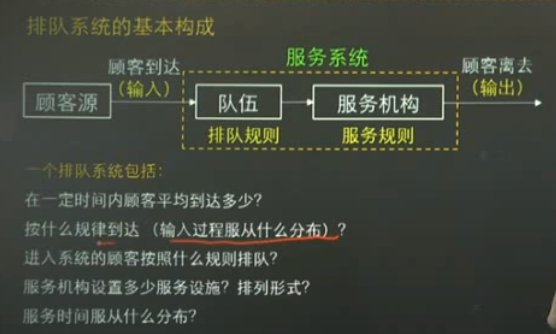
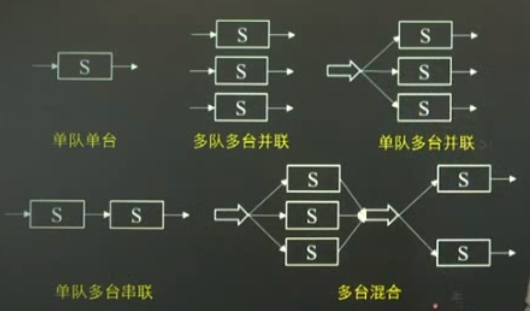
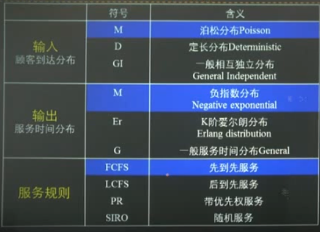
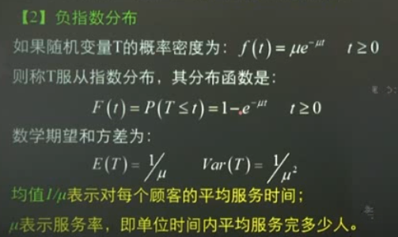
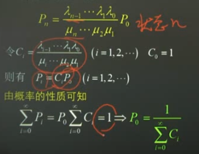
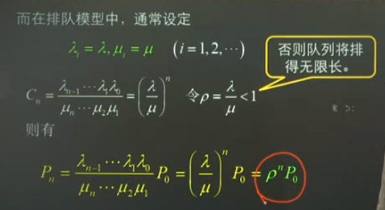
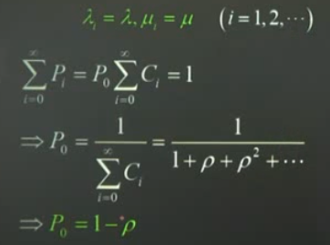
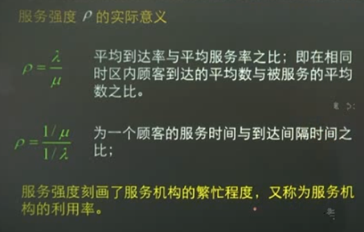
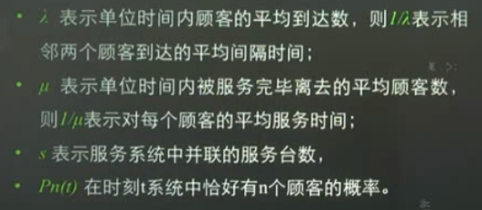
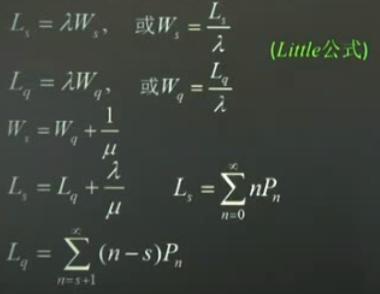

记录了排队论中的一些基本概念。

<!--more-->

## 基本内容

* 了解排队系统的基本概念
* 了解生灭过程和状态转移图的推演，状态概率公式的推演
* 掌握排队系统的主要数量指标和记号
* 熟练掌握排队模型和求解方法（单服务台排队模型）

## 排队系统的基本构成

### 输入过程的三特征

* 输入过程：顾客源无限有限，顾客到达人数**成批到达**还是**单个到达**，到达时间间隔分为**确定型**和**随机型（需知概率分布）**。服务过程对顾客到达的影响**相互独立到达、非相互独立到达（回头客问题）**。
* 排队规则：损失制、等待制、混合制，队列长，队列数
* 服务机构：服务方式：单顾客、多顾客，服务时间：确定型和随机型

### 排队模型的表示方式

肯德尔（Kendall）记号:

$$输入分布/输出分布/并联的服务站数（X/Y/Z）$$

扩展表示：

$$输入分布/输出分布/并联的服务站数/系统容量（队长）$$

$$/系统状态（顾客源数）/服务规则（X/Y/Z/A/B/C）$$

### 分布

泊松分布（最简单流）特点：

* 平稳性：在一定时间间隔内，来到服务系统的k个顾客的概率仅与这段时间的间隔长短有关，而与这段时间的起始时刻无关
* 无后效性：在不相交的时间区间内到达的顾客数是相互独立的
* 稀有性：在足够先得时间区间内只能有一个顾客到达，不可能有两个以上得顾客同时到达。

$$P_{k}(t)=e^{-\lambda t} \frac{(\lambda t)^{k}}{k !} \quad(k=0,1,2, \cdots)$$

在t时间内，有k个顾客来到服务系统得概率。

负指数分布：

## 排队问题中的常用指标

* 队长和排队长
* 逗留时间和等待时间
* 服务机构的工作强度=用于服务顾客的时间/服务设施的总服务时间
* 忙期：服务机构连续繁忙的时间长度

## 生灭过程

是用来处理输入为最简单流，服务时间为指数分布这类最简单排队模型得方法。

### 平衡方程

对任意状态，单位时间内进入该状态的平均次数和离开该状态的平均次数应该想到能（输入=输出）。

## little公式

## 参考

b站：运筹学 黄丽娟